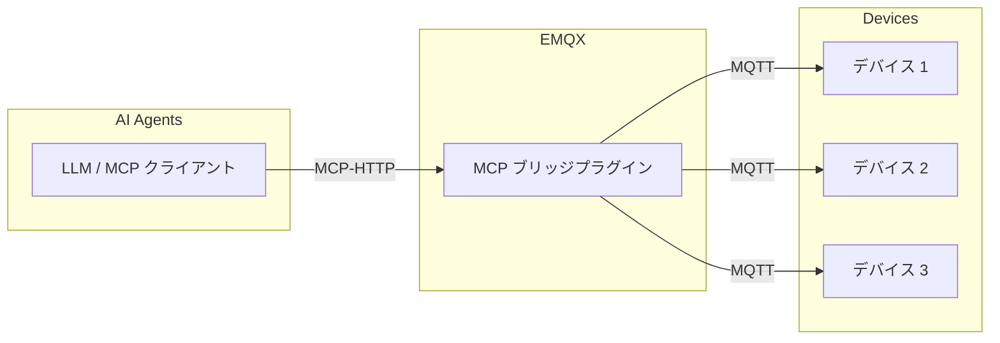
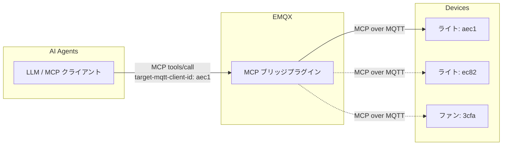
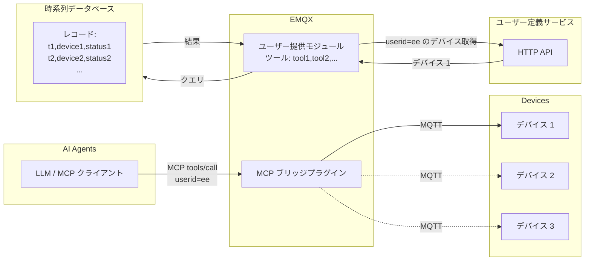

# MCP ブリッジプラグイン

<<<<<<< HEAD
[EMQX MCP ブリッジプラグイン](https://github.com/emqx/emqx_mcp_bridge) は、EMQX と MCP（Model Context Protocol）対応デバイスを統合するためのプラグインです。このプラグインを使うことで、ユーザーは MCP 対応の大規模言語モデルや AI エージェントを用いて IoT デバイスにアクセスし、制御できます。
=======
[EMQX MCP ブリッジプラグイン](https://github.com/emqx/emqx_mcp_bridge) は、EMQX と MCP（Model Context Protocol）対応デバイスを統合するためのプラグインです。このプラグインを使うことで、ユーザーは MCP 対応の大規模言語モデルや AI エージェントを用いて IoT デバイスにアクセスし、制御することができます。
>>>>>>> origin/release-5.10

## MCP ブリッジプラグインの仕組み

MCP ブリッジプラグインは EMQX 内にインストールされて動作します。起動後、Streamable HTTP または SSE に基づく MCP 接続を MQTT プロトコルに変換する HTTP エンドポイントを公開します。

IoT デバイスは MQTT を使って EMQX ブローカーに接続し、MCP 対応の大規模モデルや AI エージェントは MCP ブリッジプラグインが公開する HTTP エンドポイントに接続します。

## MCP over MQTT を使ったデバイスへのアクセス

<<<<<<< HEAD
デバイス側は MCP over MQTT プロトコルを使用して MCP サーバーとして動作し、自身のツールや機能を直接公開できます。プラグインはデバイスが登録したツールをツールタイプごとに集約します。MCP ブリッジプラグインでは、MCP over MQTT プロトコルの Server Name の概念をツールタイプにマッピングしています。

つまり、同じタイプの複数デバイスが登録したツールは、ブリッジプラグインによって単一の論理ツールとして集約され、MCP クライアントから呼び出せるようになります。

この方式は、スマートホームや産業制御システム、音声対応玩具など、単一または少数のデバイスにアクセスするクライアント向けのシナリオに適しています。これらのシナリオでは、ユーザーは大規模なデバイス群を管理するのではなく、自身のデバイスにのみアクセスすることが一般的です。

同じタイプの複数デバイスのツールを単一の論理ツールに集約するため、MCP ブリッジプラグインはツール定義に必須パラメータとして `target-mqtt-client-id` を注入します。AI エージェントがツールを呼び出す際は、ビジネスロジックに基づいて対象デバイスの ID を特定し、このパラメータで指定する必要があります。これにより MCP リクエストが特定のデバイスにルーティングされます。
=======
デバイス側では、MCP over MQTT プロトコルを使い、MCP サーバーとして自らのツールや機能を直接公開できます。プラグインはデバイスが登録したツールをツールタイプごとに集約します。MCP ブリッジプラグインでは、MCP over MQTT プロトコルの Server Name の概念をツールタイプにマッピングしています。

つまり、同じタイプの複数デバイスが登録したツールは、ブリッジプラグインによって単一の論理的なツールとして集約され、MCP クライアントから呼び出せる形になります。

この方式は、スマートホームや産業制御システム、音声対応玩具など、単一または少数のデバイスにクライアントがアクセスするシナリオに適しています。これらのシナリオでは、ユーザーは大規模なデバイス群の管理ではなく、自分のデバイスへのアクセスだけを必要とする場合が多いです。

同じタイプの複数デバイスのツールが単一の論理ツールに集約されるため、MCP ブリッジプラグインはツール定義に必須パラメータとして `target-mqtt-client-id` を注入します。AI エージェントがツールを呼び出す際には、ビジネスロジックに従って対象デバイスの ID を特定し、このパラメータで指定する必要があります。これにより MCP リクエストが特定のデバイスへルーティングされます。
>>>>>>> origin/release-5.10

## 標準 MQTT を使ったデバイスへのアクセス

<<<<<<< HEAD
デバイスは MCP over MQTT ではなく標準 MQTT プロトコルを使って EMQX に接続することも可能です。この場合、ユーザーは MCP ブリッジプラグイン内で MCP ツールを直接実装し、通常の MQTT デバイスに間接的にアクセスできます。

この方式は、スマートシティ、コネクテッドビークル、産業用 IoT など、より柔軟なデバイスアクセスが求められるシナリオに適しています。MCP ブリッジプラグイン内では、ユーザー定義の外部サービスや API へのアクセス、外部データベースからのデバイス報告データの取得など、任意のビジネスロジックを実装可能です。
=======
デバイスは MCP over MQTT ではなく、標準の MQTT プロトコルを使って EMQX に接続することも可能です。この場合、ユーザーは MCP ブリッジプラグイン内に MCP ツールを直接実装し、これらの通常の MQTT デバイスに間接的にアクセスできます。

この方式は、スマートシティ、コネクテッドビークル、産業用 IoT など、より柔軟なデバイスアクセスが求められるシナリオに適しています。MCP ブリッジプラグイン内では、任意のビジネスロジックを実装でき、ユーザー定義の外部サービスや API へのアクセス、外部データベースからのデバイス報告データの取得などが可能です。
>>>>>>> origin/release-5.10

MCP ツールをコードで実装する方法の例については、[Create Custom MCP Tools](https://github.com/emqx/emqx_mcp_bridge?tab=readme-ov-file#create-custom-mcp-tools) を参照してください。

