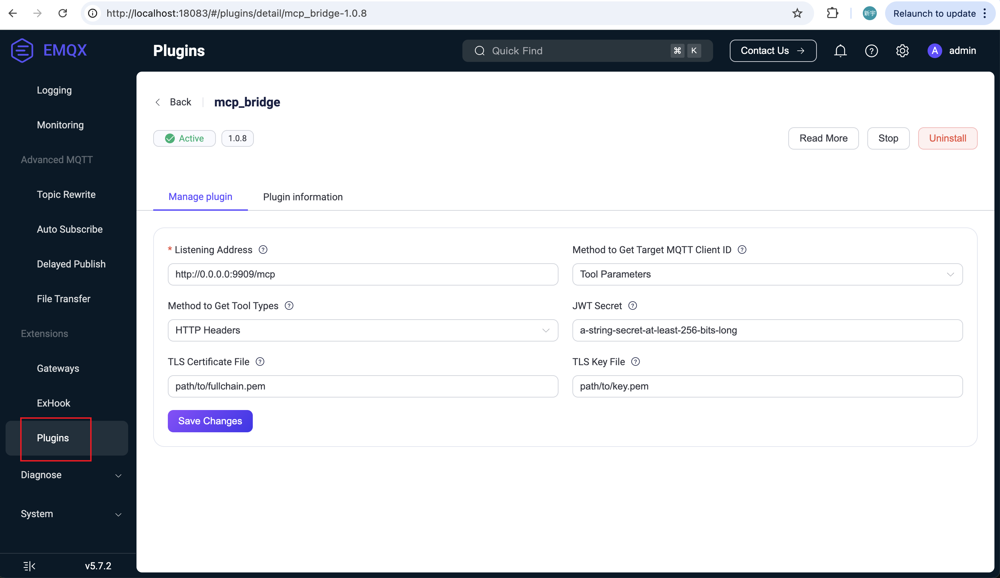
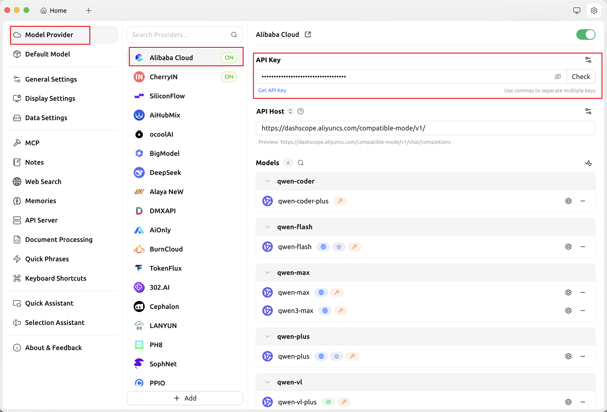
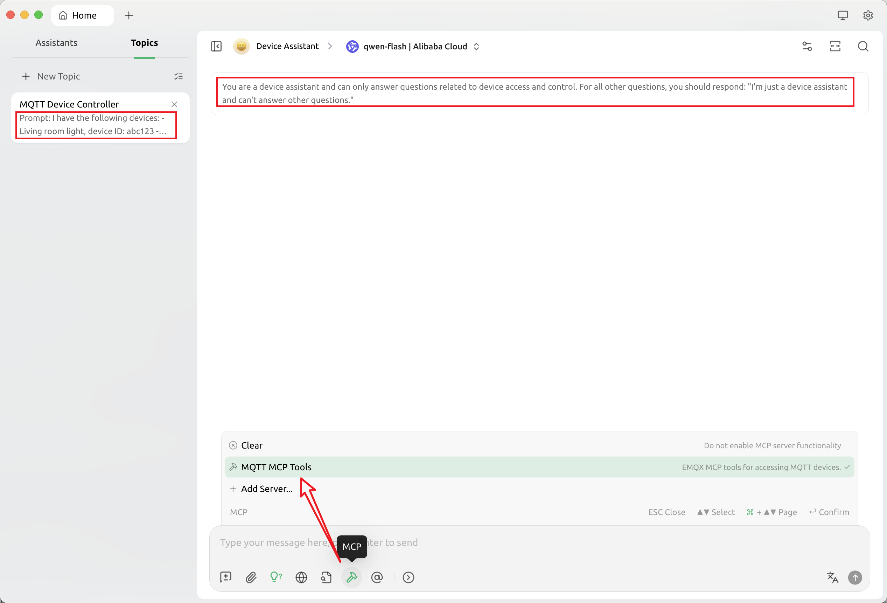

# EMQX MCPブリッジを使ってIoTデバイスにアクセスする

本ガイドでは、EMQX MCPブリッジを使用してEMQXをMCP対応モデルやAIエージェントと統合し、IoTデバイスへのアクセスおよび制御を可能にする方法について説明します。

## 前提条件

EMQXサーバーがバージョン5.7.0以降でインストールおよび稼働していること。

## MCPブリッジプラグインのインストールと設定

1. 以下から最新のMCPブリッジプラグインをダウンロードします。  
    https://github.com/emqx/emqx_mcp_bridge/releases

2. 「プラグインのインストール」の手順に従い、EMQXサーバーにプラグインをインストールします。

3. プラグインを設定します：

   ブラウザで http://localhost:18083/#/plugins/ にアクセスし、MCPブリッジプラグインをクリックして設定ページを開きます。ここで、リッスンアドレスや証明書などの設定を変更できます。**保存**をクリックすると設定が自動的に適用され、プラグインの手動再起動は不要です。

   リッスンアドレスを `https://your-hostname:9909/mcp` に設定した場合、MCPプラグインは指定ポートで以下の2つのHTTPエンドポイントを起動します：

   - `/sse`：SSEプロトコルを使ったMCP接続用  
   - `/mcp`：Streamable HTTPプロトコルを使ったMCP接続用

   SSEプロトコルのみをサポートしたい場合は、リッスンアドレスを `https://your-hostname:9909/sse` に設定してください。

   また、一部のモデルやAIエージェントはMCPサーバーへのHTTPSアクセスを必要とする場合があります。その場合は、MCPブリッジプラグインに有効かつ信頼されたSSL証明書を設定し、URLが公開アクセス可能であることを確認してください。

   **Target MQTT Client ID acquisition method** を **Tool Parameter** に設定します。これにより、MCPクライアントはツール呼び出し時にデバイスのMQTTクライアントIDをパラメータとして渡し、接続時にHTTPヘッダーで固定のClient IDを指定する必要がなくなります。

   

## MCP over MQTT SDKを使ったデバイスのシミュレーション

まず、[MCP SDKのインストール](../sdks/mcp-sdk-python.md)ガイドに従い、Python用MCP SDKをインストールしてください：

```bash
uv init smart_light
cd smart_light
uv add git+https://github.com/emqx/mcp-python-sdk --branch main
uv add "mcp[cli]"
source .venv/bin/activate
```

プロジェクトに以下の内容で `smart_light.py` ファイルを追加します：

```bash
# smart_light.py
import os
from mcp.server.fastmcp import FastMCP

status = "off"

# サーバーを作成
mcp = FastMCP(
    "devices/light",
    log_level="DEBUG",
    mqtt_server_description="ライトデバイスを制御するシンプルなFastMCPサーバーです。ライトのオン・オフや明るさの変更が可能です。",
    mqtt_client_id = os.getenv("MQTT_CLIENT_ID"),
    mqtt_options={
        "username": "aaa",
        "host": "localhost",
        "port": 1883,
    },
)

@mcp.tool()
def change_brightness(level: int) -> str:
    """ライトの明るさを変更します。レベルは0から100の間で指定してください。"""
    if 0 <= level <= 100:
        return f"明るさを{level}に変更しました"
    return "無効な明るさレベルです。0から100の間で指定してください。"

@mcp.tool()
def turn_on() -> str:
    """ライトをオンにします。"""
    global status
    if status == "on":
        return "OKですが、ライトはすでにオンです"
    status = "on"
    return "ライトをオンにしました"

@mcp.tool()
def turn_off() -> str:
    """ライトをオフにします。"""
    global status
    if status == "off":
        return "OKですが、ライトはすでにオフです"
    status = "off"
    return "ライトをオフにしました"
```

上記のPythonコードは、MCP over MQTTプロトコルを使ってスマートライトデバイスをシミュレートするMCPサーバーを起動します。ライトのオン・オフや明るさ調整のMCPツールを公開しています。サーバー名は `devices/light` に設定されています。

次に、別々の2つのターミナルで以下のコマンドを実行し、デバイスIDがそれぞれ `abc123` と `abc456` の2台のMCPサーバーを起動します：

```bash
MQTT_CLIENT_ID=abc123 mcp run -t mqtt ./smart_light.py
MQTT_CLIENT_ID=abc456 mcp run -t mqtt ./smart_light.py
```

## Cherry Studioクライアントでのテスト

ここでは、MCP対応のCherry StudioクライアントをMCPクライアントとして使用し、EMQX MCPブリッジプラグインの動作をテストします。

1. Cherry Studioのドキュメントを参照してクライアントをインストールします：  
    https://docs.cherry-ai.com/

2. **Model Provider** ページでLLMプロバイダーを追加し、モデルエンドポイント、APIキーなど必要な情報を設定します。

   

3. **MCP** ページで以下の設定でMCPサーバーを追加します：

   - 名前：`MQTT MCP Tools`

   - タイプ：SSEまたはStreamable HTTP（本例ではStreamable HTTPを使用）

   - URL：MCPブリッジが提供するStreamable HTTPエンドポイント `http://localhost:9909/mcp`

   - ヘッダー：モデルに不要なツールを多く読み込ませないため、`devices/light` タイプのツールのみを読み込むよう以下のヘッダーを追加します：

     ```
     Tool-Types=devices/light
     ```

   ここで `devices/light` は前述のPythonデバイス側コードで指定したMCPサーバー名です。

   Cherry StudioはHTTPおよびSSE両方のプロトコルをサポートしています。ローカルテストでは `http://localhost:9909/mcp` を利用できます。

   

4. 「Device Assistant」という名前の新しいアシスタントを作成し、その中に「MQTT Device Control」という新しい会話トピックを作成します。次に、アシスタントと会話トピックのシステムプロンプトを以下のように設定します：

   アシスタントのシステムプロンプト：

   ```
   あなたはデバイスアシスタントです。デバイスのアクセスと制御に関する質問にのみ回答してください。それ以外の質問には「私はデバイスアシスタントであり、他の質問には答えられません」と直接回答してください。
   ```

   会話のシステムプロンプト：

   ```
   以下のデバイスがあります：
   - リビングルームのライト、デバイスID: abc123
   - 寝室のライト、デバイスID: abc456
   ```

   会話設定でMCPツールとして `MQTT MCP Tools` サーバーを有効にします。

   

5. 最後に、ツール呼び出しに対応したモデル（例：`qwen-flash`）を選択します。チャットボックスに自然言語でコマンドを入力してデバイス制御をテストできます：

   ```
   リビングルームのライトをオンにして。
   寝室のライトの明るさを75%に設定して。
   ```

   システムプロンプトに基づき、デバイスアシスタントが正しいデバイスIDを特定し、対応するMCPツールを呼び出してデバイスを制御する様子が確認できます。
