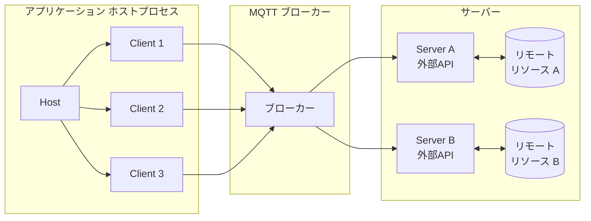
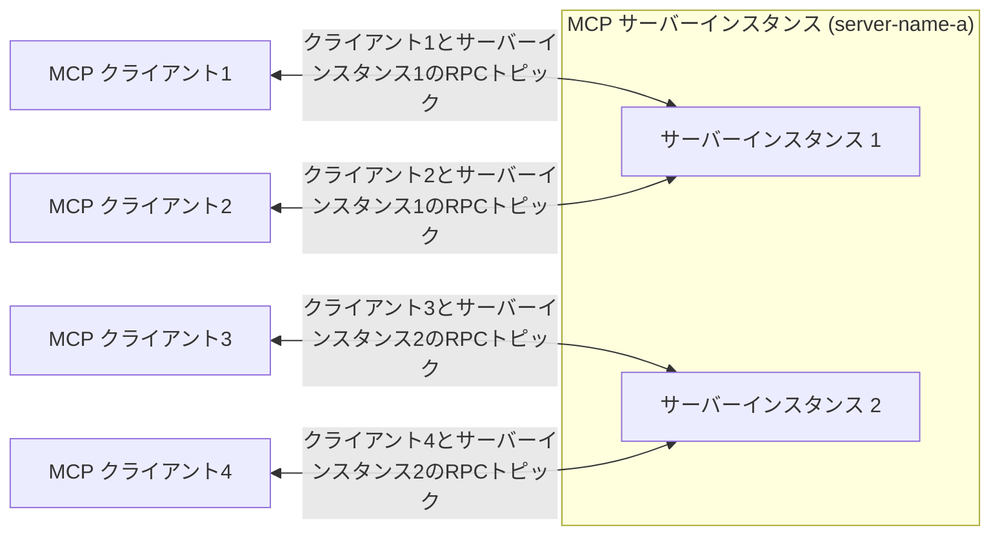

# MCP over MQTT アーキテクチャ

<<<<<<< HEAD
MCP over MQTT は、標準のMCPアーキテクチャ（Host、Client、Server）のコアコンセプトを継承しつつ、トランスポート層として中央集権型のMQTT ブローカーを導入しています。ブローカーはメッセージのルーティング、サービスの登録と検出、認証および認可を可能にします。

このアーキテクチャは、MCPの元々のコンテキストインタラクションモデルを維持しつつ、MQTTの軽量で広く適用可能な設計を活用し、IoTやエッジコンピューティングのシナリオにおける多対多通信、ロードバランシング、スケーラビリティの基盤を提供します。

## MQTT トランスポートのコアコンポーネント

MCP over MQTT アーキテクチャでは、メッセージルーターとして中央集権型のMQTT ブローカーが導入され、その他のコンポーネント（Host、Client、Server）は標準のMCP設計と同様です。
=======
MCP over MQTT は、標準のMCPアーキテクチャ（Host、Client、Server）のコアコンセプトを継承しつつ、トランスポート層として中央集権型のMQTTブローカーを導入しています。ブローカーはメッセージのルーティング、サービス登録および検出、認証、認可を可能にします。

このアーキテクチャは、MCPの元々のコンテキスト相互作用モデルを保持しながら、MQTTの軽量かつ広範に適用可能な設計を活用し、IoTやエッジコンピューティングのシナリオにおける多対多通信、ロードバランシング、スケーラビリティの基盤を提供します。

## MQTTトランスポートのコアコンポーネント

MCP over MQTTアーキテクチャでは、中央集権型のMQTTブローカーがメッセージルーターとして導入されており、他のコンポーネント（Host、Client、Server）は標準のMCP設計と一貫しています。
>>>>>>> origin/release-5.10

### Host、Client、および Server

<<<<<<< HEAD
Host、Client、および Server のコンポーネントは変更されていません（詳細は[MCPコアコンセプト](https://modelcontextprotocol.io/docs/learn/architecture#concepts-of-mcp)を参照してください）：
=======
Host、Client、およびServerのコンポーネントは変更されていません（詳細は[MCPコアコンセプト](https://modelcontextprotocol.io/docs/learn/architecture#concepts-of-mcp)を参照）：
>>>>>>> origin/release-5.10

- **Host** はクライアントのコンテナおよびコーディネーターとして機能します。
- 各 **Client** はHostによって作成され、Serverと独立した接続を維持します。
- **Server** は専用のコンテキストと機能を提供します。

<<<<<<< HEAD
主な違いは、ClientとServerが直接通信するのではなく、MQTT ブローカーを介して通信する点です。ブローカーの導入により、ClientとServer間の関係は1対1から多対多へと変わります。

### MQTT ブローカーの役割

MQTT ブローカーは中央集権型のメッセージルーターとして機能します：

- ClientとServer間のメッセージを転送します。
- サービスの登録および検出をサポートします（保持メッセージを介して）。
- ClientおよびServerの認証と認可を処理します。

## サーバースケーリングとロードバランシング

スケーラビリティとロードバランシングを実現するために、MCP Serverは複数のインスタンス（プロセス）を起動できます。各インスタンスは一意の `server-id` をMQTT クライアントIDとしてブローカーに接続し、すべてのインスタンスは同じ `server-name` を共有します。

**Clientのインタラクションフロー：**

1. Clientはサービス検出トピックをサブスクライブし、対象の `server-name` 配下のすべての利用可能な `server-id` を取得します。
2. Clientはカスタムポリシー（例：ランダムまたはラウンドロビン）に基づいてServerインスタンスを選択し、`initialize` リクエストを送信します。
=======
主な違いは、ClientとServerが直接通信するのではなく、MQTTブローカーを介して通信する点です。ブローカーの存在により、ClientとServer間の関係は1対1から多対多に変わります。

### MQTTブローカーの役割

MQTTブローカーは中央集権型のメッセージルーターとして機能します：

- ClientとServer間のメッセージを転送します。
- サービス登録および検出（リテインドメッセージを介して）をサポートします。
- ClientおよびServerの認証と認可を処理します。

## Serverのスケーリングとロードバランシング

スケーラビリティとロードバランシングを実現するために、MCP Serverは複数のインスタンス（プロセス）を起動できます。各インスタンスはユニークな `server-id` をMQTTクライアントIDとしてブローカーに接続し、すべてのインスタンスは同じ `server-name` を共有します。

**Clientの相互作用フロー：**

1. Clientはサービス検出トピックをサブスクライブし、対象の `server-name` 配下のすべての利用可能な `server-id` を取得します。
2. Clientはカスタムポリシー（ランダムやラウンドロビンなど）に基づいてServerインスタンスを選択し、`initialize` リクエストを送信します。
>>>>>>> origin/release-5.10
3. 初期化後、Clientは専用のRPCトピックを通じて選択されたServerインスタンスと通信します。

<<<<<<< HEAD
この方式により、MCPサーバーの高可用性とスケーラビリティが可能になります：
=======
このアプローチにより、MCPサーバーの高可用性とスケーラビリティが実現されます：
>>>>>>> origin/release-5.10

- **スケールアップ時**、既存のMCPクライアントは旧サーバーインスタンスに接続したままで、新規クライアントは新たに追加されたインスタンスで初期化できます。
- **スケールダウン時**、MCPクライアントは再初期化して他の利用可能なサーバーインスタンスに接続できます。
