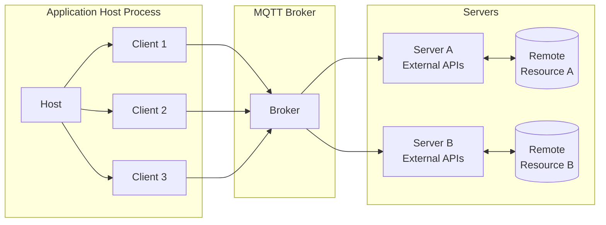
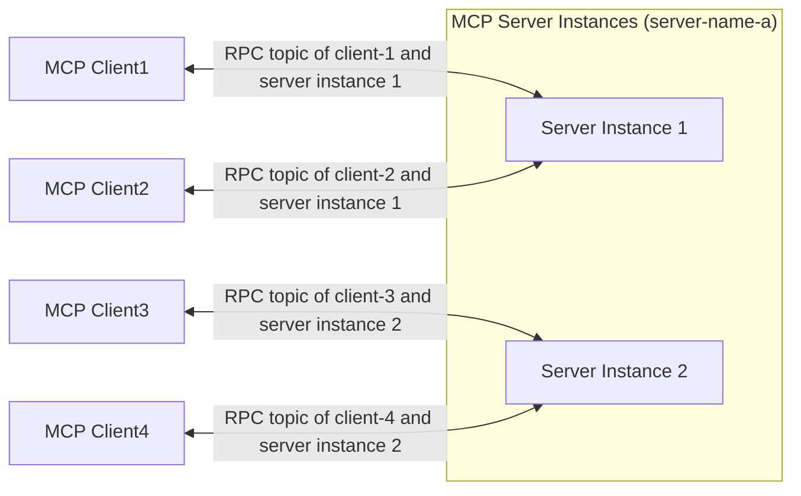

# MCP over MQTT アーキテクチャ

MCP over MQTT は、標準の MCP アーキテクチャ（Host、Client、Server）のコアコンセプトを継承しつつ、トランスポート層として中央集約型の MQTT ブローカーを導入しています。ブローカーはメッセージのルーティング、サービスの登録と検出、認証および認可を可能にします。

このアーキテクチャは MCP の元々のコンテキストインタラクションモデルを保持しつつ、MQTT の軽量で広範に適用可能な設計を活用し、IoT やエッジコンピューティングのシナリオにおける多対多通信、ロードバランシング、スケーラビリティの基盤を提供します。

## MQTT トランスポートのコアコンポーネント

MCP over MQTT アーキテクチャでは、メッセージルーターとして中央集約型の MQTT ブローカーが導入され、その他のコンポーネント（Host、Client、Server）は標準の MCP 設計と一致しています。

### Host、Client、および Server

Host、Client、および Server のコンポーネントは変更されていません（詳細は [MCP コアコンセプト](https://modelcontextprotocol.io/docs/learn/architecture#concepts-of-mcp) を参照してください）：

- **Host** はクライアントのコンテナおよびコーディネーターとして機能します。
- 各 **Client** は Host によって作成され、Server と独立した接続を維持します。
- **Server** は専用のコンテキストと機能を提供します。

主な違いは、Client と Server が直接通信するのではなく、MQTT ブローカーを介して通信する点です。ブローカーの導入により、Client と Server の関係は一対一から多対多へと変わります。

### MQTT ブローカーの役割

MQTT ブローカーは中央集約型のメッセージルーターとして機能します：

- Client と Server 間のメッセージを転送します。
- サービスの登録と検出をサポートします（保持メッセージを介して）。
- Client と Server の認証および認可を処理します。

## Server のスケーリングとロードバランシング

スケーラビリティとロードバランシングを実現するために、MCP Server は複数のインスタンス（プロセス）を起動できます。各インスタンスは MQTT クライアント ID として一意の `server-id` を持ち、すべてのインスタンスは同じ `server-name` を共有します。

**Client のインタラクションフロー：**

1. Client はサービス検出トピックをサブスクライブし、対象の `server-name` の下にあるすべての利用可能な `server-id` を取得します。
2. Client はカスタムポリシー（例えばランダムやラウンドロビン）に基づいて Server インスタンスを選択し、`initialize` リクエストを送信します。
3. 初期化後、Client は専用の RPC トピックを通じて選択した Server インスタンスと通信します。

このアプローチにより、MCP Server の高可用性とスケーラビリティが実現されます：

- **スケールアップ時**、既存の MCP クライアントは従来のサーバーインスタンスに接続したままで、新規クライアントは新たに追加されたインスタンスで初期化できます。
- **スケールダウン時**、MCP クライアントは再初期化して他の利用可能なサーバーインスタンスに接続できます。
