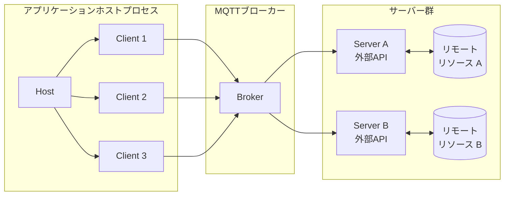
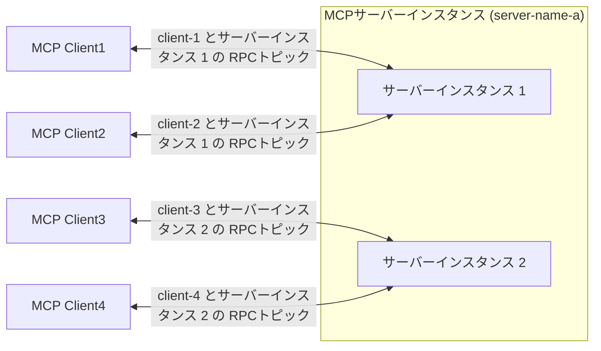

# MCP over MQTT アーキテクチャ

MCP over MQTT は、標準のMCPアーキテクチャ（Host、Client、Server）のコアコンセプトを継承しつつ、トランスポート層として中央集権型のMQTTブローカーを導入しています。ブローカーはメッセージのルーティング、サービス登録と検出、認証および認可を可能にします。

このアーキテクチャは、MCPの元々のコンテキストインタラクションモデルを維持しながら、MQTTの軽量かつ広く適用可能な設計を活用し、IoTやエッジコンピューティングのシナリオにおける多対多通信、ロードバランシング、スケーラビリティの基盤を提供します。

## MQTTトランスポートのコアコンポーネント

MCP over MQTTアーキテクチャでは、メッセージルーターとして中央集権型のMQTTブローカーが導入され、その他のコンポーネント（Host、Client、Server）は標準のMCP設計と一貫しています。

### Host、Client、および Server

Host、Client、および Server のコンポーネントは変更されていません（詳細は[MCPコアコンセプト](https://modelcontextprotocol.io/docs/learn/architecture#concepts-of-mcp)を参照）：

- **Host** はクライアントのコンテナおよびコーディネーターとして機能します。
- 各 **Client** はHostによって作成され、Serverと独立した接続を維持します。
- **Server** は専用のコンテキストと機能を提供します。

主な違いは、ClientとServerが直接通信するのではなく、MQTTブローカーを介して通信する点です。ブローカーの導入により、ClientとServerの関係は1対1から多対多へと変わります。

### MQTTブローカーの役割

MQTTブローカーは中央集権型のメッセージルーターとして機能します：

- ClientとServer間のメッセージを転送します。
- サービス登録と検出をサポートします（保持メッセージを介して）。
- ClientおよびServerの認証と認可を処理します。

## サーバースケーリングとロードバランシング

スケーラビリティとロードバランシングを実現するために、MCP Serverは複数のインスタンス（プロセス）を起動できます。各インスタンスはMQTTクライアントIDとして一意の`server-id`でブローカーに接続し、すべてのインスタンスは同じ`server-name`を共有します。

**Clientのインタラクションフロー:**

1. Clientはサービス検出トピックをサブスクライブし、対象の`server-name`に属するすべての利用可能な`server-id`を取得します。
2. Clientはカスタムポリシー（例：ランダムまたはラウンドロビン）に基づいてServerインスタンスを選択し、`initialize`リクエストを送信します。
3. 初期化後、Clientは専用のRPCトピックを通じて選択されたServerインスタンスと通信します。

この方法により、MCPサーバーの高可用性とスケーラビリティが実現されます：

- **スケールアップ時**、既存のMCPクライアントは古いサーバーインスタンスに接続したままで、新しいクライアントは新たに追加されたインスタンスで初期化できます。
- **スケールダウン時**、MCPクライアントは再初期化して他の利用可能なサーバーインスタンスに接続できます。
