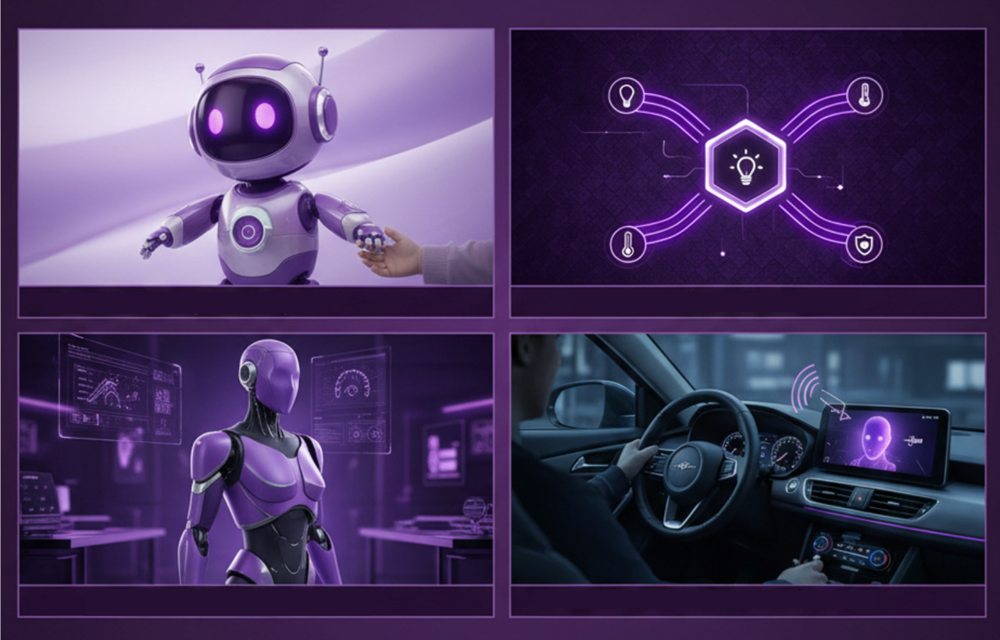

# EMQX AI

大規模言語モデル（LLM）の急速な進展により、AIは産業をかつてない速度で変革し、IoTは根本的な変化を遂げています。従来のスマートハードウェアは固定機能を中心に構築され、主に受動的な実行者として動作していましたが、現在ではデバイスが知覚、理解、対話、行動の統合能力を備えたインテリジェントエージェントへと進化し、自律的かつコンテキスト認識型の意思決定を可能にしています。この進化は多くの応用領域において破壊的なアップグレードを促進しています。

感情的な伴侶として、単純な電子玩具は感情認識、コンテキスト理解、共感的な対話が可能な知能的パートナーへと変わりつつあります。スマートホームでは、孤立したデバイスが自然言語で制御される協調的な全館エコシステムに置き換えられています。ロボティクス分野では、サービスロボットや産業用ロボット、人型ロボットに至るまで、実時間の知覚、意図理解、即時応答が求められる具現化された知能システムが必要とされています。自動車分野では、インテリジェント車両が移動する知能空間として登場し、車載AIアシスタントが複雑な交通状況を管理し、継続的かつ自然な音声対話を通じて運転体験を向上させています。

## AIハードウェアの核心：リアルタイムで正確かつコンテキスト豊かな知覚とマルチモーダルインタラクション

大規模モデルは強力な推論と生成能力を持つものの、その性能は基本的に受け取るコンテキストの質に依存します。システムが現在の状況、環境変化、ユーザーの真の意図を正確に理解できなければ、モデルは幻覚を起こしたり、無関係な応答を生成したりします。人間も同様で、情報が限られれば誤った判断をし、完全なコンテキストがあれば正確な決定を下せます。インテリジェントハードウェアにおいては、AIが*現実世界を理解する*ことが、対話の安定性と信頼性を向上させるために極めて重要です。信頼できるAIエージェントは、以下の3つの核心能力を備えている必要があります。

### マルチソースデータ：AIに現実世界を理解させる

多様なソースからのデータがAIの*ワールドモデル*を形成します：

- **環境データ**：温度、湿度、明るさ、重力などの物理信号によりリアルタイムの状態認識を実現。
- **クラウドベースの知識**：地図、天気、交通状況、充電ステーションの空き状況などのサービスがデバイスのグローバルな認知を拡張。
- **サードパーティのコンテキスト**：コンテンツサービスや知識ベースにより、より複雑な質問やユーザーのニーズに対応可能。

データソースが豊富であればあるほど、システムは*今何が起きているか*、*ユーザーが本当に必要としていること*をより正確に把握できます。

### リアルタイムイベント認識：ミリ秒単位の変化を理解する

イベントはコンテキスト理解のアンカーであり、LLMやVLMを駆動する重要なトリガーです：

- **環境変化**：例えば、室内の明るさが突然変わる場合。
- **状態変化**：おもちゃが予期せず倒れた場合など。
- **特殊シナリオ**：例えば、車が施錠された後の後部座席圧力センサーの異常検知。

ミリ秒レベルのレイテンシでイベントを捉える能力が、システムの応答速度と正確性を直接左右します。

### マルチメディアインタラクション：自然な人間と機械のコミュニケーションを実現

マルチメディアインタラクションは、従来の「音声アシスタント」から真に没入型の知能体験への根本的な飛躍を表します：

- **音声**：感情表現、自然な抑揚、多言語対応。
- **映像**：表情認識、シーン理解、リアルタイムの視覚フィードバック。
- **制御能力**：音声と映像理解を組み合わせ、より知能的でコンテキスト認識型のシナリオを実現。

## インテリジェントハードウェア構築のための6つの必須要素

入力と出力の両面から、優れたインテリジェントハードウェアを構築するために必要な6つの要素を定義します。

### 入力能力

- **知覚**：エージェントは様々なセンサーを通じて物理世界を知覚します。温度センサーで環境状態を把握し、位置情報システムで場所を認識し、加速度計で動きや姿勢を検出します。
- **聴覚**：マイクロフォンが周囲の音やユーザーの発話をキャプチャします。ノイズ抑制やエコーキャンセレーション、多言語音声認識と組み合わせることで、デバイスは自然な人間の言語を「聞く」ことが可能です。
- **視覚**：カメラが映像情報を収集し、画像認識、物体検出、顔認識、ジェスチャー認識を実現。デバイスは周囲やユーザーの行動を「見て」理解します。

### 出力能力

- **理解**：LLMとVLMモデルを統合することで、意味理解、感情認識、コンテキスト記憶を実現し、正確な意図把握と一貫したマルチターン対話を可能にします。
- **音声**：高品質スピーカーが多様な声質、感情表現、コンテキストに応じたイントネーションで合成音声を出力し、自然で流暢なコミュニケーションを実現します。
- **行動**：MCPプロトコルを通じて、音量調整、カメラ起動、多デバイス連携などの機能を制御し、ユーザーの指示を具体的な行動に変換します。

## EMQXとRTCサービスを中心としたインテリジェントIoTアーキテクチャ

EMQXのエンドツーエンドソリューションは、デバイス層、通信層、処理層、アプリケーション層を統合した階層型アーキテクチャを採用しています。センサーデータ収集とエッジ処理から、リアルタイム通信（MQTT + WebRTC）、クラウドベースの大規模モデルまでを連結し、**「知覚」→「理解」→「行動」**の閉ループチェーンを形成します。このアーキテクチャは、軽量デバイスからロボティクスや車載システムのような複雑なシナリオまで適用可能です。

### 知覚：AIワールドモデルのリアルタイムコンテキストを提供するEMQX

知覚はすべての知能的行動の基盤です。人間の場合、入力の大部分は視覚、聴覚、触覚から得られ、言語は日常活動の6～10％に過ぎません。同様に、リアルタイムの世界知覚を持たないAIエージェントは単なるアルゴリズムであり、物理世界で動作する実体とは言えません。

EMQXはデバイス向けに包括的な*リアルタイムコンテキスト基盤*を提供します：

- **ミリ秒レベルのデータパイプライン**：デバイスからクラウドまでのエンドツーエンドのメッセージ転送がミリ秒単位のレイテンシで行われ、即時のイベント処理を保証。
- **フルスペクトラムSDK**：低消費電力MCUからLinuxベースデバイスまで統一的にアクセスでき、センサー統合を簡素化。
- **大規模デバイス管理**：大規模同時接続、メッセージ処理、状態追跡をサポートし、おもちゃから自動車システムまで幅広いシナリオに対応。

#### 詳細はこちら

[EMQXで構築する知覚から制御へのフィードバック](./rtc-services/volcengine-rtc/scenarios/device-triggered-voice.md)

### 聴覚・視覚・発話：音声・映像ストリームのアクセスと処理

WebRTCはリアルタイム音声・映像インタラクションの中核技術です。低レイテンシかつ高い互換性により、インテリジェントハードウェアのマルチメディアインタラクションに最適なソリューションとなっています。

- **音声入力**：デバイスがユーザーを真に「理解」するための基盤。高品質マイクとノイズ抑制、エコーキャンセレーションにより複雑な環境でも音声の明瞭性を維持。リアルタイムASRが多言語対応で音声をテキスト化し、意味理解の基礎を形成。
- **映像入力**：デバイスに「目」を提供。高精細カメラと物体認識、顔認識、行動理解を組み合わせ、ユーザーの状態や行動を知覚。ジェスチャー操作により非接触でより自然な操作を実現。
- **音声出力**：コミュニケーションを自然に。最新のTTSは多様な声質と感情合成をサポートし、文脈に応じて音調やリズムを自動調整。機械の応答がより人間らしく魅力的に。

#### 詳細はこちら

[Volcano Engine RTCで構築する音声・映像アクセス](./rtc-services/volcengine-rtc/overview.md)

### 理解：LLMとVLMの統合

LLMは言語の理解と生成を担い、VLMは視覚と言語を統合します。これにより、デバイスは単に「聞き」「見」るだけでなく、真に*理解*することが可能になります。従来のルールベースエンジンと比較して、最新の大規模モデルは強力な推論、記憶、一般化能力を備え、極めて複雑かつオープンエンドな対話シナリオに適しています。

詳細情報：

- [Alibaba Tongyi Qianwenモデル](https://www.aliyun.com/product/tongyi)
- [Volcano Engine Doubao大規模モデル](https://www.volcengine.com/product/doubao)

### 行動：MCPデバイス制御 — AIとデバイスをつなぐ架け橋

Model Context Protocol（MCP）は、AIが自然かつ標準化された動的な方法でデバイス機能を呼び出すことを可能にします。

- **MCPサーバー**：デバイス側に展開され、カメラ制御、音量調整、機械的動作コマンドなどのデバイス機能を登録。
- **MCPクライアント**：クラウドまたはエッジで動作し、AIの意思決定を実行可能なデバイス制御コマンドに変換。
- **MCPホスト**：AIアプリケーションに組み込まれ、ユーザーの意図をツール呼び出しに変換し、デバイスとの双方向連携を実現。

MCPを通じてAIは行動力を獲得し、デバイスは統一された制御インターフェースを得ることで、多デバイス連携や複雑なシナリオ制御が可能になります。

#### 詳細はこちら

- [MCP over MQTTプロトコル概要](./mcp-over-mqtt/overview.md)

### 協調：MQTT上のA2A — エージェント間コラボレーション

インテリジェントハードウェアやAIエージェントが増加するにつれ、個々のエージェントは他のエージェントにタスクを委任し、協調する必要が高まっています。Agent-to-Agent（A2A）プロトコルは、エージェント同士が相互に発見し、タスク要求を交換し、結果をストリーム配信する方法を定義し、単独のエージェントでは対応困難な複雑なワークフローを実現するマルチエージェントシステムを形成します。

EMQXは組み込みのA2Aレジストリを通じてMQTT上でA2Aを実装し、エージェントが公開するAgent Cardを記録、接続状態を追跡し、標準MQTTトピックを用いてタスク要求をルーティングします。

#### 詳細はこちら

- [MQTT上のA2A概要](./a2a-over-mqtt/overview.md)

### 典型的なインテリジェントエージェントの対話シナリオ

- **純粋音声対話**：音声のみを入力とし、WebRTC単独でリアルタイムかつ高品質な対話を実現。
- **音声／映像によるデバイス制御**：マイクやカメラを介してデバイスを操作し、安定した制御パイプラインのためにWebRTCとMQTTの両方を利用。
- **知覚駆動の制御とマルチメディア対話**：センサーでイベントを検知し、AIが判断、音声や映像で応答する没入型インテリジェント体験。前述のシナリオ同様、WebRTCとMQTTの統合が必要。
