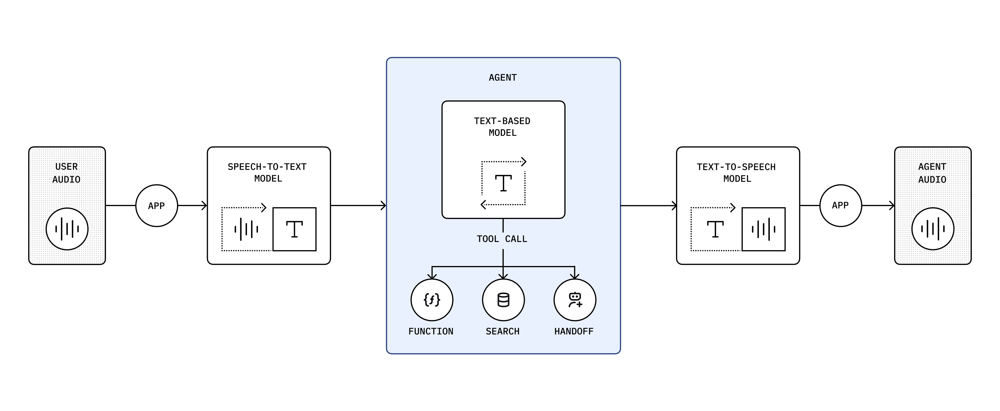

# GPT-Realtime 概要

GPT-Realtime は、OpenAI によって開発されたマルチモーダルかつリアルタイム対応のモデルで、ライブの音声入力を受け取り、リアルタイムで音声出力を生成できます。大規模な音声データセットで学習されており、人間の自然な会話パターンに密接に沿うよう設計されています。

主な特徴は以下の通りです：

- **プロトコル**：WebRTC、WebSocket、SIP に対応。テキストおよび音声入力をリアルタイムで処理し、レスポンスを連続的にストリーミング可能です。
- **会話体験**：低レイテンシ、自然で流暢な音声合成、会話中の複数の割り込みにも強く、人間の対話に近い挙動を実現します。
- **関数呼び出しとツール**：関数呼び出しおよび MCP ツールをサポートしています。
- **開発者体験**：WebRTC 統合においては、以下の2つのレベルの統合を提供します：
  - **Voice Agents SDK**：すぐに使える高レベルの抽象化機能を備えています。
  - **WebRTC SDK**：より柔軟でカスタマイズ可能な低レベルの音声/映像トランスポートを提供します。

## 従来の RTC リアルタイム音声パイプライン（複数モデルによる構成）

従来の RTC リアルタイム音声ソリューションでは、音声対話を実現するために複数のモデルが連結されるのが一般的です。まず音声をテキストに文字起こしし、その後大規模言語モデルで処理し、最後に音声合成してユーザーにストリーミングします。

## GPT-Realtime：単一モデルによる統合機能

GPT-Realtime は複数モデルの連結を不要にします。音声から音声への一連の処理を単一モデルで完結させることで、エンドツーエンドのレイテンシを大幅に低減しています。

