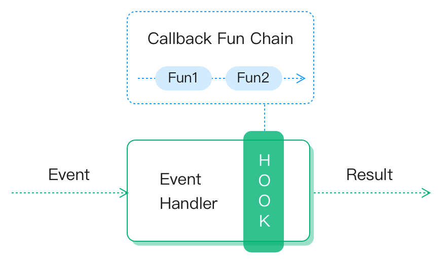

# Hooks

[Hooks](https://reactjs.org/docs/getting-started.html) は、クラスを書かずに状態管理やその他の React 機能を使用できる拡張機構です。

EMQX も Hooks をサポートしており、関数呼び出し、メッセージの受け渡し、モジュール間のイベント伝達をインターセプトすることで、システム機能の変更や拡張が可能です。

## 動作原理

システムが **Hooks** 機構を採用していない場合、イベントの入力からハンドラー、結果までの一連のイベント処理の流れは見えず、変更もできません。

しかし、処理の途中に HookPoint を設けて関数をマウントできるようにすると、外部プラグインが複数のコールバック関数をマウントして呼び出しチェーンを形成でき、内部のイベント処理を拡張・変更できます。



EMQX のいくつかの機能はこのフック機能を使って実装されています。

1. フックシステムを利用したメッセージの多段階ストリーミング処理（エンコード／デコードなど）
2. メッセージパブリッシュ時のメッセージキャッシュ（設定に応じて）
3. フックのブロッキング機構を利用したメッセージパブリッシュの遅延

システムで一般的に使われる認証／認可もこのロジックに則って実装されています。例として [多言語拡張](./exhook.md) を挙げます。

`Built-in Database` 認証のみが有効な場合、イベントの処理ロジック（上図参照）に従い、認証モジュールのロジックは以下のようになります。

1. EMQX はユーザーの認証リクエスト（Authenticate）を受け取る。
2. EMQX は `ClientInfo` とデフォルトの `AccIn` を使って認証イベントのフックを実行する。
```erlang
%% デフォルトの AccIn
{ok, #{is_superuser => false}}
```
3. `emqx_exhook` モジュールにコールバックし、この認証を有効と判断し、**allow, is_superuser** の結果を得る。
```erlang
%% AuthNResult
{ok, #{is_superuser => true}}
```
4. **認証成功**を返し、クライアントはスーパーユーザーとして正常にシステムにアクセスできる。


このように、**Hooks** は EMQX の柔軟性を大幅に高めます。EMQX の動作をカスタマイズしたい場合、コアコードを修正する必要はなく、EMQX が特定箇所に提供する **HookPoint** に関数をフックするだけで済みます。

この一連の流れで注意すべき点は以下の3つです。

1. **HookPoint** の場所：役割、実行タイミング、マウントおよびアンマウント方法
2. **コールバック関数** の実装：入力パラメータ数、役割、データ構造、返り値の意味
3. **チェーン上のコールバック関数実行機構**：コールバック関数の実行順序、チェーンの途中での実行終了方法

拡張プラグイン開発で Hooks を使う場合は、上記3点を十分理解し、**システムのスループットに影響を与えるため、フック内でのブロッキング関数の使用は極力避けてください。**

## コールバック関数チェーン

1つの **HookPoint** に複数のプラグインがイベントを監視し対応処理を行う場合があるため、各 **HookPoint** には複数のコールバック関数が存在します。

これら複数のコールバック関数が順次実行される連鎖を **コールバック関数チェーン** と呼びます。

**コールバック関数チェーン** は現在 [Chain-of-Responsibility](https://en.wikipedia.org/wiki/Chain-of-responsibility_pattern) パターンに基づいて実装されています。フックの機能性と柔軟性を満たすため、以下の特徴を持ちます。

- **順序付け**：チェーン上のコールバック関数は特定の順序で実行される必要があります。
- **入力パラメータ**：初期化パラメータが1つ以上あり、オプションでチェーン内で変更される累積値があります。
- **出力結果**：チェーン内の各関数は出力を持ち、実行結果を気にしないコールバック関数は `ok` を返します。例えば通知系イベントでは「クライアントが正常にログインした」などの戻り値は不要です。
- **伝達性**：チェーン内のコールバック関数の結果は伝達されます。さらに柔軟性のため、返り値の扱いには**2つのモード**を設計しています。
  - **結果伝達モード**<br />
    チェーン内の各コールバック関数はチェーンの入力と前関数の返り値（累積値）を受け取り、最後の関数の返り値がチェーン全体の返り値となります。チェーン呼び出し時に初期累積値を渡します。
  - **結果透過モード**<br />
    チェーン内の各関数はチェーンの入力のみを気にし、前関数の返り値は無視します。チェーンの返り値は常に `ok` となります。<br />
    これは結果伝達モードの特殊ケースで、初期累積値が `ok` で、各コールバック関数が `ok | {ok, ok} | stop | {stop, ok}` を返す場合に相当します。<br />通知系イベントの多くはこのロジックに従うため、一般的な **コールバック関数チェーン** 実行モジュールを提供しています。
- **チェーンの途中終了と無視**を許容します。
  - **途中終了**：ある関数の実行完了後、チェーンの実行を即座に終了し、以降のコールバック関数は無視されます。<br />例えば認証であるクライアントがログイン許可された場合、他の認証プラグインのチェックを省略するために途中終了します。
  - **無視**：チェーン上の処理結果を変更せず、前関数の返り値をそのまま次関数に渡します。<br />例えば複数認証プラグインがある場合、あるプラグインが対象外のクライアントと判断した際に処理を無視します。

以上より、チェーン上のコールバック関数の返り値の扱いに応じて、2つのプログラムフロー図が得られます。

### 結果伝播モード


図の意味は以下の通りです。

1. 図中には3つのコールバック関数 `Fun1` `Fun2` `Fun3` が登録され、示された順に実行される。
2. 実行順序は優先度で決まり、同じ優先度の場合はマウント順。
3. チェーンの入力パラメータは読み取り専用の `Args` と、関数が変更可能な `InitAcc`。
4. チェーンの実行が途中終了しても必ず返り値を返し、返り値の形式は以下の通り。
   - コールバック関数の返り値：
     - `ok`：操作を無視し、読み取り専用の `Args` と前関数の返した `Acc` でチェーンを継続
     - `{ok, NewAcc}`：何らかの操作を行い、`Acc` の内容を変更し、新しい `NewAcc` でチェーンを継続
   - また、以下の返り値も可能：
     - `stop`：チェーンの伝達を停止し、前関数の `Acc` を即座に返す
     - `{stop, NewAcc}`：チェーンの伝達を停止し、この関数の修正した `NewAcc` を即座に返す

### 結果透過モード


1つ目の実行モードと比較すると、チェーン内で返り値を無視する実行モードは、返り値をそのまま渡すモードの特殊ケースであることがわかります。

これは `InitAcc` が `ok` で、チェーンにマウントされた各コールバック関数が `ok | {ok, ok} | stop | {stop, ok}` を返す場合に相当します。

以上がコールバック関数チェーンの主な設計思想であり、フック上のコールバック関数の実行ロジックを規定しています。

以下の [HookPoint](#hookpoint) と [コールバック関数](#callback) の2節では、フックに関するすべての操作は [emqx](https://github.com/emqx/emqx) が提供する Erlang コードレベルの API に依存しており、フックロジック全体の基盤となっています。

- 他言語アプリケーションのフックについては、[Extension Hook](./exhook.md) を参照してください。

## HookPoint 一覧

EMQX はクライアントのライフサイクルにおける主要なアクティビティに基づき、多数の **HookPoint** をあらかじめ用意しています。システムにプリセットされたマウントポイントは以下の通りです。

| 名前                   | 説明                         | 実行タイミング                                                                                 |
|------------------------|------------------------------|-----------------------------------------------------------------------------------------------|
| client.connect         | 接続パケット処理             | サーバーがクライアントから接続パケットを受信したとき                                       |
| client.connack         | 接続応答発行                 | サーバーが接続応答メッセージの発行準備ができたとき                                         |
| client.connected       | 接続成功                     | クライアント認証完了後、システムへの接続が成功したとき                                     |
| client.disconnected    | 切断                         | クライアントの接続層が閉じる準備ができたとき                                               |
| client.authenticate    | 接続認証                     | `client.connect` 実行後                                                                      |
| client.post_authn      | 認証後書き換え               | `client.authenticate` の認証チェーン完了後（6.1.2で追加）                                   |
| client.authorize       | Pub/Sub 認可                 | `publish/subscribe` 操作実行前                                                               |
| client.subscribe       | トピックサブスクライブ       | サブスクライブメッセージ受信後、`client.authorize` 実行前                                  |
| client.unsubscribe     | サブスクライブ解除           | アン・サブスクライブパケット受信後                                                          |
| session.created        | セッション作成               | `client.connected` 完了時に新規セッション作成時                                             |
| session.subscribed     | セッションのトピックサブスクライブ | サブスクライブ操作完了後                                                                    |
| session.unsubscribed   | セッションのトピックサブスクライブ解除 | アン・サブスクライブ操作完了後                                                              |
| session.resumed        | セッション再開               | `client.connected` 実行時に旧セッション情報が正常に再開されたとき                           |
| session.discarded      | セッション破棄               | **discarded** によりセッションが終了した後                                                  |
| session.takenover      | セッション奪取               | **takenover** によりセッションが終了した後                                                  |
| session.terminated     | セッション終了               | その他の理由でセッションが終了した後                                                        |
| message.publish        | メッセージパブリッシュ       | サーバーがメッセージをパブリッシュ（ルーティング）する前                                    |
| message.delivered      | メッセージ配信               | メッセージがクライアントに配信される直前                                                   |
| message.acked          | メッセージアック受信         | クライアントからメッセージの ACK を受け取った後                                            |
| message.dropped        | メッセージ破棄               | パブリッシュされたメッセージが破棄された後                                                  |

::: tip
- **セッション破棄（discarded）**：クライアントが `clean session` 方式でログインした場合、サーバーに既存のセッションがあれば古いセッションが破棄されます。
- **セッション奪取（takenover）**：クライアントが `Reserved Session` 方式でログインした場合、サーバーに既存のセッションがあれば新しい接続により古いセッションが奪取されます。
:::

### Hook と Unhook

EMQX はフックのマウントとアンマウントのための API を提供しています。

**Hook:**

```erlang
%% Name: フック名（フックポイント）、例：'client.authenticate'
%% {Module, Function, Args}: コールバック関数のモジュール、関数、追加引数
%% Priority：整数、デフォルトは 0
emqx:hook(Name, {Module, Function, Args}, Priority).
```

フック完了後、コールバック関数は優先度順に、同じ優先度の場合はフック順に実行されます。すべての公式プラグインのマウントフックは優先度 `0` です。

**Unhook**：

```erlang
%% Name: フック名（フックポイント）、例：'client.authenticate'
%% {Module, Function}: コールバック関数のモジュールと関数
emqx:unhook(Name, {Module, Function}).
```

## コールバック関数

コールバック関数の入力パラメータと返り値は以下の表の通りです。

パラメータのデータ構造は [emqx_types.erl](https://github.com/emqx/emqx/tree/master/apps/emqx/src/emqx_types.erl) を参照してください。

| 名前                   | 入力パラメータ                                               | 返り値              |
| ---------------------- | ------------------------------------------------------------ | ------------------- |
| client.connect         | `ConnInfo`：クライアント接続層パラメータ<br />`Props`：MQTT v5.0 接続パケットのプロパティ | 新しい `Props`      |
| client.connack         | `ConnInfo`：クライアント接続層パラメータ<br />`Rc`：戻りコード<br />`Props`：MQTT v5.0 接続応答パケットのプロパティ | 新しい `Props`      |
| client.connected       | `ClientInfo`：クライアント情報パラメータ<br />`ConnInfo`：クライアント接続層パラメータ | -                   |
| client.disconnected    | `ClientInfo`：クライアント情報パラメータ<br />`ConnInfo`：クライアント接続層パラメータ<br />`ReasonCode`：理由コード | -                   |
| client.authenticate    | `ClientInfo`：クライアント情報パラメータ<br />`AuthNResult`：認証結果 | 新しい `AuthNResult` |
| client.post_authn      | `Context`：`#{client_info := ClientInfo}` のマップ（認証レスポンスの `client_attrs` を含む統合クライアント情報） | 新しい `Context` または拒否時は `{error, Reason}`（6.1.2で追加） |
| client.authorize       | `ClientInfo`：クライアント情報パラメータ<br />`Topic`：パブリッシュ／サブスクライブトピック<br />`PubSub`：パブリッシュ／サブスクライブ<br />`AuthZResult`：認可結果 | 新しい `AuthZResult` |
| client.subscribe       | `ClientInfo`：クライアント情報パラメータ<br />`Props`：MQTT v5.0 サブスクライブメッセージのプロパティ<br />`TopicFilters`：サブスクライブトピックのリスト | 新しい `TopicFilters` |
| client.unsubscribe     | `ClientInfo`：クライアント情報パラメータ<br />`Props`：MQTT v5.0 アン・サブスクライブメッセージのプロパティ<br />`TopicFilters`：アン・サブスクライブトピックのリスト | 新しい `TopicFilters` |
| session.created        | `ClientInfo`：クライアント情報パラメータ<br />`SessInfo`：セッション情報 | -                   |
| session.subscribed     | `ClientInfo`：クライアント情報パラメータ<br />`Topic`：サブスクライブトピック<br />`SubOpts`：サブスクライブ操作の設定オプション | -                   |
| session.unsubscribed   | `ClientInfo`：クライアント情報パラメータ<br />`Topic`：アン・サブスクライブトピック<br />`SubOpts`：アン・サブスクライブ操作の設定オプション | -                   |
| session.resumed        | `ClientInfo`：クライアント情報パラメータ<br />`SessInfo`：セッション情報 | -                   |
| session.discarded      | `ClientInfo`：クライアント情報パラメータ<br />`SessInfo`：セッション情報 | -                   |
| session.takenover      | `ClientInfo`：クライアント情報パラメータ<br />`SessInfo`：セッション情報 |                     |
| session.terminated     | `ClientInfo`：クライアント情報パラメータ<br />`Reason`：終了理由<br />`SessInfo`：セッション情報 | -                   |
| message.publish        | `Message`：メッセージオブジェクト                            | 新しい `Message`    |
| message.delivered      | `ClientInfo`：クライアント情報パラメータ<br />`Message`：メッセージオブジェクト | 新しい `Message`    |
| message.acked          | `ClientInfo`：クライアント情報パラメータ<br />`Message`：メッセージオブジェクト | -                   |
| message.dropped        | `Message`：メッセージオブジェクト<br />`By`：破棄者<br />`Reason`：破棄理由 | -                   |

これらのフックの利用例は [emqx_plugin_template](https://github.com/emqx/emqx-plugin-template) を参照してください。
