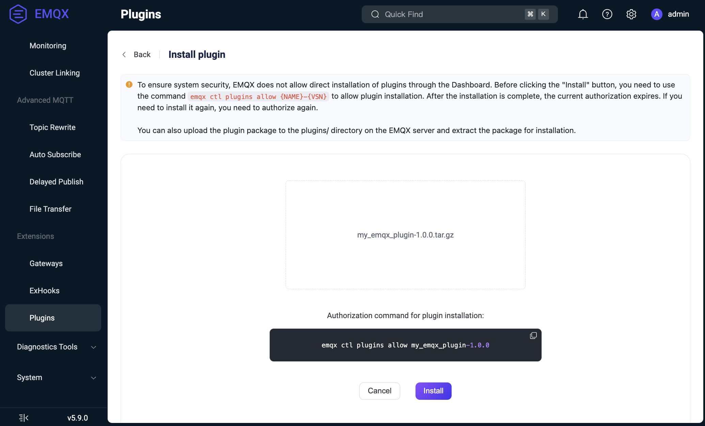
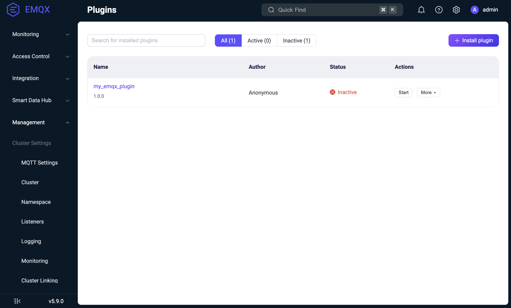

# プラグインの管理

このページでは、EMQXにおけるプラグインのライフサイクルについて説明し、Dashboard、CLI、REST APIを使用したプラグインのインストール、設定、起動、停止、アンインストール、アップグレード方法を解説します。

## プラグインのライフサイクル

EMQXプラグインは主に以下の3つのライフサイクル状態を経ます。

- **インストール済み**：プラグインのコードと設定が読み込まれているが、アプリケーションはまだ起動していない状態。
- **起動済み**：プラグインが稼働しており、EMQXと積極的に連携している状態。
- **アンインストール済み**：プラグインがシステムから完全に削除された状態。

### インストールプロセス

インストールの流れは以下の通りです：

1. プラグインパッケージ（`make rel`コマンドで作成されたtarball）をDashboard、API、またはCLI経由でアップロードします。詳細なインストール手順は[プラグインのインストールと管理](#install-and-manage-plugins)をご参照ください。
2. プラグインパッケージはEMQXクラスターの各ノードに転送されます。
3. 各ノード上で以下の処理が行われます：
   - tarballはEMQXルートディレクトリの`plugins`サブディレクトリに保存されます（`plugins.install_dir`オプションで上書き可能）：`$EMQX_ROOT/plugins/my_emqx_plugin-1.0.0.tar.gz`
   - 同じディレクトリに展開されます：`$EMQX_ROOT/plugins/my_emqx_plugin-1.0.0/`
   - 初期設定（メインプラグインのappからの`config.hocon`）が`$EMQX_DATA_DIR/plugins/my_emqx_plugin/config.hocon`にコピーされます。
   - Avroスキーマが存在すれば検証のために読み込まれます。
   - プラグインコードはノードにロードされますが、アプリケーションは起動されません。
   - EMQX設定の`plugins.states`に`disabled`として登録されます。

::: tip

プラグインの状態はEMQX設定ファイルに`enable`フラグ（`true`または`false`）としてのみ保存されます。プラグインの詳細設定は各ノードの`$EMQX_DATA_DIR/plugins/my_emqx_plugin/config.hocon`に格納されています。

:::

### 設定

インストール後、プラグインの設定はDashboardまたはAPIを通じて更新可能です。

- 新しい設定はAvroスキーマ（存在する場合）に基づき検証されます。
- 更新内容はクラスターの全ノードに配布されます。
- プラグインの`on_config_changed/2`コールバック関数が呼び出されます。プラグインが新設定を受け入れた場合、`$EMQX_DATA_DIR/plugins/my_emqx_plugin/config.hocon`に永続化されます。

::: tip

`on_config_changed/2`コールバック関数はアプリケーションが起動していない場合でも呼び出されます。

:::

::: tip

`on_config_changed/2`コールバック関数はEMQXクラスターの各ノードで呼び出されます。ローカルシステムの状態（例：ネットワークの可用性）に依存した設定検証は避けてください。ノード間で結果が不整合になる可能性があります。代わりに`on_health_check/1`を使用してランタイムチェックを行い、リソースが利用できない場合は不健康状態を報告してください。

:::

### 設定ファイルの場所

関連する設定ファイルの場所は2つあります。

- インストール済みプラグインパッケージ内のデフォルトファイル：
  - Docker環境：
    `/opt/emqx/plugins/my_emqx_plugin-1.0.0/my_emqx_plugin-1.0.0/priv/config.hocon`
  - deb/rpm環境：
    `/usr/lib/emqx/plugins/my_emqx_plugin-1.0.0/my_emqx_plugin-1.0.0/priv/config.hocon`

- DashboardやAPI経由で設定保存後にEMQXが管理する永続化されたプラグイン設定ファイル：
  - Docker環境：
    `/opt/emqx/data/plugins/my_emqx_plugin/config.hocon`
  - deb/rpm環境：
    `/var/lib/emqx/plugins/my_emqx_plugin/config.hocon`

`priv/config.hocon`はパッケージに含まれるデフォルトテンプレートであり、`data/plugins/.../config.hocon`は設定変更後にEMQXが使用する永続化設定ファイルです。

### 起動

プラグインはDashboard、API、またはCLIから手動で起動します。起動時には以下が行われます。

- プラグインのアプリケーションが起動されます。
- EMQX設定の`plugins.states`に`enabled`として登録されます。

プラグインが起動している状態で情報を取得すると、`on_health_check/1`コールバック関数が呼び出され、プラグインの状態が取得されます。

### 停止

プラグインを停止すると以下が行われます。

- プラグインのアプリケーションが停止されます。
- EMQX設定の`plugins.states`に`disabled`として登録されます。

プラグインのアプリケーションは停止されますが、コードはノード上に残ります。停止中のプラグインも設定可能なためです。

### アンインストールプロセス

アンインストールの流れは以下の通りです：

1. プラグインが起動中であれば停止します。
2. プラグインのコードをノードからアンロードします。
3. パッケージファイルをノードから削除します（設定ファイルは保持されます）。
4. EMQX設定の`plugins.states`から登録を解除します。

プラグインパッケージのアンインストールはDashboardまたはCLIで可能です。詳細は[プラグインのインストールと管理](#install-and-manage-plugins)をご覧ください。

### クラスター参加時の挙動

EMQXノードがクラスターに参加する際、プラグインや設定は各ノードのローカルファイルシステムに存在するため、必ずしもインストール済みとは限りません。

新規ノードは以下を行います。

- クラスター参加時にグローバルなEMQX設定を取得します。
- 設定からプラグインの状態（インストール済みかつ有効か）を把握します。
- 他ノードからプラグインとその実際の設定を取得します。
- プラグインをインストールし、有効なものは起動します。

## プラグインのインストールと管理

EMQXはDashboard、CLI、APIを通じてプラグインパッケージのインストール、アンインストール、管理をサポートしています。

### Dashboard経由でのパッケージインストール

プラグインがビルド済みで`my_emqx_plugin-1.0.0.tar.gz`が用意されているとします。Dashboardから直接コンパイル済みプラグインパッケージをインストールする手順は以下の通りです。

::: tip 重要なセキュリティアップデート

セキュリティ上の理由から、EMQXはDashboard経由のプラグインインストールに対して明示的な許可を要求するようになりました。

- インストール前に許可を付与する必要があります。
- 許可状態は一時的で、インストール完了後に自動的に解除されます。
- クラスター環境では全ノードで許可を付与する必要があります。

:::

1. CLIで以下のコマンドを実行し、プラグインインストールを明示的に許可します：

   ```bash
   emqx ctl plugins allow $NAME-$VSN
   ```

   - `{NAME}`：プラグイン名（例：`my_emqx_plugin`）
   - `{VSN}`：プラグインのバージョン（例：`1.0.0`）

   このコマンド実行後にDashboardからインストールを進められます。

2. EMQX Dashboardの **Management** -> **Plugins** に移動します。

3. **+ Install plugin** ボタンをクリックし、インストールページを開きます。

4. プラグインパッケージを選択またはドラッグしてアップロードします。

   

5. **Install** ボタンをクリックしてインストールを完了します。プラグイン一覧に新しいプラグインが表示されます。

   

これでプラグインの起動・停止や設定が可能になります。Dashboardでプラグインパッケージをアンインストールするには、プラグイン一覧の**Actions**列の**More**メニューから**Uninstall**をクリックしてください。

以前に許可したプラグインの許可を取り消すには、以下のいずれかを実行します。

1. プラグインをアンインストールする（インストール済みの場合）。
2. 以下のコマンドで明示的に拒否する。

```bash
emqx ctl plugins disallow $NAME-$VSN
```

### CLI経由でのパッケージインストール

プラグインがビルド済みで`my_emqx_plugin-1.0.0.tar.gz`が用意されているとします。CLIから直接コンパイル済みプラグインパッケージをインストールする手順は以下の通りです。

1. EMQXノード上でtarballをEMQXのプラグインディレクトリにコピーします。

   ```
   $ cp my_emqx_plugin-1.0.0.tar.gz $EMQX_HOME/plugins
   ```

2. プラグインをインストールします：

   ```
   $ emqx ctl plugins install my_emqx_plugin-1.0.0
   ```

3. プラグイン一覧を確認します：

   ```
   $ emqx ctl plugins list
   ```

4. プラグインの起動・停止を行います。

   ```
   $ emqx ctl plugins start my_emqx_plugin-1.0.0
   $ emqx ctl plugins stop my_emqx_plugin-1.0.0
   ```

5. プラグインをアンインストールします：

   ```
   $ emqx ctl plugins uninstall my_emqx_plugin-1.0.0
   ```

### API経由でのパッケージインストール

プラグインがビルド済みで`my_emqx_plugin-1.0.0.tar.gz`が用意されているとします。APIを使ってプラグインをインストールする手順は以下の通りです。

1. インストールを許可します。以下のコマンドを実行してください。

   ```
   emqx ctl plugins allow my_emqx_plugin-1.0.0
   ```

2. `curl`を使ってPOSTリクエストでプラグインをインストールします。

   ```
   $ curl -u $KEY:$SECRET -X POST http://$EMQX_HOST:18083/api/v5/plugins/install -H "Content-Type: multipart/form-data" -F "plugin=@my_emqx_plugin-1.0.0.tar.gz"
   ```

3. プラグイン一覧を確認してインストール成功を検証します。

   ```
   $ curl -u $KEY:$SECRET http://$EMQX_HOST:18083/api/v5/plugins | jq
   ```

4. プラグインの起動・停止を行います。

   ```
   $ curl -s -u $KEY:$SECRET -X PUT "http://$EMQX_HOST:18083/api/v5/plugins/my_emqx_plugin-1.0.0/start"
   $ curl -s -u $KEY:$SECRET -X PUT "http://$EMQX_HOST:18083/api/v5/plugins/my_emqx_plugin-1.0.0/stop"
   ```

### EMQX起動前のプラグイン事前インストール

EMQX起動時にプラグインをすぐに利用可能にしたい場合（例：カスタムDockerイメージのビルド時）、パッケージを展開し、EMQXを事前に設定しておくことが可能です。

以下はDockerfileの例ですが、deb/rpmやベアメタルなど他のデプロイ方法でも同様の手順が適用されます。

1. プラグインtarballをコピーして展開します。

   ```dockerfile
   COPY --chown=emqx:emqx my_emqx_plugin-1.0.0.tar.gz /opt/emqx/plugins/my_emqx_plugin-1.0.0.tar.gz

   RUN cd /opt/emqx/plugins && \
       mkdir -p my_emqx_plugin-1.0.0 && \
       tar zxf my_emqx_plugin-1.0.0.tar.gz -C my_emqx_plugin-1.0.0
   ```

2. EMQX設定にプラグインを登録し、起動時に自動起動するようにします。EMQXのベース設定ファイルに以下を追記します。

   ```dockerfile
   RUN cat <<EOF >> /opt/emqx/etc/base.hocon
   plugins {
       states = [
           {
               name_vsn = "my_emqx_plugin-1.0.0"
               enable = true
           }
       ]
   }
   EOF
   ```

   `enable = true`で自動起動、`enable = false`でインストールのみ（起動しない）設定となります。

## プラグインのアップグレード

EMQXでは同一プラグインの複数バージョンを同時にインストールできません。

新バージョンをインストールするには、

- 旧バージョンを先にアンインストールし、
- その後に新バージョンをインストールします。

プラグインの設定はインストール間で保持されます。

<!-- **注意**：（EMQXエンタープライズ版）ホットアップグレード後はプラグインの再インストールが必要です。 -->
