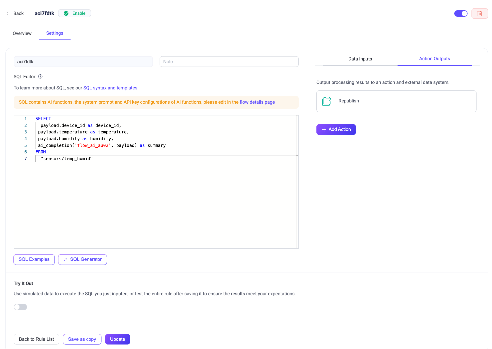

# クイックスタート：OpenAIノードを使ったFlowの作成

このセクションでは、FlowデザイナーでLLMベースのFlowを迅速に作成・テストする方法を実践的なユースケースを通じて説明します。

このデモでは、MQTTトピックからセンサーデータを受信し、LLM（例：OpenAI GPT）を使ってデータを解釈し、その意味を自然言語で要約するワークフローを構築します。生成された要約は新しいトピック `ai/summary` にパブリッシュされ、下流で利用されます。

## シナリオ説明

デバイスが温度と湿度の読み取り値をMQTTトピック `sensors/temp_humid` に報告すると仮定します。各メッセージはJSON形式の生センサーデータを含みます。EMQX Flowは以下の処理を行います。

- **データ処理**：デバイスIDとセンサー値を抽出する。
- **LLMベースの処理**：OpenAIモデルを使ってセンサーの読み取り値を要約する。
- **メッセージ再パブリッシュ**：AI生成の要約を新しいトピック `ai/summary` にパブリッシュする。

**サンプルメッセージ：**

```json
{
  "device_id": "device123",
  "temperature": 38.2,
  "humidity": 75,
  "timestamp": 1717568000000
}
```

**期待される出力（AI生成）：**

```
Device device123 reported a temperature of 38.2°C and 75% humidity.
```

## Flowの作成

::: tip 前提条件

有効なOpenAI APIキーを用意してください。

:::

1. **Flows**ページで**Create Flow**ボタンをクリックします。

2. **Messages**ノードを追加します。

   - ソースパネルから**Messages**ノードをドラッグします。
   - トピックを`sensors/temp_humid`に設定します。
   - **保存**をクリックします。

3. **Data Processing**ノードを追加します。

   - **Processing**セクションから**Data Processing**ノードをドラッグします。
   - 以下のマッピングを追加します：
     - `payload.device_id` → エイリアス `device_id`
     - `payload.temperature` → エイリアス `temperature`
     - `payload.humidity` → エイリアス `humidity`
   - **保存**をクリックします。

4. **OpenAI**ノードを追加します。

   - **Processing**セクションから**OpenAI**ノードをドラッグし、Data Processingノードに接続します。

   - ノードを設定します：
     - **Input**：`payload`を入力します。
     - **System Message**：`Generate a short summary of the device’s sensor readings in human-readable format` と入力します。
     - **Model**：`gpt-4o`を選択します。
     - **API Key**：OpenAIのAPIキーを入力します。
     - **Base URL**：空欄のままにしてOpenAIのデフォルトエンドポイントを使用します。
       
       ::: tip
       
       このフィールドにプロバイダーのAPIベースURLとAPIキーを入力すると、OpenAI互換の他サービスに接続可能です。
       
       :::
       
     - **Output Result Alias**：`summary`と入力します。
     
   - **保存**をクリックします。

5. **Republish**ノードを追加します。

   - **Sink**セクションから**Republish**ノードをドラッグし、OpenAIノードに接続します。
   - トピックを`ai/summary`に設定します。
   - ペイロードを`${summary}`に設定します。
   - **保存**をクリックします。

6. すべてのノードを接続し、右上の**保存**をクリックしてFlowを保存します。

   

   Flowとフォームルールは連携可能です。SQLや関連するルール設定はルールページで確認できます。

   

## Flowのテスト

1. MQTTクライアントをEMQXに接続します。

   Flowを素早くテストするには、ダッシュボードの**診断ツール** → **WebSocketクライアント**を使ってMQTTクライアントをシミュレートできます。あるいは、[MQTTX](https://mqttx.app/)などのツールや実際のMQTTクライアントも利用可能です。

   - EMQXサーバーに接続します。
   - トピック`ai/summary`をサブスクライブします。

2. テストを開始します。

   - Flowデザイナーで任意のノードをクリックし、編集パネルを開きます。
   - **編集**をクリックし、次に**テスト開始**をクリックして画面下部にテストパネルを表示します。
   - **シミュレートデータ入力**をクリックし、以下のメッセージをトピック`sensors/temp_humid`にパブリッシュするため**テスト送信**をクリックします。

     ```json
     {
       "device_id": "device123",
       "temperature": 38.2,
       "humidity": 75
     }
     ```

3. 結果を確認します。

   - Flowの実行結果が成功したことを確認できます。

     

   - **WebSocketクライアント**ページに戻ると、以下のようなAI生成の要約を受信できます。

     > “The sensor readings from device "device123" indicate that the current temperature is 38.2°C and the humidity level is 75%.”

   - テストが失敗した場合は、エラーメッセージが表示されます。

   - **OpenAI**ノードの稼働状況やメトリクスを確認するには、編集ページを閉じてノードをクリックし、編集パネルの**概要**タブを開いてください。

     
