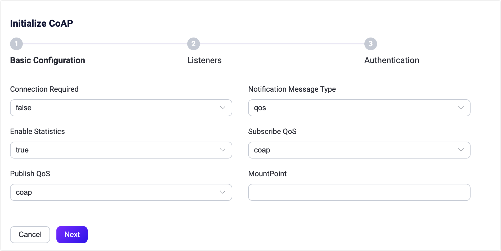
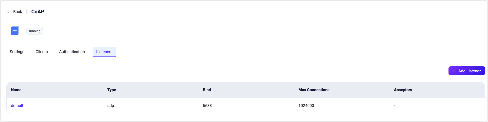

# CoAP ゲートウェイ

<<<<<<< HEAD
EMQX の CoAP ゲートウェイは、[Publish-Subscribe Broker for the CoAP](https://datatracker.ietf.org/doc/html/draft-ietf-core-coap-pubsub-09) プロトコルに準拠し、標準的なパブリッシュ、サブスクライブ、およびメッセージ受信を実装可能にします。
=======
EMQX の CoAP ゲートウェイは、[Publish-Subscribe Broker for the CoAP](https://datatracker.ietf.org/doc/html/draft-ietf-core-coap-pubsub-09) プロトコルに準拠し、標準的なパブリッシュ、サブスクライブ、およびメッセージ受信を実装できます。
>>>>>>> origin/release-5.10

以下は、接続モードおよびコネクションレスモードでサポートされる機能一覧です。

| 機能               | コネクションレスモード | 接続モード       |
| ------------------ | --------------------- | --------------- |
| メッセージパブリッシュ | √                     | √               |
| トピックサブスクライブ | √                     | √               |
| トピックのサブスクライブ解除 | ×                     | √               |
| 接続の作成           | ×                     | √               |
<<<<<<< HEAD
| 接続の切断           | ×                     | √               |
=======
| 接続のクローズ       | ×                     | √               |
>>>>>>> origin/release-5.10
| ハートビート         | ×                     | √               |
| 認証                 | ×                     | √               |

<!--a brief introduction of the architecture-->

## CoAP ゲートウェイの有効化

<<<<<<< HEAD
EMQX 5 では、CoAP ゲートウェイはダッシュボード、REST API、設定ファイル `base.hocon` を通じて設定・有効化できます。本節ではダッシュボードを例に操作手順を説明します。

EMQX ダッシュボードの左ナビゲーションメニューから **Extensions** -> **Gateways** をクリックします。**Gateway** ページにて、サポートされているすべてのゲートウェイが一覧表示されます。**CoAP** を探し、**Actions** 列の **Setup** をクリックすると、**Initialize CoAP** ページに遷移します。

::: tip

EMQX をクラスターで稼働させている場合、ダッシュボードや REST API で行った設定はクラスター全体に影響します。特定のノードのみ設定を変更したい場合は、[`base.hocon`](../configuration/configuration.md) にて設定してください。

:::

EMQX CoAP ゲートウェイはコネクションレスモードと接続モードの両方をサポートします。コネクションレスモードではメッセージは一回限りの送信として扱われ、センサーのデータ読み取りや簡単なコマンド送信など短時間のやり取りに適しています。接続モードでは、クライアントはデータ転送開始前にブローカーと接続を確立します。

**Connection Requested** で `false` または `true` を選択することで接続モードまたはコネクションレスモードを選択できます。デフォルトは `false`（コネクションレスモード）です。

接続モードを確認後、設定を続行できます。特にカスタマイズが不要な場合は、以下の3ステップで CoAP ゲートウェイを有効化できます。
=======
EMQX 5 では、CoAP ゲートウェイはダッシュボード、REST API、設定ファイル `base.hocon` を通じて設定および有効化できます。本節では、ダッシュボードを用いた設定手順を例に説明します。

EMQX ダッシュボードの左ナビゲーションメニューから **Extensions** -> **Gateways** をクリックします。**Gateway** ページにはサポートされているすべてのゲートウェイが一覧表示されます。**CoAP** を見つけ、**Actions** 列の **Setup** をクリックすると、**Initialize CoAP** ページに遷移します。

::: tip

EMQX をクラスターで稼働している場合、ダッシュボードや REST API で行った設定はクラスター全体に影響します。特定のノードのみ設定を変更したい場合は、[`base.hocon`](../configuration/configuration.md) で設定してください。

:::

EMQX CoAP ゲートウェイは、コネクションレスモードと接続モードの両方をサポートしています。コネクションレスモードではメッセージは一回限りの送信として扱われ、センサーの読み取りや単純なコマンド送信など短時間のやり取りに適しています。接続モードでは、クライアントがデータ転送開始前にブローカーと接続を確立します。

**Connection Requested** の設定で、接続モード（`true`）またはコネクションレスモード（`false`）を選択できます。デフォルトは `false` です。

接続モードを確認したら、設定を続けられます。特にカスタマイズが不要な場合は、CoAP ゲートウェイを3クリックで有効化できます。
>>>>>>> origin/release-5.10

1. **Basic Configuration** タブで **Next** をクリックし、すべてのデフォルト設定を受け入れます。
2. 続いて表示される **Listeners** タブでは、EMQX が UDP ポート `5683` にリスナーを事前設定しています。再度 **Next** をクリックして設定を確定します。
3. 最後に **Enable** ボタンをクリックして CoAP ゲートウェイを有効化します。

<<<<<<< HEAD
ゲートウェイの有効化が完了すると、**Gateways** ページに戻り、CoAP ゲートウェイのステータスが **Enabled** と表示されます。
=======
ゲートウェイの有効化が完了すると、**Gateways** ページに戻り、CoAP ゲートウェイのステータスが **Enabled** と表示されていることを確認できます。
>>>>>>> origin/release-5.10


上記の設定は REST API でも可能です。

**例:**

```bash
curl -X 'PUT' 'http://127.0.0.1:18083/api/v5/gateways/coap' \
  -u <your-application-key>:<your-security-key> \
  -H 'Content-Type: application/json' \
  -d '{
  "name": "coap",
  "enable": true,
  "mountpoint": "coap/",
  "connection_required": false,
  "listeners": [
    {
      "type": "udp",
      "name": "default",
      "bind": "5683",
      "max_conn_rate": 1000,
      "max_connections": 1024000
    }
  ]
}'
```

詳細な REST API の説明は [REST API - Gateway](../admin/api.md) を参照してください。

カスタマイズが必要な場合やリスナーの追加、認証ルールの追加を行いたい場合は、[CoAP ゲートウェイのカスタマイズ](#customize-your-coap-gateway) をご覧ください。

CoAP ゲートウェイは UDP および DTLS タイプリスナーのみをサポートしています。設定可能なパラメータの完全な一覧は [Gateway Configuration - Listeners](https://docs.emqx.com/en/enterprise/v@EE_VERSION@/hocon/) を参照してください。

## CoAP クライアントとの連携

### クライアントライブラリ

<<<<<<< HEAD
CoAP ゲートウェイを構築した後、CoAP クライアントツールを使って接続テストを行い、正常に動作することを確認できます。以下は推奨される CoAP クライアントツールです。
=======
CoAP ゲートウェイを構築した後、CoAP クライアントツールを使って接続をテストし、正常に動作することを確認できます。以下は推奨される CoAP クライアントツールの一例です。
>>>>>>> origin/release-5.10

- [libcoap](https://github.com/obgm/libcoap)
- [californium](https://github.com/eclipse/californium)

## パブリッシュ／サブスクライブ

CoAP ゲートウェイは [Publish-Subscribe Broker for the CoAP](https://datatracker.ietf.org/doc/html/draft-ietf-core-coap-pubsub-09) 標準で定義された URI パスとメソッドを使用します。

詳細なパラメータは [メッセージパブリッシュ](#message-publish)、[トピックサブスクライブ](#topic-subscribe)、[トピックのサブスクライブ解除](#topic-unsubscribe) を参照してください。

## CoAP ゲートウェイのカスタマイズ

<<<<<<< HEAD
デフォルト設定に加え、EMQX はさまざまな設定オプションを提供し、特定のビジネス要件に柔軟に対応可能です。本節では **Gateways** ページ上の各フィールドについて詳しく解説します。以下のスクリーンショット下の説明を参照してください。



- **Connection Required**: コネクションレスモードまたは接続モードの有効化を設定します。デフォルトは `false`（コネクションレスモード）。選択肢は `false`（コネクションレスモード）、`true`（接続モード）。

- **Notification Message Type**: 配信する CoAP メッセージのタイプを設定します。デフォルトは `qos`。選択肢は以下の通りです。

  - **qos**: 受信メッセージの QoS レベルに応じて CoAP 通知のアックが必要か判断します。
    - QoS 0 の場合、クライアントからのアックは不要
    - QoS 1/2 の場合、クライアントからのアックが必要
  - **con**: CoAP 通知はクライアントによるアックが必要
  - **non**: CoAP 通知はクライアントによるアック不要

- **Heartbeat**: **Connection Required** が `true` の場合のみ必要。接続維持のための最小ハートビート間隔を設定します。デフォルトは 30 秒。

- **Enable Statistics**: ゲートウェイによる統計収集とレポートを許可するか設定します。デフォルトは `true`。選択肢は `true`、`false`。
=======
デフォルト設定に加え、EMQX はさまざまな設定オプションを提供し、特定のビジネス要件に柔軟に対応できます。本節では、**Gateways** ページにある各フィールドの詳細を説明します。スクリーンショット下の説明を参照してください。


- **Connection Required**: コネクションレスモードか接続モードかを設定します。デフォルトは `false`（コネクションレス）。選択肢は `false`（コネクションレス）、`true`（接続）。

- **Notification Message Type**: 配信される CoAP メッセージのタイプを設定します。デフォルトは `qos`。選択肢は以下の通りです。

  - **qos**: 受信メッセージの QoS レベルに応じて CoAP 通知のアックが必要か決まります。
    - QoS 0 の場合、クライアントからのアックは不要
    - QoS 1/2 の場合、クライアントからのアックが必要
  - **con**: CoAP 通知はクライアントからのアックが必要
  - **non**: CoAP 通知はクライアントからのアックは不要

- **Heartbeat**: **Connection Required** が `true` の場合のみ必要。接続維持のための最小ハートビート間隔を設定します。デフォルトは 30 秒。

- **Enable Statistics**: ゲートウェイによる統計収集と報告を許可するか設定します。デフォルトは `true`。選択肢は `true`、`false`。
>>>>>>> origin/release-5.10

- **Subscriber QoS**: サブスクライブ要求のデフォルト QoS レベルを設定します。デフォルトは `coap`。選択肢は以下の通りです。

  - **coap**: **Notification Message Type** の設定に従い QoS レベルを決定
    - アック不要なら QoS 0
    - アック必要なら QoS 1
  - **qos0**, **qos1**, **qos2**

- **Publish QoS**: パブリッシュ要求のデフォルト QoS レベルを設定します。デフォルトは `coap`。選択肢は `coap`、`qos0`、`qos1`、`qos2`。

- **MountPoint**: パブリッシュやサブスクライブ時にすべてのトピックに接頭辞として付与される文字列を設定します。これにより異なるプロトコル間でのメッセージルーティングの分離が可能です。例: *CoAP*

<<<<<<< HEAD
  **注意**: このトピックプレフィックスはゲートウェイが管理するため、CoAP クライアントはパブリッシュやサブスクライブ時に明示的にこのプレフィックスを付ける必要はありません。

### リスナーの追加

デフォルトで、名前が **default** の UDP リスナーがポート `5683` に設定されており、最大 1,024,000 の同時接続をサポートしています。**Settings** をクリックすると詳細設定が可能で、**Delete** でリスナーを削除、**Add Listener** で新規リスナーを追加できます。



**Add Listener** をクリックすると **Add Listener** ページが開き、以下の設定を行えます。
=======
  **注意**: このトピック接頭辞はゲートウェイが管理しており、CoAP クライアントはパブリッシュやサブスクライブ時に明示的にこの接頭辞を付ける必要はありません。

### リスナーの追加

デフォルトでは、名前が **default** の UDP リスナーがポート `5683` で設定されており、最大 1,024,000 の同時接続をサポートしています。**Settings** で詳細設定、**Delete** でリスナー削除、**Add Listener** で新規リスナー追加が可能です。


**Add Listener** をクリックすると、以下の設定項目を入力できます。
>>>>>>> origin/release-5.10

**基本設定**

- **Name**: リスナーの一意識別子を設定します。
<<<<<<< HEAD
- **Type**: プロトコルタイプを選択します。CoAP では `udp` または `dtls` を選べます。
- **Bind**: リスナーが受け付けるポート番号を設定します。
- **MountPoint**（任意）: パブリッシュやサブスクライブ時にすべてのトピックに接頭辞として付与される文字列を設定し、異なるプロトコル間のメッセージルーティング分離を実現します。
=======
- **Type**: プロトコルタイプを選択します。CoAP では `udp` または `dtls` が選択可能です。
- **Bind**: リスナーが受け付ける接続のポート番号を設定します。
- **MountPoint**（オプション）: パブリッシュやサブスクライブ時にすべてのトピックに接頭辞として付与される文字列を設定します。
>>>>>>> origin/release-5.10

**リスナー設定**

- **Max Connections**: リスナーが処理可能な最大同時接続数を設定します。デフォルトは 1024000。
- **Max Connection Rate**: リスナーが1秒あたりに受け入れ可能な新規接続の最大レートを設定します。デフォルトは 1000。

**UDP 設定**

<<<<<<< HEAD
- **ActiveN**: ソケットの `{active, N}` オプションを設定します。これはソケットが積極的に処理可能な受信パケット数を意味します。詳細は [Erlang Documentation - setopts/2](https://www.erlang.org/doc/apps/kernel/inet.html#setopts/2) を参照してください。
- **Buffer**: 受信および送信パケットを格納するバッファサイズを KB 単位で設定します。
- **Receive Buffer**: 受信バッファサイズを KB 単位で設定します。
- **Send Buffer**: 送信バッファサイズを KB 単位で設定します。
- **SO_REUSEADDR**: ローカルでのポート番号の再利用を許可するか設定します。

**DTLS 設定**（DTLS リスナーのみ）

TLS Verify の有効化をトグルスイッチで設定可能です。ただし、その前に関連する **TLS Cert**、**TLS Key**、**CA Cert** の情報をファイル内容の入力または **Select File** ボタンでアップロードして設定する必要があります。詳細は [Enable SSL/TLS Connection](https://docs.emqx.com/en/enterprise/v5.0/network/emqx-mqtt-tls.html) を参照してください。
=======
- **ActiveN**: ソケットの `{active, N}` オプションを設定します。これはソケットが能動的に処理可能な受信パケット数を示します。詳細は [Erlang Documentation - setopts/2](https://erlang.org/doc/man/inet.html#setopts-2) を参照してください。
- **Buffer**: 送受信パケットを格納するバッファサイズを KB 単位で設定します。
- **Receive Buffer**: 受信バッファサイズを KB 単位で設定します。
- **Send Buffer**: 送信バッファサイズを KB 単位で設定します。
- **SO_REUSEADDR**: ローカルでポート番号の再利用を許可するか設定します。

**DTLS 設定**（DTLS リスナーのみ）

TLS Verify の有効化はトグルスイッチで設定可能ですが、その前に関連する **TLS Cert**、**TLS Key**、**CA Cert** 情報をファイルの内容入力または **Select File** ボタンでアップロードして設定する必要があります。詳細は [Enable SSL/TLS Connection](https://docs.emqx.com/en/enterprise/v5.0/network/emqx-mqtt-tls.html) を参照してください。
>>>>>>> origin/release-5.10

### 認証の設定

クライアント ID、ユーザー名、パスワードはクライアントの [Create Connection](#create-connection) リクエストで提供されます。CoAP ゲートウェイは以下の認証方式をサポートしています。

- [組み込みデータベース認証](../access-control/authn/mnesia.md)
- [MySQL 認証](../access-control/authn/mysql.md)
- [MongoDB 認証](../access-control/authn/mongodb.md)
- [PostgreSQL 認証](../access-control/authn/postgresql.md)
- [Redis 認証](../access-control/authn/redis.md)
- [HTTP サーバー認証](../access-control/authn/http.md)
- [JWT 認証](../access-control/authn/jwt.md)
- [LDAP 認証](../access-control/authn/ldap.md)

ここではダッシュボードを例に認証設定方法を説明します。

**Gateways** ページで **CoAP** を探し、**Actions** 列の **Setup** をクリック後、**Authentication** タブに入ります。

**Create Authentication** をクリックし、**Mechanism** に **Password-Based** または **JWT** を選択し、必要に応じて **Backend** を選択します。

認証方式の詳細な設定方法は本節冒頭の各ページを参照してください。

<<<<<<< HEAD
ダッシュボードのほか、REST API による認証設定も可能です。例えば、CoAP ゲートウェイ用に組み込みデータベース認証を作成する場合、以下のコードを使用します。
=======
ダッシュボード以外に REST API でも認証設定が可能です。例えば、CoAP ゲートウェイ用に組み込みデータベース認証を作成する場合、以下のコードを使用します。
>>>>>>> origin/release-5.10

```bash
curl -X 'POST' \
  'http://127.0.0.1:18083/api/v5/gateway/coap/authentication' \
  -u <your-application-key>:<your-security-key> \
  -H 'accept: application/json' \
  -H 'Content-Type: application/json' \
  -d '{
  "backend": "built_in_database",
  "mechanism": "password_based",
  "password_hash_algorithm": {
    "name": "sha256",
    "salt_position": "suffix"
  },
  "user_id_type": "username"
}'
```

::: tip

<<<<<<< HEAD
MQTT プロトコルとは異なり、**ゲートウェイは認証方式の作成のみをサポートし、認証方式のリスト（または認証チェーン）はサポートしません**。認証方式が有効化されていない場合、すべての CoAP クライアントのログインが許可されます。
=======
MQTT プロトコルとは異なり、**ゲートウェイは認証方式の作成のみをサポートし、認証方式のリスト（または認証チェーン）はサポートしません**。認証方式が有効でない場合、すべての CoAP クライアントはログインが許可されます。
>>>>>>> origin/release-5.10

:::

## リファレンス：CoAP クライアントガイド

### Create Connection

`Connection Mode` のみ利用可能です。

<<<<<<< HEAD
このインターフェースは CoAP ゲートウェイへのクライアント接続を作成するために使用します。CoAP ゲートウェイの認証が有効な場合、このリクエストで提供された `clientid`、`username`、`password` を検証し、不正ユーザーを防止します。
=======
このインターフェースは CoAP ゲートウェイへのクライアント接続を作成します。CoAP ゲートウェイの認証が有効な場合、このリクエストで提供された `clientid`、`username`、`password` を検証し、不正ユーザーを防止します。
>>>>>>> origin/release-5.10

**リクエストパラメータ:**

- メソッド: `POST`
- URI: `mqtt/connection{?QueryString*}`。`QueryString` は以下の通りです。
  - `clientid`: 必須パラメータ、UTF-8 文字列。ゲートウェイはこの文字列を接続の一意識別子として使用します。
  - `username`: 任意パラメータ、UTF-8 文字列。接続認証に使用。
  - `password`: 任意パラメータ、UTF-8 文字列。接続認証に使用。
- ペイロード: 空

**レスポンス:**

- ステータスコード:
<<<<<<< HEAD
  - `2.01`: 接続作成成功。この接続用のトークン文字列がメッセージボディに返されます。
  - `4.00`: 不正なリクエスト。詳細なエラー情報がメッセージボディに返されます。
=======
  - `2.01`: 接続作成成功。この接続用のトークン文字列がメッセージ本文に返されます。
  - `4.00`: 不正なリクエスト。詳細なエラー情報がメッセージ本文に返されます。
>>>>>>> origin/release-5.10
  - `4.01`: 認可失敗。リクエスト形式は正しいが認可に失敗。
- ペイロード: ステータスコードが `2.01` の場合は `Token`、それ以外は `ErrorMessage`。
  - `Token`: 以降のリクエストで使用するトークン文字列。
  - `ErrorMessage`: エラー説明メッセージ。

`libcoap` を例に示します。

```bash
# clientid 123、username と password に admin/public を指定して接続リクエストを送信。
# 返却されたトークンは 3404490787
coap-client -m post -e "" "coap://127.0.0.1/mqtt/connection?clientid=123&username=admin&password=public"

3404490787
```

:::tip
<<<<<<< HEAD
接続が正常に作成された後、ダッシュボード、REST API、CLI を使って CoAP ゲートウェイのクライアント一覧を確認できます。
=======
接続が正常に作成された後、ダッシュボード、REST API、CLI を使用して CoAP ゲートウェイ内のクライアント一覧を確認できます。
>>>>>>> origin/release-5.10
:::

### Close Connection

`Connection Mode` のみ利用可能です。

<<<<<<< HEAD
このインターフェースは CoAP 接続を切断するために使用します。
=======
このインターフェースは CoAP 接続をクローズします。
>>>>>>> origin/release-5.10

**リクエストパラメータ:**

- メソッド: `DELETE`
- URI: `mqtt/connection{?QueryString*}`。`QueryString` は以下の通りです。
  - `clientid`: 必須パラメータ、UTF-8 文字列。ゲートウェイはこの文字列を接続の一意識別子として使用します。
  - `token`: 必須パラメータ。`Create Connection` リクエストで返されたトークン文字列を使用。
- ペイロード: 空

**レスポンス:**

- ステータスコード:
<<<<<<< HEAD
  - `2.01`: 接続切断成功。
  - `4.00`: 不正なリクエスト。詳細なエラー情報がメッセージボディに返されます。
=======
  - `2.01`: 接続クローズ成功。
  - `4.00`: 不正なリクエスト。詳細なエラー情報がメッセージ本文に返されます。
>>>>>>> origin/release-5.10
  - `4.01`: 認可失敗。リクエスト形式は正しいが認可に失敗。
- ペイロード: ステータスコードが `2.01` の場合は `Token`、それ以外は `ErrorMessage`。

例:

```bash
coap-client -m delete -e "" "coap://127.0.0.1/mqtt/connection?clientid=123&token=3404490787"
```

### Heartbeat

`Connection Mode` のみ利用可能です。

<<<<<<< HEAD
このインターフェースは CoAP クライアントとゲートウェイ間の接続維持に使用します。ハートビートが期限切れになると、ゲートウェイはセッションとサブスクリプションを削除し、クライアントのすべてのリソースを解放します。
=======
このインターフェースは CoAP クライアントとゲートウェイ間の接続維持に使用します。ハートビートが期限切れになると、ゲートウェイはセッションとサブスクリプションを削除し、そのクライアントに関するすべてのリソースを解放します。
>>>>>>> origin/release-5.10

**リクエストパラメータ:**

- メソッド: `PUT`
- URI: `mqtt/connection{?QueryString*}`。`QueryString` は以下の通りです。
  - `clientid`: 必須パラメータ、UTF-8 文字列。ゲートウェイはこの文字列を接続の一意識別子として使用します。
  - `token`: 必須パラメータ。`Create Connection` リクエストで返されたトークン文字列を使用。
- ペイロード: 空

**レスポンス:**

- ステータスコード:
<<<<<<< HEAD
  - `2.01`: 接続維持成功。
  - `4.00`: 不正なリクエスト。詳細なエラー情報がメッセージボディに返されます。
=======
  - `2.01`: 接続クローズ成功。
  - `4.00`: 不正なリクエスト。詳細なエラー情報がメッセージ本文に返されます。
>>>>>>> origin/release-5.10
  - `4.01`: 認可失敗。リクエスト形式は正しいが認可に失敗。
- ペイロード: ステータスコードが `2.01` の場合は `Token`、それ以外は `ErrorMessage`。

例:

```bash
coap-client -m put -e "" "coap://127.0.0.1/mqtt/connection?clientid=123&token=3404490787"
```

:::tip
<<<<<<< HEAD
ハートビート間隔は CoAP ゲートウェイの `heartbeat` オプションで決定され、デフォルトは 30 秒です。
=======
ハートビート間隔は CoAP ゲートウェイの `heartbeat` オプションで決まり、デフォルトは 30 秒です。
>>>>>>> origin/release-5.10
:::

### メッセージパブリッシュ

このインターフェースは CoAP クライアントが指定したトピックにメッセージを送信するために使用します。`Connection Mode` が有効な場合は追加の識別情報を含める必要があります。

**リクエストパラメータ:**

- メソッド: `POST`
- URI: `ps/{+topic}{?QueryString*}`
<<<<<<< HEAD
  - `{+topic}` はパブリッシュするメッセージのトピックです。例：`coap/test` にパブリッシュする場合、URI は `ps/coap/test` となります。
  - `{?QueryString}` はリクエストパラメータで以下を含みます。
    - `clientid`: `Connection Mode` では必須、`Connectionless Mode` では任意。
    - `token`: `Connection Mode` のみ必須。
    - `retain`（任意）: リテインメッセージとしてパブリッシュするかどうか。ブール値で、デフォルトは `false`。
    - `qos`: メッセージの QoS。MQTT クライアントがメッセージを受信する際の QoS レベルを示します。値は `0`、`1`、`2` のいずれか。
=======
  - `{+topic}` はパブリッシュするメッセージのトピック。例えば `coap/test` にパブリッシュする場合、URI は `ps/coap/test` となります。
  - `{?QueryString}` はリクエストパラメータ:
    - `clientid`: `Connection Mode` では必須、コネクションレスモードでは任意。
    - `token`: `Connection Mode` のみ必須。
    - `retain`（任意）: リテインメッセージとしてパブリッシュするか。ブール値で、デフォルトは `false`。
    - `qos`: メッセージの QoS。MQTT クライアントがメッセージを受信する際の QoS レベルを示します。`0`、`1`、`2` の列挙値。
>>>>>>> origin/release-5.10
    - `expiry`: メッセージの有効期限（秒単位）。デフォルトは 0（期限なし）。

- ペイロード: メッセージのペイロード

**レスポンス:**

- ステータスコード:
  - `2.04`: パブリッシュ成功
  - `4.00`: 不正なリクエスト。詳細なエラー情報がメッセージ本文に返されます。
  - `4.01`: 認可失敗。リクエスト形式は正しいが認可に失敗。
- ペイロード: ステータスコードが `2.04` の場合は空、その他は `ErrorMessage`。

<<<<<<< HEAD
例：`Connectionless Mode` でメッセージをパブリッシュする場合
=======
例：コネクションレスモードでメッセージをパブリッシュ
>>>>>>> origin/release-5.10

```bash
coap-client -m post -e "Hi, this is libcoap" "coap://127.0.0.1/ps/coap/test"
```

<<<<<<< HEAD
または、`Connection Mode` で `clientid` と `token` を付与してパブリッシュする場合
=======
または、接続モードで `clientid` と `token` を付与してパブリッシュ
>>>>>>> origin/release-5.10

```bash
coap-client -m post -e "Hi, this is libcoap" "coap://127.0.0.1/ps/coap/test?clientid=123&token=3404490787"
```

### トピックサブスクライブ

このインターフェースは CoAP クライアントがトピックをサブスクライブするために使用します。`Connection Mode` が有効な場合は追加の識別情報を含める必要があります。

**リクエストパラメータ:**

- メソッド: `GET`
- オプション: `observer` を `0` に設定
- URI: `ps/{+topic}{?QueryString*}`
<<<<<<< HEAD
  - `{+topic}` はサブスクライブするトピックです。例：`coap/test` にサブスクライブする場合、URI は `ps/coap/test` となります。
  - `{?QueryString}` はリクエストパラメータで以下を含みます。
    - `clientid`: `Connection Mode` では必須、`Connectionless Mode` では任意。
    - `token`: `Connection Mode` のみ必須。
    - `qos`: サブスクライブの QoS。ゲートウェイが CoAP クライアントにメッセージを配信する際の MessageType（`CON` または `NON`）を示します。値は以下の通り。
=======
  - `{+topic}` はサブスクライブするトピック。例えば `coap/test` をサブスクライブする場合、URI は `ps/coap/test` となります。
  - `{?QueryString}` はリクエストパラメータ:
    - `clientid`: `Connection Mode` では必須、コネクションレスモードでは任意。
    - `token`: `Connection Mode` のみ必須。
    - `qos`: サブスクライブ QoS。ゲートウェイが CoAP クライアントにメッセージを配信する際の MessageType（`CON` または `NON`）を示します。以下の列挙値。
>>>>>>> origin/release-5.10
      - `0`: `NON` メッセージで配信
      - `1` または `2`: `CON` メッセージで配信

- ペイロード: 空

**レスポンス:**

- ステータスコード:
  - `2.05`: サブスクライブ成功
  - `4.00`: 不正なリクエスト。詳細なエラー情報がメッセージ本文に返されます。
  - `4.01`: 認可失敗。リクエスト形式は正しいが認可に失敗。
- ペイロード: ステータスコードが `2.05` の場合は空、その他は `ErrorMessage`。

<<<<<<< HEAD
例：`Connectionless Mode` で `coap/test` をサブスクライブする場合
=======
例：コネクションレスモードで `coap/test` をサブスクライブ
>>>>>>> origin/release-5.10

```bash
coap-client -m get -s 60 -O 6,0x00 -o - -T "obstoken" "coap://127.0.0.1/ps/coap/test"
```

<<<<<<< HEAD
または、`Connection Mode` で `clientid` と `token` を付与してサブスクライブする場合
=======
または、接続モードで `clientid` と `token` を付与してサブスクライブ
>>>>>>> origin/release-5.10

```bash
coap-client -m get -s 60 -O 6,0x00 -o - -T "obstoken" "coap://127.0.0.1/ps/coap/test?clientid=123&token=3404490787"
```

### トピックのサブスクライブ解除

このインターフェースは CoAP クライアントがトピックのサブスクライブを解除するために使用します。

現状の実装では、サブスクライブ解除操作は `Connection Mode` のみ利用可能です。

**リクエストパラメータ:**

- メソッド: `GET`
- URI: `ps/{+topic}{?QueryString*}`
<<<<<<< HEAD
  - `{+topic}` はサブスクライブ解除するトピックです。例：`coap/test` のサブスクライブを解除する場合、URI は `ps/coap/test` となります。
  - `{?QueryString}` はリクエストパラメータで以下を含みます。
    - `clientid`: `Connection Mode` では必須、`Connectionless Mode` では任意。
=======
  - `{+topic}` はサブスクライブ解除するトピック。例えば `coap/test` のサブスクライブを解除する場合、URI は `ps/coap/test` となります。
  - `{?QueryString}` はリクエストパラメータ:
    - `clientid`: `Connection Mode` では必須、コネクションレスモードでは任意。
>>>>>>> origin/release-5.10
    - `token`: `Connection Mode` のみ必須。

- ペイロード: 空

**レスポンス:**

- ステータスコード:
  - `2.07`: サブスクライブ解除成功
  - `4.00`: 不正なリクエスト。詳細なエラー情報がメッセージ本文に返されます。
  - `4.01`: 認可失敗。リクエスト形式は正しいが認可に失敗。
- ペイロード: ステータスコードが `2.07` の場合は空、その他は `ErrorMessage`。

<<<<<<< HEAD
例：`Connection Mode` で `coap/test` のサブスクライブを解除する場合
=======
例：接続モードで `coap/test` のサブスクライブを解除
>>>>>>> origin/release-5.10

```bash
coap-client -m get -O 6,0x01 "coap://127.0.0.1/ps/coap/test?clientid=123&token=3404490787"
```

### 短縮パラメータ名

メッセージサイズ削減のため、CoAP ゲートウェイは短縮パラメータ名をサポートしています。
<<<<<<< HEAD

例えば、`clientid=barx` は `c=bar` と書くことができます。サポートされる短縮パラメータ名は以下の通りです。
=======
>>>>>>> origin/release-5.10

例えば、`clientid=barx` は `c=bar` と書けます。対応する短縮パラメータ名は以下の通りです。

| パラメータ名   | 短縮名  |
| -------------- | ------- |
| `clientid`     | `c`     |
| `username`     | `u`     |
| `password`     | `p`     |
| `token`        | `t`     |
| `qos`          | `q`     |
| `retain`       | `r`     |
