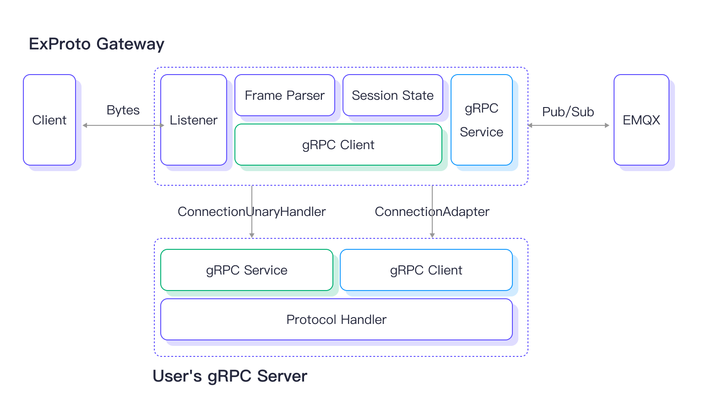
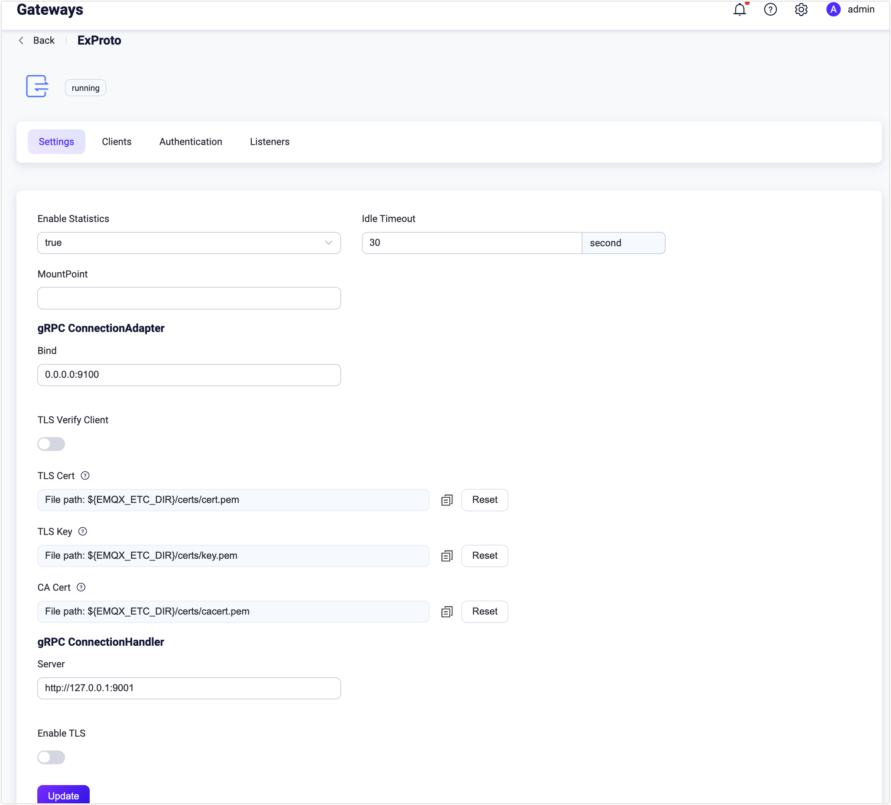
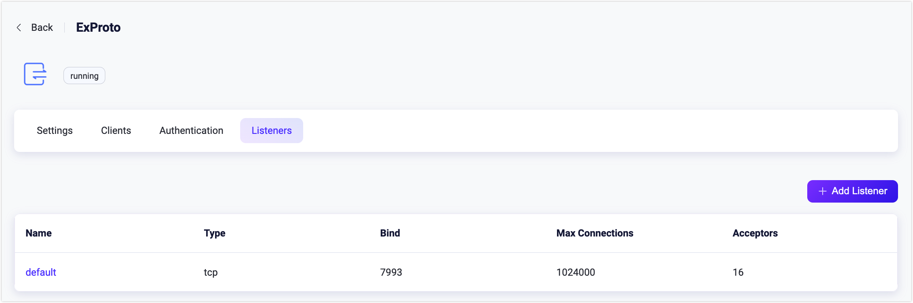
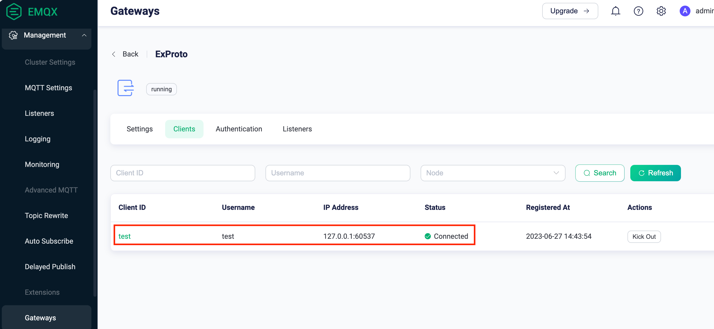

# ExProto ゲートウェイ

Extension Protocol（ExProto）は、gRPC通信を用いて実装されたカスタムプロトコル解析ゲートウェイです。Java、Python、Goなどの好みのプログラミング言語でgRPCサービスを開発でき、これらのサービスはデバイスのネットワークプロトコルを解析し、デバイス接続、認証、メッセージ送信などの機能を実現します。

本ページでは、ExProtoゲートウェイの動作原理と、EMQXにおけるExProtoゲートウェイの設定および利用方法を紹介します。

::: warning 重要なお知らせ
ExProtoゲートウェイはEMQX 6.2.0以降で非推奨となり、EMQX 7で削除予定です。
:::

<!--a brief introduction of the architecture-->

## ExProtoゲートウェイとgRPCサービスの動作

EMQXでExProtoゲートウェイを有効にすると、特定のポート（例：7993）でデバイス接続を待ち受けます。クライアントデバイスから接続があると、クライアントデバイスからのバイトデータやイベントをユーザーのgRPCサービスに渡します。これには、ExProtoゲートウェイ内のgRPCクライアントが、ユーザーのgRPCサーバーで実装された`ConnectionUnaryHandler`サービスのメソッドを呼び出す必要があります。

ユーザーのgRPCサーバー内のgRPCサービスは、ExProtoゲートウェイから受け取ったバイトデータやイベントを解析し、クライアントのネットワークプロトコルを解釈してバイトデータやイベントをPub/Subリクエストに変換し、ExProtoゲートウェイに返します。ExProtoゲートウェイで実装された`ConnectionAdapter`サービスは、ユーザーのgRPCサーバーとやり取りするためのインターフェースを提供します。これにより、クライアントデバイスはExProtoゲートウェイを介してEMQXにメッセージをパブリッシュしたり、トピックをサブスクライブしたり、クライアント接続を管理したりできます。

下図は、ExProtoゲートウェイとgRPCサービスの動作アーキテクチャを示しています。



### `exproto.proto` ファイル

`exproto.proto`ファイルは、ExProtoゲートウェイとユーザーのgRPCサービス間のインターフェースを定義します。ファイルには以下の2つのサービスが指定されています。

- `ConnectionAdapter`サービス：ExProtoゲートウェイが実装し、gRPCサーバーへのインターフェースを提供します。
- `ConnectionUnaryHandler`サービス：ユーザーのgRPCサーバーが実装し、クライアントソケットの接続処理やバイト解析のメソッドを定義します。

### `ConnectionUnaryHandler` サービス

`ConnectionUnaryHandler`サービスは、ユーザーのgRPCサーバーが実装し、クライアントソケットの接続処理やバイト解析を担当します。

このサービスには以下のメソッドがあります。

| メソッド名           | 説明                                                         |
| -------------------- | ------------------------------------------------------------ |
| OnSocketCreated      | 新しいソケットがExProtoゲートウェイに接続されるたびに呼び出されるコールバックです。 |
| OnSocketClosed       | ソケットが閉じられるたびに呼び出されるコールバックです。     |
| OnReceivedBytes      | クライアントのソケットからデータを受信するたびに呼び出されるコールバックです。 |
| OnTimerTimeout       | タイマーがタイムアウトするたびに呼び出されるコールバックです。 |
| OnReceivedMessages   | サブスクライブしたトピックにメッセージが届くたびに呼び出されるコールバックです。 |

ExProtoゲートウェイがこれらのメソッドを呼び出す際、どのソケットがイベントを発生させたかを示す一意の識別子`conn`をパラメータとして渡します。例えば、`OnSocketCreated`の関数パラメータは以下のようになります。

```
message SocketCreatedRequest {
  string conn = 1;
  ConnInfo conninfo = 2;
}
```

::: tip

ExProtoゲートウェイはプライベートプロトコルのメッセージフレームの開始・終了を認識できないため、TCPパケットのスティッキングや分割が発生する場合は、`OnReceivedBytes`コールバック内で処理する必要があります。

:::

### `ConnectionAdapter` サービス

`ConnectionAdapter`サービスはExProtoゲートウェイが実装し、gRPCサービスがサブスクライブ開始、メッセージパブリッシュ、タイマー開始、接続クローズなどの接続管理機能を呼び出せるインターフェースを提供します。以下のメソッドを含みます。

| メソッド名     | 説明                                                         |
| -------------- | ------------------------------------------------------------ |
| Send           | 指定された接続にバイトデータを送信します。                   |
| Close          | 指定された接続を閉じます。                                   |
| Authenticate   | クライアントをExProtoゲートウェイに登録し、認証を完了します。 |
| StartTimer     | 指定された接続のタイマーを開始します。通常はキープアライブ検出に使用されます。 |
| Publish        | 指定された接続からEMQXにメッセージをパブリッシュします。     |
| Subscribe      | 指定された接続でサブスクリプションを作成します。             |
| Unsubscribe    | 指定された接続のサブスクリプションを削除します。             |
| RawPublish     | EMQXにメッセージをパブリッシュします。                       |

## ExProtoゲートウェイの有効化

EMQXのExProtoゲートウェイは、ダッシュボード、REST API、または設定ファイル`base.hocon`を通じて設定および有効化できます。本節ではダッシュボードを使った有効化方法を説明します。

EMQXダッシュボードの左側ナビゲーションメニューから **Management** -> **Gateways** をクリックします。**Gateways**ページにはサポートされているすべてのゲートウェイが一覧表示されます。**ExProto**を探し、**Actions**列の**Setup**をクリックします。すると、**Initialize ExProto**ページに遷移します。

::: tip

EMQXをクラスターで運用している場合、ダッシュボードやREST APIで行った設定はクラスター全体に影響します。特定のノードのみ設定を変更したい場合は、[`base.hocon`](../configuration/configuration.md)でゲートウェイを設定してください。

:::

設定を簡略化するため、EMQXは**Gateways**ページのすべての必須項目にデフォルト値を提供しています。大きなカスタマイズが不要な場合は、以下の3クリックでExProtoゲートウェイを有効化できます。

1. **Basic Configuration**ステップページで**Next**をクリックし、すべてのデフォルト設定を受け入れます。
2. 続く**Listeners**ステップページでは、EMQXがポート7993でTCPリスナーを事前設定しています。設定を確認し、再度**Next**をクリックします。
3. **Enable**ボタンをクリックしてExProtoゲートウェイを有効化します。

有効化完了後、**Gateways**ページに戻ると、ExProtoゲートウェイのステータスが**Enabled**と表示されます。


上記の設定はREST APIでも可能です。

**例：**

```bash
curl -X 'PUT' 'http://127.0.0.1:18083/api/v5/gateway/exproto' \
  -u <your-application-key>:<your-security-key> \
  -H 'Content-Type: application/json' \
  -d '{
  "name": "exproto",
  "enable": true,
  "mountpoint": "exproto/",
  "server": {
    "bind": "0.0.0.0:9100"
  }
  "handler": {
    "address": "http://127.0.0.1:9001"
    "ssl_options": {"enable": false}
  }
  "listeners": [
    {
      "type": "tcp",
      "bind": "7993",
      "name": "default",
      "max_conn_rate": 1000,
      "max_connections": 1024000
    }
  ]
}'
```

詳細なREST APIの説明は[REST API](../admin/api.md)を参照してください。

より詳細なカスタマイズやリスナー追加、認証ルールの設定が必要な場合は、[ExProtoゲートウェイのカスタマイズ](#customize-your-exproto-gateway)をご覧ください。

## ExProtoゲートウェイのカスタマイズ

デフォルト設定に加え、EMQXはさまざまな設定オプションを提供し、特定のビジネス要件に対応できます。本節では**Gateways**ページで利用可能な設定オプションを詳しく解説します。

### 基本設定

**Gateways**ページで**ExProto**を探し、**Actions**列の**Settings**をクリックします。**Settings**タブでは、`ConnectionUnaryHandler`サービスのアドレス、`ConnectionAdapter`のリスニングポート、ゲートウェイのMountPoint文字列をカスタマイズできます。



- **Enable Statistics**：ゲートウェイが統計情報を収集・報告するかどうかを設定します。デフォルトは`true`。選択肢は`true`、`false`。
- **Idle Timeout**：非アクティブ状態が続いた後に接続を切断とみなすまでの秒数。デフォルトは30秒。
- **MountPoint**：パブリッシュやサブスクライブ時にすべてのトピックに接頭辞として付与される文字列を設定します。異なるプロトコル間でのメッセージルーティングの分離に利用可能です（例：`mqttsn/`）。このトピック接頭辞はゲートウェイが管理し、クライアント側は明示的に付ける必要はありません。
- **gRPC ConnectionAdapter**：`ConnectionAdapter`サービスの起動設定を行います。
  - **Bind**：gRPCサーバーのリッスンアドレスとポート。デフォルトは`0.0.0.0:9100`。
    - **TLS Verify Client**：ピア認証の有効・無効。デフォルトは無効。有効時は、**TLS Cert**、**TLS Key**、**CA Cert**の内容をファイルの内容入力または**Select File**ボタンでアップロードして設定します。詳細は[SSL/TLS接続の有効化](../network/emqx-mqtt-tls.md)を参照してください。
- **gRPC ConnectionHandler**：`ConnectionUnaryHandler`を実装したコールバックサーバーの設定。
  - **Server**：コールバックgRPCサーバーのアドレス。
    - **Enable TLS**：gRPCサーバーのTLS接続を有効化。デフォルトは無効。有効時は以下の設定も可能です。
      - **TLS Verify**：ピア認証の有効・無効。デフォルトは無効。有効時は**TLS Cert**、**TLS Key**、**CA Cert**をファイル内容入力またはアップロードで設定可能。
      - **SNI**：TLSのServer Name Indication拡張で使用するホスト名を指定。

### リスナーの追加

デフォルトで、ポート`7993`に名前`default`のTCPリスナーが設定されており、1秒あたり最大1,000接続、最大1,024,000同時接続をサポートします。より詳細な設定は**Listeners**タブで行え、編集、削除、新規追加が可能です。



**+ Add Listener**をクリックすると**Add Listener**ページが開き、以下の設定を行えます。

**基本設定**

- **Name**：リスナーの一意の識別子を設定。
- **Type**：プロトコルタイプを選択。ExProtoの場合は`udp`または`dtls`を選択可能。
- **Bind**：リスナーが接続を受け付けるポート番号を設定。
- **MountPoint**（任意）：パブリッシュやサブスクライブ時にすべてのトピックに付与される接頭辞文字列。異なるプロトコル間でのメッセージルーティング分離に利用可能。

**リスナー設定**

- **Acceptor**：アクセプタープールのサイズ。デフォルトは16。
- **Max Connections**：リスナーが処理可能な最大同時接続数。デフォルトは1,024,000。
- **Max Connection Rate**：リスナーが1秒あたり受け入れ可能な新規接続の最大レート。デフォルトは1,000。
- **Proxy Protocol**：EMQXクラスターがHAProxyやNGINXの背後にある場合にProxy Protocol V1/V2を有効化。デフォルトは`false`。
- **Proxy Protocol Timeout**：Proxy Protocolパケット受信のタイムアウト。タイムアウト内に受信できない場合はTCP接続を切断。デフォルトは3秒。

**TCP設定**

- **ActiveN**：ソケットの`{active, N}`オプション。ソケットが積極的に処理する受信パケット数。詳細は[Erlangドキュメント - setopts/2](https://www.erlang.org/doc/apps/kernel/inet.html#setopts/2)を参照。
- **Buffer**：受信・送信パケットを格納するバッファサイズ（KB単位）。
- **TCP_NODELAY**：接続に対してTCP_NODELAYフラグを設定。デフォルトは`false`。
- **SO_REUSEADDR**：ローカルのポート番号再利用を許可するか。デフォルトは`true`。
- **Send Timeout**：接続のTCP送信タイムアウト。デフォルトは15秒。
- **Send Timeout Close**：送信タイムアウト時に接続を切断するか。デフォルトは`true`。

**TLS設定**（SSLリスナーのみ）

TLS Verifyの有効化はトグルスイッチで設定可能ですが、その前に**TLS Cert**、**TLS Key**、**CA Cert**の情報をファイル内容入力または**Select File**ボタンでアップロードして設定する必要があります。詳細は[SSL/TLS接続の有効化](../network/emqx-mqtt-tls.md)を参照してください。

続いて以下の設定が可能です。

- **SSL Versions**：サポートするTLSバージョン。デフォルトは`tlsv1`、`tlsv1.1`、`tlsv1.2`、`tlsv1.3`。
- **SSL Fail If No Peer Cert**：クライアントが空の証明書を送信した場合に接続を拒否するか。デフォルトは`false`。選択肢は`true`、`false`。
- **CACert Depth**：ピア証明書に続く有効な認証パスに含まれる自己発行でない中間証明書の最大数。デフォルトは10。
- **Key File Passphrase**：秘密鍵がパスワード保護されている場合のパスワード。

### 認証の設定

ExProtoゲートウェイは以下のような多様な認証方式をサポートしています。

- [組み込みデータベース認証](../access-control/authn/mnesia.md)
- [MySQL認証](../access-control/authn/mysql.md)
- [MongoDB認証](../access-control/authn/mongodb.md)
- [PostgreSQL認証](../access-control/authn/postgresql.md)
- [Redis認証](../access-control/authn/redis.md)
- [HTTPサーバー認証](../access-control/authn/http.md)
- [JWT認証](../access-control/authn/jwt.md)
- [LDAP認証](../access-control/authn/ldap.md)

クライアント情報のClient ID、Username、Passwordはすべて`ConnectionAdapter`の`Authenticate`メソッドに渡されるパラメータから取得されます。

本節ではダッシュボードを例に認証設定方法を説明します。

ExProtoページで**Authentication**タブをクリックします。

**+ Create Authentication**をクリックし、**Mechanism**に`Password-Based`を選択、**Backend**に`HTTP Server`を選択して**Next**をクリックします。**Configuration**で認証ルールを設定可能です。各項目の詳細は[HTTPサーバー認証](../access-control/authn/http.md)を参照してください。


上記設定はREST APIでも可能です。

**例：**

```bash
curl -X 'POST' 'http://127.0.0.1:18083/api/v5/gateway/exproto/authentication' \
  -u <your-application-key>:<your-security-key> \
  -H 'Content-Type: application/json' \
  -d '{
  "method": "post",
  "url": "http://127.0.0.1:8080",
  "headers": {
    "content-type": "application/json"
  },
  "body": {
    "username": "${username}",
    "password": "${password}"
  },
  "pool_size": 8,
  "connect_timeout": "5s",
  "request_timeout": "5s",
  "enable_pipelining": 100,
  "ssl": {
    "enable": false,
    "verify": "verify_none"
  },
  "backend": "http",
  "mechanism": "password_based",
  "enable": true
}'
```

## テスト用のサンプルgRPCサービスの起動

本節では、ExProtoゲートウェイとgRPCサービスがどのように連携するかを示すために、サンプルのgRPCサービスを起動する方法を紹介します。

このデモでは、`telnet`コマンドを用いてTCPプロトコルでメッセージの送受信を行うクライアントをシミュレートします。実際の環境では、カスタムプライベートプロトコルを実装したデバイスがポート7993のTCPリスナーに接続します。ExProtoゲートウェイはポート7993でクライアント接続を待ち受け、ポート9100で`exproto.proto`ファイルで定義された`ConnectionAdapter`サービスを提供します。

[emqx-extension-examples](https://github.com/emqx/emqx-extension-examples)にはさまざまな言語でのサンプルgRPCサービスがあります。本デモではPythonで`ConnectionUnaryHandler`サービスを実装したエコープログラム`exproto-svr-python`を例に使用します。TCPクライアントから受信したデータをそのまま返すだけの簡単な動作です。実際の環境では、これらのアップストリームメッセージをEMQXにパブリッシュしたり、トピックをサブスクライブしてEMQXからのメッセージを受信し、クライアント接続に届けたりします。

以下は`exproto-svr-python`を例にした手順です。

::: tip 前提条件

開始前に以下を完了していることを確認してください。

- EMQX 5.1.0以降を起動し、デフォルト設定でExProtoゲートウェイを有効化している。
- Python 3.7以上をインストールし、以下の依存パッケージをインストールしている。

  ```
  python -m pip install grpcio
  python -m pip install grpcio-tools
  ```

:::

1. EMQXが動作している同じマシンで、サンプルコードをクローンし、`exproto-svr-python`ディレクトリに移動します。

   ```bash
   git clone https://github.com/emqx/emqx-extension-examples
   cd exproto-svr-python
   ```

2. 以下のコマンドでgRPCサーバーを起動します。

   ```
   python exproto_server.py
   ```

   起動に成功すると、以下のような出力が表示されます。

   ```
   ConnectionUnaryHandler started successfully, listening on 9001
   
   Tips: If the Listener of EMQX ExProto gateway listen on 7993:
         You can use the telnet to test the server, for example:
   
         telnet 127.0.0.1 7993
   
   Waiting for client connections...
   ```

3. `telnet`を使ってExProtoゲートウェイがリッスンしているポート`7993`にアクセスし、`Hi, this is tcp client!`と入力してgRPCサーバーが正常に動作しているか確認します。例：

   ```
   $ telnet 127.0.0.1 7993
   Trying 127.0.0.1...
   Connected to 127.0.0.1.
   Escape character is '^]'.
   Hi, this is tcp client!
   Hi, this is tcp client!
   ```

4. EMQXダッシュボードで左側ナビゲーションメニューから **Management** -> **Gateways** をクリックし、ExProtoの**Clients**をクリックします。ExProtoページでtelnetで接続したクライアントが表示されていることを確認できます。

   

### サンプルのシーケンス図

以下の図は、本例における接続とメッセージのやり取りのシーケンスを示しています。


<!--```mermaid sequenceDiagram
    Telnet ->> ExProto Gateway: Establish a TCP connection
rect rgb(191, 223, 255)
    ExProto Gateway ->> exproto-svr-python: Call OnSocketCreated
  exproto-svr-python ->> ExProto Gateway: Call `Authenticate` to register client
  ExProto Gateway -->> exproto-svr-python: Succeed
  exproto-svr-python ->> ExProto Gateway: Call 'Subscribe' to subscribe 'test/echo'
    ExProto Gateway -->> exproto-svr-python: Succeed
  exproto-svr-python ->> ExProto Gateway: Call 'StartTimer' to start keepalive timer
    ExProto Gateway -->> exproto-svr-python: Succeed
    exproto-svr-python -->> ExProto Gateway: `OnSocketCreated` return
end
  Telnet ->> ExProto Gateway: Send 'Hi, this is...'
rect rgb(100,150, 240)
  ExProto Gateway ->> exproto-svr-python: Call `OnReceivedBytes`
  exproto-svr-python --> exproto-svr-python: Use 'Hi, this is...' to create a message
  exproto-svr-python ->> ExProto Gateway: Call `Publish` to publish message to 'test/echo'
  ExProto Gateway -->> ExProto Gateway: Route the message
  ExProto Gateway -->> exproto-svr-python: Succeed
  exproto-svr-python -->> ExProto Gateway: `OnReceivedBytes` return
end
rect rgb(100, 150, 200)
  ExProto Gateway ->> exproto-svr-python: Call `OnReceivedMessages`
  exproto-svr-python -->> exproto-svr-python: Use message payload
  exproto-svr-python ->> ExProto Gateway: Call `Send` to deliver bytes 'Hi, this is ...'
  ExProto Gateway -->> exproto-svr-python: Succeed
  ExProto Gateway ->> Telnet: Deliver 'Hi, this is...'
  exproto-svr-python -->> ExProto Gateway: `OnReceivedMessages` return
end ```-->
