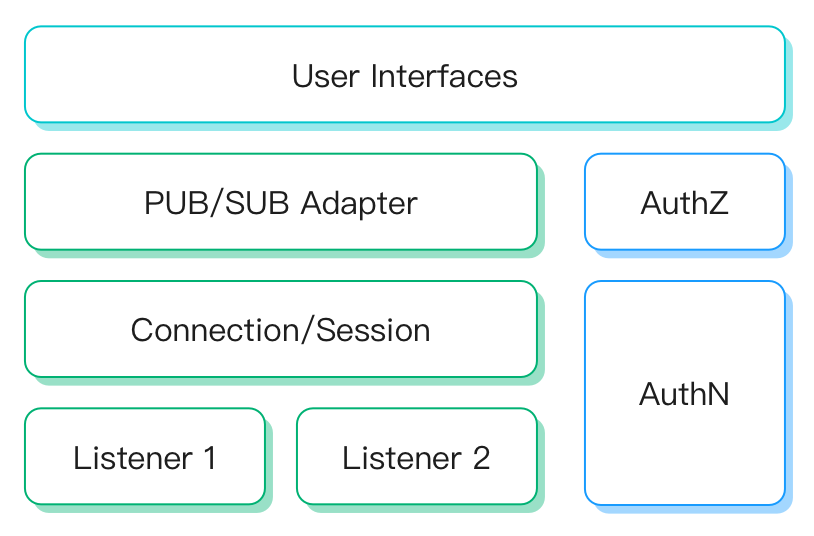

# マルチプロトコルゲートウェイ

EMQX マルチプロトコルゲートウェイは、MQTT以外のすべてのプロトコル接続、認証、およびメッセージの送受信を処理する機能を提供します。さまざまなプロトコルに対して統一された概念モデルを提供します。

EMQX 5.0以前は、MQTT以外のプロトコルアクセスは個別のプロトコルプラグインによって実装されており、これらのプラグインは設計や実装が異なっていたため、利用が難しい面がありました。

5.0以降、EMQXはマルチプロトコルゲートウェイを提供し、統一された概念および運用モデルを定義することで、より使いやすくなっています。

マルチプロトコルゲートウェイは、MQTT-SN、STOMP、CoAP、LwM2Mなどのプロトコルをサポートしています。Dashboard上で直接有効化・設定が可能であり、REST APIや`base.hocon`を使って管理することもできます。これらのゲートウェイの有効化方法やビジネスニーズに合わせた設定カスタマイズについては、以下のリンクをご参照ください。

::: warning 重要なお知らせ
ExProtoゲートウェイはEMQX 6.2.0で非推奨となり、EMQX 7で削除予定です。
:::

- [MQTT-SN](./mqttsn.md)
- [STOMP](./stomp.md)
- [CoAP](./coap.md)
- [LwM2M](./lwm2m.md)
- [ExProto](./exproto.md)

- [OCPP](./ocpp.md)
- [GB/T 32960](./gbt32960.md)
- [JT/T 808](./jt808.md)
- [NATS](./nats.md)

## マルチプロトコルゲートウェイの仕組み

EMQX マルチプロトコルゲートウェイは、リスナー、接続／セッション、パブリッシュ／サブスクライブ、認証、認可などの主要コンポーネントに対して統一された概念および運用モデルを定義しています。

各コンポーネントの概要は以下の通りです。

- **リスナー**：TCP、SSL、UDP、DTLSのリスナータイプをサポートします。各ゲートウェイは複数のリスナーを作成可能です。
- **接続／セッション**：ゲートウェイは受け入れたクライアント接続ごとにセッションを作成し、サブスクリプションリスト、配信／受信キュー、クライアントメッセージの再送制御を管理します。
- **パブリッシュ／サブスクライブ**：各ゲートウェイタイプは、MQTTプロトコルのPUB/SUBメッセージモデルに適応する方法を定義しています。PUB/SUBを持たないプロトコルでは、メッセージのトピックやペイロードを設定する必要があり、ゲートウェイごとに異なるメッセージフォーマットを使用する場合があります。
- **認証**：各ゲートウェイは認証機構を設定でき、クライアント情報を用いたログイン認可を行います。

## 主な機能

### リスナー

各ゲートウェイは複数のリスナーを有効化でき、異なるプロトコルゲートウェイは以下のリスナータイプをサポートしています。

|            | TCP  | UDP  | SSL  | DTLS | Websocket | Websocket over TLS |
| ---------- | ---- | ---- | ---- | ---- | --------- | ------------------ |
| MQTT-SN    |      | ✔︎    |      | ✔︎    |           |                    |
| STOMP      | ✔︎    |      | ✔︎    |      |           |                    |
| CoAP       |      | ✔︎    |      | ✔︎    |           |                    |
| LwM2M      |      | ✔︎    |      | ✔︎    |           |                    |
| ExProto    | ✔︎    | ✔︎    | ✔︎    | ✔︎    |           |                    |
| OCPP       |      |      |      |      | ✔︎         | ✔︎                  |
| GB/T 32960 | ✔︎    |      | ✔︎    |      |           |                    |
| JT/T 808   | ✔︎    |      |      | ✔︎    |           |                    |
| NATS       | ✔︎    |      | ✔︎    |      | ✔︎         | ✔︎                  |

### メッセージフォーマット

PUB/SUBメッセージモデルとの互換性を確保するために、各ゲートウェイタイプは基盤となるプロトコルにPUB/SUBの概念があるかどうかに適応する必要があります。

[MQTT-SN](./mqttsn.md)や[STOMP](./stomp.md)のようにPUB/SUBの概念を持つプロトコルでは、クライアントが送信するトピックとペイロードをそのまま使用するため、メッセージフォーマットの変換は不要です。

一方、[CoAP](./coap.md)や[LwM2M](./lwm2m.md)のようにPUB/SUBの概念を持たないプロトコルでは、トピックやパブリッシュ、サブスクライブの定義がありません。この場合、ゲートウェイ側でメッセージ内容のフォーマットを設計し、ゲートウェイごとに異なるフォーマットを用いることがあります。

- **CoAP**：CoAPゲートウェイは[Publish-Subscribe Broker for the CoAP](https://datatracker.ietf.org/doc/html/draft-ietf-core-coap-pubsub-09)標準で定義されたURIパスとメソッドを使用します。詳細は[メッセージパブリッシュ](./coap.md#message-publish)、[トピックサブスクライブ](./coap.md#topic-subscribe)、[トピックサブスクライブ解除](./coap.md#topic-unsubscribe)をご覧ください。
- **LwM2M**：LwM2Mプロトコルのメッセージモデルは[リソースモデルと操作](https://technical.openmobilealliance.org/OMNA/LwM2M/LwM2MRegistry.html)に基づいており、MQTTのパブリッシュ／サブスクライブモデルとは全く異なります。詳細は[LwM2Mゲートウェイ - メッセージフォーマット](./lwm2m.md#message-format)をご覧ください。

### 認証

認証は、システムに接続しようとするクライアントの身元を検証するプロセスです。バージョン5.0以降、ゲートウェイはログイン認可のための認証機構をサポートしています。

ゲートウェイによってサポートされる認証機構は異なりますが、すべてのゲートウェイはHTTPベースの認証をサポートしています。[HTTPベース認証](../access-control/authn/http.md)。以下の表はサポートされている認証タイプの一覧です。

|            | HTTPサーバー | 組み込みデータベース | MySQL | MongoDB | PostgreSQL | Redis | JWT  | LDAP |
| ---------- | ------------ | -------------------- | ----- | ------- | ---------- | ----- | ---- | ---- |
| MQTT-SN    | ✔︎            |                      |       |         |            |       |      |      |
| STOMP      | ✔︎            | ✔︎                    | ✔︎     | ✔︎       | ✔︎          | ✔︎     | ✔︎    | ✔︎    |
| CoAP       | ✔︎            | ✔︎                    | ✔︎     | ✔︎       | ✔︎          | ✔︎     | ✔︎    | ✔︎    |
| LwM2M      | ✔︎            |                      |       |         |            |       |      |      |
| Exproto    | ✔︎            | ✔︎                    | ✔︎     | ✔︎       | ✔︎          | ✔︎     | ✔︎    | ✔︎    |
| OCPP       | ✔︎            | ✔︎                    | ✔︎     | ✔︎       | ✔︎          | ✔︎     | ✔︎    | ✔︎    |
| GB/T 32960 | ✔︎            |                      |       |         |            |       |      |      |
| JT/T 808   | N/A          | N/A                  | N/A   | N/A     | N/A        | N/A   | N/A  |      |
| NATS       | ✔︎            | ✔︎                    | ✔︎     | ✔︎       | ✔︎          | ✔︎     | ✔︎    | ✔︎    |

注意：認証機構が設定されていない場合は、どのクライアントもログイン可能です。

#### ゲートウェイにおける認証の仕組み

EMQX マルチプロトコルゲートウェイは、接続してくるクライアントの認証を担当します。これは接続ごとに`ClientInfo`を作成することで実現されます。

`ClientInfo`には、認証に一般的に使用される`Username`や`Password`などの汎用フィールドが含まれています。さらに、各ゲートウェイにはLwM2Mの`Endpoint Name`のように固有のクライアント情報フィールドもあり、これらも認証に使用される場合があります。

認証機構が設定されている場合、ゲートウェイはクライアントのUsernameおよびPasswordを自身のデータベースに保存された情報と照合し、一致すればクライアントを認証しゲートウェイへのアクセスを許可します。

::: tip

異なるゲートウェイ間でクライアントIDは重複可能ですが、同一ゲートウェイに重複したクライアントIDでログインすると、既存のそのクライアントIDに紐づくセッションは切断されます。

:::

## 外部システムとの統合

外部システムとの連携を強化するために、ゲートウェイはEMQXで定義されたフックもサポートしています。

ゲートウェイ間で意味論の異質性があるため、コアフックの一部のみが利用可能です。

クライアント接続関連のフックのサポート状況は以下の通りです。

外部システムとの相互運用性を向上させるため、ゲートウェイはEMQXで定義されたフックをサポートする設計となっています。

ただし、各ゲートウェイ間で意味論の違いがあるため、コアフックのうち一部のみが利用可能です。以下の表はクライアント接続関連フックのサポート状況です。

| 名称                   | 必須かどうか | 説明                                                         | 対応プロトコル           |
| ---------------------- | ------------ | ------------------------------------------------------------ | ------------------------ |
| `client.connect`       | 任意         | クライアント接続要求の数（成功・失敗を含む）                 | 全ゲートウェイ           |
| `client.connack`       | 任意         | クライアントが受信した`CONNACK`メッセージの数                | 全ゲートウェイ           |
| `client.authenticate`  | 必須         | 認証済みクライアントの数                                     |                          |
| `client.connected`     | 必須         | 成功裏に接続したクライアントの数                              | 全ゲートウェイ           |
| `client.disconnected`  | 必須         | クライアントの切断数（正常・異常切断を含む）                  | 全ゲートウェイ           |
| `client.authorize`     | 必須         | 認可されたクライアントのパブリッシュ／サブスクライブ要求数    | 全ゲートウェイ           |
| `client.subscribe`     | 任意         | クライアントのトピックサブスクライブ試行数                   | MQTT-SN STOMP       |
| `client.unsubscribe`   | 任意         | クライアントのトピックサブスクライブ解除試行数               | MQTT-SN STOMP        |

セッションおよびメッセージ関連のフックはプロトコル間での異質性がないため、各ゲートウェイタイプで完全にサポートされています。

フックの詳細については[フック](../extensions/hooks.md)をご参照ください。
