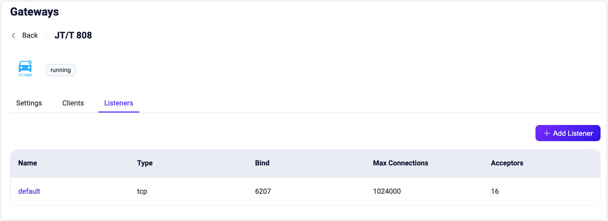

# JT/T 808 ゲートウェイ

EMQX 5.4 には、中国で広く使用されている車両端末通信プロトコルである JT/T 808 プロトコルが含まれています。これは車両と監視センター間のデータ通信に利用されます。EMQX の JT/T 808 ゲートウェイは、JT/T 808 クライアントからの接続を受け入れ、そのイベントやメッセージを MQTT パブリッシュメッセージに変換します。

現在の実装には以下の制限があります：

- TCP 伝送に基づいています。
- JT/T 808 2013 のみをサポートし、JT/T 808 2021 はまだサポートしていません。
- 端末の登録および登録解除メッセージを SMS で送信できません。
- EMQX の組み込み認証システムは使用できず、端末登録／アクセス認証用の HTTP サービスアドレスの設定が必要です。

## JT/T 808 ゲートウェイの有効化

JT/T 808 ゲートウェイは、ダッシュボード、REST API、または `base.hocon` 設定ファイルから有効化および設定できます。

### ダッシュボードからのゲートウェイ有効化

このセクションでは、ダッシュボードを使って JT/T 808 ゲートウェイを有効化する方法を説明します。

EMQX ダッシュボードの左ナビゲーションバーで **管理** -> **ゲートウェイ** をクリックします。**ゲートウェイ** ページにはサポートされているすべてのゲートウェイが一覧表示されます。**JT/T 808** を見つけて、**操作** 列の **設定** ボタンをクリックします。**JT/T 808 初期化** ページに移動します。

::: tip

EMQX がクラスターで稼働している場合、ダッシュボードまたは REST API での設定はクラスター全体に反映されます。単一ノードのみ設定したい場合は、[`base.hocon`](../configuration/configuration.md) でゲートウェイを設定してください。

:::

設定を簡素化するために、EMQX は **ゲートウェイ** ページのすべての必須フィールドにデフォルト値を提供しています。カスタム設定が不要な場合、以下の3ステップで JT/T 808 ゲートウェイを有効化できます：

1. **基本パラメータ** ステップページで全てのデフォルト設定を受け入れ、**次へ** をクリックします。
2. 次に **リスナー** ステップページに遷移し、EMQX はポート 6207 の TCP リスナーを事前設定しています。再度 **次へ** をクリックして設定を確定します。
3. **有効化** ボタンをクリックして JT/T 808 ゲートウェイを起動します。

ゲートウェイ有効化が完了すると、**ゲートウェイ** ページに戻り、JT/T 808 ゲートウェイが **有効** 状態になっていることが確認できます。


### REST API または設定ファイルからのゲートウェイ有効化

JT/T 808 ゲートウェイは REST API または設定ファイルからも有効化および設定できます：

:::: tabs type:card

::: tab REST API

```bash
curl -X 'PUT' 'http://127.0.0.1:18083/api/v5/gateways/jt808' \
  -u <your-application-key>:<your-security-key> \
  -H 'Content-Type: application/json' \
  -d '{
  "name": "jt808",
  "frame": {
    "max_length": 8192
  },
  "proto": {
    "auth": {
      "allow_anonymous": true
    },
    "up_topic":"jt808/${clientid}/${phone}/up",
    "dn_topic":"jt808/${clientid}/${phone}/dn"
  },
  "mountpoint": "jt808/${clientid}/",
  "retry_interval": "8s",
  "max_retry_times": 3,
  "message_queue_len": 10,
  "enable_stats": true,
  "idle_timeout": "30s",
  "listeners": [
    {
      "type":"tcp",
      "name":"default",
      "bind":"6207",
      "acceptors":16,
      "max_conn_rate":1000,
      "max_connections":1024000,
      "id":"jt808:tcp:default"
    }
  ]
  }'
```

:::

::: tab Configuration File

```properties
gateway {
  jt808 {
    enable_stats = true
    frame {max_length = 8192}
    idle_timeout = 30s
    listeners {
      tcp {
        default {
          acceptors = 16
          bind = "6207"
          max_conn_rate = 1000
          max_connections = 1024000
        }
      }
    }
    max_retry_times = 3
    message_queue_len = 10
    mountpoint = "jt808/${clientid}/"
    proto {
      auth {allow_anonymous = true}
      dn_topic = "jt808/${clientid}/${phone}/dn"
      up_topic = "jt808/${clientid}/${phone}/up"
    }
    retry_interval = 8s
  }
}
```

:::

::::

::: tip

EMQX がクラスターで稼働している場合、ダッシュボードまたは REST API での設定はクラスター全体に反映されます。単一ノードのみ設定したい場合は、[`base.hocon`](../configuration/configuration.md) でゲートウェイを設定してください。

:::

JT/T 808 ゲートウェイは TCP タイプのリスナーのみをサポートしています。設定可能なパラメータの完全な一覧は以下を参照してください：[Gateway Configuration - Listeners](https://docs.emqx.com/en/enterprise/v@EE_VERSION@/hocon/)。

## JT/T 808 ゲートウェイのカスタマイズ

デフォルト設定に加え、EMQX はさまざまな設定オプションを提供しており、特定のビジネス要件により適したカスタマイズが可能です。このセクションでは、**ゲートウェイ** ページで利用可能な設定オプションを詳しく解説します。

### 基本設定

ゲートウェイページで **JT/T 808** を見つけ、**操作** 列の **設定** をクリックします。**設定** ペインで JT/T 808 ゲートウェイのカスタマイズが可能です。


- **MountPoint**：パブリッシュやサブスクライブ時にすべてのトピックの先頭に付加される文字列を設定します。これにより異なるプロトコル間でのメッセージルーティングの分離を実現できます。例：`jt808/${clientid}/`。このトピックプレフィックスはゲートウェイが管理し、クライアントはパブリッシュやサブスクライブ時に明示的に追加する必要はありません。
- **Max Length of Frame**：ゲートウェイが処理可能なフレームの最大サイズです。デフォルト値は `8192` で、幅広いデータパケットサイズに対応します。
- **Retry Interval**：メッセージ配信失敗時の再試行間隔です。デフォルトは `8s` です。
- **Max Retry Times**：メッセージ配信の最大試行回数です。この回数を超えても配信できない場合、メッセージは破棄されます。デフォルトは `3` です。
- **Max message queue length**：ダウンロードストリームメッセージ配信の最大メッセージキュー長です。デフォルトは `100` です。
- **Idle Timeout**：接続クライアントの非アクティブ時間の上限（秒）です。これを超えると切断とみなされます。デフォルトは `30` 秒です。
- **Enable Statistics**：ゲートウェイの統計収集とレポートを許可するかどうかの設定です。デフォルトは `true`、選択肢は `true` または `false` です。
- **Registry**：JT/T 808 端末のレジストリセンターです。`allow_anonymous` が `false` の場合は必須です。ゲートウェイが JT/T 808 登録メッセージを受信すると、このアドレスに HTTP リクエストとして登録情報を送信します。詳細は [クライアント認証／認可の設定](#configure-client-authentication-authorization) を参照してください。
- **Authentication URL**：クライアント認証を行う外部サービスの URL を指定します。
- **Up Topic**：ゲートウェイから EMQX へメッセージをパブリッシュする際の MQTT トピックパターンです。JT/T 808 クライアントからのメッセージがどのように MQTT トピックにマッピングされるかを定義します。デフォルトは `jt808/${clientid}/${phone}/up` です。
- **Down Topic**：ブローカーからゲートウェイを経由して JT/T 808 クライアントへ送信されるメッセージの MQTT トピックパターンです。MQTT ブローカーから JT/T 808 クライアントへのメッセージルーティングを定義します。デフォルトは `jt808/${clientid}/${phone}/dn` です。
- **Ignore Unsupported Frames**：標準プロトコルに準拠しない JT/T 808 フレームの処理方法を決定します。
  - `true` に設定すると、非対応フレームはログに記録されますが、他の有効なメッセージの処理は継続され、カスタムや非標準メッセージによる切断を防ぎます。デフォルトは `true` です。
  - `false` に設定すると、非対応フレーム受信時にクライアントを切断します。
- **Allow Anonymous**：クライアントが認証なしで接続できるかどうかを設定します。`true` の場合、認証情報なしでの接続を許可します。

### リスナーの追加

デフォルトで、名前が **default** の TCP リスナーがポート `6207` に設定されており、1秒あたり最大1,000接続、最大1,024,000の同時接続をサポートしています。より詳細な設定を行うには、**リスナー** タブをクリックし、編集、削除、新規追加が可能です。



**+ リスナー追加** をクリックすると **リスナー追加** ページが開き、以下の設定項目を入力できます：

**基本設定**

- **名前**：リスナーの一意識別子を設定します。
- **タイプ**：プロトコルタイプを選択します。MQTT-SN の場合は `udp` または `dtls` が選べます。
- **バインド**：リスナーが接続を受け付けるポート番号を設定します。
- **MountPoint**（任意）：パブリッシュやサブスクライブ時に付加されるトピックのプレフィックス文字列を設定し、異なるプロトコル間でのメッセージルーティング分離を実現します。

**リスナー設定**

- **アセプター数**：アセプタープールのサイズを設定します。デフォルトは `16` です。
- **最大接続数**：リスナーが処理可能な同時接続の最大数を設定します。デフォルトは `1024000` です。
- **最大接続レート**：リスナーが1秒あたり受け入れる新規接続の最大数を設定します。デフォルトは `1000` です。
- **Proxy Protocol**：EMQX クラスターが HAProxy や NGINX の背後にある場合に Proxy Protocol V1/V2 を有効化します。デフォルトは `false` です。
- **Proxy Protocol タイムアウト**：Proxy Protocol パケットがタイムアウト内に受信されない場合、EMQX は TCP 接続を切断します。デフォルトは `3` 秒です。

**TCP 設定**

- **ActiveN**：ソケットの `{active, N}` オプションを設定します。これはソケットが能動的に処理できる受信パケット数を示します。詳細は [Erlang ドキュメント - setopts/2](https://erlang.org/doc/man/inet.html#setopts-2) を参照してください。
- **バッファ**：受信および送信パケットを格納するバッファサイズを KB 単位で設定します。
- **TCP_NODELAY**：接続に対して TCP_NODELAY フラグを設定します。デフォルトは `false` です。
- **SO_REUSEADDR**：ローカルポート番号の再利用を許可するかどうかを設定します。デフォルトは `true` です。
- **送信タイムアウト**：接続の TCP 送信タイムアウトを秒単位で設定します。デフォルトは `15` 秒です。
- **送信タイムアウト時の切断**：送信タイムアウト発生時に接続を切断するかどうかを設定します。デフォルトは `true` です。

### クライアント認証／認可の設定

JT/T 808 プロトコル仕様の独自の登録／認証ロジックにより、JT/T 808 ゲートウェイは特定の登録サービス HTTP サービスに登録／認証をリクエストする方式のみをサポートしています。

::: tip

ここでの「認証」は、JT/T 808 プロトコルで定義される認証を指し、MQTT の Pub/Sub アクセス制御とは異なります。

:::

また、`gateway.jt808.proto.auth.allow_anonymous = true` を設定すると匿名認証が有効になり、クライアントの登録／認証ロジックをスキップできます。

登録／認証リクエストの詳細フォーマットは以下の通りです：

#### 登録リクエスト

```properties
URL: http://127.0.0.1:8991/jt808/registry
Method: POST
Body:
   { "province": 58,
     "city": 59,
     "manufacturer": "Infinity",
     "model": "Q2",
     "license_number": "ZA334455",
     "dev_id": "xx11344",
     "color": 3,
     "phone", "00123456789"
   }
```

**登録レスポンス：**

:::: tabs type:card

::: tab 例 1

```json
{
  "code": 0,
  "authcode": "132456789"
}
```

:::

::: tab 例 2

```json
{
  "code": 1
}
```

:::

::::

返却コードは以下の通りです：

0: 成功  
1: 車両はすでに登録済み  
2: データベースに該当車両なし  
3: 端末はすでに登録済み  
4: データベースに該当端末なし  

#### 認証リクエスト

```properties
URL: http://127.0.0.1:8991/jt808/auth
Method: POST
Body:
   { "code": "authcode",
     "phone", "00123456789"
   }
```

**認証レスポンス：**

```
HTTP ステータスコード 200: 認証成功
その他: 認証失敗
```

補足：認証リクエストは、システムに認証コードが保存されていない場合（端末が直接認証メッセージを送信してシステムにログインする場合）のみ呼び出されます。

## データ交換フォーマット

詳細は [JT/T 808 ゲートウェイ データ交換フォーマット](./jt808_data_exchange.md) を参照してください。

## ユーザーレイヤーインターフェース

- 詳細な設定手順は以下を参照してください：[Gateway Configuration - JT/T 808 Gateway](https://docs.emqx.com/en/enterprise/v5.4.0/hocon/)
- 詳細な REST API インターフェースは以下を参照してください：[REST API - Gateway](../admin/api.md)
