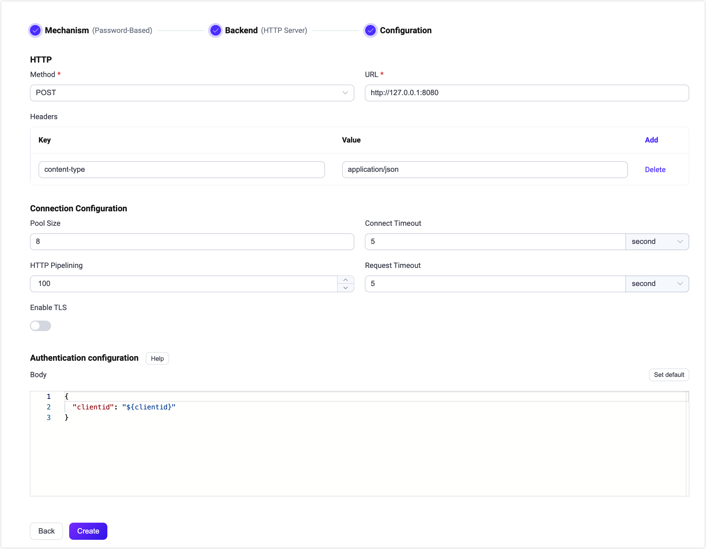

# MQTT-SN ゲートウェイ

<<<<<<< HEAD
MQTT-SN（MQTT for Sensor Networks）は、ワイヤレスセンサーネットワーク向けの軽量なパブ/サブプロトコルです。EMQX MQTT-SN ゲートウェイは、これらのデバイスが EMQX に接続して通信できるようにし、MQTT-SN と標準 MQTT プロトコルの橋渡しをします。

本ページでは、EMQX における MQTT-SN ゲートウェイの設定および使用方法を紹介します。
=======
MQTT-SN（MQTT for Sensor Networks）は、ワイヤレスセンサーネットワーク向けの軽量なパブサブプロトコルです。EMQX MQTT-SN ゲートウェイは、これらのデバイスが EMQX に接続して通信できるようにし、MQTT-SN と標準 MQTT プロトコル間の橋渡しを行います。

本ページでは、EMQX における MQTT-SN ゲートウェイの設定方法と使用方法を紹介します。
>>>>>>> origin/release-5.10

::: tip

MQTT-SN ゲートウェイは [MQTT-SN v1.2](https://www.oasis-open.org/committees/download.php/66091/MQTT-SN_spec_v1.2.pdf) をベースにしています。

:::

<!--アーキテクチャの簡単な紹介-->

## MQTT-SN ゲートウェイの有効化

<<<<<<< HEAD
EMQX 5.0 では、MQTT-SN ゲートウェイはダッシュボード、REST API、および設定ファイル `base.hocon` を通じて設定および有効化できます。本節では、ダッシュボードを使った設定例を示し、操作手順を解説します。

EMQX ダッシュボードの左側ナビゲーションメニューで **Management** -> **Gateways** をクリックします。**Gateways** ページにはサポートされているすべてのゲートウェイが一覧表示されます。**MQTT-SN** を見つけて、**Actions** 列の **Setup** をクリックすると、**Initialize MQTT-SN** ページに遷移します。
=======
EMQX 5.0 では、MQTT-SN ゲートウェイはダッシュボード、REST API、設定ファイル `base.hocon` を通じて設定および有効化できます。本節ではダッシュボードを例に操作手順を説明します。

EMQX ダッシュボードの左側ナビゲーションメニューで **Management** -> **Gateways** をクリックします。**Gateways** ページにはサポートされているすべてのゲートウェイが一覧表示されます。**MQTT-SN** を探し、**Actions** 列の **Setup** をクリックすると、**Initialize MQTT-SN** ページに遷移します。
>>>>>>> origin/release-5.10

::: tip

EMQX をクラスターで運用している場合、ダッシュボードや REST API で行った設定はクラスター全体に影響します。特定のノードのみ設定を変更したい場合は、[`base.hocon`](../configuration/configuration.md) で設定してください。

:::

<<<<<<< HEAD
設定を簡略化するため、EMQX は **Gateways** ページのすべての必須項目にデフォルト値を用意しています。大幅なカスタマイズが不要な場合は、以下の3ステップで MQTT-SN ゲートウェイを有効化できます。
=======
設定を簡略化するために、EMQX は **Gateways** ページのすべての必須フィールドにデフォルト値を用意しています。大幅なカスタマイズが不要であれば、MQTT-SN ゲートウェイは以下の3クリックで有効化できます。
>>>>>>> origin/release-5.10

1. **Basic Configuration** タブで **Next** をクリックし、すべてのデフォルト設定を受け入れます。
2. 次に **Listeners** タブに遷移し、EMQX はポート1884で UDP リスナーを事前設定しています。**Next** をクリックして設定を確認します。
3. 最後に **Enable** ボタンをクリックして MQTT-SN ゲートウェイを有効化します。

ゲートウェイの有効化が完了すると、**Gateways** ページに戻り、MQTT-SN ゲートウェイの状態が **Enabled** と表示されていることを確認できます。


上記の設定は REST API でも可能です。

**例：**

```bash
curl -X 'PUT' 'http://127.0.0.1:18083/api/v5/gateways/mqttsn' \
  -u <your-application-key>:<your-security-key> \
  -H 'Content-Type: application/json' \
  -d '{
  "name": "mqttsn",
  "enable": true,
  "gateway_id": 1,
  "mountpoint": "mqttsn/",
  "listeners": [
    {
      "type": "udp",
      "bind": "1884",
      "name": "default",
      "max_conn_rate": 1000,
      "max_connections": 1024000
    }
  ]
}'
```

詳細な REST API の説明は [REST API - Gateway](../admin/api.md) を参照してください。

<<<<<<< HEAD
カスタマイズが必要な場合やリスナーの追加、認証ルールの追加を行いたい場合は、[MQTT-SN ゲートウェイのカスタマイズ](#customize-your-mqtt-sn-gateway) セクションをご覧ください。
=======
カスタマイズが必要で、リスナーを追加したり認証ルールを設定したい場合は、[MQTT-SN ゲートウェイのカスタマイズ](#customize-your-mqtt-sn-gateway) セクションをお読みください。
>>>>>>> origin/release-5.10

## MQTT-SN クライアントとの連携

### クライアントライブラリ

MQTT-SN ゲートウェイを構築した後は、MQTT-SN クライアントツールを使用して接続をテストし、正常に動作することを確認できます。以下は推奨される MQTT-SN クライアントツールの例です。

- [paho.mqtt-sn.embedded-c](https://github.com/eclipse/paho.mqtt-sn.embedded-c)
- [mqtt-sn-tools](https://github.com/njh/mqtt-sn-tools)

### パブリッシュ／サブスクライブ

MQTT-SN プロトコルはすでにパブリッシュ／サブスクライブの動作を定義しています。例えば：

- MQTT-SN プロトコルの `PUBLISH` メッセージはパブリッシュ操作に使用され、このメッセージでトピックと QoS が指定されます。
<<<<<<< HEAD
- `SUBSCRIBE` メッセージはサブスクライブ操作に使用され、トピックと QoS の両方が指定されます。
=======
- `SUBSCRIBE` メッセージはサブスクライブ操作に使用され、トピックと QoS が指定されます。
>>>>>>> origin/release-5.10
- `UNSUBSCRIBE` メッセージはサブスクライブ解除操作に使用され、トピックが指定されます。

## MQTT-SN ゲートウェイのカスタマイズ

<<<<<<< HEAD
デフォルト設定に加え、EMQX はさまざまな設定オプションを提供しており、特定のビジネス要件により適合させることが可能です。本節では、**Gateways** ページで利用可能な各種フィールドについて詳しく解説します。

### 基本設定

**Basic Configuration** タブでは、ゲートウェイ ID のカスタマイズ、事前定義されたトピックリストの設定、およびこのゲートウェイの MountPoint 文字列の設定が可能です。以下のスクリーンショット下の説明をご覧ください。
=======
デフォルト設定に加え、EMQX はさまざまな設定オプションを提供し、特定のビジネス要件に合わせて柔軟に対応できます。本節では **Gateways** ページで利用可能な各種フィールドについて詳しく説明します。

### 基本設定

**Basic Configuration** タブでは、ゲートウェイ ID のカスタマイズ、あらかじめ定義されたトピックリストの設定、ゲートウェイの MountPoint 文字列の設定が可能です。以下のスクリーンショット下の説明を参照してください。
>>>>>>> origin/release-5.10


- **Gateway ID**：ゲートウェイの一意の識別子を設定します。例：1。

<<<<<<< HEAD
- **Enable Broadcast**：ゲートウェイがクライアントに対してゲートウェイ広告をブロードキャストするかどうかを設定します。指定した Gateway ID を含むメッセージをブロードキャストします。デフォルト：`true`。選択肢：`true`、`false`。

- **Enable QoS 3**：QoS -1 とも呼ばれ、アックやサブスクリプションを必要とせず、ゲートウェイに `PUBLISH` メッセージのみ送信する基本クライアント向けの設定です。デフォルト：`true`。選択肢：`true`、`false`。

- **Idle Timeout**：接続された MQTT-SN クライアントが非アクティブとみなされるまでの秒数を設定します。デフォルト：`30s`。

- **Enable Statistics**：ゲートウェイが統計情報を収集・報告するかどうかを設定します。デフォルト：`true`。選択肢：`true`、`false`。

- **Predefined Topic List**：事前定義されたトピック ID と対応するトピック名を設定します。**Add** をクリックして新しいエントリを追加できます。

  - **Topic ID**：トピック ID を設定します。1 から 65535 の整数である必要があります。
  - **Topic**：トピック名を設定します。

- **MountPoint**：パブリッシュやサブスクライブ時にすべてのトピックの前に付加される文字列を設定します。これにより異なるプロトコル間でのメッセージルーティングの分離を実現できます。例：`mqttsn/`。

  **注意**：このトピックプレフィックスはゲートウェイによって管理されます。MQTT-SN クライアントはパブリッシュやサブスクライブ時にこのプレフィックスを明示的に付加する必要はありません。

### リスナーの追加

デフォルトでは、名前が **default** の UDP リスナーがポート `1884` に設定されており、1秒あたり最大1,000接続、最大1,024,000の同時接続をサポートします。**Settings** をクリックすると詳細設定が可能で、**Delete** でリスナーを削除、**+ Add Listener** で新規リスナーを追加できます。
=======
- **Enable Broadcast**：ゲートウェイがゲートウェイ広告をクライアントにブロードキャストするかどうかを設定します。指定した Gateway ID を含むメッセージをブロードキャストします。デフォルト：`true`。選択肢：`true`、`false`。

- **Enable QoS 3**：QoS -1 とも呼ばれ、アックやサブスクライブを必要とせず、`PUBLISH` メッセージのみをゲートウェイに送信する基本クライアント向けの設定です。デフォルト：`true`。選択肢：`true`、`false`。

- **Idle Timeout**：MQTT-SN クライアントが非アクティブとみなされて切断されるまでの秒数を設定します。デフォルト：`30s`。

- **Enable Statistics**：ゲートウェイが統計情報を収集・報告するかどうかを設定します。デフォルト：`true`。選択肢：`true`、`false`。

- **Predefined Topic List**：あらかじめ定義されたトピック ID と対応するトピック名を設定します。**Add** をクリックして新規エントリーを追加します。

  - **Topic ID**：1〜65535 の整数でトピック ID を設定します。
  - **Topic**：トピック名を設定します。

- **MountPoint**：パブリッシュやサブスクライブ時にすべてのトピックの前に付加される文字列を設定します。異なるプロトコル間でメッセージルーティングの分離を実現する方法の一つです。例：`mqttsn/`。

  **注意**：このトピックプレフィックスはゲートウェイが管理するため、MQTT-SN クライアントはパブリッシュやサブスクライブ時に明示的にこのプレフィックスを付ける必要はありません。

### リスナーの追加

デフォルトで、名前が **default** の UDP リスナーがポート `1884` に設定されており、1秒あたり最大1,000接続、最大1,024,000の同時接続をサポートします。より詳細な設定を行うには **Settings** をクリックし、リスナーを削除するには **Delete** をクリック、新しいリスナーを追加するには **+ Add Listener** をクリックします。
>>>>>>> origin/release-5.10


**Add Listener** をクリックすると **Add Listener** ページが開き、以下の設定が行えます。

**基本設定**

- **Name**：リスナーの一意の識別子を設定します。
<<<<<<< HEAD
- **Type**：プロトコルタイプを選択します。MQTT-SN では **udp** または **dtls** が選べます。
- **Bind**：リスナーが受け付ける接続のポート番号を設定します。
- **MountPoint**（任意）：パブリッシュやサブスクライブ時にすべてのトピックの前に付加される文字列を設定し、異なるプロトコル間でのメッセージルーティングの分離を実現します。

**リスナー設定**

- **Acceptor**（DTLS リスナーのみ）：アクセプタープールのサイズを設定します。デフォルトは **16**。
- **Max Connections**：リスナーが処理可能な最大同時接続数を設定します。デフォルトは **1024000**。
- **Max Connection Rate**：リスナーが1秒あたり受け入れ可能な新規接続の最大レートを設定します。デフォルトは **1000**。

**UDP 設定**

- **ActiveN**：ソケットの `{active, N}` オプションを設定します。これはソケットが積極的に処理できる受信パケット数です。詳細は [Erlang Documentation - setopts/2](https://www.erlang.org/doc/apps/kernel/inet.html#setopts/2) をご参照ください。
- **Buffer**：受信および送信パケットを格納するバッファサイズを KB 単位で設定します。
=======
- **Type**：プロトコルタイプを選択します。MQTT-SN では **udp** または **dtls** を選択可能です。
- **Bind**：リスナーが接続を受け付けるポート番号を設定します。
- **MountPoint**（任意）：パブリッシュやサブスクライブ時にすべてのトピックの前に付加される文字列を設定し、異なるプロトコル間でのメッセージルーティング分離を実現します。

**リスナー設定**

- **Acceptor**（DTLS リスナーのみ）：アクセプタプールのサイズを設定します。デフォルト：**16**。
- **Max Connections**：リスナーが処理可能な最大同時接続数を設定します。デフォルト：**1024000**。
- **Max Connection Rate**：リスナーが1秒あたりに受け入れ可能な新規接続の最大レートを設定します。デフォルト：**1000**。

**UDP 設定**

- **ActiveN**：ソケットの `{active, N}` オプションを設定します。これはソケットが積極的に処理できる受信パケット数を示します。詳細は [Erlang Documentation - setopts/2](https://erlang.org/doc/man/inet.html#setopts-2) を参照してください。
- **Buffer**：受信および送信パケットを格納するバッファのサイズを KB 単位で設定します。
>>>>>>> origin/release-5.10
- **Receive Buffer**：受信バッファのサイズを KB 単位で設定します。
- **Send Buffer**：送信バッファのサイズを KB 単位で設定します。
- **SO_REUSEADDR**：ローカルでのポート番号の再利用を許可するかどうかを設定します。

**DTLS 設定**（DTLS リスナーのみ）

<<<<<<< HEAD
TLS Verify の有効化はトグルスイッチで設定できますが、その前に関連する **TLS Cert**、**TLS Key**、および **CA Cert** の情報を設定する必要があります。ファイルの内容を直接入力するか、**Select File** ボタンでアップロードしてください。詳細は [Enable SSL/TLS Connection](../network/emqx-mqtt-tls.md) をご参照ください。
=======
TLS Verify の有効化はトグルスイッチで設定できます。ただし、その前に関連する **TLS Cert**、**TLS Key**、**CA Cert** の情報をファイル内容の入力または **Select File** ボタンでアップロードして設定する必要があります。詳細は [Enable SSL/TLS Connection](../network/emqx-mqtt-tls.md) を参照してください。
>>>>>>> origin/release-5.10

続いて以下の設定が可能です。

- **DTLS Versions**：サポートする DTLS バージョンを設定します。デフォルトは **dtlsv1.2** と **dtlsv1**。
<<<<<<< HEAD
- **Fail If No Peer Cert**：クライアントが空の証明書を送信した場合に接続を拒否するかどうかを設定します。デフォルトは **false**。選択肢は **true**、**false**。
- **Intermediate Certificate Depth**：ピア証明書に続く有効な認証パスに含まれる自己発行でない中間証明書の最大数を設定します。デフォルトは **10**。
- **Key Password**：プライベートキーがパスワード保護されている場合に使用するユーザーパスワードを設定します。
=======
- **Fail If No Peer Cert**：クライアントが空の証明書を送信した場合に EMQX が接続を拒否するかどうかを設定します。デフォルト：**false**。選択肢：**true**、**false**。
- **Intermediate Certificate Depth**：ピア証明書に続く有効な認証パスに含まれる自己発行でない中間証明書の最大数を設定します。デフォルト：**10**。
- **Key Password**：プライベートキーがパスワード保護されている場合に使用するパスワードを設定します。
>>>>>>> origin/release-5.10

### 認証の設定

MQTT-SN プロトコルの接続メッセージはクライアントの Client ID のみを提供するため、MQTT-SN ゲートウェイは [HTTP サーバー認証](../access-control/authn/http.md) のみをサポートしています。

クライアント情報の生成ルールは以下の通りです。

<<<<<<< HEAD
- Client ID：`CONNECT` メッセージの Client ID フィールドを使用。
- Username：未定義。
- Password：未定義。
=======
- Client ID：`CONNECT` メッセージの Client ID フィールドを使用
- Username：未定義
- Password：未定義
>>>>>>> origin/release-5.10

ここではダッシュボードを例に認証設定方法を説明します。

**Gateways** ページで **MQTT-SN** を探し、**Actions** 列の **Setup** をクリックし、**Authentication** タブに入ります。

<<<<<<< HEAD
**Create Authentication** をクリックし、**Mechanism** に **Password-Based**、**Backend** に **HTTP Server** を選択します。続いて **Configuration** タブで認証ルールを設定します。
=======
**Create Authentication** をクリックし、**Mechanism** に **Password-Based** を選択、**Backend** に **HTTP Server** を選択します。続いて **Configuration** タブで認証ルールを設定します。
>>>>>>> origin/release-5.10



各フィールドの詳細は [HTTP サーバー認証](../access-control/authn/http.md) を参照してください。

上記の設定は REST API でも実行可能です。

**例：**

```bash
curl -X 'POST' 'http://127.0.0.1:18083/api/v5/gateway/mqttsn/authentication' \
  -u <your-application-key>:<your-security-key> \
  -H 'Content-Type: application/json' \
  -d '{
  "method": "post",
  "url": "http://127.0.0.1:8080",
  "headers": {
    "content-type": "application/json"
  },
  "body": {
    "clientid": "${clientid}"
  },
  "pool_size": 8,
  "connect_timeout": "5s",
  "request_timeout": "5s",
  "enable_pipelining": 100,
  "ssl": {
    "enable": false,
    "verify": "verify_none"
  },
  "backend": "http",
  "mechanism": "password_based",
  "enable": true
}'
```
