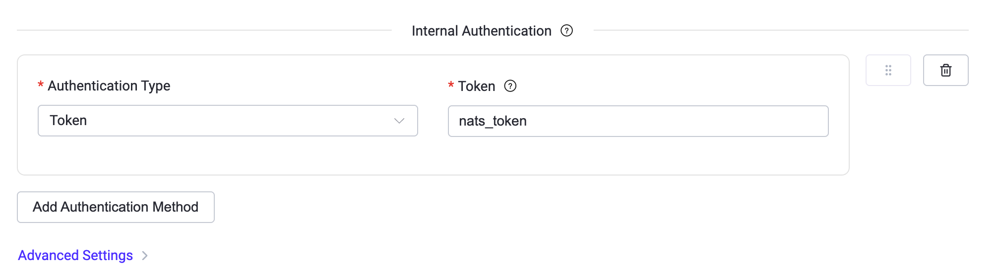
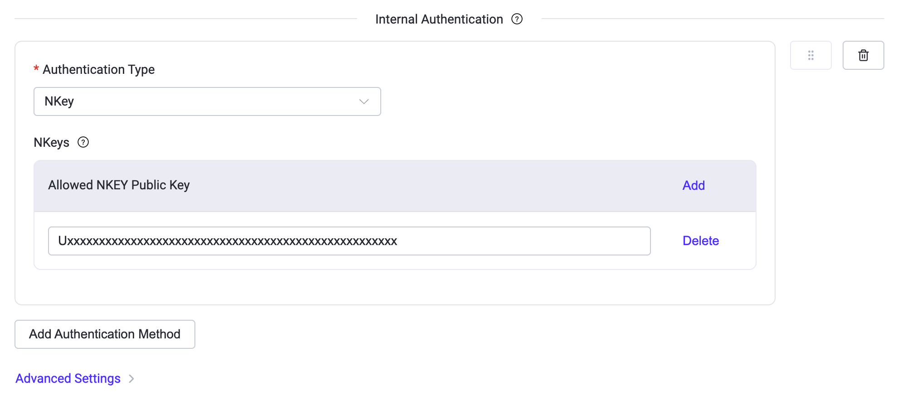

# NATS プロトコルゲートウェイ

EMQX 5.10.0 以降、EMQX は [NATS プロトコル](https://docs.nats.io/reference/reference-protocols/nats-protocol) に基づく NATS プロトコルゲートウェイを導入しました。これにより、EMQX は NATS クライアントからの接続を受け入れ、MQTT とのメッセージ相互運用を実現します。本ドキュメントでは、その機能概要と NATS ゲートウェイの有効化および設定手順を説明します。

## 機能概要

NATS プロトコルゲートウェイは現在、以下の主要な機能をサポートしています。

### プロトコルサポート

- **NATS プロトコルのメッセージタイプを完全サポート**：
  - 接続およびセッション管理：`INFO`、`CONNECT`
  - メッセージのパブリッシュ／サブスクライブ：`PUB`、`HPUB`、`SUB`、`UNSUB`
  - メッセージ配信および応答：`MSG`、`HMSG`
  - ハートビートおよびステータス：`PING`、`PONG`、`+OK`、`-ERR`
- **冗長モード（Verbose mode）対応**：クライアントが `CONNECT verbose=true` で接続した場合に応答確認を有効化。
- **多彩な認証方式に対応**：Token、NKey、JWT、ユーザー名／パスワード認証をサポート。

### MQTT との相互運用

- **MQTT との双方向メッセージ相互運用**：
  - NATS クライアントからパブリッシュされたメッセージを MQTT パブリッシュに変換。
  - MQTT メッセージを対応するトピックをサブスクライブしている NATS クライアントへ転送。
- **NATS ワイルドカードサブスクリプション対応**：MQTT 互換のトピック形式に自動変換。
- **Queue Group 共有サブスクリプション対応**：NATS の Queue Group サブスクリプションを MQTT の共有サブスクリプション形式に変換。
- **Request/Reply モード対応**：
  - NATS クライアントからのリクエストを MQTT リクエストに変換。
  - 対象トピックに MQTT サブスクライバーがいない場合は、EMQX が迅速にエラー応答を返す。

### ネットワークおよび接続性

- **複数のトランスポートプロトコルをサポート**：TCP、TLS、WebSocket（WS）、および TLS 上の WebSocket（WSS）。

## NATS と MQTT 間のクロスプロトコルメッセージング

NATS プロトコルはパブリッシュ／サブスクライブメッセージングモデルに完全対応しており、NATS ゲートウェイを介して MQTT メッセージングと相互運用します。変換ルールは以下の通りです。

- **PUB および HPUB メッセージはパブリッシュ操作として扱う**：
  - トピックは PUB メッセージの `subject` フィールドから派生。例：`t.a` は MQTT トピック `t/a` に変換されます。
  - メッセージペイロードは PUB メッセージ本文から直接取得。
  - クライアントが `CONNECT verbose=1` で接続した場合、変換後の MQTT メッセージは QoS 1、それ以外は QoS 0。
- **SUB メッセージはサブスクリプション要求として扱う**：
  - トピックは SUB メッセージの `subject` フィールドから派生。例：`t.a` は MQTT トピック `t/a` に変換。
  - QoS は同様に、`verbose=1` で QoS 1、それ以外は QoS 0。
  - ワイルドカードをサポート。例：`*.b.>` は `+/b/#` に変換。
  - Queue Group をサポート。SUB メッセージの Queue Group 値は MQTT 共有サブスクリプションのグループ名に変換。
- **UNSUB メッセージはサブスクリプション解除要求として扱い**、サブスクリプション ID（sid）で解除対象を特定。

::: tip

NATS ゲートウェイはパブリッシュ／サブスクライブ操作の独自アクセス制御を実装していません。トピック権限は統一された[認可設定](../access-control/authz/authz.md)で管理してください。

:::

## NATS ゲートウェイの有効化

EMQX 5.10.0 以降、NATS ゲートウェイは以下の3つの方法で有効化できます。

- ダッシュボードから
- REST API を使用して
- `base.hocon` 設定ファイルを編集して

::: tip

クラスター環境では、ダッシュボードまたは REST API での設定は自動的に全ノードに適用されます。特定ノードのみ設定を反映したい場合は、そのノードの `base.hocon` 設定ファイルを使用してください。

:::

### ダッシュボードからの有効化

EMQX ダッシュボードから NATS ゲートウェイを素早く有効化する手順：

1. 左メニューの **Management** -> **Gateways** に移動。
2. **Gateways** ページで **NATS** を探し、**Actions** 列の **Setup** ボタンをクリックして **Initialize NATS** セットアップウィザードを開始。
3. ウィザードの手順に従う：
   - **Basic Configuration** ステップでデフォルト値を受け入れ、**Next** をクリック。
   - **Listeners** ステップでリスナーを設定するかスキップして **Next** をクリック。
     （リスナー設定の詳細は [Add a Listener](#add-a-listener) を参照）
   - **Enable** をクリックして NATS ゲートウェイを有効化。

有効化完了後、**Gateways** ページにリダイレクトされ、NATS ゲートウェイのステータスが **Enabled** と表示されます。

### REST API からの有効化

以下の例は REST API を使って NATS ゲートウェイを有効化する方法です。

```bash
curl -X 'PUT' 'http://127.0.0.1:18083/api/v5/gateway/nats' \
  -u <your-application-key>:<your-security-key> \
  -H 'Content-Type: application/json' \
  -d '{
  "name": "nats",
  "enable": true,
  "mountpoint": "nats/",
  "listeners": [
    {
      "type": "tcp",
      "name": "default",
      "bind": "4222",
      "max_conn_rate": 1000,
      "max_connections": 1024000
    }
  ]
}'
```

### 設定ファイルからの有効化

以下の設定例は `base.hocon` を編集して NATS ゲートウェイを有効化する方法です。

```properties
gateway.nats {

  mountpoint = "nats/"

  listeners.tcp.default {
    bind = 4222
    acceptors = 16
    max_connections = 1024000
    max_conn_rate = 1000
  }
}
```

NATS ゲートウェイは TCP、SSL、WS、WSS タイプリスナーをサポートします。設定可能なパラメータの完全な一覧は、[EMQX Enterprise Configuration Manual](https://docs.emqx.com/en/enterprise/v@EE_VERSION@/hocon/) のゲートウェイ設定 - リスナーセクションを参照してください。

## NATS ゲートウェイのカスタマイズ

デフォルト設定に加え、EMQX はビジネス要件に応じて柔軟に設定可能なオプションを提供しています。このセクションでは **Gateways** ページで利用可能な設定項目を詳述します。

### 基本設定

1. **Gateways** ページで **NATS** を探し、**Actions** 列の **Settings** ボタンをクリック。

2. **Settings** タブでゲートウェイの接続パラメータ、マウントポイントプレフィックス、クライアント識別情報のオーバーライドを設定可能。

   - **Server Name**：ゲートウェイの内部参照用の一意識別子。デフォルトは `emq_nats_gateway`。
   - **Mountpoint**：ゲートウェイ経由のすべてのトピックに自動付加される文字列プレフィックス。プロトコル間のトピック分離に役立ちます。例：`nats/` を使うとクライアントが手動でプレフィックスを付ける必要なくクロスプロトコルルーティングが可能。
   - **Default Heartbeat Interval**：サーバーがクライアントの生存確認のために `PING` パケットを送信する間隔（秒）。デフォルトは `60` 秒。
   - **Heartbeat Timeout Threshold**：クライアントが応答しない場合に切断とみなすタイムアウト時間。
   - **Maximum Payload Size**：単一の `PUB` または `HPUB` メッセージペイロードの最大サイズ（バイト）。デフォルトは `1048576` バイト。
   - **Idle Timeout**：非アクティブなクライアント接続を切断するまでの待機時間（秒）。デフォルトは `30` 秒。
   - **Enable Statistics**：このゲートウェイの統計収集とレポートを有効にするかどうか。デフォルトは有効。
   - **Client Info Override**：`CONNECT` パケットから認証情報を抽出する方法を定義。

     ::: tip

     認証が有効な場合は、`username` と `password` に正しいフィールドをマッピングし、適切に資格情報を処理できるようにしてください。

     :::

     - **Username**：`CONNECT` パケットの `user` フィールドにマッピング。
     - **Password**：`CONNECT` パケットの `pass` フィールドにマッピング。
     - **Client ID**：`${generated}` で自動生成、またはカスタムロジックで設定可能。

3. **Update** をクリックして変更を適用。

### リスナーの追加

**Listeners** タブでリスナーの編集、削除、新規追加が可能です。

1. **Listeners** タブで **+ Add Listener** をクリック。

2. **Add Listener** ダイアログで以下のオプションを設定：

   **基本設定**

   - **Name**：リスナーを識別する一意の名前。
   - **Type**：リスナーの種類。NATS では `tcp`、`ssl`、`ws`、`wss` がサポートされます。
   - **Bind**：リスナーが接続を受け付けるポート番号。

   **リスナー設定**

   - **Max Connections**：同時接続の最大数。デフォルトは `1024000`。
   - **Max Connection Rate (Listener)**：1秒あたりに受け入れる新規接続の最大数。デフォルトは `1000`。
   - **Proxy Protocol**：Proxy Protocol v1/v2 の有効化。デフォルトは `false`。
   - **Proxy Protocol Timeout**：Proxy Protocol ヘッダー受信のタイムアウト。指定時間内にヘッダーが受信されない場合、接続を切断。デフォルトは `3` 秒。

   **ピア検証設定**（SSL および WSS リスナーのみ適用）

   相互 TLS はデフォルトで有効です。TLS 証明書、秘密鍵、CA 証明書の設定が必要で、アップロードまたは直接フォームに貼り付け可能です。詳細は [SSL/TLS 接続の有効化](../network/emqx-mqtt-tls.md) を参照してください。

   - **TLS Cert**：TLS 証明書ファイルのパスまたは内容。
   - **TLS Key**：TLS 秘密鍵ファイルのパスまたは内容。
   - **CA Cert**：CA 証明書ファイルのパスまたは内容。
   - **Force Verify Peer Certificate**：クライアント証明書検証の強制。デフォルトは `true`。

3. **Add** をクリックしてリスナー作成を完了。

### 認証の設定

NATS ゲートウェイは以下の2種類の認証方式をサポートします。

- **ゲートウェイ認証（`authentication`）**：EMQX ゲートウェイ認証機構、通常はユーザー名／パスワード形式のバックエンド。
- **内部ゲートウェイ認証（`internal_authn`）**：NATS ネイティブのユーザー名／パスワード以外の認証。

両方が有効な場合、EMQX は以下の順序で認証を評価します。

1. `internal_authn` メソッドを上から順に評価。
2. 必要な資格情報が欠けている場合は次のメソッドを試行。
3. 資格情報があるが検証に失敗した場合は即座に接続拒否。
4. すべての内部メソッドがスキップされ、`authentication` が設定されていればゲートウェイ認証にフォールバック。
5. 内部メソッドもゲートウェイ認証も設定されていなければ、すべての NATS クライアントの接続を許可。

#### ゲートウェイ認証の設定

他のゲートウェイ同様、NATS ゲートウェイは標準の EMQX 認証機構と連携可能です。以下の認証バックエンドをサポートします。

- [組み込みデータベース認証](../access-control/authn/mnesia.md)
- [MySQL 認証](../access-control/authn/mysql.md)
- [MongoDB 認証](../access-control/authn/mongodb.md)
- [PostgreSQL 認証](../access-control/authn/postgresql.md)
- [Redis 認証](../access-control/authn/redis.md)
- [HTTP サーバー認証](../access-control/authn/http.md)
- [JWT 認証](../access-control/authn/jwt.md)
- [LDAP 認証](../access-control/authn/ldap.md)

ゲートウェイ認証では、NATS の `CONNECT` パケットから以下のフィールドを抽出します。

- **Client ID**：デフォルトで自動生成。
- **Username**：`user` フィールドの値。
- **Password**：`pass` フィールドの値。

MQTT プロトコルとは異なり、ゲートウェイ認証は単一の認証機構のみをサポートし、チェーンやリストは対応していません。

##### ダッシュボードでの設定例

HTTP サーバーを使ったパスワード認証の設定例：

1. NATS ゲートウェイ設定の **Authentication** タブに移動。
2. **+ Create Authentication** をクリックし、メカニズムに **Password-Based**、データソースに **HTTP Server** を選択し、**Next** をクリック。
3. 設定パラメータを入力。詳細は [HTTP パスワード認証](../access-control/authn/http.md) を参照。
4. **Create** をクリックし、設定内容を確認して **Update** をクリックして確定。

##### REST API での設定例

組み込みデータベース認証を REST API で設定する例：

```bash
curl -X 'POST' \
  'http://127.0.0.1:18083/api/v5/gateway/nats/authentication' \
  -u <your-application-key>:<your-security-key> \
  -H 'accept: application/json' \
  -H 'Content-Type: application/json' \
  -d '{
  "backend": "built_in_database",
  "mechanism": "password_based",
  "password_hash_algorithm": {
    "name": "sha256",
    "salt_position": "suffix"
  },
  "user_id_type": "username"
}'
```

##### 設定ファイルでの設定例

組み込みデータベース認証を設定ファイルで指定する例：

```properties
gateway.nats {

  authentication {
    backend = built_in_database
    mechanism = password_based
    password_hash_algorithm {
      name = sha256
      salt_position = suffix
    }
    user_id_type = username
  }
}
```

その他の認証タイプについては、[EMQX 認証機構](../access-control/authn/authn.md#emqx-authenticators)のドキュメントを参照してください。

#### 内部認証（`internal_authn`）の設定

これは NATS ゲートウェイ固有の認証機能で、NATS サーバー標準の3つの認証方式をサポートします。

##### トークン認証

- NATS `CONNECT` パケットの `auth_token` フィールドを使用。
- プレイントークンおよび bcrypt ハッシュ（`$2a$`、`$2b$`、`$2y$`）をサポート。
- NATS リファレンス：[Token authentication](https://docs.nats.io/running-a-nats-service/configuration/securing_nats/auth_intro/tokens)

ダッシュボード設定例：



設定ファイル例：

```properties
gateway.nats {
  internal_authn = [
    {
      type = token
      token = "nats_token"
    }
  ]
}
```

##### NKey 認証

- NATS `CONNECT` パケットの `nkey` + `sig` チャレンジ／レスポンスを使用。
- `nkeys` は有効な NATS ユーザーパブリックキー（`U...`）である必要あり。
- NATS リファレンス：[NKey authentication](https://docs.nats.io/running-a-nats-service/configuration/securing_nats/auth_intro/nkey_auth)

ダッシュボード設定例：



設定ファイル例：

```properties
gateway.nats {
  internal_authn = [
    {
      type = nkey
      nkeys = [
        "Uxxxxxxxxxxxxxxxxxxxxxxxxxxxxxxxxxxxxxxxxxxxxxxxxxxxx"
      ]
    }
  ]
}
```

##### JWT 認証（ACL サポート付き）

- NATS `CONNECT` パケットの `jwt` + `sig`（およびオプションの `nkey`）を使用。
- 信頼されたオペレーターリストと JWT プリロードリストの両方が必要。
- リゾルバータイプは現在 `memory` のみ対応。つまり有効なアカウント JWT は設定で事前ロードされる。
- NATS リファレンス：[JWT authentication](https://docs.nats.io/running-a-nats-service/configuration/securing_nats/auth_intro/jwt)

ダッシュボード設定例：


設定ファイル例：

```properties
gateway.nats {
  internal_authn = [
    {
      type = jwt
      trusted_operators = [
        "Oxxxxxxxxxxxxxxxxxxxxxxxxxxxxxxxxxxxxxxxxxxxxxxxxxxxx"
      ]
      resolver {
        type = memory
        resolver_preload = [
          {
            pubkey = "Axxxxxxxxxxxxxxxxxxxxxxxxxxxxxxxxxxxxxxxxxxxxxxxxxxxx"
            jwt = "<your-account-jwt>"
          }
        ]
      }
    }
  ]
}
```

JWT ユーザークレームには ACL ルールを含めることも可能です。EMQX は `permissions` および `nats.pub` / `nats.sub` クレームをサポートし、最終的な認可結果は JWT ACL と EMQX 認可ルールの積集合となります。

JWT ACL クレーム例：

```json
{
  "sub": "Uxxxxxxxxxxxxxxxxxxxxxxxxxxxxxxxxxxxxxxxxxxxxxxxxxxxx",
  "iss": "Axxxxxxxxxxxxxxxxxxxxxxxxxxxxxxxxxxxxxxxxxxxxxxxxxxxx",
  "nats": {
    "pub": {
      "allow": ["sensors.>"],
      "deny": ["sensors.secret.>"]
    },
    "sub": {
      "allow": ["alerts.>"],
      "deny": ["alerts.internal.>"]
    }
  }
}
```

### ユーザーレベルインターフェースの設定

- 設定の完全なリファレンスは：[NATS Gateway Configuration](https://docs.emqx.com/en/enterprise/v@EE_VERSION@/hocon/)
- REST API の詳細は：[Gateway REST API Documentation](https://docs.emqx.com/en/enterprise/v@EE_MINOR_VERSION@/admin/api-docs)

## さらに詳しく

NATS プロトコルゲートウェイとそのユースケースについては、以下のブログ記事をご覧ください。

[EMQX NATS Gateway: Enabling MQTT-NATS Bidirectional Interoperability](https://www.emqx.com/en/blog/emqx-nats-gateway)
