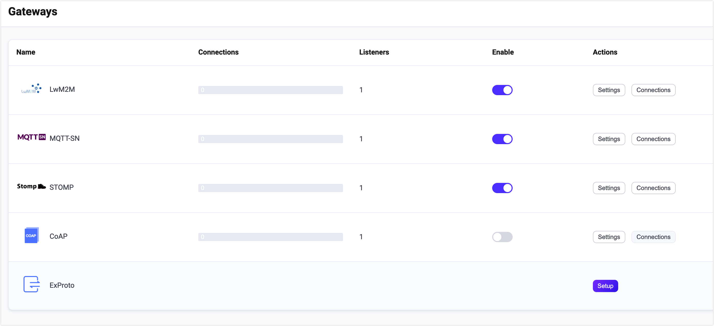

# STOMPゲートウェイ

EMQX STOMPゲートウェイは、[STOMP](https://stomp.github.io/stomp-specification-1.2.html)とMQTTプロトコル間の橋渡しを行うメッセージングプロトコルトランスレーターであり、これらのプロトコルを使用するクライアント同士の通信を可能にします。

このSTOMPゲートウェイは、クライアントとサーバーに対して軽量かつシンプルなメッセージングソリューションを提供し、さまざまなメッセージング環境でのメッセージ交換を実現します。TCPおよびSSLタイプのリスナーをサポートしており、柔軟で多用途なメッセージングシステム構築ツールです。

::: tip

STOMPゲートウェイは[Stomp v1.2](https://stomp.github.io/stomp-specification-1.2.html)をベースにしており、STOMP v1.0およびv1.1仕様と互換性があります。

:::

## STOMPゲートウェイの有効化

EMQX 5では、STOMPゲートウェイはダッシュボード、REST API、および設定ファイル`base.hocon`を通じて設定および有効化が可能です。本節では、ダッシュボードによる設定例を用いて操作手順を説明します。

EMQXダッシュボードの左ナビゲーションメニューで **Management** -> **Gateways** をクリックします。**Gateways** ページにはサポートされているすべてのゲートウェイが一覧表示されます。**STOMP** を見つけて、**Actions** 列の **Setup** をクリックすると、**Initialize STOMP** ページに遷移します。

::: tip

EMQXをクラスターで運用している場合、ダッシュボードやREST APIで行った設定はクラスター全体に影響します。特定のノードのみ設定を変更したい場合は、[`base.hocon`](../configuration/configuration.md)で設定してください。

:::

設定を簡素化するために、EMQXは**Gateways**ページ上のすべての必須フィールドにデフォルト値を提供しています。大幅なカスタマイズが不要な場合は、わずか3クリックでSTOMPゲートウェイを有効化できます。

1. **Basic Configuration** タブで **Next** をクリックし、すべてのデフォルト設定を受け入れます。  
2. 次に **Listeners** タブに遷移し、EMQXはポート`61613`でUDPリスナーを事前設定しています。ここでも **Next** をクリックして設定を確認します。  
3. 最後に **Enable** ボタンをクリックしてSTOMPゲートウェイを有効化します。

ゲートウェイの有効化が完了すると、**Gateways** ページに戻り、STOMPゲートウェイのステータスが **Enabled** と表示されていることを確認できます。



EMQX 5.0では、ダッシュボードを通じてStompゲートウェイの設定と有効化が可能です。

上記の設定はREST APIでも行えます。

**例:**

```bash
curl -X 'PUT' 'http://127.0.0.1:18083/api/v5/gateways/stomp' \
  -u <your-application-key>:<your-security-key> \
  -H 'Content-Type: application/json' \
  -d '{
  "name": "stomp",
  "enable": true,
  "mountpoint": "stomp/",
  "listeners": [
    {
      "type": "tcp",
      "name": "default",
      "bind": "61613",
      "max_conn_rate": 1000,
      "max_connections": 1024000
    }
  ]
}'
```

## STOMPクライアントとの連携

### クライアントライブラリ

STOMPゲートウェイを構築した後は、STOMPクライアントツールを使って接続テストを行い、正常に動作しているか確認できます。例えば、[stomp.py](https://github.com/jasonrbriggs/stomp.py)などがあります。

### パブリッシュ／サブスクライブ

STOMPプロトコルはPUB/SUBメッセージングモデルと完全に互換性があり、STOMPゲートウェイは以下を使用します。

- STOMPプロトコルの`SEND`メッセージをメッセージパブリッシュに使用します。`SEND`メッセージの`destination`フィールドがトピックを指定し、メッセージ内容は`SEND`メッセージのボディに含まれます。QoSは固定で0です。  
- STOMPプロトコルの`SUBSCRIBE`メッセージをサブスクライブ要求に使用します。`SUBSCRIBE`メッセージの`destination`フィールドがトピックを指定します。QoSは固定で0であり、MQTTプロトコルで定義されているワイルドカードをサポートします。  
- STOMPプロトコルの`UNSUBSCRIBE`メッセージをサブスクライブ解除要求に使用します。`UNSUBSCRIBE`メッセージの`destination`フィールドがトピックを指定します。

## STOMPゲートウェイのカスタマイズ

デフォルト設定に加え、EMQXはさまざまな設定オプションを提供しており、特定のビジネス要件により適した構成が可能です。本節では、**Gateways**ページで利用可能な各種フィールドについて詳しく解説します。

### 基本設定

**Basic Configuration** タブでは、許容される最大ヘッダー数、ヘッダー長の最大値、統計情報の有効化、ゲートウェイのMountPoint文字列の設定が可能です。以下の説明を参照してください。

<!--後日スクリーンショット追加予定-->

1. **Max Header**: 許容されるSTOMPヘッダーの最大数を設定します。デフォルトは`10`です。  
2. **Max Each Header Length**: ヘッダー値の最大文字列長を設定します。デフォルトは`1024`です。  
3. **Max Body Length**: STOMPパケットの最大バイト数を設定します。デフォルトは`65536`です。  
4. **Idle Timeout**: 非アクティブ状態が続いた場合に接続を切断するまでの最大待機時間（秒）を設定します。  
5. **Enable Statistics**: ゲートウェイによる統計収集と報告を許可するか設定します。デフォルトは`true`、選択肢は`true`または`false`です。  
6. **MountPoint**: パブリッシュおよびサブスクライブ時にすべてのトピックの前に付加される文字列を設定します。これにより異なるプロトコル間でのメッセージルーティングの分離を実現できます。例：`stomp/`。

   **注意**: このトピックプレフィックスはゲートウェイ側で管理されるため、クライアントはパブリッシュやサブスクライブ時に明示的にこのプレフィックスを付加する必要はありません。

### リスナーの追加

`61613`ポートで**default**という名前のtcpリスナーがすでに設定されており、最大16のアセプターをプールで管理し、最大1,024,000の同時接続をサポートしています。**Settings**をクリックすると詳細設定が可能で、**Delete**でリスナーを削除、**+ Add Listener**で新規リスナーを追加できます。

::: tip

STOMPゲートウェイはTCPおよびSSLタイプのリスナーのみをサポートしています。

:::

**Add Listener**をクリックすると**Add Listener**ページが開き、以下の設定が可能です。

**基本設定**

- **Name**: リスナーの一意識別子を設定します。  
- **Type**: プロトコルタイプを選択します。STOMPの場合は**tcp**または**ssl**を選択可能です。  
- **Bind**: リスナーが接続を受け付けるポート番号を設定します。  
- **MountPoint**（任意）: パブリッシュおよびサブスクライブ時にすべてのトピックの前に付加される文字列を設定し、異なるプロトコル間のメッセージルーティングの分離を実現します。

**リスナー設定**

- **Acceptor**: アセプタープールのサイズを設定します。デフォルトは**16**です。  
- **Max Connections**: リスナーが処理可能な最大同時接続数を設定します。デフォルトは**1024000**です。  
- **Max Connection Rate**: リスナーが1秒あたりに受け入れ可能な新規接続の最大レートを設定します。デフォルトは**1000**です。  
- **Proxy Protocol**: EMQXが[ロードバランサー](../deploy/cluster/lb.md)の背後に配置されている場合に、プロトコルV1/V2を有効化します。  
- **Proxy Protocol Timeout**: プロキシプロトコルパッケージ受信を待つ最大時間（秒）を設定し、タイムアウト時に接続を切断します。デフォルトは**3秒**です。

**TCP設定**

- **ActiveN**: ソケットの`{active, N}`オプションを設定します。これはソケットが能動的に処理可能な受信パケット数を意味します。詳細は[Erlang Documentation - setopts/2](https://www.erlang.org/doc/apps/kernel/inet.html#setopts/2)を参照してください。  
- **Buffer**: 受信および送信パケットを格納するバッファサイズをKB単位で設定します。  
- **TCP_NODELAY**: 接続に対して`TCP_NODELAY`フラグを有効にするか設定します。これはクライアントが前のデータのアックを待たずに追加データを送信できるかどうかを制御します。デフォルトは**false**、選択肢は**true**または**false**です。  
- **SO_REUSEADDR**: ポート番号のローカル再利用を許可するか設定します。  
- **Send Timeout**: 送信タイムアウト時に接続を切断するかどうかを設定します。デフォルトは**15秒**です。

**SSL設定**（SSLリスナーのみ）

TLS検証を有効化するかどうかのトグルスイッチを設定できます。ただし、その前に**TLS Cert**、**TLS Key**、**CA Cert**の情報をファイル内容の入力または**Select File**ボタンによるアップロードで設定する必要があります。詳細は[Enable SSL/TLS Connections](../network/emqx-mqtt-tls.md)を参照してください。

続いて以下の設定が可能です。

- **SSL Versions**: サポートするSSLバージョンを設定します。デフォルトは**tlsv1.3**、**tlsv1.2**、**tlsv1.1**、**tlsv1**です。  
- **Fail If No Peer Cert**: クライアントが空の証明書を送信した場合にEMQXが接続を拒否するか設定します。デフォルトは**false**、選択肢は**true**または**false**です。  
- **Intermediate Certificate Depth**: ピア証明書に続く有効な認証パスに含まれる自己発行でない中間証明書の最大数を設定します。デフォルトは**10**です。  
- **Key Password**: プライベートキーがパスワード保護されている場合に使用するパスワードを設定します。

## 認証の設定

STOMPプロトコルの接続メッセージにはすでにユーザー名とパスワードの概念があるため、STOMPは以下のような多様な認証方式をサポートしています。

- [組み込みデータベース認証](../access-control/authn/mnesia.md)  
- [MySQL認証](../access-control/authn/mysql.md)  
- [MongoDB認証](../access-control/authn/mongodb.md)  
- [PostgreSQL認証](../access-control/authn/postgresql.md)  
- [Redis認証](../access-control/authn/redis.md)  
- [HTTPサーバー認証](../access-control/authn/http.md)  
- [JWT認証](../access-control/authn/jwt.md)  
- [LDAP認証](../access-control/authn/ldap.md)  

STOMPゲートウェイは、STOMPプロトコルの`CONNECT`または`STOMP`メッセージ内の情報を用いてクライアントの認証フィールドを生成します。

- クライアントID：ランダムに生成される文字列  
- ユーザー名：`CONNECT`または`STOMP`メッセージヘッダーの`login`フィールドの値  
- パスワード：`CONNECT`または`STOMP`メッセージヘッダーの`passcode`フィールドの値

REST APIを使用して、Stompゲートウェイ用の組み込みデータベース認証を作成することも可能です。

**例:**

```bash
curl -X 'POST' \
  'http://127.0.0.1:18083/api/v5/gateway/stomp/authentication' \
  -u <your-application-key>:<your-security-key> \
  -H 'accept: application/json' \
  -H 'Content-Type: application/json' \
  -d '{
  "backend": "built_in_database",
  "mechanism": "password_based",
  "password_hash_algorithm": {
    "name": "sha256",
    "salt_position": "suffix"
  },
  "user_id_type": "username"
}'
```

::: tip

MQTTプロトコルとは異なり、**ゲートウェイは認証器の作成のみをサポートし、認証器のリスト（または認証チェーン）はサポートしていません**。

認証器が有効化されていない場合、すべてのSTOMPクライアントはログインが許可されます。

:::
