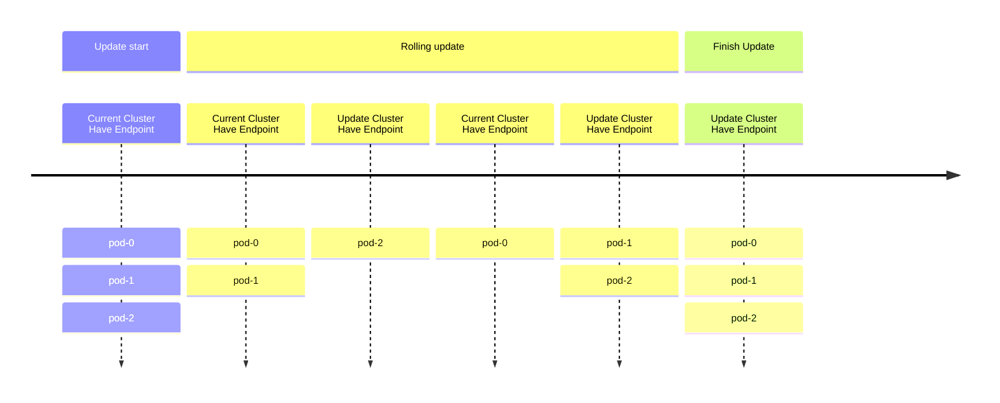
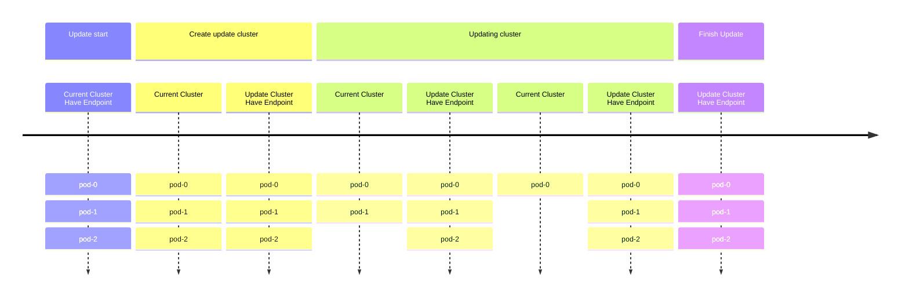

# EMQXクラスターのブルーグリーンアップグレードの実施

## 目的

ブルーグリーンデプロイメントによるEMQXクラスターのグレースフルアップグレードを実施します。

## 背景

従来のEMQXクラスターのデプロイメントでは、StatefulSetのデフォルトのローリングアップグレード戦略を用いてEMQX Podを更新することが一般的です。しかし、この方法には以下の2つの問題があります。

* ローリングアップデート中は、新旧両方のPodが対応するServiceにより選択されるため、終了処理中の古いPodにMQTTクライアントが接続され、頻繁な切断と再接続が発生する可能性があります。
* ローリングアップデートの過程では、新しいPodが起動して準備完了になるまでに時間がかかるため、常に_N - 1_個のPodしかサービスを提供できず、サービスの可用性が低下する恐れがあります。



## 解決策

EMQX Operatorはデフォルトでブルーグリーンデプロイメントを実行します。EMQX CRを通じてEMQXクラスターを更新すると、EMQX Operatorがアップグレードを開始します。

アップグレードの全体的な流れは以下のステップに大別されます。

1. 更新された仕様で新しいEMQXノード群を作成する。
2. 新しいノード群が準備完了したら、Serviceリソースを新しいノード群に切り替え、古いノード群への新規接続を遮断する。
3. 既存のMQTT接続を制御された速度で古いノード群から新しいノード群へ安全に移行し、再接続の嵐を防ぐ。
4. 古いEMQXノード群を段階的にスケールダウンする。
5. アップグレードを完了する。



## 手順

### アップデート戦略の設定

1. `apps.emqx.io/v2beta1`のEMQX CRを作成し、アップデート戦略を設定します。

  ```yaml
  apiVersion: apps.emqx.io/v2beta1
  kind: EMQX
  metadata:
    name: emqx-ee
  spec:
    image: emqx/emqx:@EE_VERSION@
    config:
      data: |
        license {
          key = "..."
        }
    updateStrategy:
      evacuationStrategy:
        # MQTTクライアントの退避速度（接続数/秒）：
        connEvictRate: 1000
        # MQTTセッションの退避速度（セッション数/秒）：
        sessEvictRate: 1000
        # Pod削除前の待機時間（秒）：
        waitTakeover: 10
      # 全ノード準備完了後、アップグレード開始までの待機時間（秒）：
      initialDelaySeconds: 10
      type: Recreate
  ```

2. 上記内容を`emqx-update.yaml`として保存し、`kubectl apply`でデプロイします。

  ```bash
  $ kubectl apply -f emqx-update.yaml
  emqx.apps.emqx.io/emqx-ee created
  ```

3. EMQXクラスターの状態を確認します。

  `STATUS`が`Ready`であることを確認してください。準備完了までに時間がかかる場合があります。

  ```bash
  $ kubectl get emqx
  NAME      STATUS   AGE
  emqx-ee   Ready    8m33s
  ```

### EMQXクラスターへの接続

[MQTTX](https://mqttx.app/cli)は、MQTT 5.0に対応したオープンソースのコマンドラインクライアントツールで、自動再接続機能を備えており、MQTTサービスやアプリケーションの開発・デバッグに役立ちます。

MQTTXを使用してEMQXクラスターに接続します。

```bash
mqttx bench conn -h ${IP} -p ${PORT} -c 3000
[10:05:21 AM] › ℹ  Start the connect benchmarking, connections: 3000, req interval: 10ms
✔  success   [3000/3000] - Connected
[10:06:13 AM] › ℹ  Done, total time: 31.113s
```

### アップグレードのトリガー

1. Podテンプレートに変更を加えると、EMQX Operatorのアップグレード戦略がトリガーされます。

  ここでは例として、Podの`ImagePullPolicy`を変更してアップグレードをトリガーします。

  ```bash
  $ kubectl patch emqx emqx-ee --type=merge -p '{"spec": {"imagePullPolicy": "Never"}}'
  emqx.apps.emqx.io/emqx-ee patched
  ```

2. アップグレードの進行状況を確認します。

  ```bash
  $ kubectl get emqx emqx-ee -o json | jq ".status.nodeEvacuationsStatus"
  [
    {
      "connection_eviction_rate": 200,
      "node": "emqx-ee@emqx-ee-54fc496fb4-2.emqx-ee-headless.default.svc.cluster.local",
      "session_eviction_rate": 200,
      "session_goal": 0,
      "connection_goal": 22,
      "session_recipients": [
        "emqx-ee@emqx-ee-5d87d4c6bd-2.emqx-ee-headless.default.svc.cluster.local",
        "emqx-ee@emqx-ee-5d87d4c6bd-1.emqx-ee-headless.default.svc.cluster.local",
        "emqx-ee@emqx-ee-5d87d4c6bd-0.emqx-ee-headless.default.svc.cluster.local"
      ],
      "state": "waiting_takeover",
      "stats": {
        "current_connected": 0,
        "current_sessions": 0,
        "initial_connected": 33,
        "initial_sessions": 0
      }
    }
  ]
  ```

  | フィールド名               | 説明                                                                 |
  |---------------------------|----------------------------------------------------------------------|
  | `node`                    | 現在退避中のノード。                                                  |
  | `state`                   | ノードの退避フェーズ。                                                |
  | `session_recipients`      | MQTTセッションの受け手ノード。                                       |
  | `session_eviction_rate`   | このノードのMQTTセッション退避速度（セッション数/秒）。              |
  | `connection_eviction_rate`| このノードのMQTT接続退避速度（接続数/秒）。                          |
  | `initial_sessions`        | このノードの初期セッション数。                                       |
  | `initial_connected`       | このノードの初期接続数。                                             |
  | `current_sessions`        | このノードの現在のセッション数。                                     |
  | `current_connected`       | このノードの現在の接続数。                                           |

3. アップグレード完了まで待機します。

  ```bash
  $ kubectl get emqx
  NAME      STATUS   AGE
  emqx-ee   Ready    8m33s
  ```

  `STATUS`が`Ready`であることを確認してください。MQTTクライアント数やセッション数によっては、アップグレードに時間がかかる場合があります。

  アップグレード完了後、`kubectl get pods`で古いEMQXノードが削除されていることを確認できます。

## Grafanaによる監視

以下の監視グラフは、アップグレード中の接続数を示したもので、例として10,000接続を使用しています。


| ラベル／プレフィックス      | 説明                                                  |
|----------------------------|-------------------------------------------------------|
| Total                      | 接続の総数。グラフの最上位の線として表示されます。   |
| `emqx-ee-86f864f975`       | 古いEMQXノード3台の名前プレフィックス。              |
| `emqx-ee-648c45c747`       | アップグレードされたEMQXノード3台の名前プレフィックス。|

このタイムラインは、EMQX Operatorがどのようにスムーズなブルーグリーンアップグレードを実行するかを示しています。アップグレード中も総接続数は安定しており（移行速度、サーバー能力、クライアントの再接続戦略などの要因に依存）、サービスの中断を最小限に抑え、サーバーの過負荷を防ぎ、全体のサービス安定性を向上させています。
