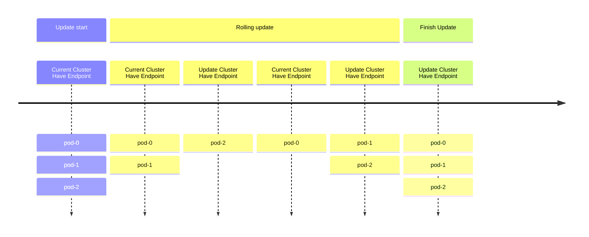
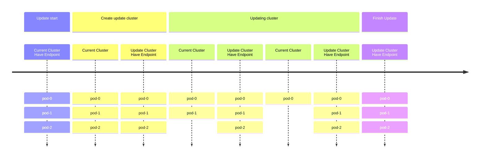

# EMQXクラスターのブルーグリーンアップグレードの実施

## 目的

ブルーグリーンデプロイメントを通じて、EMQXクラスターのグレースフルアップグレードを実施します。

## 背景

従来のEMQXクラスターのデプロイでは、StatefulSetのデフォルトのローリングアップグレード戦略を用いてEMQX Podを更新することが一般的です。しかし、この方法には以下の2つの問題があります。

* ローリングアップデート中は、新旧両方のPodが対応するServiceに選択されるため、終了処理中の古いPodにMQTTクライアントが接続し、頻繁な切断と再接続が発生する可能性があります。
* ローリングアップデートの過程では、新しいPodが起動して準備完了になるまでに時間がかかるため、任意の時点でサービスを提供できるPodは_N - 1_に限られ、サービスの可用性が低下する恐れがあります。



## 解決策

EMQX Operatorはデフォルトでブルーグリーンデプロイメントを実施します。対応するEMQX CRを通じてEMQXクラスターを更新すると、EMQX Operatorがアップグレードを開始します。

アップグレード全体の流れは大まかに以下のステップに分かれます。

1. 更新された仕様の新しいEMQXノード群を作成します。
2. 新しいノード群が準備完了したら、Serviceリソースの向きを新しいノード群に切り替え、新規接続が古いノード群にルーティングされないようにします。
3. 既存のMQTT接続を制御された速度で安全に古いノード群から新しいノード群へ移行し、再接続の嵐を防ぎます。
4. 古いEMQXノード群を段階的にスケールダウンします。
5. アップグレードを完了します。



## 手順

### アップデート戦略の設定

1. `apps.emqx.io/v2` のEMQX CRを作成し、アップデート戦略を設定します。

  ```yaml
  apiVersion: apps.emqx.io/v2
  kind: EMQX
  metadata:
    name: emqx
  spec:
    image: emqx/emqx:@EE_VERSION@
    config:
      data: |
        license {
          key = "..."
        }
    updateStrategy:
      evacuationStrategy:
        # MQTTクライアントの退避速度（接続数／秒）：
        connEvictRate: 1000
        # MQTTセッションの退避速度（セッション数／秒）：
        sessEvictRate: 1000
        # Pod削除前の待機時間（秒）：
        waitTakeover: 10
      # すべてのノードが準備完了後、アップグレード開始までの待機時間（秒）：
      initialDelaySeconds: 10
      type: Recreate
  ```

2. 上記内容を `emqx-update.yaml` として保存し、`kubectl apply` でデプロイします。

  ```bash
  $ kubectl apply -f emqx-update.yaml
  emqx.apps.emqx.io/emqx created
  ```

3. EMQXクラスターの状態を確認します。

  `STATUS` が `Ready` であることを確認してください。準備完了までに時間がかかる場合があります。

  ```bash
  $ kubectl get emqx
  NAME      STATUS   AGE
  emqx      Ready    8m33s
  ```

### EMQXクラスターへの接続

[MQTTX](https://mqttx.app/cli) は自動再接続をサポートするMQTT 5.0対応のオープンソースコマンドラインクライアントツールで、MQTTサービスやアプリケーションの開発・デバッグに役立ちます。

MQTTXを用いてEMQXクラスターに接続します。

```bash
mqttx bench conn -h ${IP} -p ${PORT} -c 3000
[10:05:21 AM] › ℹ  Start the connect benchmarking, connections: 3000, req interval: 10ms
✔  success   [3000/3000] - Connected
[10:06:13 AM] › ℹ  Done, total time: 31.113s
```

### アップグレードのトリガー

1. Podテンプレートに対する変更があれば、EMQX Operatorのアップグレード戦略がトリガーされます。

  ここでは例として、Podの `ImagePullPolicy` を変更してアップグレードをトリガーします。

  ```bash
  $ kubectl patch emqx emqx --type=merge -p '{"spec": {"imagePullPolicy": "Never"}}'
  emqx.apps.emqx.io/emqx patched
  ```

2. アップグレードの進捗状況を確認します。

  ```bash
  $ kubectl get emqx emqx -o json | jq ".status.nodeEvacuationsStatus"
  [
    {
      "nodeName": "emqx@emqx-54fc496fb4-2.emqx-headless.default.svc.cluster.local",
      "initialConnections": 33,
      "initialSessions": 0,
      "connectionEvictionRate": 200,
      "sessionEvictionRate": 200,
      "state": "waiting_takeover",
      "sessionRecipients": [
        "emqx@emqx-5d87d4c6bd-2.emqx-headless.default.svc.cluster.local",
        "emqx@emqx-5d87d4c6bd-1.emqx-headless.default.svc.cluster.local",
        "emqx@emqx-5d87d4c6bd-0.emqx-headless.default.svc.cluster.local"
      ]
    }
  ]
  ```

  | フィールド名               | 説明                                                         |
  |---------------------------|--------------------------------------------------------------|
  | `nodeName`                | 現在退避中のノード名。                                        |
  | `state`                   | ノード退避のフェーズ。                                        |
  | `sessionRecipients`       | MQTTセッションの受け入れ先ノード。                            |
  | `sessionEvictionRate`     | 当該ノードのMQTTセッション退避速度（セッション数／秒）。      |
  | `connectionEvictionRate`  | 当該ノードのMQTT接続退避速度（接続数／秒）。                  |
  | `initialSessions`         | 当該ノードの初期セッション数。                                |
  | `initialConnections`      | 当該ノードの初期接続数。                                      |

  ノード退避の進捗は、各[EMQXノードのステータス](../reference/v2-reference.md#emqxnode)にある `connections` と `sessions` のカウンターを参照して推測できます。

3. アップグレード完了まで待機します。

  ```bash
  $ kubectl get emqx
  NAME      STATUS   AGE
  emqx      Ready    8m33s
  ```

  `STATUS` が `Ready` であることを確認してください。MQTTクライアント数やセッション数によっては、アップグレードに時間がかかる場合があります。

  アップグレード完了後、`kubectl get pods` で古いEMQXノードが削除されていることを確認できます。

## Grafanaによるモニタリング

以下のモニタリンググラフは、アップグレード中の接続数を10,000接続の例で示しています。


| ラベル／プレフィックス       | 説明                                                    |
|-----------------------------|---------------------------------------------------------|
| Total                       | 接続数の合計。グラフの最上位のラインとして表示されます。 |
| `emqx-86f864f975`           | 古いEMQXノード3台の名前プレフィックス。                  |
| `emqx-648c45c747`           | アップグレード済みのEMQXノード3台の名前プレフィックス。  |

このタイムラインは、EMQX Operatorがスムーズなブルーグリーンアップグレードを実施する様子を示しています。全体を通じて接続数は安定しており（移行速度、サーバー能力、クライアントの再接続戦略などの要因に依存します）、サービスの中断を最小限に抑え、サーバーの過負荷を防ぎ、サービス全体の安定性を向上させています。
