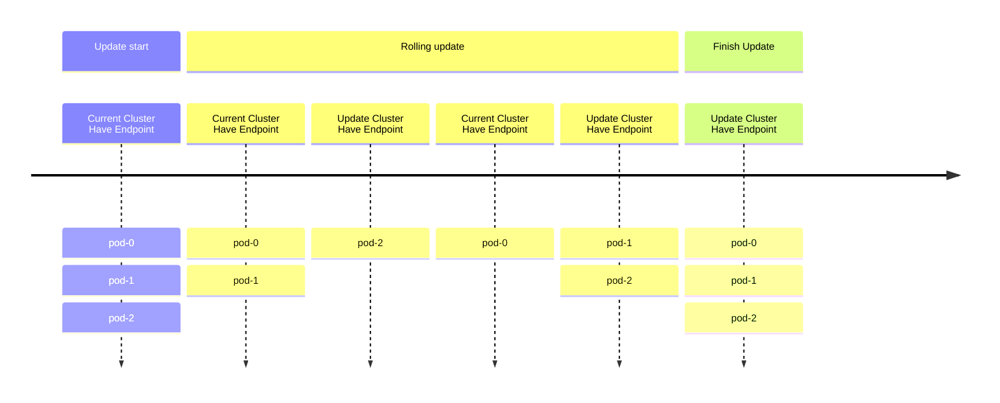
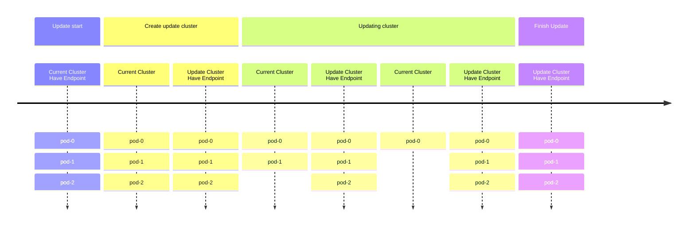

# EMQXクラスターをブルーグリーンデプロイメントで優雅にアップグレードする方法

このページでは、ブルーグリーンデプロイメントを通じてEMQXクラスターを優雅にアップグレードする方法を説明します。

:::tip

この機能は `apps.emqx.io/v1beta4 EmqxEnterprise` および `apps.emqx.io/v2beta1 EMQX` のみをサポートしています。

:::

## 背景

1. 従来のEMQXクラスターのデプロイメントでは、StatefulSetのデフォルトのローリングアップグレード戦略が通常EMQX Podの更新に使用されます。しかし、この方法には以下の2つの問題があります。

   1. ローリングアップデート中、新旧のPodが対応するServiceによって選択されるため、MQTTクライアントが誤ったPodに接続し、頻繁な切断と再接続が発生する可能性があります。

   2. ローリングアップデートの過程では、新しいPodが起動して準備完了になるまで時間がかかるため、N - 1のPodのみがサービスを提供でき、サービスの可用性が低下する恐れがあります。



## 解決策

前述のローリングアップデートの問題に対して、EMQX Operatorはブルーグリーンデプロイメントによるアップグレードソリューションを提供します。EMQXカスタムリソースを用いてEMQXクラスターをアップグレードする際、EMQX Operatorは新しいEMQXクラスターを作成し、新クラスターが準備完了となった後にKubernetes Serviceを新クラスターにリダイレクトします。その後、旧EMQXクラスターのPodを段階的に削除して、EMQXクラスターの更新を実現します。

旧EMQXクラスターのPodを削除する際、EMQX OperatorはEMQXのノード避難機能を活用し、MQTT接続を希望のレートで新クラスターに移行させることが可能です。これにより、一時的に大量の接続が集中する問題を回避できます。

アップグレード全体の流れは以下のように大まかに分けられます。

1. 同一仕様のクラスターを作成する。

2. 新クラスターが準備完了後、Serviceを新クラスターにリダイレクトし、旧クラスターをServiceから外す。この時点で新クラスターがトラフィックを受け始め、旧クラスターの既存接続は影響を受けません。

3. （EMQX Enterprise Editionのみ対応）EMQXノード避難機能を用いて、各ノードの接続を順次避難させる。

4. 旧クラスターを段階的にスケールダウンし、ノード数を0にする。

5. アップグレード完了。



## アップデート戦略の設定

:::: tabs type:card
::: tab apps.emqx.io/v2beta1

`apps.emqx.io/v2beta1` EMQXを作成し、アップデート戦略を設定します。

```yaml
apiVersion: apps.emqx.io/v2beta1
kind: EMQX
metadata:
  name: emqx-ee
spec:
  image: emqx/emqx-enterprise:5.10
  config:
    data: |
      license {
        key = "..."
      }
  updateStrategy:
    evacuationStrategy:
      connEvictRate: 1000
      sessEvictRate: 1000
      waitTakeover: 10
    initialDelaySeconds: 10
    type: Recreate
```

`initialDelaySeconds`：すべてのノードが準備完了してからアップデート開始までの待機時間（単位：秒）。

`waitTakeover`：Pod削除時のインターバル時間（単位：秒）。

`connEvictRate`：MQTTクライアントの避難レート。EMQX Enterprise Editionのみサポート（単位：件/秒）。

`sessEvictRate`：MQTTセッションの避難レート。EMQX Enterprise Editionのみサポート（単位：件/秒）。

上記内容を `emqx-update.yaml` として保存し、以下のコマンドでEMQXをデプロイします。

```bash
$ kubectl apply -f emqx-update.yaml

emqx.apps.emqx.io/emqx-ee created
```

EMQXクラスターの状態を確認し、`STATUS` が `Ready` であることを確認してください。EMQXクラスターが準備完了になるまでに時間がかかる場合があります。

```bash
$ kubectl get emqx

NAME      STATUS   AGE
emqx-ee   Ready    8m33s
```

:::
::: tab apps.emqx.io/v1beta4

`apps.emqx.io/v1beta4 EmqxEnterprise` を作成し、アップデート戦略を設定します。

```yaml
apiVersion: apps.emqx.io/v1beta4
kind: EmqxEnterprise
metadata:
  name: emqx-ee
spec:
  blueGreenUpdate:
    initialDelaySeconds: 60
    evacuationStrategy:
      waitTakeover: 5
      connEvictRate: 200
      sessEvictRate: 200
  template:
    spec:
      emqxContainer:
        image:
          repository: emqx/emqx-ee
          version: 4.4.30
```

`initialDelaySeconds`：すべてのノードが準備完了してからノード避難を開始するまでの待機時間（単位：秒）。

`waitTakeover`：すべての接続が切断された後、クライアントが再接続してセッションを引き継ぐまでの待機時間（単位：秒）。

`connEvictRate`：MQTTクライアントの避難レート（単位：件/秒）。

`sessEvictRate`：MQTTセッションの避難レート（単位：件/秒）。

上記内容を `emqx-update.yaml` として保存し、以下のコマンドでEMQX Enterprise Editionクラスターをデプロイします。

```bash
$ kubectl apply -f emqx-update.yaml

emqxenterprise.apps.emqx.io/emqx-ee created
```

EMQXクラスターの状態を確認し、`STATUS` が `Running` であることを確認してください。EMQXクラスターが準備完了になるまでに時間がかかる場合があります。

```bash
$ kubectl get emqxenterprises

NAME      STATUS   AGE
emqx-ee   Running  8m33s
```

:::
::::

## MQTTX CLIでEMQXクラスターに接続する

MQTT X CLIは、自動再接続をサポートするオープンソースのMQTT 5.0 CLIクライアントです。純粋なコマンドラインモードのMQTT Xであり、グラフィカルインターフェースを使わずにMQTTサービスやアプリケーションの開発・デバッグを迅速に行うことを目的としています。MQTT X CLIのドキュメントは以下を参照してください：[MQTTX CLI](https://mqttx.app/cli)。

以下のコマンドを実行してEMQXクラスターに接続します。

```bash
mqttx bench conn -h ${IP} -p ${PORT} -c 3000
```

出力例：

```bash
[10:05:21 AM] › ℹ  Start the connect benchmarking, connections: 3000, req interval: 10ms
✔  success   [3000/3000] - Connected
[10:06:13 AM] › ℹ  Done, total time: 31.113s
```

## EMQXクラスターのアップグレード

- Podテンプレートに対する変更はすべてEMQX Operatorのアップグレード戦略をトリガーします。

  > 本記事では、ContainerのImagePullPolicyを変更することでアップグレードをトリガーしています。ユーザーは実際のニーズに応じて変更してください。

  ```bash
  $ kubectl patch emqx emqx-ee --type=merge -p '{"spec": {"imagePullPolicy": "Never"}}'

  emqx.apps.emqx.io/emqx-ee patched
  ```

- ステータスを確認します。

  ```bash
  $ kubectl get emqx emqx-ee -o json | jq ".status.nodeEvacuationsStatus"

  [
    {
      "connection_eviction_rate": 200,
      "node": "emqx-ee@emqx-ee-54fc496fb4-2.emqx-ee-headless.default.svc.cluster.local",
      "session_eviction_rate": 200,
      "session_goal": 0,
      "connection_goal": 22,
      "session_recipients": [
        "emqx-ee@emqx-ee-5d87d4c6bd-2.emqx-ee-headless.default.svc.cluster.local",
        "emqx-ee@emqx-ee-5d87d4c6bd-1.emqx-ee-headless.default.svc.cluster.local",
        "emqx-ee@emqx-ee-5d87d4c6bd-0.emqx-ee-headless.default.svc.cluster.local"
      ],
      "state": "waiting_takeover",
      "stats": {
        "current_connected": 0,
        "current_sessions": 0,
        "initial_connected": 33,
        "initial_sessions": 0
      }
    }
  ]
  ```

  `connection_eviction_rate`：ノードの避難レート（単位：件/秒）。

  `node`：現在避難中のノード。

  `session_eviction_rate`：ノードのセッション避難レート（単位：件/秒）。

  `session_recipients`：セッション避難の受け取り先リスト。

  `state`：ノード避難のフェーズ。

  `stats`：避難中ノードの統計指標。現在の接続数（current_connected）、現在のセッション数（current_sessions）、開始時の接続数（initial_connected）、開始時のセッション数（initial_sessions）を含みます。

- アップグレード完了まで待機します。

  ```bash
  $ kubectl get emqx

  NAME      STATUS   AGE
  emqx-ee   Ready    8m33s
  ```

  `STATUS` が `Running` であることを必ず確認してください。EMQXクラスターのアップグレード完了までに時間がかかる場合があります。

  アップグレード完了後、コマンド `$ kubectl get pods` を使用して旧EMQXノードが削除されていることを確認できます。

## Grafanaによるモニタリング

アップグレード中の接続数のモニタリンググラフ（10,000接続を例としています）は以下の通りです。


Total：接続数の合計で、グラフの最上部の線で表されています。

emqx-ee-86f864f975：アップグレード前の3つのEMQXノードを示すプレフィックス。

emqx-ee-648c45c747：アップグレード後の3つのEMQXノードを示すプレフィックス。

上図のように、EMQX Kubernetes Operatorのブルーグリーンデプロイメントを通じてKubernetes上で優雅なアップグレードを実現しています。このソリューションにより、アップグレード中の接続数の大きな変動は（移行レート、サーバーの受け入れ速度、クライアントの再接続ポリシーなどに依存しますが）ほとんど発生せず、アップグレードのスムーズさが大幅に向上します。これによりサーバーの過負荷を効果的に防止し、業務への影響を軽減し、サービスの安定性を向上させることが可能です。
