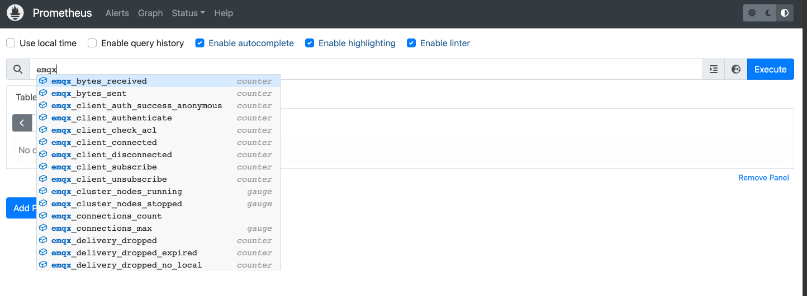

# Prometheus と Grafana による EMQX クラスターの監視

## タスク対象
[EMQX Exporter](https://github.com/emqx/emqx-exporter) をデプロイし、Prometheus と Grafana で EMQX クラスターを監視します。

## Prometheus と Grafana のデプロイ

Prometheus のデプロイ方法は [Prometheus](https://github.com/prometheus-operator/prometheus-operator) を参照してください。  
Grafana のデプロイ方法は [Grafana](https://grafana.com/docs/grafana/latest/setup-grafana/installation/kubernetes/) を参照してください。

## EMQX クラスターのデプロイ

以下は EMQX カスタムリソースの関連設定例です。デプロイしたい EMQX のバージョンに応じて対応する API バージョンを選択してください。詳細な対応関係は [EMQX Operator Compatibility](../operator.md) をご参照ください。

EMQX は HTTP インターフェースを通じて指標を公開することをサポートしています。クラスター全体の統計指標については、以下のドキュメントをご参照ください：[Prometheus との統合](../../../../../guides/observability/prometheus.md)

```yaml
apiVersion: apps.emqx.io/v2beta1
kind: EMQX
metadata:
  name: emqx
spec:
  image: emqx/emqx-enterprise:@EE_VERSION@
  config:
    data: |
      license {
        key = "..."
      }
```

上記内容を `emqx.yaml` として保存し、以下のコマンドを実行して EMQX クラスターをデプロイします。

```bash
$ kubectl apply -f emqx.yaml

emqx.apps.emqx.io/emqx created
```

EMQX クラスターのステータスを確認し、`STATUS` が `Running` になるまで待ちます。クラスターの準備には時間がかかる場合があります。

```bash
$ kubectl get emqx emqx
NAME   IMAGE                              STATUS    AGE
emqx   emqx/emqx-enterprise:@EE_VERSION@  Running   10m
```

## API シークレットの作成
emqx-exporter と Prometheus は EMQX ダッシュボードの API からメトリクスを取得するため、ダッシュボードにサインインして [API キー](../../../../../guides/dashboard/system.md#api-keys) を作成してください。

## [EMQX Exporter](https://github.com/emqx/emqx-exporter) のデプロイ

`emqx-exporter` は EMQX の Prometheus API に含まれていない一部のメトリクスを公開するために設計されています。

```yaml
apiVersion: v1
kind: Service
metadata:
  labels:
    app: emqx-exporter
  name: emqx-exporter-service
spec:
  ports:
    - name: metrics
      port: 8085
      targetPort: metrics
  selector:
    app: emqx-exporter
---
apiVersion: apps/v1
kind: Deployment
metadata:
  name: emqx-exporter
  labels:
    app: emqx-exporter
spec:
  selector:
    matchLabels:
      app: emqx-exporter
  replicas: 1
  template:
    metadata:
      labels:
        app: emqx-exporter
    spec:
      securityContext:
        runAsUser: 1000
      containers:
        - name: exporter
          image: emqx-exporter:latest
          imagePullPolicy: IfNotPresent
          args:
            # "emqx-dashboard-service-name" は operator によって 18083 ポートを公開するために作成されたサービス名です
            - --emqx.nodes=${emqx-dashboard-service-name}:18083
            - --emqx.auth-username=${paste_your_new_api_key_here}
            - --emqx.auth-password=${paste_your_new_secret_here}
          securityContext:
            allowPrivilegeEscalation: false
            runAsNonRoot: true
          ports:
            - containerPort: 8085
              name: metrics
              protocol: TCP
          resources:
            limits:
              cpu: 100m
              memory: 100Mi
            requests:
              cpu: 100m
              memory: 20Mi
```

> `--emqx.nodes` の引数には、operator によって 18083 ポートを公開するために作成されたサービス名を設定してください。サービス名は `kubectl get svc` コマンドで確認できます。

上記内容を `emqx-exporter.yaml` として保存し、`--emqx.auth-username` と `--emqx.auth-password` を作成した API シークレットに置き換えてから、以下のコマンドで emqx-exporter をデプロイします。

```bash
kubectl apply -f emqx-exporter.yaml
```

emqx-exporter Pod のステータスを確認します。

```bash
$ kubectl get po -l="app=emqx-exporter"

NAME      STATUS   AGE
emqx-exporter-856564c95-j4q5v   Running  8m33s
```

## Prometheus 監視の設定
Prometheus-operator は [PodMonitor](https://github.com/prometheus-operator/prometheus-operator/blob/main/Documentation/design.md#podmonitor) と [ServiceMonitor](https://github.com/prometheus-operator/prometheus-operator/blob/main/Documentation/design.md#servicemonitor) CRD を使って、Pod やサービスの監視方法を動的に定義します。

```yaml
apiVersion: monitoring.coreos.com/v1
kind: PodMonitor
metadata:
  name: emqx
  labels:
    app.kubernetes.io/name: emqx
spec:
  podMetricsEndpoints:
    - interval: 5s
      path: /api/v5/prometheus/stats
      # emqx ダッシュボードの containerPort 名
      port: dashboard
      relabelings:
        - action: replace
          # ユーザー定義のクラスター名、ユニークである必要があります
          replacement: emqx5
          targetLabel: cluster
        - action: replace
          # 固定値、変更しないでください
          replacement: emqx
          targetLabel: from
        - action: replace
          # 固定値、変更しないでください
          sourceLabels: ['pod']
          targetLabel: "instance"
  selector:
    matchLabels:
      # emqx Pod のラベルと同じもの
      apps.emqx.io/instance: emqx
      apps.emqx.io/managed-by: emqx-operator
  namespaceSelector:
    matchNames:
      # EMQX クラスターを別のネームスペースにデプロイしている場合は修正してください
      #- default
---
apiVersion: monitoring.coreos.com/v1
kind: ServiceMonitor
metadata:
  name: emqx-exporter
  labels:
    app: emqx-exporter
spec:
  selector:
    matchLabels:
      # emqx-exporter サービスのラベルと同じもの
      app: emqx-exporter
  endpoints:
    - port: metrics
      interval: 5s
      path: /metrics
      relabelings:
        - action: replace
          # ユーザー定義のクラスター名、ユニークである必要があります
          replacement: emqx5
          targetLabel: cluster
        - action: replace
          # 固定値、変更しないでください
          replacement: exporter
          targetLabel: from
        - action: replace
          # 固定値、変更しないでください
          sourceLabels: ['pod']
          regex: '(.*)-.*-.*'
          replacement: $1
          targetLabel: "instance"
        - action: labeldrop
          # 固定値、変更しないでください
          regex: 'pod'
  namespaceSelector:
    matchNames:
      # exporter を別のネームスペースにデプロイしている場合は修正してください
      #- default
```

<p>`path` は指標収集インターフェースのパスを示します。EMQX 5 では `/api/v5/prometheus/stats` です。`selector.matchLabels` はマッチする Pod のラベルを示し、`apps.emqx.io/instance: emqx` となっています。</p>  
<p>targetLabel の `cluster` は現在のクラスター名を表し、一意である必要があります。</p>

上記内容を `monitor.yaml` として保存し、以下のコマンドを実行します。

```bash
$ kubectl apply -f monitor.yaml
```

## Prometheus での EMQX 指標の確認

Prometheus のインターフェースを開き、Graph ページに切り替えて `emqx` と入力すると、以下の図のように表示されます。



**Status** -> **Targets** ページに切り替えると以下の画面が表示され、クラスター内のすべての監視対象 EMQX Pod 情報を確認できます。


## Grafana テンプレートのインポート
すべてのダッシュボード [テンプレート](https://github.com/emqx/emqx-exporter/tree/main/grafana-dashboard/template) をインポートしてください。  
メインダッシュボード **EMQX** を開いてお楽しみください！


