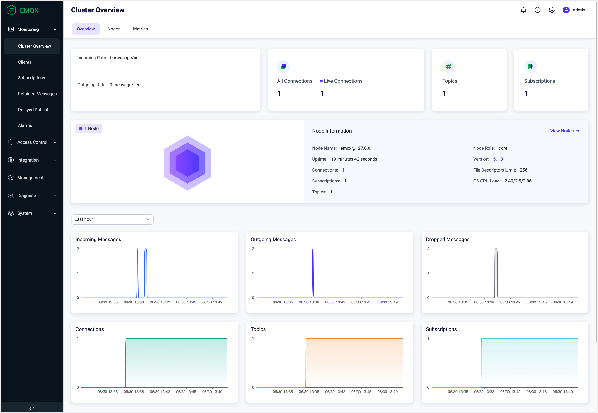

# EMQXを始める

EMQXは、世界で最もスケーラブルで信頼性の高いMQTTメッセージングプラットフォームであり、ビジネスデータをリアルタイムで確実に接続、移動、処理するのに役立ちます。このオールインワンのMQTTプラットフォームを使えば、重要なビジネスインパクトをもたらすIoTアプリケーションを簡単に構築できます。

本章では、EMQXのダウンロードとインストール方法、および組み込みのWebSocketツールを使った接続とメッセージングサービスのテスト方法をご案内します。

::: tip
このクイックスタートガイドで紹介しているデプロイ方法のほかに、完全マネージド型のMQTTサービスであるEMQX Cloudもぜひお試しください。インフラのメンテナンス不要で、[アカウント登録](https://accounts.emqx.com/signup?continue=https%3A%2F%2Fcloud-intl.emqx.com%2Fconsole%2Fdeployments%2Fnew)を行うだけで、すぐにMQTTサービスを開始し、IoTデバイスを任意のクラウドに接続できます。
:::

## EMQXのインストール

EMQXは、[Docker](./deploy/install-docker.md)での実行、[EMQX Kubernetes Operator](https://www.emqx.com/en/emqx-kubernetes-operator)によるインストール、またはダウンロードパッケージを使ってコンピュータや仮想マシン（VM）にインストールすることが可能です。ダウンロードパッケージでのインストールを選択した場合、現在以下のオペレーティングシステムがサポートされています。

- RedHat
- CentOS
- RockyLinux
- AmazonLinux
- Ubuntu
- Debian
- macOS
- Linux

上記にないプラットフォームについては、[EMQ](https://www.emqx.com/en/contact)までお問い合わせください。

### Dockerを使ったEMQXのインストール

コンテナによるデプロイは、EMQXを最速で試す方法です。このクイックスタートガイドでは、Dockerを使ったEMQXのインストールと起動方法を紹介します。

1. 最新版のEMQXをダウンロードして起動するには、以下のコマンドを実行してください。

   事前に[Docker](https://www.docker.com/)がインストールされ、起動していることを確認してください。

   ```bash
   docker run -d --name emqx -p 1883:1883 -p 8083:8083 -p 8084:8084 -p 8883:8883 -p 18083:18083 emqx/emqx-enterprise:latest
   ```

2. Webブラウザを起動し、アドレスバーに `http://localhost:18083/` （`localhost`はIPアドレスに置き換え可能）を入力して[EMQXダッシュボード](../guides/dashboard/introduction.md)にアクセスします。ここからクライアントへの接続や稼働状況の確認が可能です。

   デフォルトのユーザー名とパスワード：

   `admin`

   `public`

### インストールパッケージを使ったEMQXのインストール

コンピュータやVMにインストールパッケージを使ってEMQXをインストールし、設定調整やパフォーマンスチューニングを行うこともできます。以下の手順はmacOS 26（Tahoe）およびarm64アーキテクチャ（Apple Silicon）を例に説明します。

::: tip

すべてのランタイム依存関係を考慮すると、テストやホットアップグレードにはインストールパッケージの使用を推奨しますが、本番環境での使用は**推奨しません**。

:::

1. [公式ダウンロードサイトのmacOSタブ](https://www.emqx.com/en/downloads-and-install/enterprise?os=macOS)にアクセスします。

2. 最新バージョン `@EE_VERSION@` を選択し、**Package Type**から `macOS 26 arm64 / zip` を選びます。

3. リンクをクリックしてパッケージをダウンロードし、インストールします。ページ内のコマンド説明も参照可能です。

4. EMQXを起動するには、以下を実行します。

   ```bash
   ./emqx/bin/emqx foreground
   ```
   これは対話型シェルでEMQXを起動します。シェルを閉じるとEMQXも停止します。
   なお（推奨はしませんが）、以下のコマンドでバックグラウンド起動も可能です。

   ```bash
   ./emqx/bin/emqx start
   ```

5. Webブラウザを起動し、アドレスバーに `http://localhost:18083/` （`localhost`はIPアドレスに置き換え可能）を入力して[EMQXダッシュボード](../guides/dashboard/introduction.md)にアクセスします。ここからクライアントへの接続や稼働状況の確認が可能です。

   デフォルトのユーザー名とパスワードは `admin` と `public` です。ログイン後にパスワード変更を求められます。

6. EMQXを停止するには、以下を実行します。

   ```bash
   ./emqx/bin/emqx stop
   ```

テスト終了後にEMQXをアンインストールするには、EMQXフォルダを削除してください。

## MQTTXで接続を検証する

EMQXの起動に成功したら、MQTTXを使って接続とメッセージサービスのテストを続けられます。

[MQTTX](https://mqttx.app)は、macOS、Linux、Windowsで動作する洗練されたクロスプラットフォームのMQTT 5.0デスクトップクライアントです。チャットスタイルのユーザーインターフェースで簡単に接続を作成し、複数のクライアントを保存できます。MQTT/MQTTS接続のテストや、MQTTメッセージのサブスクライブおよびパブリッシュも可能です。

ここでは、アプリのダウンロードやインストール不要で使えるブラウザベースのMQTT 5.0 WebSocketクライアントツールである[MQTTX Web](https://mqttx.app/web)を使った接続検証方法を紹介します。

::: tip 前提条件
接続テストの前に、ブローカーのアドレスとポート情報を準備してください。

- **EMQXアドレス**：一般的にはサーバーのIPアドレス
- **ポート**：ダッシュボードの左ナビゲーションメニューから **Management** -> **Listeners** をクリックし、ポート番号を確認してください
:::

### 接続の作成

1. [MQTTX Web](https://mqttx.app/web-client#/recent_connections)にアクセスします。

2. MQTT接続の設定を行い、確立します。**+ New Connection** ボタンをクリックして設定画面に入ります。

   - **Name**：接続名を入力します（例：`MQTTX_Test`）。

   - **Host**

     - プロトコルタイプをドロップダウンリストから選択します。WebSocketプロトコルを使用する場合は `ws://` を選択してください。MQTTX WebはWebSocketプロトコルのみ対応しています。SSL/TLS接続をテストする場合は、[MQTTXデスクトップクライアント](https://mqttx.app/)をダウンロードしてください。
     - EMQXのアドレスを入力します（例：`emqx@127.0.0.1`）。

   - **Port**：WebSocketプロトコルの場合は例として `8083` を入力します。

   他の項目はデフォルトのままか、ビジネスニーズに合わせて設定してください。各項目の詳細は[MQTTユーザーマニュアル - Connect](https://mqttx.app/docs/get-started)を参照してください。

3. 画面右上の **Connect** ボタンをクリックします。

4. メッセージのパブリッシュ／受信をテストします。チャットエリア右下の送信アイコンをクリックすると、送信に成功したメッセージが上部のチャットウィンドウに表示されます。

### トピックのパブリッシュとサブスクライブ

接続が確立したら、引き続き異なるトピックのサブスクライブとメッセージのパブリッシュを行えます。

1. **+ New Subscription** をクリックします。MQTTX Webは設定に基づき、トピック `testtopic/#` をQoSレベル0でサブスクライブするためのフィールドを自動入力します。異なるトピックをサブスクライブする場合はこの手順を繰り返してください。MQTTX Webはトピックごとに色分けして区別します。

2. チャットエリア右下の送信アイコンをクリックしてメッセージのパブリッシュ／受信をテストします。送信に成功したメッセージはチャットウィンドウに表示されます。


さらに、片方向／双方向SSL認証やカスタムスクリプトによるテストデータのシミュレーションなどのテストを続けたい場合は、[MQTTX](https://mqttx.app)をお試しください。

### ダッシュボードでメトリクスを確認

EMQXダッシュボードのクラスター概要ページでは、**接続数（Connections）**、**トピック数（Topics）**、**サブスクリプション数（Subscriptions）**、**受信メッセージ数（Incoming Messages）**、**送信メッセージ数（Outgoing messages）**、**ドロップされたメッセージ数（Dropped Messages）**などのメトリクスを確認できます。



## 次のステップ

ここまでで、EMQXのインストール、起動、アクセスのテストが完了しました。引き続き、[認証と認可](../guides/access-control/authn/authn.md)や[ルールエンジン](../develop/data-integration/rules.md)との連携など、EMQXのより高度な機能をお試しください。

## よくある質問

[EMQ Q&Aコミュニティ](https://askemq.com/)では、EMQXやその他EMQ関連製品の使い方について議論したり、質問や回答を投稿したり、IoT関連技術に関する他のEMQXユーザーと経験を共有したりできます。また、専門的な技術サポートが必要な場合は、いつでも[お問い合わせ](https://www.emqx.com/en/contact)ください。
