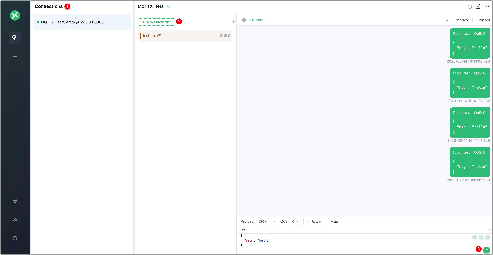
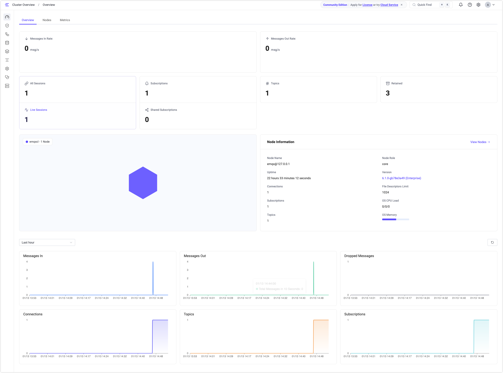

# EMQXのはじめ方

EMQXは、世界で最もスケーラブルで信頼性の高いMQTTメッセージングプラットフォームであり、ビジネスデータをリアルタイムで確実に接続・移動・処理するのに役立ちます。このオールインワンのMQTTプラットフォームを使えば、IoTアプリケーションを簡単に構築し、ビジネスに大きな影響を与えることができます。

この章では、EMQXのダウンロードとインストール方法、および組み込みのWebSocketツールを使った接続とメッセージングサービスのテスト方法をご紹介します。

::: tip
このクイックスタートガイドで紹介するデプロイ方法のほかに、IoT向けのフルマネージドMQTTサービスであるEMQX Cloudもぜひお試しください。インフラのメンテナンス不要で、[アカウント登録](https://accounts.emqx.com/signup?continue=https%3A%2F%2Fcloud-intl.emqx.com%2Fconsole%2Fdeployments%2Fnew)を行うだけで、すぐにMQTTサービスを開始し、IoTデバイスを任意のクラウドに接続できます。
:::

## EMQXのインストール

EMQXは、[Docker](./deploy/install-docker.md)での実行、[EMQX Kubernetes Operator](https://www.emqx.com/en/emqx-kubernetes-operator)によるインストール、またはダウンロードパッケージを使ってコンピューターや仮想マシン（VM）にインストールすることができます。ダウンロードパッケージでのインストールを選択した場合、現在以下のオペレーティングシステムがサポートされています。

- RedHat
- CentOS
- RockyLinux
- AmazonLinux
- Ubuntu
- Debian
- macOS
- Linux

上記にないプラットフォームについては、[EMQ](https://www.emqx.com/en/contact)までお問い合わせください。

### Dockerを使ったEMQXのインストール

コンテナによるデプロイは、EMQXをすぐに試す最速の方法です。このクイックスタートガイドでは、Dockerを使ったEMQXのインストールと起動方法を説明します。

1. 最新版のEMQXをダウンロードして起動するには、以下のコマンドを入力してください。

   実行前に[Docker](https://www.docker.com/)がインストールされ、起動していることを確認してください。

   ```bash
   docker run -d --name emqx -p 1883:1883 -p 8083:8083 -p 8084:8084 -p 8883:8883 -p 18083:18083 emqx/emqx-enterprise:latest
   ```

2. Webブラウザを起動し、アドレスバーに `http://localhost:18083/`（`localhost`はIPアドレスに置き換え可能）を入力して[EMQXダッシュボード](../guides/dashboard/introduction.md)にアクセスします。ここからクライアントの接続や稼働状況の確認が可能です。

   デフォルトのユーザー名とパスワード：

   `admin`

   `public`

### インストールパッケージを使ったEMQXのインストール

コンピューターやVMにインストールパッケージを使ってEMQXをインストールすることもでき、設定の調整やパフォーマンスチューニングが容易です。以下の手順はmacOS 26 (Tahoe) とarm64アーキテクチャ（Apple Silicon）を例に説明しています。

::: tip

すべてのランタイム依存関係を考慮すると、テストやホットアップグレードにはインストールパッケージの使用を推奨しますが、本番環境での使用は**推奨しません**。

:::

1. [公式ダウンロードサイトのmacOSタブ](https://www.emqx.com/en/downloads-and-install/enterprise?os=macOS)にアクセスします。

2. 最新バージョン `@EE_VERSION@` を選択し、**Package Type**から `macOS 26 arm64 / zip` を選びます。

3. リンクをクリックしてパッケージをダウンロードし、インストールします。ページ内のコマンド説明も参照可能です。

4. EMQXを起動するには、以下を入力します。

   ```bash
   ./emqx/bin/emqx foreground
   ```
   これによりEMQXがインタラクティブシェルで起動します。シェルを閉じるとEMQXも停止します。
   なお（推奨しませんが）、バックグラウンドで起動する場合は以下のコマンドを使用できます。

   ```bash
   ./emqx/bin/emqx start
   ```

5. Webブラウザを起動し、アドレスバーに `http://localhost:18083/`（`localhost`はIPアドレスに置き換え可能）を入力して[EMQXダッシュボード](../guides/dashboard/introduction.md)にアクセスします。ここからクライアントの接続や稼働状況の確認が可能です。

   デフォルトのユーザー名とパスワードは `admin` と `public` です。ログイン後にパスワード変更が求められます。

6. EMQXを停止するには、以下を入力します。

   ```bash
   ./emqx/bin/emqx stop
   ```

テスト終了後にEMQXをアンインストールするには、EMQXフォルダを削除するだけです。

## MQTTXで接続を検証する

EMQXを正常に起動できたら、MQTTXを使って接続とメッセージサービスのテストを続けられます。

[MQTTX](https://mqttx.app)は、macOS、Linux、Windowsで動作する洗練されたクロスプラットフォームのMQTT 5.0デスクトップクライアントです。ユーザーはチャットスタイルのUIを通じて複数のクライアントを素早く作成・保存でき、MQTT/MQTTSの接続、サブスクライブ、パブリッシュのテストが可能です。

ここでは、アプリケーションのダウンロードやインストール不要で使えるブラウザベースのMQTT 5.0 WebSocketクライアントツールである[MQTTX Web](https://mqttx.app/web)を使った接続検証方法を紹介します。

::: tip 前提条件
接続テストの前に、ブローカーのアドレスとポート情報を準備してください。

- **EMQXアドレス**：一般的にはサーバーのIPアドレス
- **ポート**：ダッシュボードの左側ナビゲーションメニューから **Management** -> **Listeners** をクリックしてポート番号を確認
:::

### 接続の作成

1. [MQTTX Web](https://mqttx.app/web-client#/recent_connections)にアクセスします。

2. MQTT接続を設定して確立します。**+ New Connection**ボタンをクリックして接続設定ページを開きます。

   - **Name**：接続名を入力します。例：`MQTTX_Test`

   - **Host**：

     - プロトコルをドロップダウンリストから選択します。例：WebSocketプロトコルの場合は `ws://` を選択します。
   
       > MQTTX WebはWebSocket接続のみ対応しています。SSL/TLS接続をテストする場合は、[MQTTXデスクトップクライアント](https://mqttx.app/)をダウンロードしてください。
   
     - EMQXのアドレスを入力します。例：`127.0.0.1`
   
   - **Port**：ポート番号を入力します。例：WebSocket接続では一般的に `8083` を使用します。
   
   その他の項目はデフォルトのままにするか、必要に応じて調整してください。各オプションの詳細は[MQTTユーザーマニュアル – 接続](https://mqttx.app/docs/get-started)を参照してください。

3. ページ右上の**Connect**ボタンをクリックします。

4. メッセージのパブリッシュと受信を確認します。メッセージエリア右下の**Send**アイコンをクリックしてください。送信に成功したメッセージはチャットウィンドウに表示されます。

### トピックのパブリッシュとサブスクライブ

接続が成功したら、引き続き異なるトピックのサブスクライブとメッセージのパブリッシュが可能です。

1. **+ New Subscription**をクリックします。MQTTX Webは設定に基づき、トピック `testtopic/#` をQoSレベル0でサブスクライブするように一部フィールドを自動入力します。異なるトピックをサブスクライブする場合はこの手順を繰り返してください。MQTTX Webはトピックごとに色分けして区別します。

2. チャットエリア右下の送信アイコンをクリックしてメッセージのパブリッシュ／受信をテストします。送信に成功したメッセージはチャットウィンドウに表示されます。



さらに、片方向／双方向SSL認証のテストやカスタムスクリプトでのテストデータのシミュレーションなどを行いたい場合は、[MQTTX](https://mqttx.app)を引き続きご利用ください。

### ダッシュボードでメトリクスを確認

EMQXダッシュボードのクラスター概要ページでは、**接続数**、**トピック数**、**サブスクリプション数**、**受信メッセージ数**、**送信メッセージ数**、**破棄されたメッセージ数**などのメトリクスを確認できます。



## 次のステップ

ここまででEMQXのインストール、起動、アクセス確認が完了しました。次は[認証と認可](../guides/access-control/authn/authn.md)や[ルールエンジン](../develop/data-integration/rules.md)との連携など、EMQXのより高度な機能を試してみてください。

## よくある質問

[EMQ Q&Aコミュニティ](https://askemq.com/)では、EMQXやその他EMQ関連製品の使い方についての議論、質問と回答、IoT関連技術に関するユーザー同士の情報交換ができます。また、専門的な技術サポートが必要な場合は、いつでも[お問い合わせ](https://www.emqx.com/en/contact)ください。
