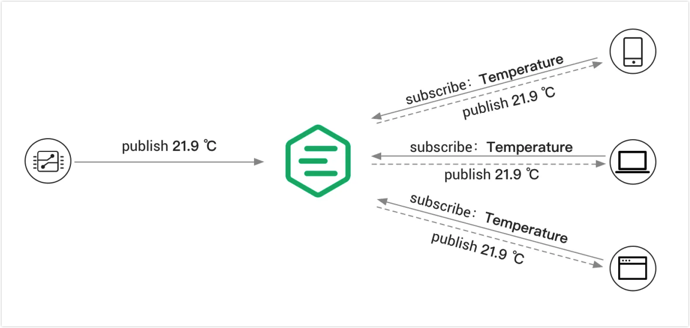

# パブリッシュ／サブスクライブ

世界最高水準のMQTTブローカーであるEMQXは、MQTTプロトコルの重要な機能である[パブリッシュ／サブスクライブメッセージングパターン](./mqtt-concepts.md#publish-subscribe-pattern)をサポートしています。EMQXのパブリッシュ／サブスクライブ機能は、ワイルドカードトピックのサポート、トピックベースのメッセージフィルタリング、メッセージのパーシステンス、QoS（サービス品質）設定など、多様な機能を備えており、複雑かつ高性能なメッセージングアプリケーションに適しています。

パブリッシュ機能は、EMQXブローカーに接続されたデバイスが特定のトピックにメッセージを送信できるようにします。メッセージにはセンサーの読み取り値、ステータス更新、コマンドなど、あらゆる種類のデータを含めることが可能です。デバイスがトピックにメッセージをパブリッシュすると、EMQXはそのメッセージを受信し、そのトピックをサブスクライブしているすべてのデバイスに転送します。

EMQXのサブスクライブ機能は、デバイスが特定のトピックからメッセージを受信できるようにします。デバイスは1つまたは複数のトピックをサブスクライブでき、サブスクライブしたトピックでパブリッシュされたすべてのメッセージを受け取ります。これにより、デバイスはリアルタイムで特定のイベントやデータストリームを監視でき、常に更新をポーリングする必要がなくなります。

本章では、[MQTTのコアコンセプト](./mqtt-concepts.md)を学びます。また、EMQXでのパブリッシュ／サブスクライブ機能の試し方や、MQTTクライアントツールを使って以下のMQTT固有の機能を試す方法を紹介します。

- [共有サブスクリプション](./mqtt-shared-subscription.md)
- [保持メッセージ](./mqtt-retained-message.md)
- [遺言メッセージ](./mqtt-will-message.md)
- [トピックワイルドカード](./mqtt-wildcard-subscription.md)

MQTT固有の機能以外にも、EMQXにはいくつかの拡張機能が実装されています。本章では、以下の拡張機能と、それらをEMQXダッシュボードで設定し、クライアントツールでテストする方法も紹介します。

- [排他サブスクリプション](./mqtt-exclusive-subscription.md)
- [遅延パブリッシュ](./mqtt-delayed-publish.md)
- [自動サブスクライブ](./mqtt-auto-subscription.md)
- [トピック書き換え](./mqtt-topic-rewrite.md)
