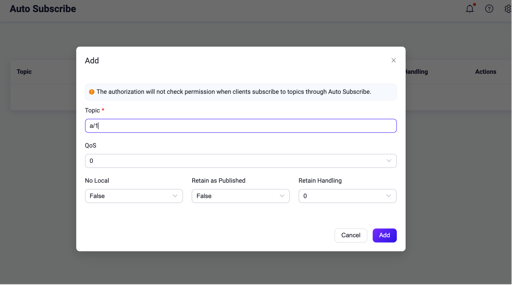
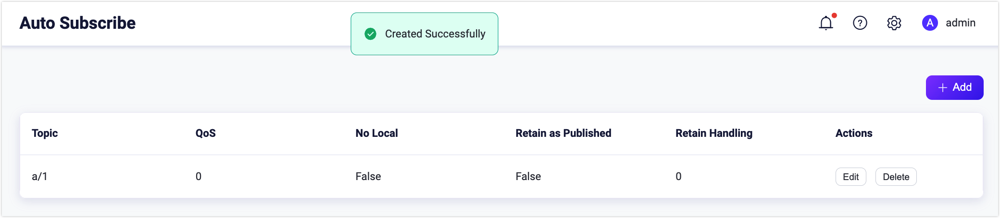
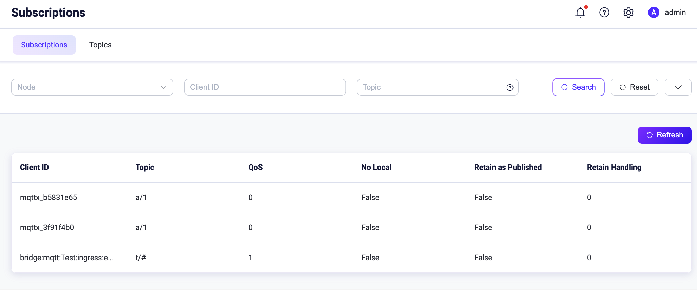
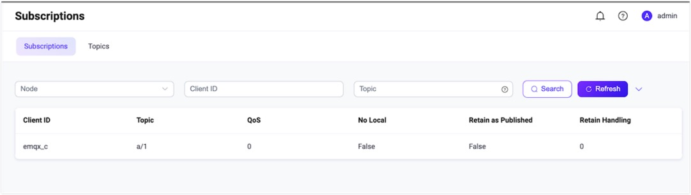

# Auto Subscribe

Auto Subscribeは、EMQXがサポートする拡張されたMQTT機能です。**Auto Subscription**を有効にすると、ユーザーは複数のEMQXルールを設定できます。クライアントがEMQXに正常に接続されると、EMQXはクライアントのサブスクライブ処理を自動的に完了し、クライアントはもはや `SUBSCRIBE` リクエストを送信する必要がなくなります。

EMQX 5.0以前では、この機能は**Proxy Subscription**と呼ばれていました。

## DashboardでAuto Subscribeを設定する

1. EMQXダッシュボードを開きます。左側のナビゲーションメニューで、**Management** -> **Auto Subscribe** をクリックします。

2. **Auto Subscribe**ページで、右上の**+ Add**ボタンをクリックします。

3. ポップアップダイアログボックスで、**Topic**テキストボックスにテスト用トピック `a/1` を入力します。他の設定はデフォルトのままにします。

   - **Topic**: クライアントが自動的にサブスクライブするトピックを入力します。プレースホルダーを使って動的にトピックを構築することも可能です。詳細は[プレースホルダー](#placeholders)をご参照ください。

   - **QoS**: トピックのサービス品質を指定します。選択肢は `0`、`1`、`2` です。

   - **No local**: 選択肢は `False` または `True` です。

   - **Retain as Published**: 指定したトピックで送信されたメッセージを保持するかどうかを指定します。選択肢は `False` または `True` です。

   - **Retained Handling**: 選択肢は `0`、`1`、`2` です。

      

   ダイアログボックスの**Add**ボタンをクリックします。これで自動サブスクライブトピック `a/1` が正常に作成されます。

   

これでAuto Subscription機能が有効になりました。新しいサブスクライバーは、ブローカーに接続されると自動的にトピック `a/1` をサブスクライブします。

## MQTTX DesktopでAuto Subscriptionを試す

[DashboardでAuto Subscribeを設定する](#configure-auto-subscribe-via-dashboard)でトピック `a/1` が自動サブスクライブトピックとして設定されています。以下の手順では、クライアントがブローカーに接続されると自動的にトピック `a/1` をサブスクライブする様子を示します。

:::tip 前提条件

[MQTTX Desktop](./publish-and-subscribe.md#mqttx-desktop)を使った基本的なパブリッシュおよびサブスクライブ操作の理解。

:::

1. EMQXとMQTTX Desktopを起動します。**New Connection**をクリックして、パブリッシャーとしてクライアント接続を作成します。

   - **Name**フィールドに `Demo` と入力します。
   - **Host**にローカルホストの `127.0.0.1` を入力します（このデモの例として使用）。
   - 他の設定はデフォルトのままにして**Connect**をクリックします。

   ::: tip

   MQTT接続の作成に関するより詳細な手順は[MQTTX Desktop](./publish-and-subscribe.md#mqttx-desktop)をご覧ください。

   :::

   

3. もう一つのMQTTクライアント接続を `Subscriber` という名前で作成します。

3. **Connections**ペインでクライアント `Demo` を選択し、トピックに `a/1` を入力してこのトピックにメッセージを送信します。

   - クライアント `Subscriber` は新たにサブスクライブを作成しなくても自動的にメッセージを受信します。

   - クライアント `Demo` も新しい接続としてメッセージを受信します。

     ::: tip

     パブリッシュ／サブスクライブパターンでは、クライアントは送信者とサブスクライバーの両方になり得ます。

     :::

4. EMQXダッシュボードに戻り、左側のナビゲーションメニューから**Monitoring** -> **Subscriptions**をクリックします。トピック `a/1` に自動サブスクライブされた2つのサブスクリプションが表示されます。

   

## MQTTX CLIでAuto Subscriptionを試す

:::tip 前提条件

[MQTTX CLI](./publish-and-subscribe.md#mqttx-cli)を使った基本的なパブリッシュおよびサブスクライブ操作の理解。

:::

1. クライアントIDを `emqx_c` として新しい接続を作成します。

   ```bash
   mqttx conn -i emqx_c
   ```

2. EMQXダッシュボードに移動し、左側のナビゲーションメニューから**Monitoring** -> **Subscriptions**をクリックします。クライアント `emqx_c` がトピック `a/1` をサブスクライブしていることが表示されます。

   

## プレースホルダー

Auto Subscribeはプレースホルダーをサポートしており、トピックを動的に構築できます。プレースホルダーの形式は `${}` です。サポートされている変数は以下の通りです。

- `${clientid}`: クライアントID
- `${username}`: クライアントのユーザー名
- `${host}`: クライアントがEMQXに接続した際のIPアドレス

例えば、クライアントIDが `emqx_c` で設定されたトピックが `a/${clientid}` の場合、クライアントはEMQXに接続後、自動的にトピック `a/emqx_c` をサブスクライブします。
