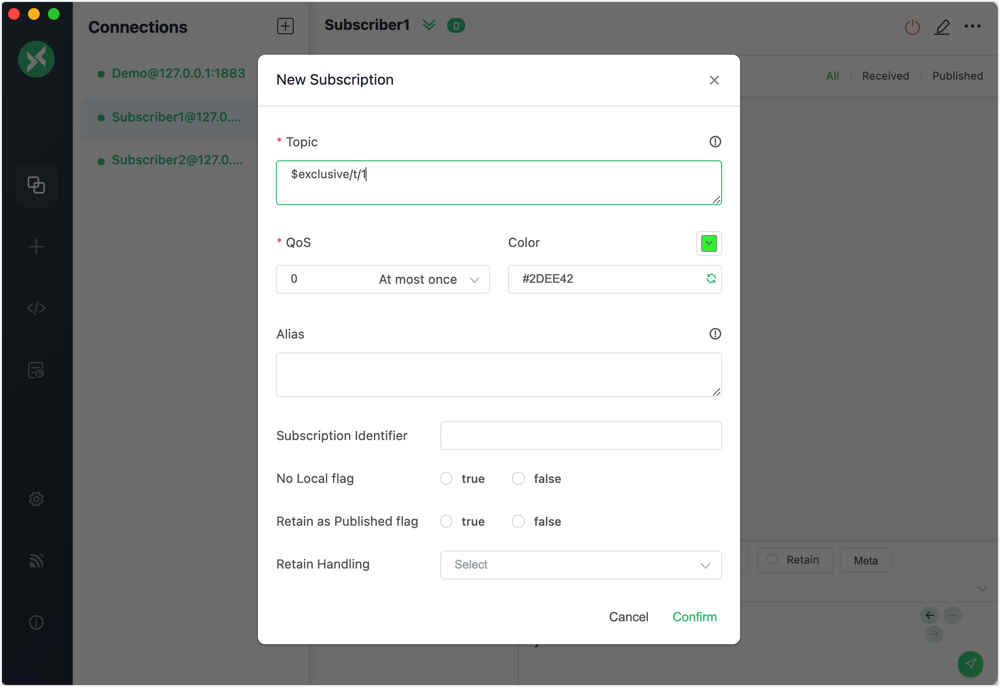
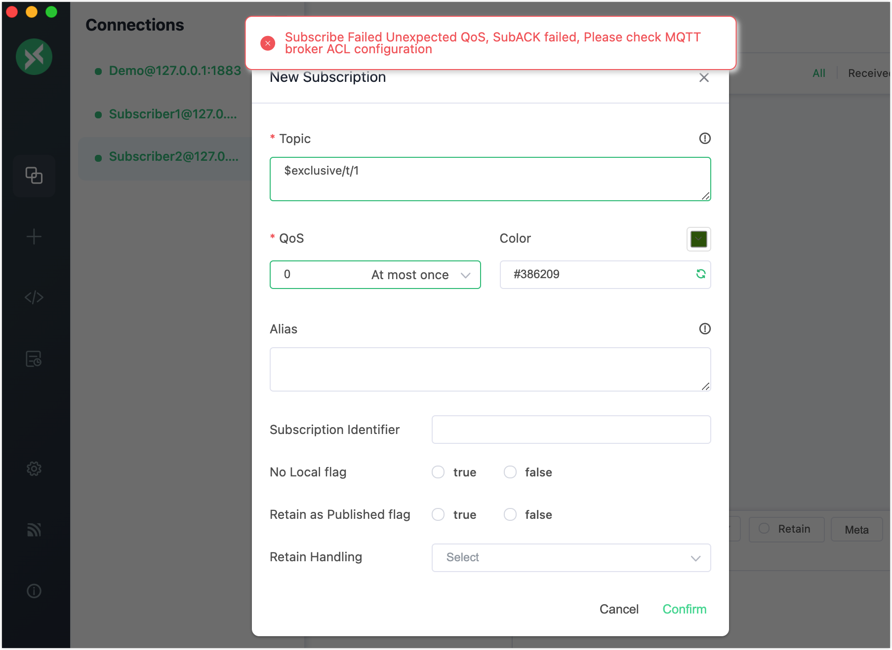

# 排他サブスクリプション

排他サブスクリプションは、EMQXがサポートする拡張されたMQTT機能です。これはトピックに対して相互排他的なサブスクリプションを可能にします。つまり、同時に1つのサブスクライバーのみがトピックをサブスクライブでき、現在のサブスクライバーがサブスクリプションを解除するまで、他のサブスクライバーは該当トピックをサブスクライブできません。

サブスクリプションを排他にするには、トピック名の先頭にプレフィックスを追加する必要があります。以下の表は例を示しています。

| 例 | プレフィックス | 実際のトピック名 |
| --------------- | ----------- | ------------ |
| $exclusive/t/1 | $exclusive/ | t/1 |

クライアント**A**が`$exclusive/t/1`をサブスクライブすると、**A**が`$exclusive/t/1`のサブスクリプションをキャンセルするまで、他のクライアントは`$exclusive/t/1`をサブスクライブできません。

::: tip

排他サブスクリプションは必ず`$exclusive/`で始まる必要があります。上記の例では、他のクライアントは`t/1`を通じて通常通りサブスクライブ可能です。

:::

## 設定ファイルで排他サブスクリプションを有効化する

排他サブスクリプションはデフォルトで無効です。設定ファイルで以下のように有効化できます。

```bash
mqtt.exclusive_subscription.enable = true
```

## MQTTX Desktopで排他サブスクリプションを試す

::: tip 前提条件

- [MQTTX Desktop](./publish-and-subscribe.md#mqttx-desktop)を使った基本的なパブリッシュおよびサブスクライブ操作ができること
- 排他サブスクリプションが有効化されていること

:::

1. EMQXとMQTTX Desktopを起動します。**New Connection**をクリックして、パブリッシャーとしてクライアント接続を作成します。

   - **Name**欄に`Demo`と入力します。
   - **Host**欄にローカルホストの`127.0.0.1`を入力します（このデモの例として使用）。
   - その他の設定はデフォルトのままにして**Connect**をクリックします。

   ::: tip

   MQTT接続の作成方法については、[MQTTX Desktop](./publish-and-subscribe.md#mqttx-desktop)で詳しく説明しています。

   :::

   

2. さらに2つのMQTT接続を作成し、それぞれ`Subscriber1`と`Subscriber2`と名付けます。

3. **Connections**ペインで`Subscriber1`を選択し、**New Subscription**ボタンをクリックしてサブスクリプションを作成します。**Topic**テキストボックスに`$exclusive/t/1`と入力し、このトピックをサブスクライブします。**Confirm**をクリックします。

   

4. **Connections**ペインで`Subscriber2`を選択し、同様に**New Subscription**ボタンをクリックしてサブスクリプションを作成します。**Topic**テキストボックスに`$exclusive/t/1`と入力し、サブスクライブを試みます。**Confirm**をクリックします。

   - エラーメッセージが表示されます。

   

## MQTTX CLIで排他サブスクリプションを試す

::: tip 前提条件

- [MQTTX CLI](./publish-and-subscribe.md#mqttx-cli)を使った基本的なパブリッシュおよびサブスクライブ操作ができること
- 排他サブスクリプションが有効化されていること

:::

1. 以下のコマンドで排他サブスクリプションを行います。

   ```bash
   mqttx sub -t "$exclusive/t/1"
   ```

2. ステップ1のコマンドを再度実行して、トピック`$exclusive/t/1`への別のサブスクリプションを試みます。以下のように返されます。

   ```bash
   subscription negated to t/2 with code 135
   ```

   排他サブスクリプションのエラーコード一覧：

   | コード | 理由                                                         |
   | ---- | ------------------------------------------------------------ |
   | 0x8F | 排他サブスクリプションが有効でない状態で`$exclusive/`を使用した。 |
   | 0x97 | すでに別のクライアントがこのトピックをサブスクライブしている。     |
