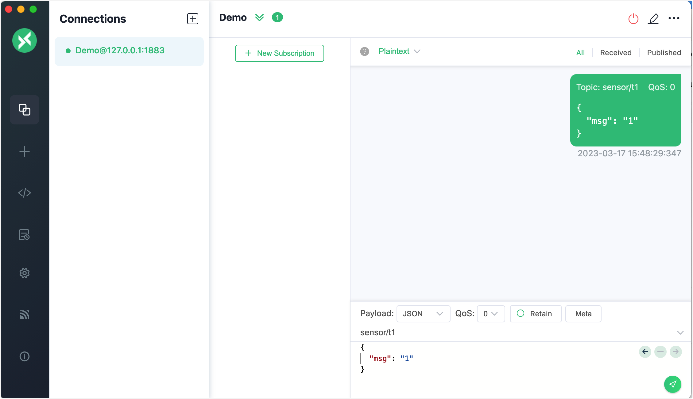
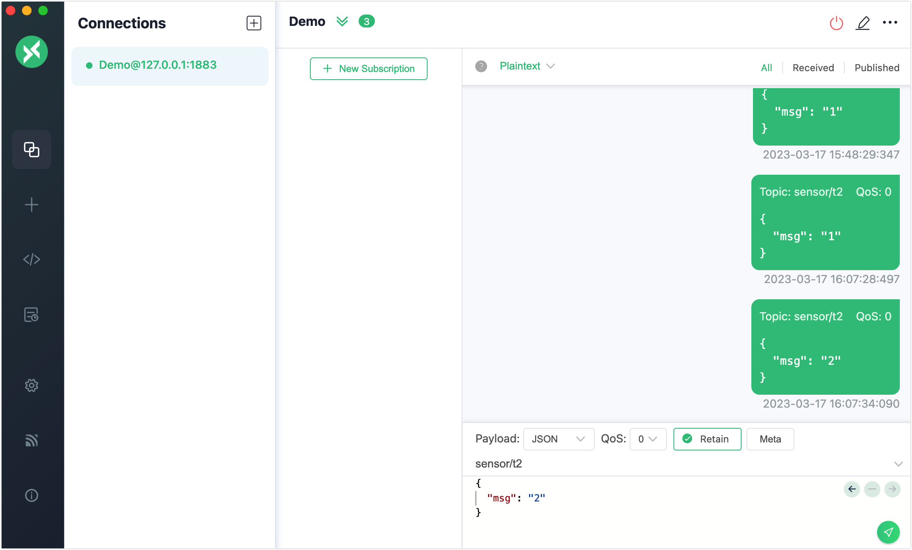
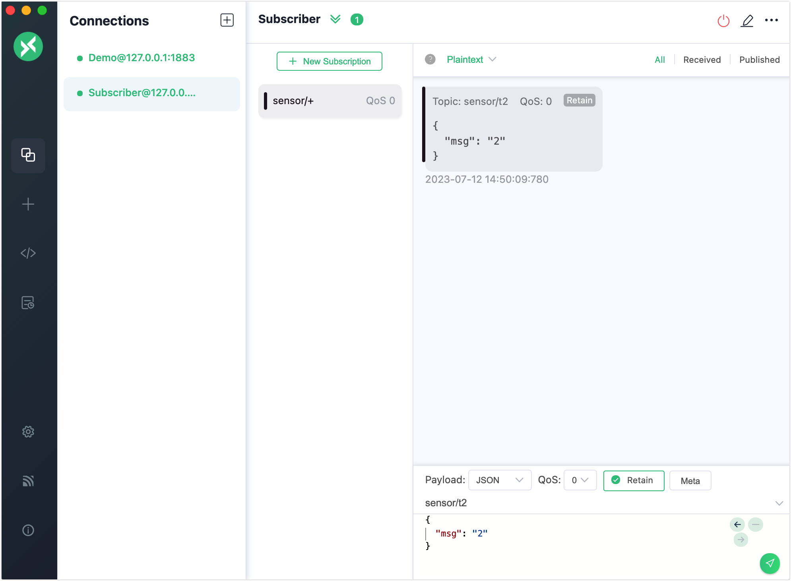
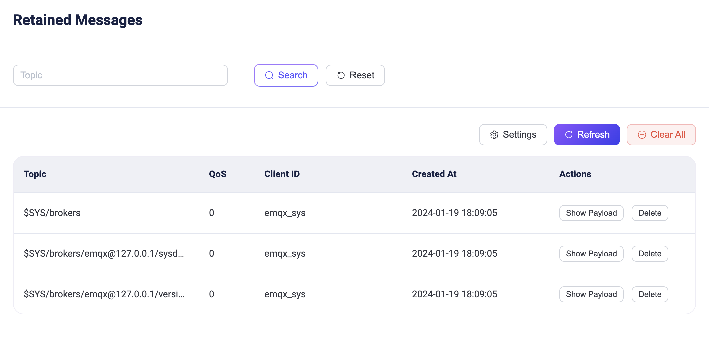

# MQTTのリテインドメッセージ

EMQXはMQTTのリテインドメッセージ機能を実装しています。特定のトピックでパブリッシュされたメッセージに`Retained`フラグを付けて、EMQX上に永続的なメッセージとして保存できます。新しいサブスクライバーがリテインドメッセージのトピックにサブスクライブすると、そのメッセージが過去にパブリッシュされていても即座に受信します。

クライアントツールを使ってEMQXに接続し、このメッセージングサービスを試すことができます。本節では、[MQTTX Desktop](https://mqttx.app/)と[MQTTX CLI](https://mqttx.app/cli)を使用してクライアントをシミュレートし、リテインドメッセージのパブリッシュと受信の動作を確認する方法を紹介します。

:::tip 前提条件

- MQTTの[リテインドメッセージ](./mqtt-concepts.md)に関する知識
- [MQTTX](./publish-and-subscribe.md)を使った基本的なパブリッシュおよびサブスクライブ操作

:::

## MQTTX Desktopでリテインドメッセージをパブリッシュする

1. EMQXとMQTTX Desktopを起動し、**New Connection**をクリックしてパブリッシャーとしてクライアント接続を作成します。

   - **Name**欄に`Demo`と入力します。
   - **Host**欄にlocalhostの`127.0.0.1`を入力します（本デモの例として使用）。
   - その他の設定はデフォルトのままにして、**Connect**をクリックします。

   ::: tip

   MQTT接続の詳細な作成手順は[MQTTX Desktop](./publish-and-subscribe.md#mqttx-desktop)で紹介しています。

   :::

   

3. 接続成功後、テキストボックスにトピック名`sensor/t1`を入力し、スクリーンショットのようにメッセージペイロードを作成します。送信ボタンをクリックします。トピック`sensor/t1`へのメッセージがメッセージダイアログに表示されます。

   

4. トピック`sensor/t2`で2つのリテインドメッセージをパブリッシュします。

   - 1つ目のメッセージに`1`を入力し、**Retain**を選択して送信ボタンをクリックします。
   - 2つ目のメッセージに`2`を入力し、送信ボタンをクリックします。

   

5. **Connections**ペインで**+** -> **New Connection**をクリックし、メッセージを受信するクライアントとして`Subscriber`を作成します。

5. **+ New Subscription**をクリックし、トピック`sensor/+`をサブスクライブします。**Confirm**ボタンをクリックします。

   :::tip

   トピックを`sensor/+`に設定すると、`sensor/t1`と`sensor/t2`の両方がサブスクライブされます。トピックとワイルドカードの詳細は[Understanding MQTT Topics & Wildcards by Case](https://www.emqx.com/en/blog/advanced-features-of-mqtt-topics)をご覧ください。

   :::

   クライアント`Subscriber`は、トピック`sensor/t1`の最初のメッセージや、トピック`sensor/t2`の最初のリテインドメッセージは受信せず、各トピックの最新のリテインドメッセージのみを受信することが確認できます。これはEMQXが各トピックの最新のリテインドメッセージのみを保存しているためです。

   

これでMQTTXクライアントを使ったリテインドメッセージの送信を試しました。EMQXのダッシュボードから保存されている最新のリテインドメッセージを確認することもできます。詳細は[ダッシュボードでリテインドメッセージを確認する](#view-retained-message-in-dashboard)をご覧ください。

## MQTTX CLIでリテインドメッセージをパブリッシュする

1. 1つのクライアントで接続要求を開始します。

1. 以下のコマンドを使ってリテインドメッセージをパブリッシュします。トピックを`t/1`、ペイロードを`A retained message from MQTTX CLI`、`retain = true`に設定します：

   ```bash
   mqttx pub -t 't/1' -m 'A retained message from MQTTX CLI' --retain true -h 'localhost' -p 1883
   ```

3. 同じブローカーに別の新しいクライアント接続要求を開始し、新しいクライアントでトピック`t/1`をサブスクライブします。リテインドメッセージを受信します。

   新しいクライアントを継続的に作成してトピック`t/1`をサブスクライブさせると、作成したすべての新しいクライアントがリテインドメッセージを受信します。

   ```bash
   $ mqttx sub -t 't/1' -h 'localhost' -p 1883 -v
   topic:  t/1
   payload:  A retained message from MQTTX CLI
   retain: true
   ```

3. リテインドメッセージをクリアするために空メッセージをパブリッシュします：

   ```bash
   mqttx pub -t 't/1' -m '' --retain true -h 'localhost' -p 1883
   ```

4. 新しいクライアント接続を開始し、トピック`t/1`をサブスクライブします。リテインドメッセージが受信されず、リテインドメッセージがクリアされたことを示します。

## ダッシュボードでリテインドメッセージを確認する

リテインドメッセージをパブリッシュすると、EMQXはこのメッセージをシステム内に保存します。リテインドメッセージのトピックをサブスクライブすると、EMQXはこのメッセージをトピックにパブリッシュし、即座に受信できます。

リテインドメッセージのデフォルトの有効期限は無期限で、手動で削除しない限り失効しません。

### リテインドメッセージ一覧

**Monitoring** -> **Retained Messages**ページでは、システム内のすべてのリテインドメッセージをトピック、QoS、パブリッシュ時間、クライアントIDとともに確認できます。検索ボックスで検索によるフィルタリングが可能で、トピックのワイルドカードもサポートしています。

ページには、リテインドメッセージのペイロードを表示する**Show Payload**ボタンと削除する**Delete**ボタンがあり、**Refresh**ボタンで一覧を更新できます。また、**Settings**ボタンからリテインドメッセージの設定ページにアクセスできます。

デフォルトで以下の3種類のリテインドメッセージが[システムトピック](./mqtt-concepts.md)から確認できます：

- $SYS/brokers/+/sysdescr：現在のEMQXノードのシステム説明
- $SYS/brokers/+/version：現在のEMQXノードのバージョン番号
- $SYS/brokers：現在のEMQXのすべてのノードの数と名前



### リテインドメッセージの削除

EMQXでリテインドメッセージを削除するには、クライアントからリテインドメッセージのトピックに空メッセージをパブリッシュするか、EMQXダッシュボードを使用します。ダッシュボードでは、特定のリテインドメッセージに対して**Delete**ボタンをクリックして削除できます。クラスター内のすべてのリテインドメッセージを削除するには、**Clear All**ボタンを使用します。

さらに、リテインドメッセージの有効期限をリテインドメッセージ設定ページで指定することもでき、期限切れ時にEMQXが自動的に削除します。
