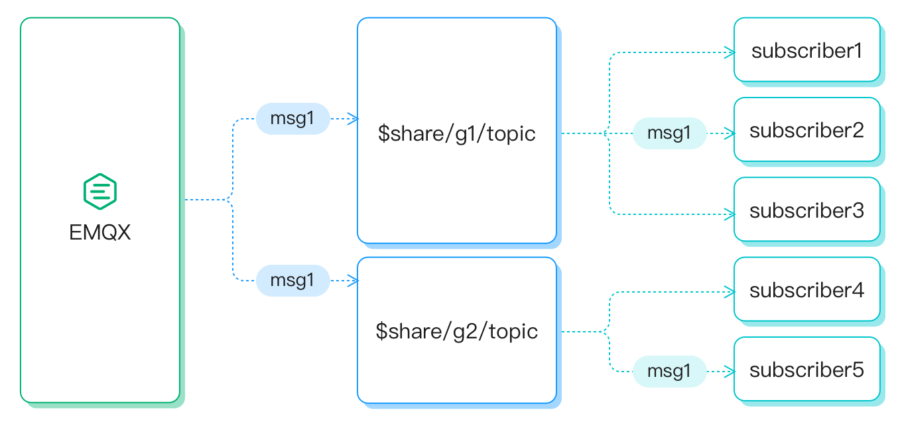
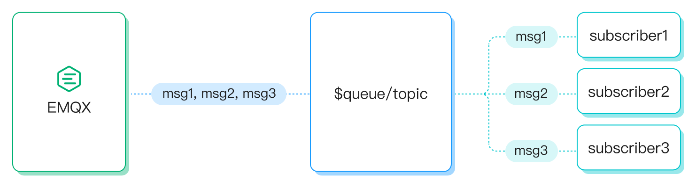
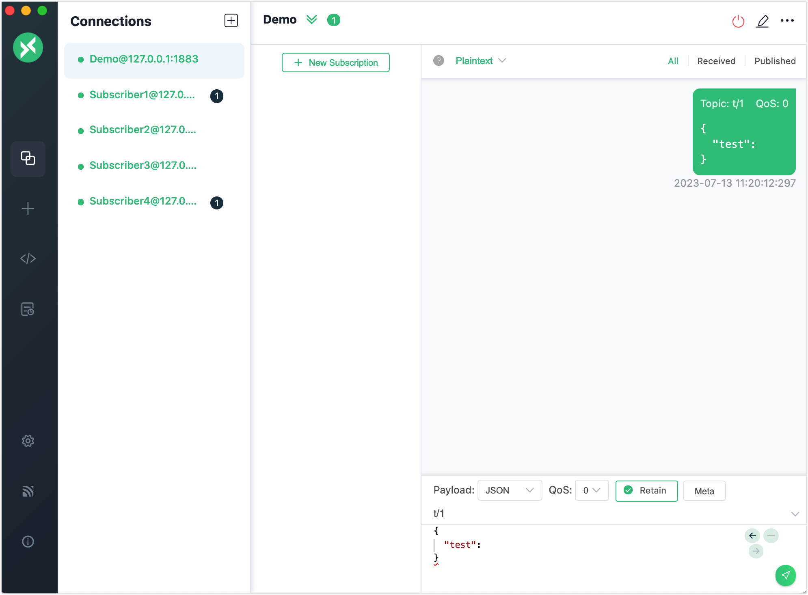
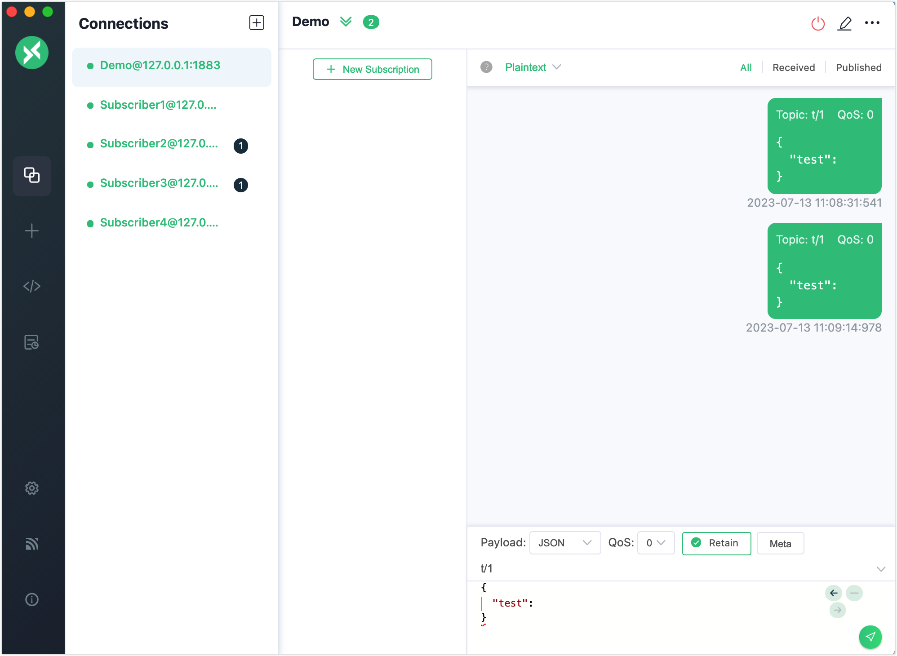

# MQTT 共有サブスクリプション

EMQX は MQTT の共有サブスクリプション機能を実装しています。共有サブスクリプションは複数のサブスクライバー間で負荷分散を実現するためのサブスクリプションモードです。クライアントは複数のサブスクリプショングループに分けられ、メッセージはすべてのサブスクリプショングループに転送されますが、各グループ内のクライアントのうち1つだけがメッセージを受信します。元のトピックにプレフィックスを付けることで、複数のサブスクライバー向けの共有サブスクリプションを有効にできます。EMQX は共有サブスクリプションのプレフィックスとして、グループ用（`$share/<group-name>/` で始まる）とグループ用でないもの（`$queue/` で始まる）の2種類の形式をサポートしています。

共有サブスクリプションの2種類のプレフィックス形式の例は以下の通りです。

| プレフィックス形式               | 例             | プレフィックス | 実際のトピック名 |
| -------------------------------- | -------------- | -------------- | ---------------- |
| グループ用共有サブスクリプション | $share/abc/t/1 | $share/abc/    | t/1              |
| グループ用でない共有サブスクリプション | $queue/t/1     | $queue/        | t/1              |

クライアントツールを使って EMQX に接続し、このメッセージングサービスを試すことができます。本節では共有サブスクリプションの仕組みを紹介し、[MQTTX Desktop](https://mqttx.app/) と [MQTTX CLI](https://mqttx.app/cli) を使ってクライアントをシミュレートし、共有サブスクリプション機能を試す方法を説明します。

## グループ用共有サブスクリプション

元のトピックに `$share/<group-name>` のプレフィックスを付けることで、グループ単位の共有サブスクリプションを有効にできます。グループ名は任意の文字列です。EMQX は異なるグループに同時にメッセージを転送し、同じグループに属するサブスクライバーは負荷分散しながらメッセージを受信します。

例えば、サブスクライバー `s1`、`s2`、`s3` がグループ `g1` のメンバーで、`s4` と `s5` がグループ `g2` のメンバーであり、全員が元のトピック `t1` をサブスクライブしているとします。共有サブスクリプショントピックは `$share/g1/t1` と `$share/g2/t1` になります。EMQX が元のトピック `t1` にメッセージ `msg1` をパブリッシュすると：

- EMQX は `msg1` をグループ `g1` と `g2` の両方に送信します。
- `s1`、`s2`、`s3` のうちの1つだけが `msg1` を受信します。
- `s4` と `s5` のうちの1つだけが `msg1` を受信します。



## グループ用でない共有サブスクリプション

`$queue/` プレフィックスの共有サブスクリプショントピックは、グループに属さないサブスクライバー向けのものです。これは `$share` プレフィックスを使った共有サブスクリプションの特殊なケースと考えられます。すべてのサブスクライバーが `$share/$queue` のようなサブスクリプショングループに属していると理解できます。



## 共有サブスクリプションとセッション

クライアントがパーシステントセッションを持ち、共有サブスクリプションをサブスクライブしている場合、クライアントが切断している間もセッションは共有サブスクリプショントピックにパブリッシュされたメッセージを受信し続けます。クライアントが長時間切断状態にあり、メッセージのパブリッシュ頻度が高いと、セッション状態内の内部メッセージキューがオーバーフローする可能性があります。この問題を避けるために、共有サブスクリプションにはクリーンセッション（`clean_session=true`）を使用することを推奨します。クリーンセッションはクライアント切断後すぐに期限切れになります。

MQTT v5 を使用する場合は、セッション有効期限を短く設定する（0以外の場合）ことが推奨されます。これにより、クライアントは一時的に切断しても、切断期間中にパブリッシュされたメッセージを再接続後に受信できます。セッションが期限切れになると、送信キュー内の QoS1 および QoS2 メッセージ、またはインフライトキュー内の QoS1 メッセージは同じグループの他のセッションに再配信されます。最後のセッションが期限切れになると、すべての保留中メッセージは破棄されます。

パーシステントセッションの詳細は、[MQTT Persistent Session and Clean Session Explained](https://www.emqx.com/en/blog/mqtt-session) を参照してください。

## MQTTX Desktop で共有サブスクリプションを試す

:::tip 前提条件

- MQTT の [共有サブスクリプション](./mqtt-concepts.md#shared-subscription) に関する知識
- [MQTTX](./publish-and-subscribe.md) を使った基本的なパブリッシュとサブスクライブ操作の理解

:::

以下の手順では、元のトピックに `$share` プレフィックスを付けて、異なるグループのサブスクライバーが同じトピックの共有サブスクリプションを行い、共有サブスクリプションからメッセージを受信する方法を示します。

このデモでは、1つのクライアント接続 `demo` をパブリッシャーとして作成し、トピック `t/1` にメッセージをパブリッシュします。さらに、`Subscriber1`、`Subscriber2`、`Subscriber3`、`Subscriber4` の4つのクライアント接続をサブスクライバーとして作成します。サブスクライバーはグループ `a` と `b` に分けられ、両グループがトピック `t/1` をサブスクライブします。

1. EMQX と MQTTX Desktop を起動し、**New Connection** をクリックしてパブリッシャー用のクライアント接続を作成します。

   - **Name** に `Demo` を入力します。
   - **Host** にローカルホストの `127.0.0.1` を入力します（本デモの例として）。
   - 他の設定はデフォルトのままにして **Connect** をクリックします。

   ::: tip

   MQTT 接続の作成方法の詳細は [MQTTX Desktop](./publish-and-subscribe.md#mqttx-desktop) を参照してください。

   :::

   

2. **New Connection** をクリックして、4つのサブスクライバー用の接続を作成します。**Name** はそれぞれ `Subscriber1`、`Subscriber2`、`Subscriber3`、`Subscriber4` に設定します。

3. **Connections** ペインでサブスクライバー接続を1つずつ選択し、**New Subscription** をクリックして共有サブスクリプションを作成します。以下のルールに従って、**Topic** テキストボックスに正しいトピックを入力します。

   複数のサブスクライバーをグループ化するには、サブスクライブするトピック `t/1` の前にグループ名 `{group}` を追加します。さらに、すべてのグループ名の前に `$share` プレフィックスを付けます。

   **New Subscription** ウィンドウで：

   - `Subscriber1` と `Subscriber2` の **Topic** を `$share/a/t/1` に設定します。
   - `Subscriber3` と `Subscriber4` の **Topic** を `$share/b/t/1` に設定します。

   これらの例のトピックでは：

   - プレフィックス `$share` は共有サブスクリプションであることを示します。
   - `{group}` は `a` と `b` で、任意の名前に変更可能です。
   - `t/1` は元のトピック名を示します。

   他の設定はデフォルトのままにして、**Confirm** ボタンをクリックします。

   

5. 先ほど作成した `Demo` 接続をクリックします。

   - トピック `t/1` でメッセージを送信します。グループ `a` のクライアント `Subscriber1` とグループ `b` のクライアント `Subscriber4` がメッセージを受信するはずです。

     

   - 同じメッセージを再度送信します。グループ `a` の `Subscriber2` とグループ `b` の `Subscriber3` がメッセージを受信します。

     

:::tip

共有サブスクリプションのメッセージがパブリッシュされると、EMQX は異なるグループに同時にメッセージを転送しますが、同じグループ内のサブスクライバーのうち1つだけがメッセージを受信します。

:::

## MQTTX CLI で共有サブスクリプションを試す

1. 4つのサブスクライバーを2つのグループに分けて、トピック `t/1` をサブスクライブします：

   ```bash
   # クライアント A と B がトピック `$share/my_group1/t/1` をサブスクライブ
   mqttx sub -t '$share/my_group1/t/1' -h 'localhost' -p 1883

   ## クライアント C と D がトピック `$share/my_group2/t/1` をサブスクライブ
   mqttx sub -t '$share/my_group2/t/1' -h 'localhost' -p 1883
   ```

2. 新しいクライアントを使って、元のトピック `t/1` にペイロード `1`、`2`、`3`、`4` の4つのメッセージをパブリッシュします：

   ```bash
   mqttx pub -t 't/1' -m '1' -h 'localhost' -p 1883
   mqttx pub -t 't/1' -m '2' -h 'localhost' -p 1883
   mqttx pub -t 't/1' -m '3' -h 'localhost' -p 1883
   mqttx pub -t 't/1' -m '4' -h 'localhost' -p 1883
   ```

3. 各サブスクリプショングループ内のクライアントが受信したメッセージを確認します：

   - サブスクリプショングループ1（A と B）およびサブスクリプショングループ2（C と D）は同時にメッセージを受信します。
   - 同じグループ内のサブスクライバーのうち1つだけがメッセージを受信します。
