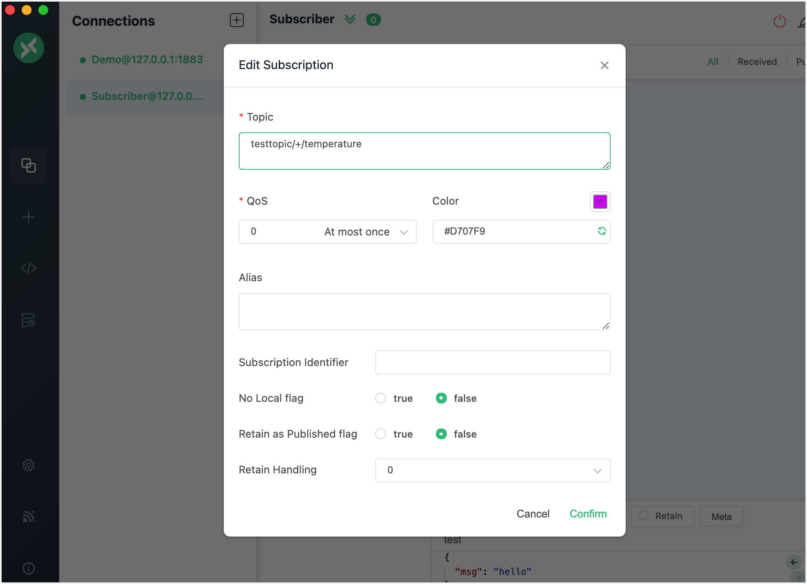
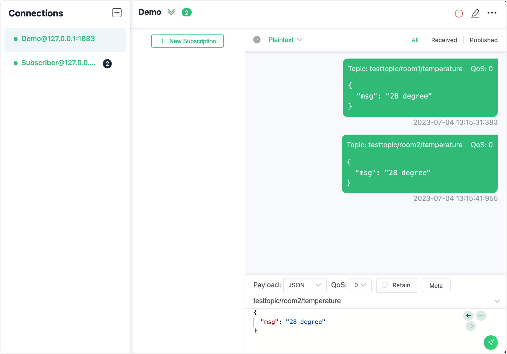
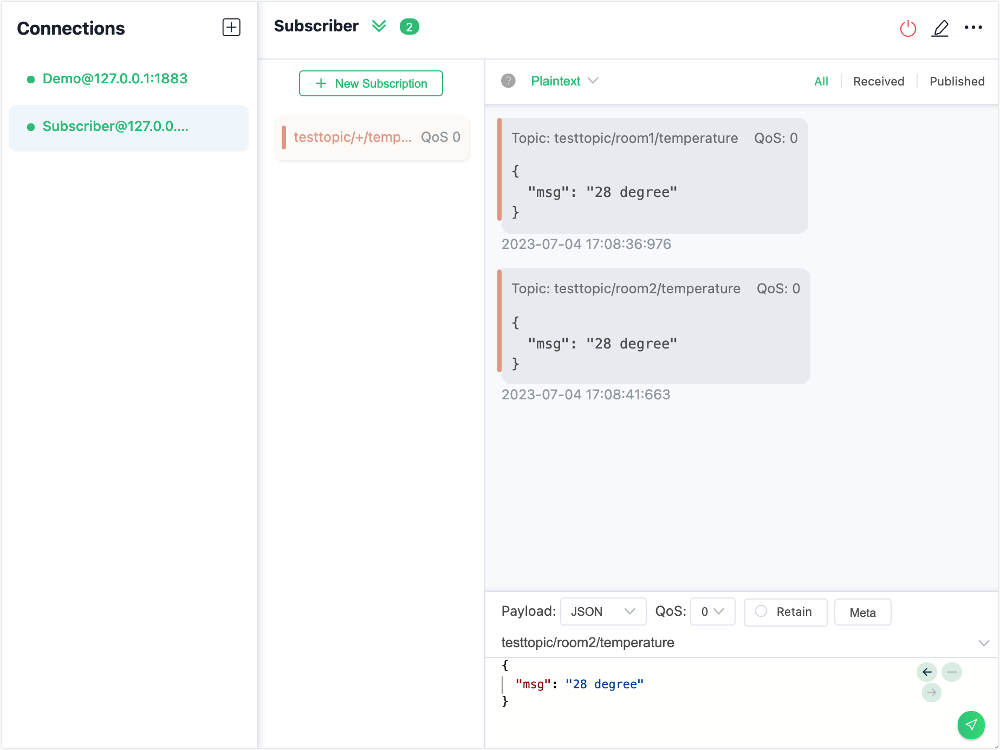
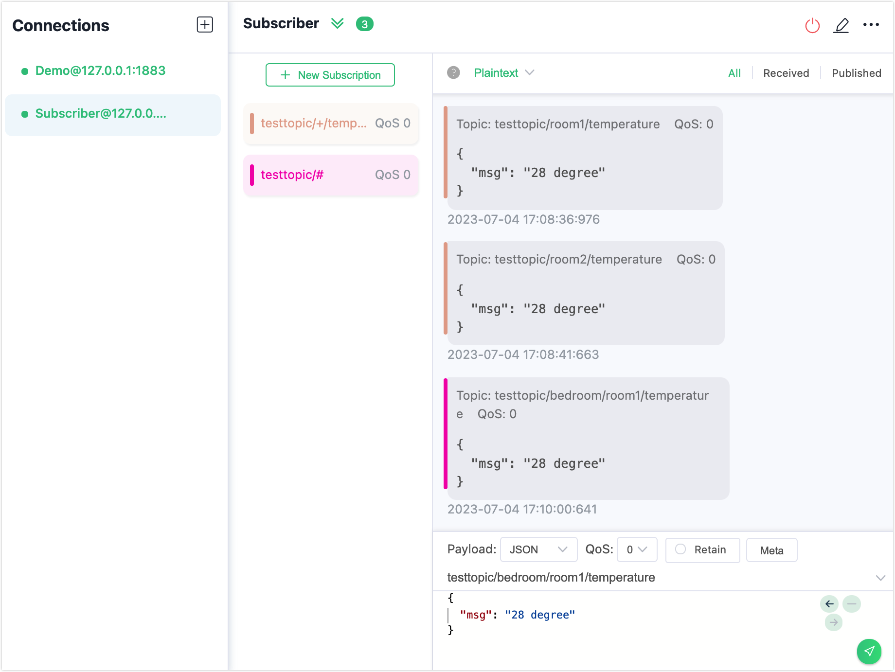

# ワイルドカードサブスクリプション

MQTTのトピック名は、メッセージルーティングに使用されるUTF-8エンコードされた文字列です。より柔軟な運用を可能にするために、MQTTは階層的なトピックネームスペースをサポートしています。トピックは通常、レベルごとに区切られ、スラッシュ `/` で区切られます（例：`chat/room/1`）。[ワイルドカードサブスクリプション](https://docs.oasis-open.org/mqtt/mqtt/v5.0/os/mqtt-v5.0-os.html#_Topic_Names_and)とは、トピックフィルターに1つ以上のワイルドカード文字を含むサブスクリプションのことで、複数のトピック名にマッチさせることができます。本ページでは、MQTTでサポートされている2種類のワイルドカードの使い方と、EMQXでワイルドカードを含むトピックをサブスクライブする方法を紹介します。

::: tip 注意

ワイルドカードはサブスクライブ時のみ使用可能で、パブリッシュ時には使用できません。また、**多数のクライアントでワイルドカードサブスクリプションを使用するとパフォーマンスに影響を与える可能性があるため避けてください**。

:::

## シングルレベルワイルドカード

`+`（U+002B）は、トピックの1レベルにのみマッチするワイルドカード文字です。シングルレベルワイルドカードはトピックフィルターの任意のレベルで使用でき、最初や最後のレベルでも可能です。使用する場合、そのレベル全体を占める必要があります。複数のレベルで使用可能で、マルチレベルワイルドカードと組み合わせて使うこともできます。以下はシングルレベルワイルドカードの使用例です。

```
"+" は有効
"sensor/+" は有効
"sensor/+/temperature" は有効
"sensor+" は無効（レベル全体を占めていない）
```

クライアントが `sensor/+/temperature` をサブスクライブすると、以下のトピックからのメッセージを受信します。

```awk
sensor/1/temperature
sensor/2/temperature
...
sensor/n/temperature
```

ただし、以下のトピックにはマッチしません。

```bash
sensor/temperature
sensor/bedroom/1/temperature
```

## マルチレベルワイルドカード

`#`（U+0023）は、トピック内の任意の数のレベルにマッチするワイルドカード文字です。マルチレベルワイルドカードを使用する場合、そのレベル全体を占め、トピックの最後の文字でなければなりません。例：

```pgsql
"#" は有効で、すべてのトピックにマッチ
"sensor/#" は有効
"sensor/bedroom#" は無効（+ または # はワイルドカードレベルとしてのみ使用可能）
"sensor/#/temperature" は無効（# は最後のレベルでなければならない）
```

クライアントが `sensor/#` をサブスクライブすると、以下のトピックからのメッセージを受信します。

```pgsql
sensor
sensor/temperature
sensor/1/temperature
```

## MQTTXクライアントでワイルドカードサブスクリプションを試す

このセクションでは、MQTTXクライアントを使ってワイルドカードトピックのサブスクリプションを作成する方法を示します。デモとして、1つのクライアント接続 `Demo` をパブリッシャーとしてメッセージをパブリッシュします。もう1つのクライアント接続をサブスクライバーとして作成し、以下のワイルドカードトピックをサブスクライブします。

- `testtopic/+/temperature`
- `testtopic/#`

:::tip 前提条件

- MQTTの[ワイルドカード](./mqtt-concepts.md#topic-and-wildcards)に関する知識
- [MQTTX](./publish-and-subscribe.md)を使った基本的なパブリッシュ・サブスクライブ操作

:::

1. EMQXとMQTTX Desktopを起動し、**New Connection**をクリックしてパブリッシャー用のクライアント接続を作成します。

   - **Name**に `Demo` と入力します。
   - **Host**にローカルホスト `127.0.0.1` を入力します（本デモの例として）。
   - その他の設定はデフォルトのままにして、**Connect**をクリックします。

   ::: tip

   MQTT接続の作成方法については、[MQTTX Desktop](./publish-and-subscribe.md#mqttx-desktop)で詳しく説明しています。

   :::

   

2. **Connections**ペインの **+** をクリックし、サブスクライバー用の別の接続を作成します。**Name**を `Subscriber` に設定します。

3. **Connections**で `Subscriber` を選択し、**+ New Subscription**をクリックします。ポップアップダイアログで、**Topic**フィールドに `testtopic/+/temperature` と入力します。その他のオプションはデフォルトのままにします。

   

4. **Connections**で `Demo` を選択します。トピックフィールドに `testtopic/room1/temperature` と入力し、メッセージフィールドにペイロード `28 degree` を入力します。送信ボタンをクリックします。同じペイロードでトピック `testtopic/room2/temperature` にもメッセージを送信します。

      

5. **Connections**で `Subscriber` を選択します。サブスクライバーがパブリッシャーから送信された異なるトピックの2つのメッセージを受信していることが確認できます。

      

6. **+ New Subscription**をクリックします。ポップアップダイアログで、デフォルトのトピック `testtopic/#` を**Topic**フィールドに使用します。その他のオプションはデフォルトのままにします。

7. **Connections**で `Demo` を選択します。トピックフィールドに `testtopic/bedroom/room1/temperature` と入力し、メッセージフィールドにペイロード `28 degree` を入力します。送信ボタンをクリックします。

8. **Connections**で `Subscriber` を選択します。メッセージがサブスクリプション `testtopic/#` のみへ送信されていることが確認できます。

      
