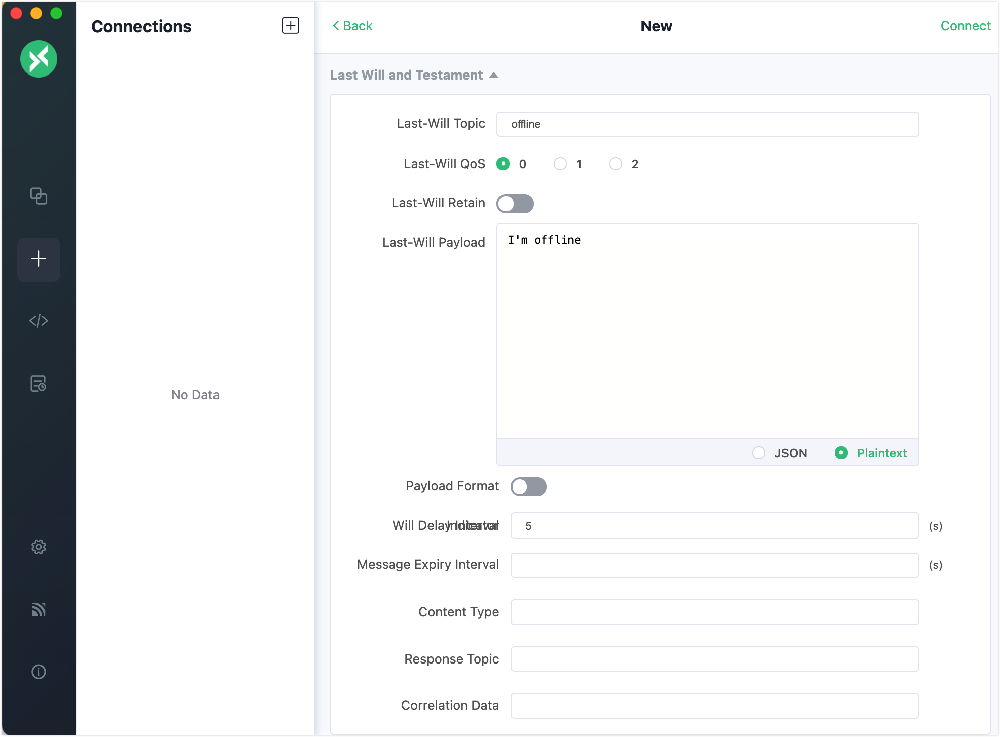
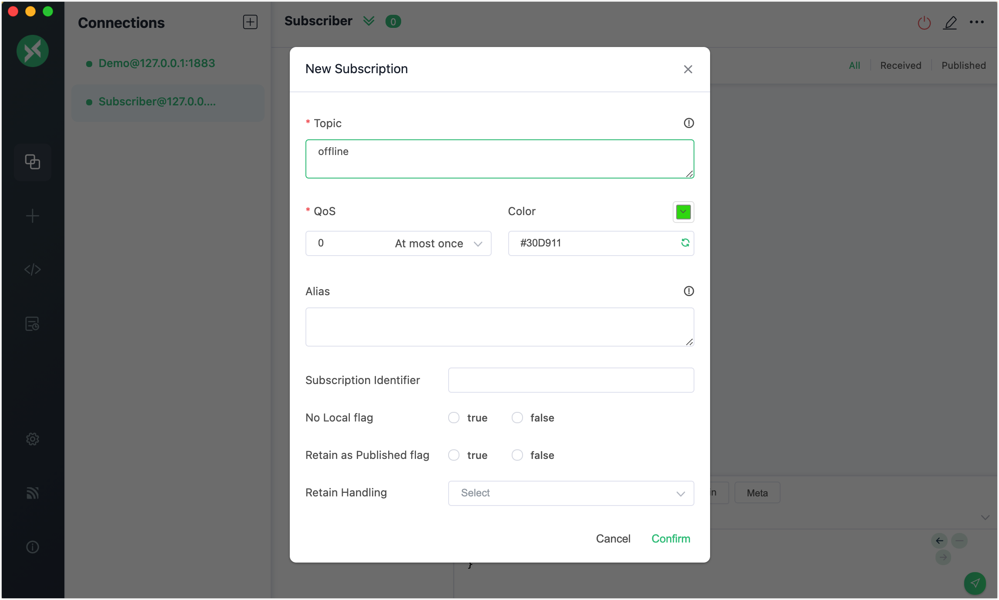
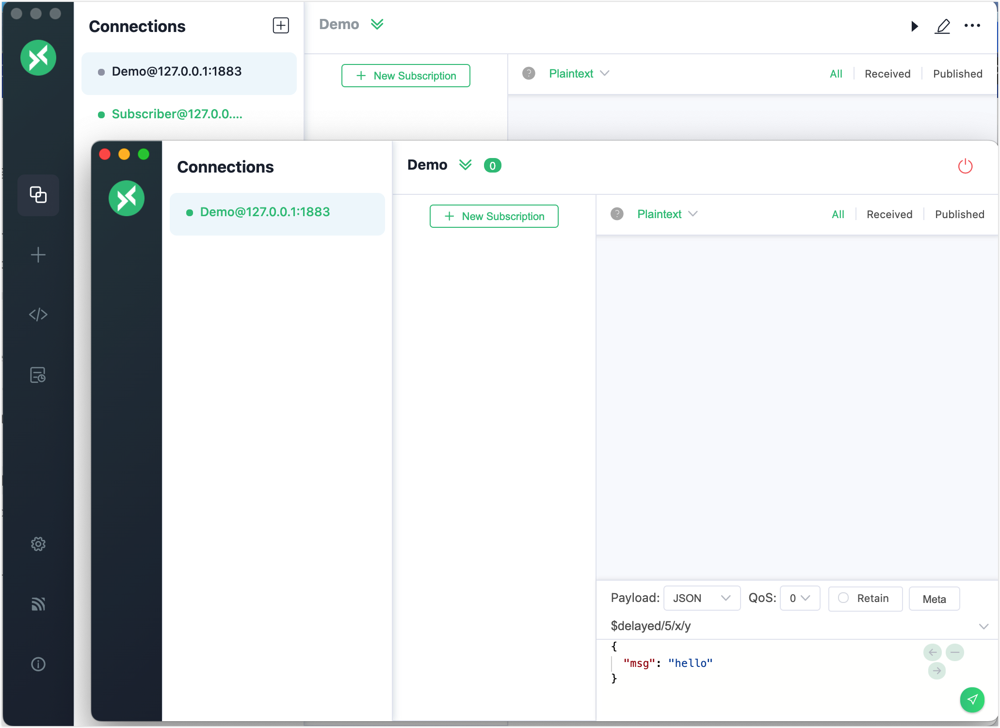
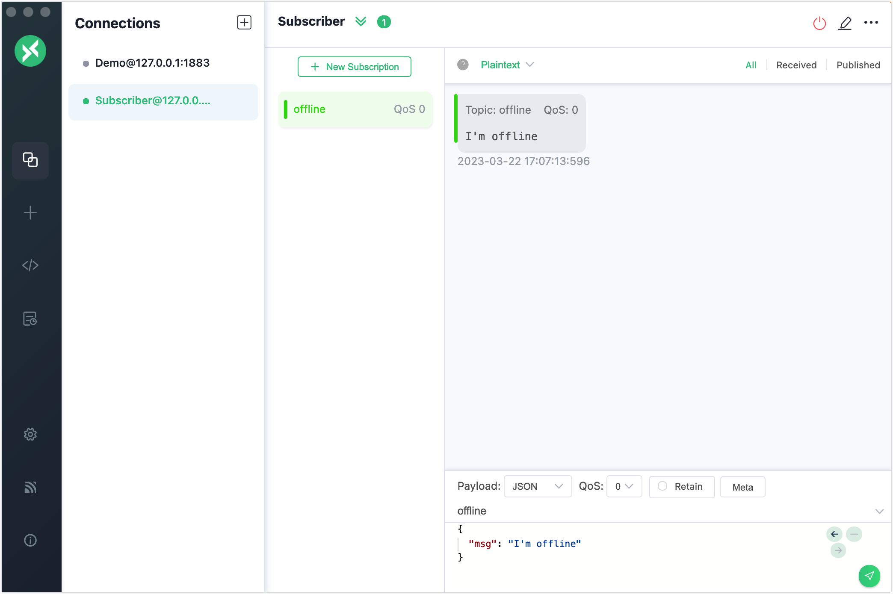

# MQTT Will Message

EMQXはMQTTのウィルメッセージ機能を実装しています。クライアントにウィルメッセージが設定されている場合、クライアントが意図せず切断されると、EMQXは関連するサブスクライバーにメッセージを送信し、サブスクライバーがクライアントの状態を把握・更新できるようにします。

EMQXでこのメッセージングサービスを試すために、クライアントツールを使用できます。本節では、[MQTTX Desktop](https://mqttx.app/) と [MQTTX CLI](https://mqttx.app/cli) を使ってクライアントをシミュレートし、ウィルメッセージがどのようにパブリッシュされ受信されるかを紹介します。

:::tip 前提条件

- MQTTの[Will Message](./mqtt-concepts.md#will-message)に関する知識
- [MQTTX](./publish-and-subscribe.md)を使った基本的なパブリッシュおよびサブスクライブ操作

:::

## MQTTX Desktopでウィルメッセージをパブリッシュする

1. EMQXとMQTTX Desktopを起動します。**New Connection** をクリックして、パブリッシャーとしてクライアント接続を作成します。

   - **Name** フィールドに `Demo` と入力します。
   - **Host** にローカルホストの `127.0.0.1` を入力します（このデモの例として使用）。
   - 他の設定はデフォルトのままにして、**Connect** をクリックします。

   ::: tip

   MQTT接続の作成に関する詳細な手順は、[MQTTX Desktop](./publish-and-subscribe.md#mqttx-desktop)で紹介しています。

   :::

   

   ページをスクロールダウンし、**Last Will and Testament** セクションでウィルメッセージの設定を行います。

   - **Last-Will Topic**： `offline` と入力します。
   - **Last-Will QoS**： デフォルト値の `0` に設定します。
   - **Last-Will Retain**： デフォルトで無効のままにします。有効にすると、ウィルメッセージは保持メッセージにもなります。
   - **Last-Will Payload**： `I'm offline` と入力します。
   - **Will Delay Intervals (s)**： `5` 秒に設定します。

   他の設定はデフォルトのままにして、**Connect** ボタンをクリックします。

   

2. **Connections** ペインで **+** -> **New Connection** をクリックし、新しいクライアント接続を作成します。接続の **Name** を `Subscriber`、**Host** を `127.0.0.1` に設定します。他の設定はデフォルトのままにして、**Connect** をクリックします。

3. **Subscriber** ペインで **New Subscription** をクリックします。**Topic** テキストボックスに `offline` と入力し、他の設定はデフォルトのままにして、**Confirm** ボタンをクリックします。

   

4. **Connections** ペインで `Demo` という名前のクライアント接続を選択し、右クリックして **New Window** を選択します。新しいウィンドウで **Connect** ボタンをクリックします。

   

5. 新しいウィンドウを閉じて5秒待ちます。クライアント `Subscriber` がウィルメッセージ `I'm offline` を受信します。

   


## MQTTX CLIでウィルメッセージをパブリッシュする

1. 1つのクライアントで接続要求を開始します。トピックを `t/1`、ペイロードを `A will message from MQTTX CLI` に設定します。

   ```bash
   $ mqttx conn -h 'localhost' -p 1883 --will-topic 't/1' --will-message 'A will message from MQTTX CLI'
   Connected
   ```

2. 別のクライアントでトピック `t/1` をサブスクライブし、ウィルメッセージを受信します。

   ```bash
   mqttx sub -t 't/1' -h 'localhost' -p 1883 -v
   ```

3. ステップ1で指定したクライアントを切断すると、ステップ2で指定したクライアントがウィルメッセージを受信します。

   ```bash
   topic:  t/1
   payload:  A will message from MQTTX CLI
   ```
