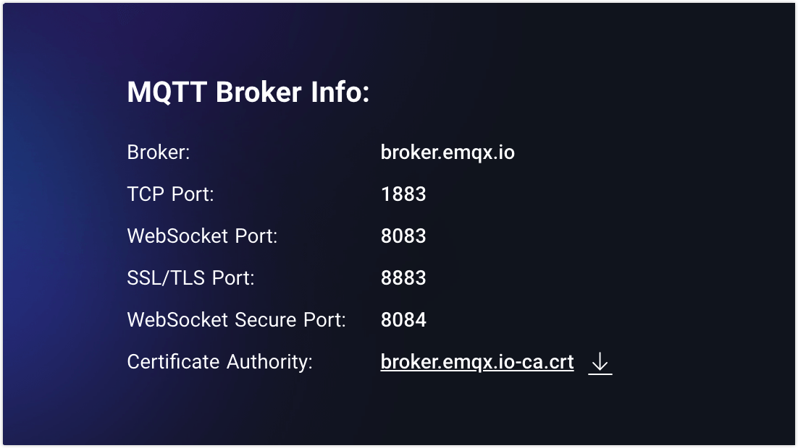
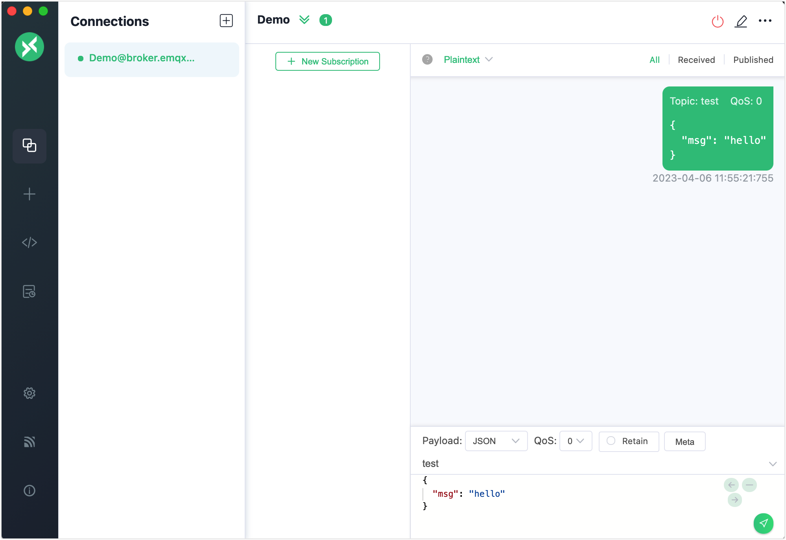
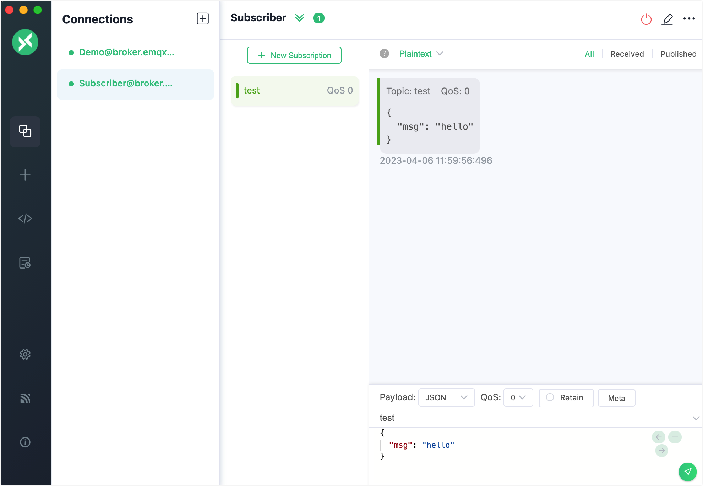
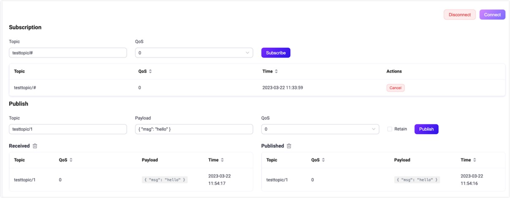

# MQTTクライアントによるテスト

リアルタイムデバイスをEMQXに接続しIoTアプリケーションを開発する前に、クライアントツールを使ってEMQXのメッセージングサービスをテストすることは、安全かつ効率的です。

EMQXをローカルにデプロイする前でも、EMQが提供する無料のオンライン公開[MQTTブローカー](https://www.emqx.com/en/mqtt/public-mqtt5-broker)やMQTTクライアントツールを検証ツールとして活用し、MQTTメッセージングサービスやアプリケーション開発の迅速なテストが可能です。



本章では、一般的に使われるMQTT 5.0クライアントツールを紹介し、以下のメッセージングサービスをテストするための簡単なデモを示します。

- クライアント接続の確立
- トピックのサブスクライブ
- メッセージのパブリッシュ
- メッセージの受信と表示

## MQTTX

[MQTTX](https://mqttx.app)はEMQがオープンソースで提供する洗練されたクロスプラットフォーム対応のMQTT 5.0検証ツールです。以下の3種類のツールを含みます。

- MQTTX Client
- MQTTX CLI
- MQTT Web

### MQTTX Desktop

[MQTTX Desktop](https://mqttx.app)はクロスプラットフォーム対応のMQTTデスクトップクライアントツールです。使いやすいグラフィカルインターフェースを提供し、ユーザーが迅速にMQTT接続を作成し、MQTTメッセージのパブリッシュ／サブスクライブをテストできます。

テスト前にMQTTX Clientをダウンロードしてインストールしてください。

1. ご利用のOSに応じて、アプリケーションストアまたは[MQTTX公式サイト](https://mqttx.app/)からインストールパッケージをダウンロードします。
2. MQTTX Clientをインストールします。詳細は[MQTTX - インストール](https://mqttx.app/docs/downloading-and-installation)を参照してください。

以下の手順でMQTTXデスクトップクライアントを使った簡単なテストを行います。

1. MQTTX Clientを起動し、**New Connection**をクリックしてMQTT接続を作成します。

2. メッセージをパブリッシュするクライアントとして新規接続を設定します。

   **General**セクションでクライアントの一般情報を入力します。

   - **Name**: 接続名を入力します。
   - **Client ID**: デフォルトのままで構いません。クライアント接続の一意識別子で、更新ボタンをクリックすると自動生成されます。
   - **Host**: 利用するプロトコルを選択します。`mqtt://`または`ws://`を選択してください。`SSL/TLS`認証接続を使う場合は、`mqtts://`または`wss://`を選択します。ホストIPアドレスはデフォルトで`broker.emqx.io`に設定されており、公開ブローカーに接続します。自分のEMQXを使う場合は実際のIPに置き換えてください。
   - **Port**: 選択したプロトコルに対応するポート番号を入力します。
   - **Username**と**Password**: ブローカーでユーザー認証が有効な場合は入力し、無効なら空欄のままにします。
   - **SSL/TLS**: `SSL/TLS`認証接続を使う場合はトグルボタンで有効にします。

   他の設定はデフォルトのままにし、右上の**Connect**ボタンをクリックします。

   

3. 接続成功後、テキストボックスにトピック名`test`を入力し、スクリーンショットのようにメッセージを作成します。送信ボタンをクリックすると、トピック`test`にメッセージが表示されます。

   

4. **Connections**ペインの**+** -> **New Connection**をクリックし、メッセージを受信するクライアントとして新規接続を作成します。名前を`Subscriber`に設定し、他の一般接続設定はクライアント`Demo`と同じにします。

5. **Connections**ペインでクライアント`Subscriber`を選択し、**+ New Subscription**をクリックします。

   - **Topic**: テキストボックスに`test`を入力します。
   - **QoS**: デフォルト値のままにします。
   - **Color**: サブスクリプションを識別する色を選択できます。

   他のオプションは空欄のままにし、**Confirm**ボタンをクリックします。

   

6. **Connections**ペインでクライアント`Demo`を選択し、トピック`test`に新しいメッセージをパブリッシュします。クライアント`Subscriber`が新しいメッセージを受信していることが確認できます。

   

これでMQTTX Clientを使った基本的なパブリッシュとサブスクライブの操作を体験できました。詳細かつ高度な操作については[MQTTX - パブリッシュとサブスクリプション](https://mqttx.app/docs/get-started#publish-and-subscription)を参照してください。

### MQTTX CLI

[MQTTX CLI](https://mqttx.app/cli)はEMQが提供するオープンソースのMQTT 5.0コマンドラインツールです。グラフィカルインターフェースを必要とせず、コマンドライン上でMQTTサービスやアプリケーションのテスト・デバッグが可能です。

以下の手順でMQTTX CLIを使い、接続、パブリッシュ／サブスクライブ、メッセージ表示を行います。

1. MQTT CLIをダウンロードしてインストールします。ここではmacOSを例に説明します。他のOSについては[MQTTX CLI - インストール](https://mqttx.app/docs/cli/downloading-and-installation)を参照してください。

   ```bash
   # Homebrew
   brew install emqx/mqttx/mqttx-cli
   # Intelチップ
   curl -LO https://www.emqx.com/zh/downloads/MQTTX/v1.9.0/mqttx-cli-macos-x64
   sudo install ./mqttx-cli-macos-x64 /usr/local/bin/mqttx
   # Apple Silicon
   curl -LO https://www.emqx.com/zh/downloads/MQTTX/v1.9.0/mqttx-cli-macos-arm64
   sudo install ./mqttx-cli-macos-arm64 /usr/local/bin/mqttx
   ```

2. コマンドラインツールで以下のコマンドを実行し、EMQXに接続して`testtopic/#`トピックをサブスクライブします。

   ```shell
   mqttx sub -t 'testtopic/#' -q 1 -h 'localhost' -p 1883 'public' -v
   ```

   パラメータの説明:

   - `-t`: サブスクライブするトピック
   - `-q`: メッセージのQoS（デフォルト: 0）
   - `-h`: リスナーのIPアドレス（デフォルト: `localhost`）
   - `-p`: ブローカーのポート（デフォルト: `1883`）
   - `-v`: メッセージの前にトピックを表示

   実行成功後、コマンドラインは受信待機状態になり、メッセージ受信後に内容を表示します。

   さらにパラメータの詳細は[MQTTX CLI - サブスクライブ](https://mqttx.app/docs/cli/get-started#subscribe)を参照してください。

3. 新しいコマンドラインウィンドウを開き、以下のコマンドを実行してEMQXに接続し、トピック`testtopic/#`にメッセージをパブリッシュします。

   ```bash
   mqttx pub -t 'testtopic/1' -q 1 -h 'localhost' -p 1883 -m 'from MQTTX CLI'
   ```

   パラメータ:

   - `-t`: パブリッシュするトピック
   - `-q`: メッセージのQoS（デフォルト: 0）
   - `-h`: リスナーのIPアドレス（デフォルト: `localhost`）
   - `-p`: ブローカーのポート（デフォルト: `1883`）
   - `-m`: メッセージ本文

   実行成功後、コマンドラインは接続を確立しメッセージをパブリッシュし、ブローカーから切断します。ステップ2のコマンドラインウィンドウには以下のメッセージが表示されます。

   ```bash
   topic:  testtopic/1
   payload:  from MQTTX CLI
   ```

   さらにパラメータの詳細は[MQTTX CLI - パブリッシュ](https://mqttx.app/docs/cli/get-started#publish)を参照してください。

### MQTTX Web

[MQTTX Web](https://mqttx.app/web)はブラウザベースのMQTT 5.0 WebSocketクライアントツールです。ツールのダウンロードやインストール不要で、WebSocket経由のMQTT開発やデバッグを完結できます。MQTTX Webでのテスト操作は[MQTTX Client](#mqtt-x-client)と基本的に同じです。


## ダッシュボード WebSocket

[EMQX Dashboard](../dashboard/introduction.md)はWebSocketクライアントを提供しており、手軽かつ効果的なMQTTテストツールとして利用できます。MQTT over WebSocketでEMQXへの接続、トピックのサブスクライブ、メッセージのパブリッシュをテスト可能です。

1. EMQX Dashboardの左ナビゲーションメニューで**Diagnose** -> **WebSocket Client**をクリックします。

2. **Connection**セクションに接続情報を入力します。

   - **Host**: 対応するIPアドレスを入力します（デフォルト: `localhost`）。
   - **Port**: デフォルトの`8083`のままにします。
   - **Username**と**Password**: もしあれば入力し、アクセス制御がなければ空欄のままにします。

   他の設定はデフォルトのままにします。

3. **Connect**ボタンをクリックして接続を確立します。

4. **Subscription**セクションでサブスクライブするトピックを`testtopic/#`に設定し、**Subscribe**ボタンをクリックしてサブスクライブを完了します。トピック`testtopic/#`が下のテーブルに追加されます。

   

   サブスクライブ後、トピックにマッチするすべてのメッセージがこの接続に転送されます。

5. **Publish**セクションでパブリッシュするメッセージのトピックを設定します。

   - **Topic**: `testtopic/1`に設定します（ワイルドカード`+`や`#`はサポートされません）。
   - **Payload**: `{"msg": 'Hello"}`に設定します。
   - **QoS**: デフォルト値の`0`に設定します。
   - **Retain**: リテインメッセージに設定したい場合はチェックボックスを選択します。リテインメッセージの詳細は[リテインメッセージ](./mqtt-concepts.md)を参照してください。

   **Publish**ボタンをクリックすると、**Published**セクションに1件のレコードが追加されます。メッセージはすべてのサブスクライバーにルーティングされます。このテストではパブリッシャーも受信者なので、**Received**セクションにも新しいレコードが追加されます。

   
