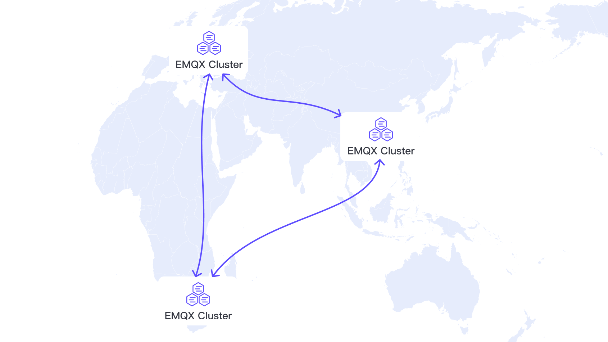

# 新機能

このページでは、現在のリリースでサポートされている主要な新機能を紹介します。EMQXが提供するすべての機能を網羅しているわけではありませんのでご注意ください。

## クラスターリンク

クラスターリンクは、地理的に分散したEMQXクラスター間でシームレスかつ安全、効率的にメッセージを共有する機能です。従来のMQTTブリッジがすべてのメッセージを転送し、フィードバックループを防ぐためにトピックプレフィックスを必要とするのに対し、クラスターリンクはアクティブなサブスクリプションに基づき関連するメッセージのみを転送するため、帯域幅の使用を最小限に抑え、レイテンシを低減し、スケーラビリティを向上させます。

クラスターリンクの設定および管理はシンプルかつ柔軟に設計されています。EMQXダッシュボード、設定ファイル、REST APIから直接クラスターリンクの作成、変更、監視が可能です。リアルタイムでの可視化のために、ステータスインジケーターやリンク統計も提供されています。

クラスターリンクの開始方法については、[クラスターリンクのクイックスタート](../develop/cluster-linking/quick-start.md)をご参照ください。

## スキーマ検証

[スキーマ検証](../develop/data-integration/schema-validation.md)は、あらかじめ定義されたフォーマットに準拠したメッセージのみを処理または配信することを保証します。EMQXはJSON Schema、Protobuf、Avro、およびルールエンジンのSQL構文による検証をサポートしています。検証結果に基づき、メッセージの破棄、クライアントの切断、ルールエンジンイベントのトリガーなどのアクションを設定できます。

## メッセージ変換

[メッセージ変換](../develop/data-integration/message-transformation.md)では、配信またはさらなる処理の前にメッセージをデコード、修正、再エンコードする変換パイプラインを定義できます。ネストされた変換や複数のエンコーダ／デコーダの利用、[Variform式](../guides/configuration/configuration.md#variform-expressions)による動的な値の割り当てもサポートしています。

## データ統合の拡張サポート

最近のEMQXバージョンでは、データ統合機能が大幅に強化されています。新たにサポートされたデータ統合には以下のものが含まれますが、これに限定されません：

- **[Snowflake](../develop/data-integration/snowflake.md)**：処理済みデータをSnowflakeのステージに書き込み、Snowflakeテーブルにロードします。IoTデータをSnowflakeに安全に長期保存し、Snowflakeのデータウェアハウスおよび分析機能を活用してリアルタイムまたはバッチ分析を実行できます。
- **[Azure Blob Storage](../develop/data-integration/azure-blob-storage.md)**：EMQXをMicrosoft Azureのスケーラブルなオブジェクトストレージサービスとシームレスに統合します。大量のIoTテレメトリおよびイベントデータのアーカイブに最適で、構造化データおよび非構造化データの耐久性の高い低コスト保存をAWS S3と同様にサポートします。
- **[Datalayers](../develop/data-integration/data-bridge-datalayers.md)**：Datalayersは産業用IoT、IoV（Internet of Vehicles）、エネルギーシステム向けに設計された分散型エッジクラウドデータベースプラットフォームです。EMQXとの統合により、リアルタイムデータをDatalayersに取り込み、時系列ストレージやキー・バリューキャッシュ、分析を実行できます。

## セキュリティ強化

最近のバージョンでは、EMQXはより多様な認証および認可方式をサポートし、柔軟かつ細かなアクセス制御を実現しています。新たにサポートされた機能は以下の通りです：

- **[LDAP統合](../guides/access-control/authn/ldap.md)**：外部LDAPディレクトリに対してユーザー認証を行い、エンタープライズグレードのユーザー管理をサポートします。
- **[REST APIベースのMQTT 5.0 SCRAM認証](../guides/access-control/authn/scram_restapi.md)**：MQTT 5.0標準に準拠したSCRAM認証をRESTful APIで利用可能にします。
- **[Kerberos認証](../guides/access-control/authn/kerberos.md)**：KerberosベースのSSOシステムと統合し、安全かつ集中管理されたユーザー認証を実現します。
- **[Client-Info認証](../guides/access-control/authn/cinfo.md)**：IPアドレス、デバイスID、ユーザー名などのクライアントメタデータに基づく柔軟なアクセス制御を可能にします。

## メトリクス、ログ、トレースのためのOpenTelemetry統合

EMQXはOpenTelemetryをサポートし、MQTTシステムの監視とトラブルシューティングを容易にしました。

**主な機能：**

- **メトリクス**：リアルタイムメトリクスをOpenTelemetry Collectorにエクスポートし、PrometheusやGrafanaなどのツールで可視化可能です。
- **ログ**：トレースIDなどの豊富なコンテキストを含む構造化ログをログシステムに送信し、デバッグを容易にします。
- **トレース**：EMQXノード間のMQTTメッセージフローの分散トレースを有効にし、遅延やルーティング問題、ノード固有のパフォーマンスボトルネックを特定できます。
- **エンドツーエンドトレースモード**：メッセージの完全な経路とクライアントのアクションを追跡します。クライアントID、トピック、QoSでフィルタリング可能で、サンプリングやエクスポート率を制御してシステム負荷を管理します。

OpenTelemetryにより、オープンで標準的なツールを使ってEMQXのパフォーマンスとメッセージフローを完全に可視化できます。詳細は[OpenTelemetryとの統合](../guides/observability/opentelemetry/opentelemetry.md)をご覧ください。

## 新しいプロトコルゲートウェイ

EMQXは、輸送、エネルギー、電動モビリティなどの業界固有のメッセージング標準をサポートする新しいプロトコルゲートウェイをいくつか導入し、垂直システムとの直接統合を可能にしました。

- **[OCPPゲートウェイ](../develop/gateway/ocpp.md)**：Open Charge Point Protocol（OCPP）1.6をネイティブにサポートし、EMQXがEV充電ステーションと直接接続してOCPPメッセージをMQTTに変換し、統一された通信を実現します。
- **[JT/T 808ゲートウェイ](../develop/gateway/jt808.md)**：車両テレマティクス向けのJT/T 808プロトコルを実装し、GPS端末や車載ユニットからのバイナリメッセージを受信、MQTTメッセージの16進エンコードされたペイロードとして転送し、下流でのデコードと解析を可能にします。
- **[GB/T 32960ゲートウェイ](../develop/gateway/gbt32960.md)**：GB/T 32960プロトコルに基づき、新エネルギー車両からの構造化された診断およびテレメトリデータを受信、デコード、MQTTで転送します。

これらのゲートウェイにより、業界標準プロトコルをMQTTベースのデータプラットフォームに容易に取り込み、スマート充電、車両管理、EVデータ報告などのシナリオを支援します。

## ダッシュボード体験の最適化

EMQXダッシュボードはバージョン5.8以降、MQTTブローカーの管理においてより直感的で強力なインターフェースを提供しています。主な強化点は以下の通りです：

**使いやすさの向上**

- アクションおよびソースページにページネーション、検索、ステータスフィルターを追加し、大規模なルールや統合の管理を簡素化しました。
- ワンクリックでクラスターのメトリクスをリセットできる機能を追加し、クラスターの変化を迅速に診断・観察可能にしました。

**メトリクス表示の強化**

- `/api/v5/monitor`エンドポイントを並列RPC呼び出しで最適化し、大規模環境でのタイムアウトを解消しました。
- ホームページにメッセージレートなどの主要メトリクスを直接表示し、重要な情報へのアクセスを簡素化しました。

**監視ツール**

アラームイベント用の簡易Webhook設定を導入し、監視の自動化と事前対応を容易にしました。詳細は[アラームイベント送信のためのWebhook統合](../guides/observability/alarms.md#integrate-webhook-to-send-alarm-events)をご覧ください。

## その他の機能

上記のハイライトに加え、最近のEMQXアップデートには多くの新機能や改善が含まれています。完全なリストについては、[リリースノート](../release-notes/changes-ee-v5.md)をご参照ください。
