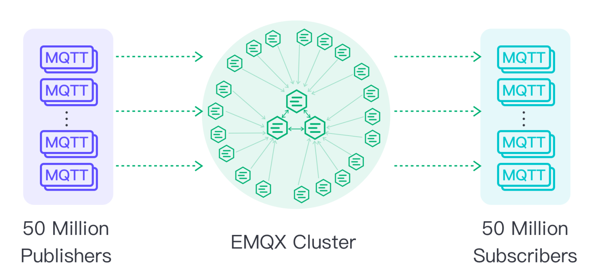

# 新機能

このセクションでは、EMQX Enterprise 5.0以降で導入された新機能を紹介します。

## コア＋レプリカ クラスターアーキテクチャ

EMQX 5.0では、新しい[Mriaクラスターアーキテクチャ](../develop/cluster/mria-introduction.md)を採用しています。このアーキテクチャにより、1つのEMQXクラスターで[1億の同時MQTT接続](https://www.emqx.com/en/blog/reaching-100m-mqtt-connections-with-emqx-5-0)をサポート可能となり、世界で最もスケーラブルなオープンソースMQTTブローカーとなっています。



この明らかなスケーラビリティの向上に加え、Mriaクラスターアーキテクチャは大規模展開におけるブレインスプリットのリスクとその影響を低減し、より安定で信頼性の高いIoTデータアクセスサービスをクライアントに提供します。

導入方法は[EMQXクラスターの作成](../operate/cluster/create-cluster.md)をご覧ください。

## ダウンタイムなしのローリングアップグレード

EMQX 5.1からは、クラスターのシームレスなローリングアップグレードをサポートしています。これにより、サービスの中断なしに新バージョンへ移行でき、システム全体の可用性と信頼性が向上します。

## MQTT over QUIC

EMQX 5.0では、実験的機能としてQUIC対応（MQTT over QUIC）を導入し、独自のメッセージング機構と管理手法を設計しました。EMQX 5.1では[QUICマルチストリーム](https://www.emqx.com/en/blog/emqx-newsletter-202302)のサポートを追加し、現在はこの機能を「一般提供」と位置付けています。

次世代インターネットプロトコルHTTP/3の基盤となるトランスポートプロトコルである[QUIC](https://datatracker.ietf.org/doc/html/rfc9000)は、TCP/TLSに比べて接続オーバーヘッドやメッセージレイテンシを低減し、モダンなモバイルインターネットに適した接続性を提供します。そこでEMQXはMQTTのトランスポート層をQUICに置き換え、MQTT over QUICを実現しました。

MQTT over QUICの評価やネットワーク接続性の改善効果を検証するには、[MQTT over QUICの使い方](../develop/mqtt-over-quic/getting-started.md)をご覧ください。

## MQTTによるファイル転送

EMQX 5.1では、MQTTプロトコルを用いたファイル転送機能を導入しました。

この機能は標準MQTTプロトコルの拡張実装に基づいており、既存のクライアントやアプリケーションを変更せずに統合可能です。クライアントはMQTTプロトコルで特定のトピックにファイルのセグメントを送信し、転送完了後にサーバー側でファイルセグメントを結合してローカルディスクに保存するか、S3互換のオブジェクトストレージにエクスポートします。

HTTP/FTPプロトコルと比較して、MQTTは低帯域幅消費と最小限のリソース利用を実現し、高速かつ効率的なファイル転送が可能です。統一されたIoTデータチャネルによりシステム構成も簡素化され、アプリケーションの複雑さや保守コストを削減します。

[MQTTによるファイル転送](../develop/file-transfer/introduction.md)をぜひお試しください。

## バックアップとリストア

EMQX 5.1では、コマンドラインツールによるバックアップとリストア機能を導入しました。組み込みデータベースからデータや設定ファイルを圧縮パッケージとしてエクスポートし、新しいクラスターに復元できます。

::: details 使用例
バックアップの作成例：

```bash
$ ./bin/emqx ctl data export
...
Data has been successfully exported to data/backup/emqx-export-2023-06-21-14-07-31.592.tar.gz.
```

バックアップのリストア例：

```bash
./bin/emqx ctl data import <File>
```
:::

詳細は[バックアップとリストア](../operate/backup-restore.md)をご覧ください。

## 再設計されたIoTデータ統合

SQLに加え、EMQX 5.xのルールエンジンは[jq](https://stedolan.github.io/jq/)もサポートし、より複雑なJSONデータ形式の処理が可能になりました。詳細は[jq関数のドキュメント](../develop/data-integration/rule-sql-jq.md)をご参照ください。

EMQXはデフォルトでWebHookへのデータ送信や外部MQTTサービスとの双方向データ統合をサポートします。40以上のクラウドサービスやエンタープライズシステムにリアルタイムでIoTデータを送信したり、そこからデータを取得して処理後に指定トピックへ送信できます。EMQX 5.0ではダッシュボードでデータ統合プロセスを可視化するFlows機能を提供し、ルールエンジンのIoTデータ処理や外部データサービス・デバイスへのデータフローを簡単に確認可能です。

対応する各種データ統合の詳細と設定方法は[データ統合](../develop/data-integration/data-bridges.md)をご覧ください。

## 柔軟な認証／認可

EMQX 5.xは組み込みのクライアント認証／認可機能を提供し、ユーザーは簡単な設定で様々なデータソースと連携したユーザー認証や多様なシナリオでのデータセキュリティを実現できます。

**新機能**

- クラスター単位での認証／認可設定をDashboardから操作可能
- Dashboardによる設定、導入、管理をサポート
- 認証器と認可チェッカーの実行順序調整をサポート
- 実行速度や回数の統計による完全な可観測性を実現
- リスナー単位での認証設定をサポートし、より柔軟なアクセス制御を提供

Dashboardや設定ファイルによる認証／認可設定の詳細は[認証](../operate/access-control/authn/authn.md)および[認可](../operate/access-control/authz/authz.md)をご覧ください。

## 使いやすくなったEMQXダッシュボード

EMQX 5.xではダッシュボードを全面的に再設計し、視覚的な体験を向上させ、より強力でユーザーフレンドリーな機能を備えています。

**新機能**

- 新UI/UXデザイン：リアルタイムの可観測性を大幅に強化
- メニュー構造の最適化：コンテンツへの高速かつ直接的なアクセス
- データ監視と管理：重要データを一目で把握
- 可視化されたアクセス制御：認証／認可管理を標準搭載
- 可視化されたデータフロー：[Flows](../develop/flow-designer/introduction.md)により、デバイスやクライアントからルールエンジンを経てのデータフローを明確に確認可能
- 実行時の設定更新：即時反映されるホットアップデート対応

## ブリッジ向けの過負荷保護、リミッター、バッファキュー

新機能の**リミッター**は、接続数やメッセージレートの制御をより精密かつ階層的に行う機能です。クライアント、リスナー、ノード単位でクライアントの動作を制限し、想定された負荷内でシステムを運用可能にします。過負荷保護とリミッターの組み合わせにより、クライアントの過負荷や過剰なリクエストを防ぎ、安定したシステム運用を実現します。

また、すべてのブリッジに汎用バッファキューを追加し、過負荷時に発生するメッセージをバッファリング可能にしました。このバッファはネットワーク変動やサービスダウン時など外部リソースが利用できない場合に、メモリまたはディスクキャッシュにメッセージを保存します。サービス復旧後にバッファ内のメッセージを送信しますが、バッファ内のリクエストは期限切れになる場合があります。これはバージョン4との大きな違いです。バッファ容量が上限を超えると、先入れ先出し（FIFO）で破棄されます。

## クラウドネイティブとEMQXオペレーター

クラウドネイティブアプリケーションには水平スケールと弾力的なクラスターが必須です。

[EMQX Kubernetes Operator](https://www.emqx.com/en/emqx-kubernetes-operator)を使うことで、EMQX 5.xのレプリカントノードを最大限に活用できます。Kubernetes DeploymentでステートレスなEMQXノードをデプロイし、大規模なMQTT接続数とメッセージスループットをサポートするEMQXクラスターを構築可能です。

## 新しいゲートウェイフレームワーク

EMQX 5.1では、マルチプロトコルアクセスのための基盤アーキテクチャを再構築し、統一された設定フォーマットと管理インターフェースを備えた新しい拡張ゲートウェイフレームワークを提供します。

- **統一された統計・監視指標：** EMQX 5.0ではゲートウェイ／クライアントレベルの統計指標（送受信バイト数、メッセージ数など）を提供
- **独立した接続・セッション管理：** EMQX 4.xではゲートウェイクライアントもMQTTクライアントリストで管理されていましたが、EMQX 5.0ではゲートウェイごとに独立したページを作成し、1つのClient IDを複数ゲートウェイで再利用可能
- **独立したクライアント認証：** EMQX 4.xではゲートウェイ認証もMQTTクライアント管理下でしたが、EMQX 5.0ではゲートウェイごとに独自の認証機構を設定可能
- **明確な仕様による拡張の容易さ：** 標準的な概念とインターフェースを提供し、ゲートウェイのカスタマイズを容易に

新しいゲートウェイフレームワークにより、複数プロトコルのアクセスを統一的に管理し、EMQXの使いやすさがさらに向上しました。サードパーティプロトコルを実装するクライアントも、データ統合、安全で信頼性の高い認証／認可、数十億規模の水平スケール能力など、EMQXの利点を活用できます。

## **その他の機能更新**

### 簡素化された設定

設定ファイルは簡潔で読みやすい[HOCON](https://github.com/emqx/hocon)形式に変更され、よく使われる設定項目をデフォルトで含むことで、可読性と保守性を向上させています。

### 改良されたREST API

REST APIはOpenAPI 3.0仕様に準拠し、明確で豊富なAPIドキュメントを備えています。

### 迅速なトラブルシューティング

スローサブスクリプションやオンライン追跡などの診断ツールが追加され、本番環境での問題解決を迅速化します。

### 構造化ログ

機械（インデクサー）に優しいJSON形式の構造化ログをサポート。エラーログは一貫して'msg'トークンでタグ付けされ、問題の原因特定を容易にします。

### 柔軟な拡張とカスタマイズ

新しいプラグインアーキテクチャを開発し、ユーザーは独立したプラグインパッケージとして拡張プラグインをコンパイル、配布、インストールしてEMQXの利用をカスタマイズ・拡張可能です。
