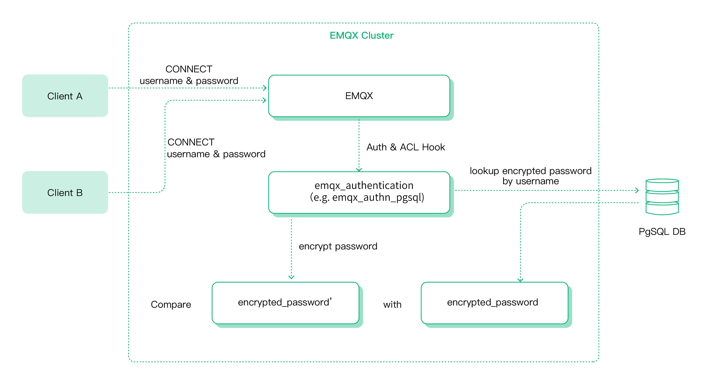
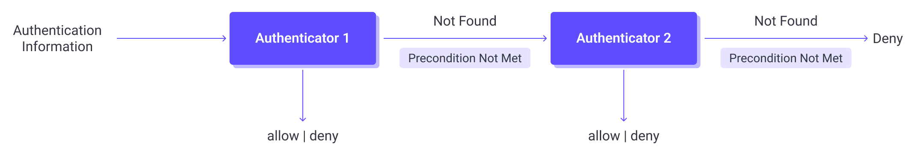
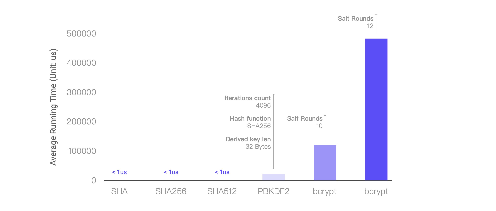
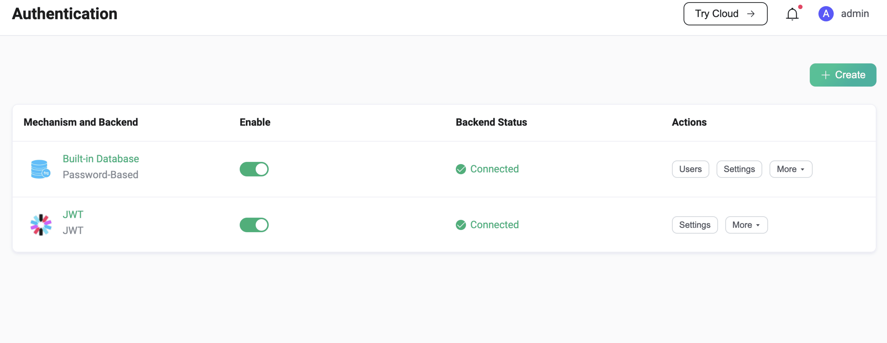

# 認証

認証はクライアントの身元を検証するプロセスです。ほとんどのアプリケーションにおいて不可欠な要素であり、不正なクライアント接続からサービスを保護するのに役立ちます。

EMQXは複数の認証メカニズムをサポートしており、さらにクライアントとサーバー間の認証要求オプションを提供する[TLS X.509](https://en.wikipedia.org/wiki/X.509)証明書認証および[TLS-PSK](https://www.rfc-editor.org/rfc/rfc4279)認証もサポートしています。

本節では、身元認証の基本概念と設定について説明します。

::: tip

デフォルトでは、EMQXは認証機能を有効にしておらず、すべてのクライアントの接続を許可します。実運用環境で使用する場合は、少なくとも1つの認証方式を事前に設定してください。

:::

## 認証メカニズム

EMQXがサポートする認証メカニズムは以下の通りです。

- X.509証明書認証
- JWT認証
- ユーザー名／パスワード認証
- MQTT 5.0の拡張認証
- PSK認証

### X.509証明書認証

EMQXはクライアント認証のために[X.509証明書認証](./x509.md)をサポートしています。EMQXでX.509証明書認証を使用すると、クライアントとサーバーはTLS/SSLを介して信頼された接続を確立でき、通信当事者の真正性と送信データの完全性を保証します。EMQXは片方向認証（クライアントがサーバーのみを認証）と双方向認証（クライアントとサーバーがお互いの証明書を検証）をサポートしており、さまざまなセキュリティ要件や展開シナリオに対応可能です。

### JWT認証

[JSON Web Token (JWT)](https://jwt.io/)はトークンベースの認証メカニズムであり、サーバー側でクライアントの認証情報やセッション情報を保持しません。

クライアントは接続要求にJWTを含み、EMQXは事前に設定されたシークレットまたは公開鍵を用いてJWTの署名を検証します。JWKSエンドポイントを設定している場合、JWT認証器はJWKSエンドポイントから取得した公開鍵リストを使ってJWT署名を検証します。

### パスワード認証

EMQXは最もシンプルで一般的なパスワード認証をサポートしており、クライアントはユーザー名、クライアントID、および対応するパスワードなどの認証情報を提供する必要があります。場合によっては、TLS証明書の一部フィールド（例：証明書のCommon Name）をクライアントの身元認証情報として使用することもあります。いずれの場合も、これらの認証情報は事前にデータベースに保存されており、パスワードは通常ソルト付きハッシュ形式で保存されます。

EMQXのパスワード認証の動作は以下の通りです。クライアントは接続要求時に認証情報を携帯し、EMQXはクライアントが提供した認証情報に対応するハッシュ化パスワードをデータベースから照会し、一致した場合にのみ接続を許可します。



組み込みデータベースのほかに、EMQXはMySQL、PostgreSQL、MongoDB、Redisなどの各種バックエンドデータベースとの統合もサポートしています。

また、EMQXはユーザーが開発したHTTPサーバーなどの外部サービスに認証処理を委譲する設定も可能です。

### MQTT 5.0 拡張認証

[MQTT 5.0の拡張認証](https://www.emqx.com/en/blog/mqtt5-enhanced-authentication)は基本認証を拡張し、チャレンジ／レスポンス方式の認証を含みます。拡張認証の実装により、SCRAM認証（Salted Challenge Response Authentication Mechanism）やKerberos認証など、より安全な認証メカニズムを利用可能です。EMQXの具体的な拡張認証実装は、組み込みデータベースおよび外部HTTPサービスを通じたSCRAMユーザー管理をサポートしています。

### PSK認証

EMQXの[PSK認証](../../network/psk-authentication.md)は、証明書ベースのTLSに代わるよりシンプルかつ安全な認証方法を提供します。クライアントとサーバーが共通の秘密鍵を共有し、デジタル証明書を必要としません。このメカニズムは、証明書処理のオーバーヘッドが大きいリソース制約のある環境で特に有用です。

## EMQX認証器

EMQXは認証メカニズムおよびバックエンドデータベースに基づき、以下の認証方式（以下「認証器」と呼ぶ）をサポートしています。

| メカニズム       | データベース          | 説明                                                        |
| -------------- | ----------------- | ------------------------------------------------------------ |
| パスワードベース | 組み込みデータベース | [Mnesiaデータベースを認証情報ストレージとして使用する認証](./mnesia.md) |
| パスワードベース | MySQL             | [MySQLデータベースを認証情報ストレージとして使用する認証](mysql.md) |
| パスワードベース | PostgreSQL        | [PostgreSQLデータベースを認証情報ストレージとして使用する認証](postgresql.md) |
| パスワードベース | MongoDB           | [MongoDBデータベースを認証情報ストレージとして使用する認証](./mongodb.md) |
| パスワードベース | Redis             | [Redisデータベースを認証情報ストレージとして使用する認証](./redis.md) |
| パスワードベース | LDAP              | [LDAPサーバーを認証情報ストレージとして使用する認証](./ldap.md) |
| パスワードベース | HTTPサーバー       | [外部HTTP APIを使った認証情報検証認証](./http.md)               |
| JWT            |                   | [JWTを使った認証](./jwt.md)                                   |
| SCRAM          | 組み込みデータベース | [SCRAMを使った認証](./scram.md)                               |
| SCRAM          | HTTPサーバー       | [RESP APIベースのSCRAM認証](./scram_restapi.md)                |
| GSSAPI         | Kerberos          | [Kerberosを使ったGSSAPI認証](./kerberos.md)                    |
| ルールベース     |                   | [Client-infoを使った認証](./cinfo.md)                          |

## 認証チェーン

EMQXは認証チェーンの作成をサポートしており、複数の認証器を定義された順序で評価できます。チェーン内の各認証器は異なるタイプである必要があります（例：1つはHTTP、1つはLDAP、1つは組み込みデータベース）。

::: tip

現時点でEMQXはMQTTクライアント向けの認証チェーンのみサポートしています。ゲートウェイは認証チェーンをサポートせず、単一の認証器を使用してください。

:::

X.509証明書ベースの認証が適用される場合は、認証チェーンの実行前に必ず実行されます。

### 認証チェーンの動作

認証チェーンが設定されている場合、EMQXはまず最初の認証器で一致する認証情報を取得しようとし、失敗した場合は次の認証器に切り替えて処理を続行します。

パスワードベース認証を例に動作を説明します。

1. **前提条件の評価（設定されている場合）**  
   認証器に[前提条件](#authenticator-preconditions)がある場合、EMQXはクライアント属性情報（例：`listener`、`clientid`、`username`）に基づいて式を評価します。  
   - 式が`true`の場合、認証器が呼び出されます。  
   - そうでなければ認証器はスキップされます。

2. **認証器の実行**  
   - 認証情報が見つかり有効（例：パスワードが正しい）なら、クライアントは認証成功となり接続が許可されます。  
   - 認証情報が見つかったが無効なら、クライアントはアクセス拒否されます。  
   - 認証情報が見つからなければ、EMQXはチェーン内の次の認証器に移動します。

3. **エラーまたは無効時のスキップ**  
   認証器が無効化されている場合や、実行中に内部エラー（例：データベースが利用不可）が発生した場合もスキップされます。

4. **フォールバック動作**  
   すべての認証器がスキップされるか、いずれもクライアントを認証できなかった場合、EMQXはデフォルトで接続を拒否します。



### 認証器の前提条件

EMQX 5.9以降、各認証器に前提条件を割り当てて、特定のクライアントに対して認証器を呼び出すかどうかを制御できます。前提条件は[Variform式](../../configuration/configuration.md#variform-expressions)であり、クライアント属性（`listener`、`username`、`clientid`など）を評価します。式が`true`と評価されない場合、認証器はスキップされます。

この機能により認証チェーン内で条件分岐が可能となり、異なるリスナー経由のクライアントに異なる認証器を適用するなど、認証ロジックの細かな制御が可能です。EMQXは適切な場合にのみ認証器を呼び出し、不要な外部システムへのリクエストを回避します。

#### 前提条件でサポートされるクライアント属性

前提条件で利用可能なクライアント属性は以下の通りです。

- `username`: クライアントのユーザー名
- `password`: クライアントのパスワード
- `clientid`: クライアントID
- `client_attrs.*`: クライアント属性
- `cert_common_name`: クライアントTLS証明書のSubjectフィールド
- `cert_subject`: クライアントTLS証明書のCommon Name（CN）
- `peersni`: TLSクライアントが送信したSNI（Server Name Indication）
- `listener`: リスナーID（例：`tcp:default`）
- `zone`: 関連付けられた設定ゾーン

#### 前提条件の例

異なるリスナー経由のクライアントを異なる認証器で認証する例：

- `tcp:default`のクライアントに対してHTTP認証器を適用：

  ```
  str_eq(listener, 'tcp:default')
  ```

- `ssl:default`のクライアントに対してPostgreSQL認証器を適用：

  ```
  str_eq(listener, 'ssl:default')
  ```

JWT認証器とパスワード認証器を1つの認証チェーンで組み合わせる場合、JWT認証器に以下の前提条件を設定します。

```
is_jwt(password)
```

EMQX 6.2.3以降、この前提条件はパスワードが構造的にJWTである場合にのみ`true`を返します。JWTパスワードの場合はJWT認証器が呼び出され、そうでない場合やパスワードがない場合はJWT認証器をスキップし、次の認証器に処理を移します。

## 外部リソースキャッシュ

EMQXはMySQL、MongoDB、Redisなどの外部バックエンドから取得した認証結果をノード単位でキャッシュする仕組みを提供しています。このキャッシュは認証結果の検索性能を向上させ、特に高スループット環境での外部リソースへの重複アクセスを削減します。

::: tip 注意

外部リソースキャッシュは外部データソースにのみ適用されます。組み込みデータベース認証器などローカルソースには適用されません。

:::

### 外部リソースキャッシュの動作

外部リソースキャッシュはノード単位で認証結果を保存し、同一ノード上のすべてのクライアントセッションで共有されます。これにより外部認証バックエンドへの重複問い合わせを防ぎます。

1. クライアントが接続し認証がトリガーされる。
2. EMQXはキャッシュに既存の認証結果があるか確認する。  
   - 有効な結果があれば**キャッシュヒット**となり、外部バックエンドへの問い合わせは行われない。  
   - 結果がなければ**キャッシュミス**となり、外部バックエンドに問い合わせる。

3. バックエンドから返された結果はキャッシュに保存され、**キャッシュ挿入**メトリクスが増加する。

この仕組みはレイテンシの低減、バックエンド負荷の軽減、システムの応答性維持に寄与します。

### 外部リソースキャッシュの有効化と設定

EMQXダッシュボードから外部リソースキャッシュを有効化および設定できます。

1. **アクセス制御** -> **認証** に移動します。

2. 右上の **外部リソースキャッシュ設定** ボタンをクリックすると、右側からサイドパネルが表示されます。

3. パネル内の **外部リソースキャッシュを有効にする** ボタンでキャッシュ機能をオン／オフできます。有効化後、以下のキャッシュ設定を行います。

   | 項目名                           | 説明                                                        |
   | -------------------------------- | ------------------------------------------------------------ |
   | **最大キャッシュアイテム数**       | ノードあたりの最大キャッシュエントリ数。デフォルト：`1,000,000`。 |
   | **最大メモリ使用量**              | キャッシュのメモリ使用上限。デフォルト：`100 MB`。           |
   | **キャッシュTTL**                 | キャッシュエントリの有効期間。デフォルト：`1分`。             |

4. **更新** をクリックして設定を反映します。

これらの設定はクラスター全体に適用され、すべてのノードで一貫した動作を保証します。

### 外部リソースキャッシュの状態監視

<!--@include: ../monitor-cache-status.md-->

## スーパーユーザー

通常、認証はクライアントの身元認証情報の検証のみを行い、クライアントが特定のトピックに対してパブリッシュ／サブスクライブする権限を持つかどうかは認可システムで判断します。しかしEMQXはスーパーユーザーの役割と権限プリセット機能を提供しており、パブリッシュ／サブスクライブの認可ステップを支援します。

::: tip

権限プリセットはJWT認証およびHTTP認証でサポートされています。現在のクライアントが所有するパブリッシュ／サブスクライブ権限の[アクセス制御リスト（ACL）](./acl.md)はJWTペイロードやHTTPレスポンスボディに含まれ、認証通過後にクライアントにプリセットされます。

:::

データベースクエリ、HTTPレスポンス、JWTクレームの`is_superuser`フィールドでユーザーがスーパーユーザーかどうかを確認できます。

## パスワードハッシュ化

パスワードを平文で保存すると、データベースを覗いた誰もがパスワードを読み取れてしまいます。そのため、パスワードはハッシュ化アルゴリズムを用いてハッシュ値として保存することが推奨されます。EMQXは様々なセキュリティ要件に対応するため、多様なパスワードハッシュアルゴリズムをサポートしています。

また、EMQXはソルトをハッシュに加えることもサポートしており、ソルトを加えたユニークなハッシュ（password_hash）は様々な攻撃から保護します。

### ワークフロー

パスワードハッシュ化のワークフローは以下の通りです。

1. EMQX認証器は設定されたクエリ文で、ハッシュ化パスワードやソルト値を含む適格な認証情報をデータベースから取得します。
2. クライアントが接続を試みる際、EMQX認証器はクライアントが提供したパスワードを設定されたハッシュアルゴリズムと取得したソルト値でハッシュ化します。
3. EMQX認証器はステップ1で取得したハッシュ化パスワードとステップ2で計算したハッシュ値を比較し、一致すれば認証を許可します。

EMQXがサポートするハッシュアルゴリズムは以下の通りです。

```
# シンプルなアルゴリズム
password_hash_algorithm {
  name = sha256             # plain, md5, sha, sha512
  salt_position = suffix    # prefix, disable
}

# bcrypt
password_hash_algorithm {
  name = bcrypt
}

# pbkdf2
password_hash_algorithm {
  name = pbkdf2
  mac_fun = sha256          # md4, md5, ripemd160, sha, sha224, sha384, sha512
  iterations = 4096
  dk_length = 32           # 任意、単位：バイト
}
```

ハッシュアルゴリズムによって性能差が大きいため、用途に応じて選択してください。参考までに、4コア8GBマシンで各アルゴリズムを100回実行した平均実行時間は以下の通りです。



## 認証プレースホルダー

EMQXはクエリ文やHTTPリクエスト内でプレースホルダーを使用可能です。認証時にこれらのプレースホルダーは実際のクライアント情報に置き換えられ、現在のクライアントにマッチするクエリやHTTPリクエストが構築されます。

有効なプレースホルダーは`${PATH.TO.VALUE}`の形式で、PATH.TO.VALUEはオブジェクト内の値へのドット区切りパスです。使用可能な文字は英数字、ドット（`.`）、アンダースコア（`_`）です。サポートされない文字を含む場合はプレースホルダーとして扱われず、単なるテキストとして処理されます。

例えば、EMQXのMySQL認証器ではデフォルトのクエリSQLに`${username}`プレースホルダーが使われています。

```
SELECT password_hash, salt FROM mqtt_user where username = ${username} LIMIT 1
```

クライアント（名前：`emqx_u`）が接続要求を送ると、構築されるクエリ文は以下のようになります。

```
SELECT password_hash, salt FROM mqtt_user where username = 'emqx_u' LIMIT 1
```

EMQXが現在サポートするプレースホルダーは以下の通りです。

- `${clientid}`: 実行時にクライアントIDに置き換えられます。クライアントIDは通常`CONNECT`パケットで明示的に指定されますが、`use_username_as_clientid`や`peer_cert_as_clientid`が有効な場合はユーザー名や証明書のフィールド、証明書内容で上書きされます。

- `${username}`: 実行時にユーザー名に置き換えられます。ユーザー名は`CONNECT`パケットの`Username`フィールドから取得されます。`peer_cert_as_username`が有効な場合は証明書のフィールドや内容で上書きされます。

- `${password}`: 実行時にパスワードに置き換えられます。パスワードは`CONNECT`パケットの`Password`フィールドから取得されます。

- `${peerhost}`: 実行時にクライアントのIPアドレスに置き換えられます。EMQXは[Proxy Protocol](http://www.haproxy.org/download/1.8/doc/proxy-protocol.txt)をサポートしており、TCPプロキシやロードバランサーの背後に配置されていても実際のIPアドレスを取得可能です。

- `${peername}`: 実行時にクライアントのIPアドレスとポートに置き換えられ、`IP:PORT`形式となります。

- `${cert_subject}`: 実行時にクライアントTLS証明書のSubjectに置き換えられます。ロードバランサーがクライアント証明書情報をTCPリスナーに送信する場合はProxy Protocol v2の使用を確認してください。

- `${cert_common_name}`: 実行時にクライアントTLS証明書のCommon Nameに置き換えられます。ロードバランサーがクライアント証明書情報をTCPリスナーに送信する場合はProxy Protocol v2の使用を確認してください。

- `${client_attrs.NAME}`: クライアント属性。`NAME`は事前設定された属性名に置き換えられます。クライアント属性の詳細は[MQTTクライアント属性](../../../develop/client-attributes/client-attributes.md)を参照してください。

- `${zone}`: 実行時にクライアントのゾーンに置き換えられます。`${zone}`プレースホルダーは認証テンプレートで直接使用可能です。ゾーン設定の詳細は[ゾーンオーバーライド](../../configuration/configuration.md#zone-override)を参照してください。

  例えば、以下のACLルールは`${zone}`を使ってクライアントの割り当てゾーンに基づき動的に権限を適用します。

  ```
  {allow, all, all, ["${zone}/${username}/#"]}
  ```

## 認証の設定

EMQXは認証の設定方法として、ダッシュボード、設定ファイル、HTTP APIの3つを提供しています。

### ダッシュボードでの認証設定

EMQXダッシュボードは認証器の設定状況確認やカスタマイズに直感的に利用できます。下図の例では、組み込みデータベースベースのパスワード認証とJWT認証の2つの認証器が設定されています。



### 設定ファイルでの認証設定

設定ファイルでもEMQX認証器を設定可能です。

例えば、以下の`authentication`フィールドでは複数の認証器からなる認証チェーンを作成しており、設定ファイル内の順序で認証器が実行されます。

```
# base.hocon

# すべてのMQTTリスナーに対するグローバル認証チェーン
authentication = [
  ...
]

listeners.tcp.default {
  ...
  # 指定したMQTTリスナーに対する認証チェーン
  authentication = [
    ...
  ]
}

gateway.stomp {
  ...
  # すべてのSTOMPリスナーに対するグローバル認証器
  authentication = {
    ...
  }

}
```

認証器の種類によって設定項目は異なります。詳細は設定章を参照してください。<!--後続で該当章へのリンク挿入予定-->

### HTTP APIでの認証設定

設定ファイルに比べ、HTTP APIはより便利でランタイム更新をサポートし、クラスター全体に設定変更を自動同期できます。

EMQX認証APIを使って認証チェーンや認証器を管理可能です。例えば、グローバル認証器の作成や特定認証器の設定更新が行えます。

- `/api/v5/authentication`: グローバルMQTT認証管理用APIエンドポイント
- `/api/v5/gateway/{protocol}/authentication`: 他アクセスプロトコルのグローバル認証管理用APIエンドポイント
- `/api/v5/gateway/{protocol}/listeners/{listener_id}/authentication`: 他アクセスプロトコルのリスナー認証管理用APIエンドポイント

#### 認証器ID

特定の認証器を操作するには、上記エンドポイントに認証器IDを付加します（例：`/api/v5/authentication/{id}`）。メンテナンスを容易にするため、IDはEMQXが自動生成してAPIで返すのではなく、以下の規則に従います。

```
<mechanism>:<backend>
```

または

```
<mechanism>
```

例：

1. `password_based:built_in_database`
2. `jwt`
3. `scram:built_in_database`

リスナーIDについても同様の規則があります。

```bash
<transport_protocol>:<name>
```

ゲートウェイリスナーIDはプロトコル名を先頭に付加します。

```bash
<protocol>:<transport_protocol>:<name>
```

認証器IDおよびリスナーIDはURLで使用する際にURLエンコード規則に従う必要があり、例えば`:`は`%3A`に置き換えます。

```bash
PUT /api/v5/authentication/password_based%3Abuilt_in_database
```

#### データ操作API

[組み込みデータベース](./mnesia.md)および[MQTT 5.0拡張認証](./scram.md)を使った認証では、認証データの作成、更新、削除、一覧取得などを行うHTTP APIを提供しています。詳細は[HTTP APIで認証データを管理する](./user_management.md)を参照してください。

APIリクエストやパラメータの詳細は[HTTP API](../../api.md)を参照してください。
