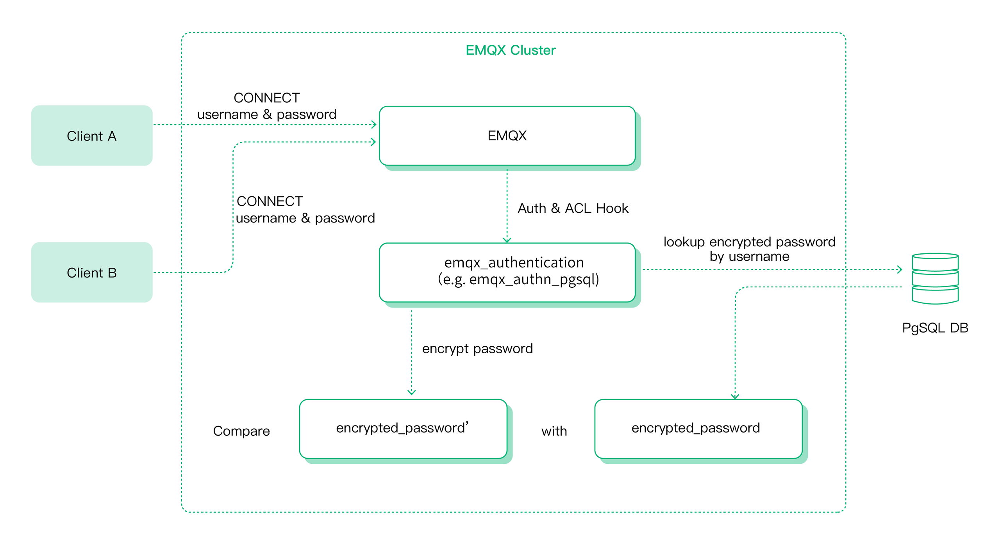
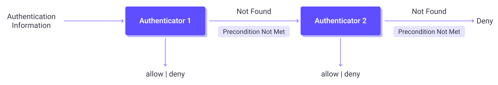
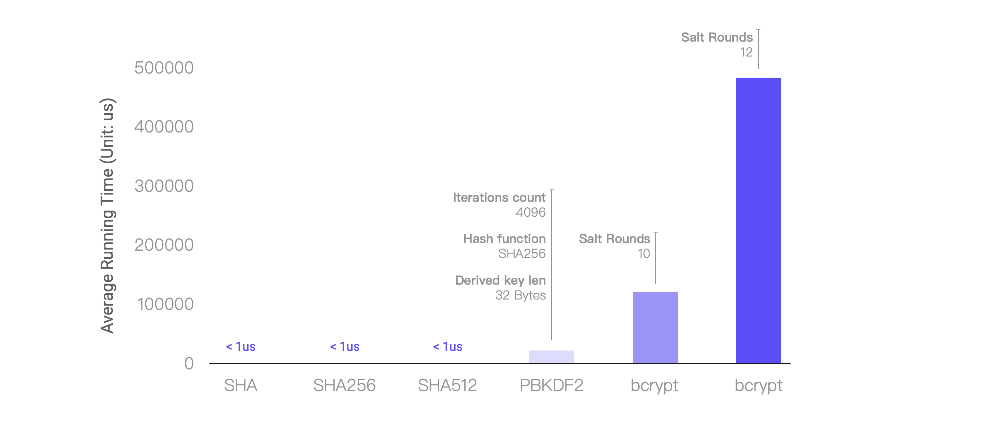
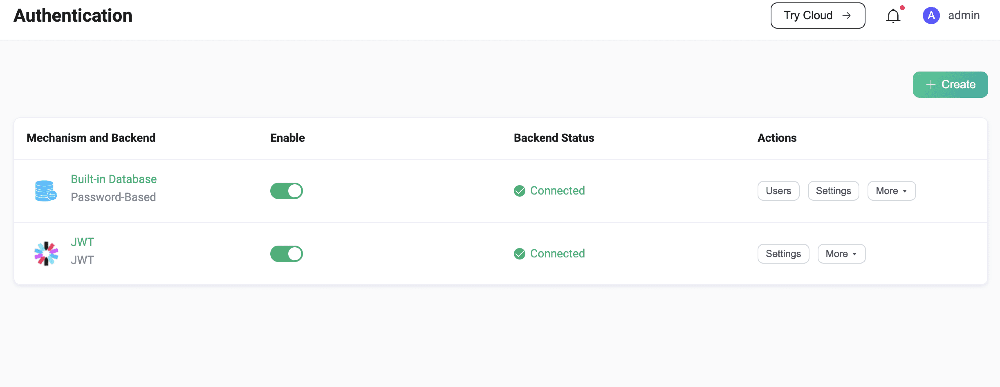

# 認証

認証はクライアントの身元を検証するプロセスです。これはほとんどのアプリケーションにおいて不可欠なものであり、不正なクライアント接続からサービスを保護するのに役立ちます。

EMQXは複数の認証メカニズムをサポートしており、[TLS X.509](https://en.wikipedia.org/wiki/X.509)証明書認証や[TLS-PSK](https://www.rfc-editor.org/rfc/rfc4279)認証もサポートしています。これにより、クライアントとサーバー間の認証要求に対する選択肢を提供します。

本節では、身元認証の基本概念と設定について説明します。

::: tip

デフォルトでは、EMQXは認証機能を有効にしておらず、すべてのクライアントの接続を許可します。運用環境で使用する場合は、少なくとも1つの認証方法を事前に設定してください。

:::

## 認証メカニズム

EMQXがサポートする認証メカニズムは以下の通りです：

- X.509証明書認証
- JWT認証
- ユーザー名／パスワード認証
- MQTT 5.0の拡張認証
- PSK認証

### X.509証明書認証

EMQXはクライアント認証のために[X.509証明書認証](./x509.md)をサポートしています。EMQXでX.509証明書認証を使用すると、クライアントとサーバーはTLS/SSLを通じて信頼できる接続を確立し、通信当事者の真正性と送信データの整合性を保証します。EMQXは片方向認証（一方が認証される）と双方向認証（双方が相互に証明書を検証する）の両方をサポートしており、様々なセキュリティ要件や展開シナリオに対応可能です。

### JWT認証

[JSON Web Token (JWT)](https://jwt.io/)は、サーバーがクライアントの認証情報やセッション情報を保持しないトークンベースの認証メカニズムです。

クライアントは接続要求時にJWTを携帯し、EMQXは事前に設定されたシークレットまたは公開鍵を使ってJWT署名を検証します。ユーザーがJWKSエンドポイントを設定した場合、JWT認証器はJWKSエンドポイントから取得した公開鍵リストを用いてJWT署名を検証します。

### パスワード認証

EMQXは最もシンプルで一般的なパスワード認証をサポートしており、クライアントはユーザー名、クライアントID、対応するパスワードなどの認証情報を提供する必要があります。場合によってはTLS証明書の一部フィールド（例：証明書のCommon Name）をクライアントの身元認証情報として使用することも可能です。いずれの場合も、これらの認証情報は事前にデータベースに保存されており、パスワードは通常ソルト付きハッシュ形式で保存されます。

EMQXにおけるパスワード認証の仕組みは以下の通りです：クライアントは接続要求時に認証情報を携帯し、EMQXはクライアントが提供した認証情報に対応するハッシュ化されたパスワードをデータベースから照会し、一致した場合のみ接続を許可します。


組み込みデータベースのほか、EMQXはMySQL、PostgreSQL、MongoDB、Redisなどの各種バックエンドデータベースとの連携もサポートしています。

さらに、EMQXはユーザーが開発したHTTPサーバーなど外部サービスに認証処理を委譲する設定も可能です。

### MQTT 5.0 拡張認証

[MQTT 5.0拡張認証](https://www.emqx.com/en/blog/mqtt5-enhanced-authentication)は基本認証を拡張し、チャレンジ／レスポンス方式の認証を含みます。拡張認証の実装により、SCRAM認証（Salted Challenge Response Authentication Mechanism）やKerberos認証など、より安全な認証メカニズムの利用が可能です。EMQXの拡張認証は組み込みデータベースおよび外部HTTPサービスを通じたSCRAMユーザー管理をサポートしています。

### PSK認証

EMQXの[PSK認証](../../network/psk-authentication.md)は、証明書ベースのTLSに代わるシンプルかつ安全な認証方法を提供します。クライアントとサーバーが共有する秘密鍵に基づくため、デジタル証明書を必要としません。このメカニズムは、証明書の管理にかかるオーバーヘッドが大きいリソース制約のある環境で特に有効です。

## EMQX認証器

EMQXは認証メカニズムとバックエンドデータベースに基づき、以下の認証方法（以下「認証器」と呼びます）をサポートしています：

| メカニズム      | データベース          | 説明                                                  |
| -------------- | ----------------- | ------------------------------------------------------------ |
| パスワードベース | 組み込みデータベース | [Mnesiaデータベースを認証情報ストレージとして使用する認証](./mnesia.md) |
| パスワードベース | MySQL             | [MySQLデータベースを認証情報ストレージとして使用する認証](./mysql.md) |
| パスワードベース | PostgreSQL        | [PostgreSQLデータベースを認証情報ストレージとして使用する認証](./postgresql.md) |
| パスワードベース | MongoDB           | [MongoDBデータベースを認証情報ストレージとして使用する認証](./mongodb.md) |
| パスワードベース | Redis             | [Redisデータベースを認証情報ストレージとして使用する認証](./redis.md) |
| パスワードベース | LDAP              | [LDAPサーバーを認証情報ストレージとして使用する認証](./ldap.md) |
| パスワードベース | HTTPサーバー       | [外部HTTP APIを用いた認証情報検証による認証](./http.md) |
| JWT            |                   | [JWTを用いた認証](./jwt.md)                         |
| SCRAM          | 組み込みデータベース | [SCRAMを用いた認証](./scram.md)                     |
| SCRAM          | HTTPサーバー       | [RESP APIベースのSCRAM認証](./scram_restapi.md) |
| GSSAPI         | Kerberos          | [Kerberosを用いたGSSAPI認証](./kerberos.md)   |
| ルールベース     |                   | [Client-infoを用いた認証](./cinfo.md)                         |

## 認証チェーン

EMQXは認証チェーンの作成をサポートしており、複数の認証器を定義された順序で評価できます。チェーン内の各認証器は異なるタイプでなければなりません（例：HTTP認証器1つ、LDAP認証器1つ、組み込みデータベース認証器1つなど）。

::: tip

現時点でEMQXはMQTTクライアント向けの認証チェーン作成のみをサポートしています。ゲートウェイは認証チェーンをサポートしておらず、単一の認証器を使用してください。

:::

X.509証明書ベースの認証が適用される場合、認証チェーンの実行前に必ず実行されます。

### 認証チェーンの動作

認証チェーンを設定すると、EMQXはまず最初の認証器から認証情報の取得を試み、失敗した場合は次の認証器へ処理を移します。

パスワードベースの認証を例に動作を説明します：

1. **前提条件の評価（設定されている場合）**  
   認証器に[前提条件](#authenticator-preconditions)がある場合、EMQXはクライアント属性情報（例：`listener`、`clientid`、`username`）に基づいて式を評価します。  
   - 式が`true`の場合、認証器が呼び出されます。  
   - そうでなければ認証器はスキップされます。

2. **認証器の実行**  
   - 認証情報が見つかり有効（例：パスワードが正しい）なら、クライアントは認証成功となり接続が許可されます。  
   - 認証情報が見つかり無効なら、クライアントはアクセス拒否されます。  
   - 認証情報が見つからなければ、EMQXは次の認証器に処理を移します。

3. **エラーまたは無効時のスキップ**  
   認証器が無効化されている場合や、実行中に内部エラー（例：データベースが利用不可）が発生した場合もスキップされます。

4. **フォールバック動作**  
   すべての認証器がスキップされるか、いずれもクライアントを認証できなかった場合、EMQXはデフォルトで接続を拒否します。



### 認証器の前提条件

EMQX 5.9以降、各認証器に前提条件を割り当てることができ、特定のクライアントに対して認証器を呼び出すかどうかを制御できます。前提条件は[Variform式](../../configuration/configuration.md#variform-expressions)で、クライアント属性（`listener`、`username`、`clientid`など）を評価します。式が`true`と評価されない場合、認証器はスキップされます。

この機能により認証チェーンに条件付きロジックを組み込め、異なるリスナー経由のクライアントに異なる認証器を適用するなど、認証ロジックを細かく制御できます。EMQXは適切な場合にのみ認証器を呼び出し、不要な外部システムへのリクエストを回避します。

#### 前提条件でサポートされるクライアント属性

前提条件で使用可能なクライアント属性は以下の通りです：

- `username`：クライアントのユーザー名
- `password`：クライアントのパスワード
- `clientid`：クライアントID
- `client_attrs.*`：クライアント属性（`*`は設定済みの属性名に置換）
- `cert_common_name`：クライアントTLS証明書のSubjectフィールド
- `cert_subject`：クライアントTLS証明書のCommon Name（CN）
- `peersni`：TLSクライアントが送信したSNI（Server Name Indication）
- `listener`：リスナーID（例：`tcp:default`）
- `zone`：関連付けられたコンフィグゾーン

#### 前提条件の例

異なるリスナー経由のクライアントを異なる認証器で認証する例：

- `tcp:default`リスナーのクライアントにHTTP認証器を適用：

  ```
  str_eq(listener, 'tcp:default')
  ```

- `ssl:default`リスナーのクライアントにPostgreSQL認証器を適用：

  ```
  str_eq(listener, 'ssl:default')
  ```

JWT認証器とパスワード認証器を同一認証チェーンに組み合わせる場合、JWT認証器に以下の前提条件を設定します：

```
is_jwt(password)
```

EMQX 6.2.3以降、この前提条件はパスワードが構造的にJWTである場合のみ`true`を返します。パスワードがJWTでないか存在しない場合、EMQXはJWT認証器をスキップし、次の認証器に処理を移します。

## 外部リソースキャッシュ

EMQXはMySQL、MongoDB、Redisなどの外部バックエンドから取得した認証結果をノードレベルでキャッシュする仕組みを提供しています。このキャッシュは認証結果の検索性能を向上させ、特に高スループット環境での外部リソースへの繰り返しアクセスを削減します。

::: tip 注意

外部リソースキャッシュは外部データソースにのみ適用されます。組み込みデータベース認証器などローカルソースには適用されません。

:::

### 外部リソースキャッシュの動作

外部リソースキャッシュはノード単位で認証結果を保存し、同一ノード上のすべてのクライアントセッションで共有されます。これにより外部認証バックエンドへの重複クエリを回避します。

1. クライアントが接続し認証をトリガーする。
2. EMQXはキャッシュに以前の結果があるか確認する：  
   - 有効な結果があれば**キャッシュヒット**となり、外部バックエンドへの呼び出しは行われません。  
   - 結果がなければ**キャッシュミス**となり、EMQXは外部バックエンドに問い合わせます。

3. バックエンドから返された結果はキャッシュに保存され、**キャッシュ挿入**メトリクスが増加します。

この仕組みによりレイテンシを低減し、バックエンドの負荷を抑えつつシステムの応答性を維持します。

### 外部リソースキャッシュの有効化と設定

EMQXダッシュボードから外部リソースキャッシュを有効化・設定できます：

1. **アクセス制御** -> **認証** に移動します。

2. 右上の **外部リソースキャッシュ設定** ボタンをクリックすると、右側からパネルが表示されます。

3. パネル内の **外部リソースキャッシュを有効にする** ボタンでキャッシュ機能をオン／オフします。有効化後、以下のキャッシュ設定を行います：

   | 項目名                         | 説明                                                  |
   | ------------------------------ | ----------------------------------------------------- |
   | **最大キャッシュアイテム数**    | ノードごとの最大キャッシュエントリ数。デフォルト：`1,000,000`。 |
   | **最大メモリ使用量**            | キャッシュのメモリ使用上限。デフォルト：`100 MB`。    |
   | **キャッシュTTL**               | キャッシュエントリの有効期間。デフォルト：`1分`。     |

4. **更新** をクリックして設定を反映します。

これらの設定はクラスター全体に適用され、すべてのノードで一貫した動作を保証します。

### 外部リソースキャッシュの状態監視

<!--@include: ../monitor-cache-status.md-->

## スーパー ユーザー

通常、認証はクライアントの身元認証情報の検証のみを行い、特定のトピックに対するパブリッシュ／サブスクライブ権限は認可システムで判断されます。しかしEMQXはスーパー ユーザー役割と権限プリセット機能を提供し、パブリッシュ／サブスクライブの認可ステップを支援します。

::: tip

権限プリセットはJWT認証およびHTTP認証でサポートされています。現在のクライアントが所有するパブリッシュ／サブスクライブ権限の[アクセス制御リスト（ACL）](./acl.md)はJWTペイロードやHTTPレスポンスボディに含まれ、認証成功後にクライアントへプリセットされます。

:::

ユーザーがスーパー ユーザーかどうかは、データベースクエリ、HTTPレスポンス、JWTクレームの `is_superuser` フィールドで確認できます。

## パスワードハッシュ化

パスワードを平文で保存すると、データベースを覗いた誰もがユーザーのパスワードを読み取れてしまいます。そのため、パスワードハッシュアルゴリズムを用いてハッシュ値として保存することが推奨されます。EMQXは様々なパスワードハッシュアルゴリズムをサポートし、多様なセキュリティ要件に対応します。

さらに、EMQXはソルトの付加もサポートしており、ソルトを加えたユニークなハッシュ（password_hash）により様々な攻撃から保護します。

### ワークフロー

パスワードハッシュ化のワークフローは以下の通りです：

1. EMQX認証器は設定されたクエリ文を用いて、データベースからハッシュ化パスワードやソルト値を含む該当する認証情報を取得します。
2. クライアントが接続を試みる際、EMQX認証器はクライアントが提供したパスワードを設定されたハッシュアルゴリズムと取得したソルトでハッシュ化します。
3. EMQX認証器はステップ1で取得したハッシュ化パスワードとステップ2で計算したハッシュ値を比較し、一致すれば接続を許可します。

以下はEMQXがサポートするハッシュアルゴリズムの例です：

```
# シンプルなアルゴリズム
password_hash_algorithm {
  name = sha256             # plain, md5, sha, sha512
  salt_position = suffix    # prefix, disable
}

# bcrypt
password_hash_algorithm {
  name = bcrypt
}

# pbkdf2
password_hash_algorithm {
  name = pbkdf2
  mac_fun = sha256          # md4, md5, ripemd160, sha, sha224, sha384, sha512
  iterations = 4096
  dk_length = 32           # 任意、単位：バイト
}
```

ハッシュアルゴリズムによって性能に大きな差があるため、用途に応じて適切に選択してください。参考までに、4コア8GB環境で各ハッシュアルゴリズムを100回実行した際の平均実行時間は以下の通りです：



## 認証プレースホルダー

EMQXはクエリ文やHTTPリクエスト内でプレースホルダーを使用できます。認証時にこれらのプレースホルダーは実際のクライアント情報に置換され、現在のクライアントに合致したクエリやHTTPリクエストが構築されます。

有効なプレースホルダーは `${PATH.TO.VALUE}` の形式で、PATH.TO.VALUEはオブジェクト内の値へのドット区切りパスです。使用可能な文字は英数字、ドット（`.`）、アンダースコア（`_`）です。サポートされない文字を含むプレースホルダーはプレーンテキストとして扱われます。

例えば、EMQXのMySQL認証器ではデフォルトのクエリSQLに `${username}` プレースホルダーが使われています：

```
SELECT password_hash, salt FROM mqtt_user where username = ${username} LIMIT 1
```

クライアント（名前：`emqx_u`）が接続要求を送ると、構築されるクエリ文は以下のようになります：

```
SELECT password_hash, salt FROM mqtt_user where username = 'emqx_u' LIMIT 1
```

EMQXが現在サポートするプレースホルダーは以下の通りです：

- `${clientid}`：実行時にクライアントIDに置換されます。クライアントIDは通常`CONNECT`パケットで明示的に指定されますが、`use_username_as_clientid`や`peer_cert_as_clientid`が有効な場合はユーザー名や証明書のフィールド、証明書内容で上書きされます。

- `${username}`：実行時にユーザー名に置換されます。ユーザー名は`CONNECT`パケットの`Username`フィールドから取得されます。`peer_cert_as_username`が有効な場合は証明書のフィールドや内容で上書きされます。

- `${password}`：実行時にパスワードに置換されます。パスワードは`CONNECT`パケットの`Password`フィールドから取得されます。

- `${peerhost}`：実行時にクライアントの送信元IPアドレスに置換されます。[Proxy Protocol](http://www.haproxy.org/download/1.8/doc/proxy-protocol.txt)が有効な場合は、プロキシが報告する送信元IPアドレスを使用します。

- `${peerport}`：EMQX 6.0.4以降、実行時にクライアントの送信元ポート番号（例：`51544`）に置換されます。Proxy Protocolが有効な場合はプロキシが報告する送信元ポートを使用します。

- `${peername}`：EMQX 6.0.4以降、実行時にクライアントの送信元IPアドレスとポート番号に置換されます。IPv4の場合は`IP:port`形式（例：`192.168.0.1:51544`）、IPv6の場合は角括弧なしで`2001:db8::1:51544`のように表現されます。Proxy Protocolが有効な場合はプロキシが報告するIPアドレスとポートを使用します。

- `${cert_subject}`：実行時にクライアントTLS証明書のSubjectに置換されます。ロードバランサーがTCPリスナーにクライアント証明書情報を送信する場合はProxy Protocol v2の使用を確認してください。

- `${cert_common_name}`：実行時にクライアントTLS証明書のCommon Nameに置換されます。ロードバランサーがTCPリスナーにクライアント証明書情報を送信する場合はProxy Protocol v2の使用を確認してください。

- `${client_attrs.NAME}`：クライアント属性。`NAME`は事前設定された属性名に置換されます。クライアント属性の詳細は[MQTTクライアント属性](../../../develop/client-attributes/client-attributes.md)を参照してください。

- `${zone}`：実行時にクライアントのゾーンに置換されます。`${zone}`プレースホルダーは認証テンプレート内で直接使用可能です。ゾーン設定の詳細は[ゾーンオーバーライド](../../configuration/configuration.md#zone-override)を参照してください。

  例えば、以下のACLルールは`${zone}`を使いクライアントの割り当てられたゾーンに基づき動的に権限を適用します：

  ```
  {allow, all, all, ["${zone}/${username}/#"]}
  ```

::: tip
`${peerhost}`および`${peerport}`プレースホルダーは非推奨です。後方互換性のために残されていますが、新規テンプレートでは`${peername}`の使用を推奨します。
:::

## 認証の設定

EMQXは認証の設定をダッシュボード、設定ファイル、HTTP APIの3通りで提供しています。

### ダッシュボードによる認証設定

EMQXダッシュボードは認証器の状態確認や設定カスタマイズが直感的に行える方法です。下図の例では、組み込みデータベースを用いたパスワード認証とJWT認証の2つの認証器が設定されています。



### 設定ファイルによる認証設定

設定ファイルでもEMQX認証器を設定可能です。

例えば、以下の`authentication`フィールドでは複数の認証器からなる認証チェーンを作成しており、設定ファイル内の順序で認証器が実行されます。

```
# base.hocon

# すべてのMQTTリスナーに対するグローバルな認証チェーン
authentication = [
  ...
]

listeners.tcp.default {
  ...
  # 指定したMQTTリスナーに対する認証チェーン
  authentication = [
    ...
  ]
}

gateway.stomp {
  ...
  # すべてのSTOMPリスナーに対するグローバル認証器
  authentication = {
    ...
  }

}
```

認証器の種類によって設定項目は異なります。詳細は設定章を参照してください。<!--後続で対応章へのリンク挿入予定-->

### HTTP APIによる認証設定

設定ファイルに比べ、HTTP APIはより便利でランタイム更新をサポートし、設定変更をクラスタ全体に自動同期できます。

EMQX認証APIを使い、グローバル認証器の作成や特定認証器の設定更新などを管理できます。

- `/api/v5/authentication`：グローバルMQTT認証管理用APIエンドポイント
- `/api/v5/gateway/{protocol}/authentication`：他アクセスプロトコルのグローバル認証管理用APIエンドポイント
- `/api/v5/gateway/{protocol}/listeners/{listener_id}/authentication`：他アクセスプロトコルのリスナー認証管理用APIエンドポイント

#### 認証器ID

特定の認証器を操作するには、上記エンドポイントに認証器IDを付加します（例：`/api/v5/authentication/{id}`）。IDはEMQXが自動生成・返却するのではなく、以下の規則に従います：

```
<mechanism>:<backend>
```

または：

```
<mechanism>
```

例：

1. `password_based:built_in_database`
2. `jwt`
3. `scram:built_in_database`

リスナーIDにも同様の規則があります：

```bash
<transport_protocol>:<name>
```

ゲートウェイリスナーIDはプロトコル名を前に付けます：

```bash
<protocol>:<transport_protocol>:<name>
```

認証器IDやリスナーIDはURLで使用する際、URLエンコード規則に従う必要があります。例えば、`:`は`%3A`に置換します：

```bash
PUT /api/v5/authentication/password_based%3Abuilt_in_database
```

#### データ操作API

[組み込みデータベース](./mnesia.md)および[MQTT 5.0拡張認証](./scram.md)を使った認証では、EMQXは認証データの作成、更新、削除、一覧取得などを行うHTTP APIを提供しています。詳細は[HTTP APIで認証データを管理する](./user_management.md)を参照してください。

詳細なAPIリクエストやパラメータについては[HTTP API](../../api.md)を参照してください。
