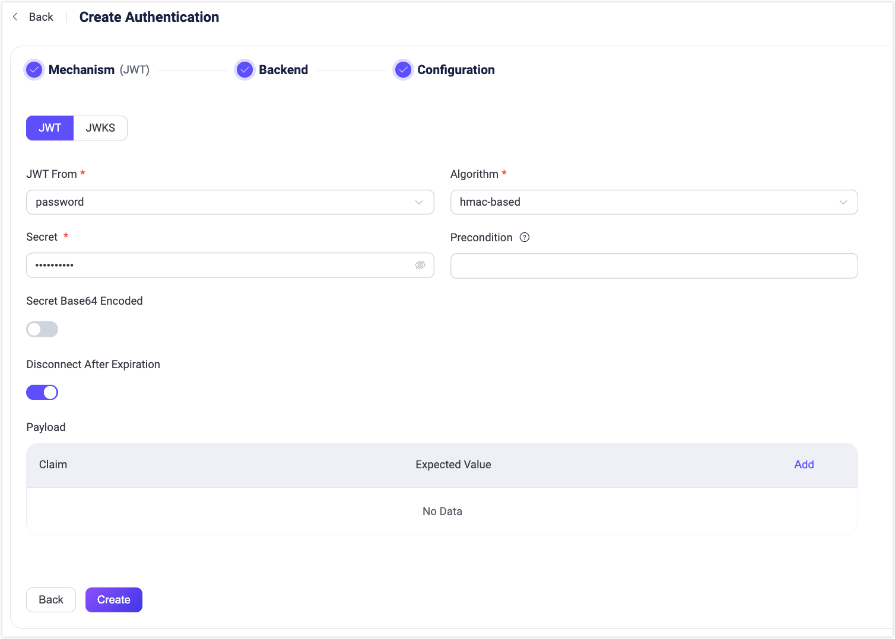
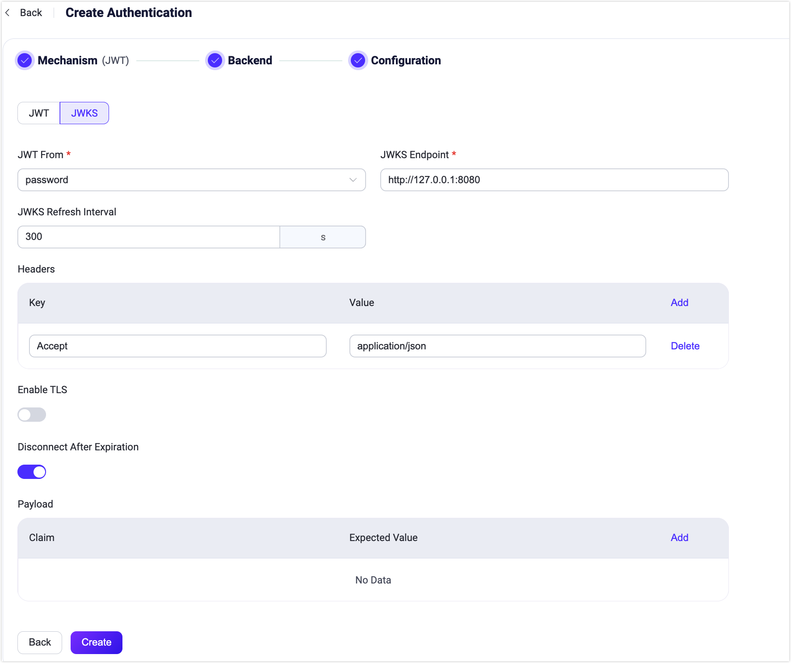

# JWT認証

[JSON Web Token (JWT)](https://jwt.io/) はトークンベースの認証機構です。サーバー側でクライアントの認証情報やセッション情報を保持する必要がありません。EMQXはユーザー認証にJWTを使用することをサポートしています。

::: tip 前提条件

[EMQXの基本的な認証概念](../authn/authn.md)の知識

:::

## 認証の原理

クライアントは接続リクエストにJWTを含め、EMQXは事前に設定されたシークレットまたは公開鍵を使ってJWTの署名を検証します。ユーザーがJWKSエンドポイントを設定している場合、JWT認証器はJWKSエンドポイントから取得した公開鍵リストを用いてJWTの署名を検証します。

署名検証が成功すると、JWT認証器はクレームのチェックに進みます。JWT認証器は`iat`（発行時刻）、`nbf`（有効開始時刻）、`exp`（有効期限）などのクレームに基づきJWTの有効性を積極的に検証します。追加のカスタムクレームも検証対象として指定可能です。署名とクレームの両方の検証が成功した場合にのみ、クライアントはアクセスを許可されます。

EMQXバージョン5.7.0以降では、JWT認証にJWTの有効期限切れ後にクライアントを切断するオプションが追加されました。設定パラメータ`disconnect_after_expire`はデフォルトで`true`に設定されています。JWTの有効期限切れ後もクライアントを接続状態に保ちたい場合は、このパラメータを`false`に設定してください。

## ベストプラクティス

JWT認証器は基本的にJWTの署名のみを検証するため、JWT認証器単体ではクライアントの正当性を保証しません。

ベストプラクティスとしては、独立した認証サーバーを構築し、クライアントはまず認証サーバーにアクセスして認証サーバーがクライアントの正当性を検証し、正当なクライアントに対してJWTを発行します。その後、クライアントは取得したJWTを用いてEMQXに接続します。

:::tip

JWTのペイロードはBase64エンコードされているだけなので、JWTを入手した者は誰でもBase64デコードによりペイロードの元情報を取得可能です。そのため、JWTのペイロードに機密情報を保存することは推奨されません。

JWTの漏洩や盗難のリスクを低減するため、有効期限を適切に設定し、TLSを有効にしてクライアント接続を暗号化することを推奨します。

:::

## アクセス制御リスト（オプション）

アクセス制御リスト（ACL）は認証結果の拡張機能で、ログイン後のクライアントの権限を制御します。JWTに`acl`フィールドを含めてクライアントの権限を指定できます。

詳細は[アクセス制御リスト（ACL）](./acl.md)をご参照ください。

## クライアント属性

EMQX v5.7.0以降、JWTペイロードのオプションフィールド`client_attrs`を使って[クライアント属性](../../../develop/client-attributes/client-attributes.md)を設定できます。キーと値はどちらも文字列型である必要があります。

例：

```json
{
  "exp": 1654254601,
  "username": "emqx_u",
  "client_attrs": {
      "role": "admin",
      "sn": "10c61f1a1f47"
  }
}
```

## ダッシュボードでのJWT認証設定

1. 左側のナビゲーションメニューから **アクセス制御** -> **認証** を選択します。

2. **認証** ページの右上にある **作成** をクリックし、**メカニズム**として **JWT** を選択して **次へ** をクリックします。バックエンドの選択はスキップして、**設定** タブに進みます。

   

3. 以下のオプションを設定します：

   - **JWT From**：クライアント接続リクエストのどこにJWTがあるかを指定します。利用可能なオプションは`password`と`username`で、MQTTクライアントの`CONNECT`パケットの`Password`フィールドまたは`Username`フィールドに対応します。

   - **Algorithm**：JWTの暗号化アルゴリズムを指定します。選択肢は`hmac-based`と`public-key`で、それぞれ異なる設定が必要です。

     - `hmac-based`：JWTの署名生成と検証に対称鍵を使用します。サポートされるアルゴリズムはHS256、HS384、HS512です。設定項目は以下の通りです：
       - `Secret`：署名検証に使用する鍵。署名生成時と同じ鍵を指定します。
       - `Secret Base64 Encode`：`Secret`がBase64エンコードされているかどうかを設定し、EMQXが署名検証時に秘密鍵をデコードするかを決定します。

     - `public-key`：JWTの署名生成に秘密鍵を使用し、検証に公開鍵を使用します。サポートされるアルゴリズムはRS256、RS384、RS512、ES256、ES384、ES512です。設定項目は以下の通りです：
       - `Public Key`：署名検証に使用するPEM形式の公開鍵を指定します。

   - **Precondition**：[Variform式](../../configuration/configuration.md#variform-expressions)で、JWT認証器をクライアント接続に適用するかどうかを制御します。クライアントの属性（`username`、`password`、`clientid`、`listener`など）に対して評価され、式の評価結果が文字列の"true"の場合のみ認証器が呼び出されます。そうでなければスキップされます。詳細は[認証器の前提条件](./authn.md#authenticator-preconditions)をご覧ください。

     例：JWTクライアントとパスワード認証クライアントが同じ認証チェーンを使う場合、`is_jwt(password)`を使用します。

     EMQX 6.2.3以降、`is_jwt(password)`はパスワードが構造的にJWTである場合のみ`true`を返します。平文パスワード、未設定パスワード、形式不正な値は`false`を返し、JWT認証器はスキップされて次の認証器が処理します。構造的に正しいJWTでも署名やクレーム検証に失敗した場合はJWT認証器で処理され拒否されます。

   - **Disconnect After Expiration**：JWTの有効期限切れ後にクライアントを切断するかどうかを設定します。デフォルトで有効です。

   - **Payload**：ユーザーが追加で検証したいクレームを指定します。複数のキーと値のペアを**Claim**と**Expected Value**フィールドで定義可能です。キーはJWTのクレーム名と一致させる必要があり、値はクレームの実際の値と比較されます。現在、`${clientid}`と`${username}`のプレースホルダーがサポートされています。

4. **作成** をクリックして設定を完了します。

EMQXはJWKSエンドポイントから最新のJWKSを定期的に取得することもサポートしています。JWKSは認可サーバーが発行しRSAまたはECDSAアルゴリズムで署名されたJWTの検証に使う公開鍵の集合です。この機能を利用する場合は、**JWKS**設定ページに切り替えてください。



JWKS固有の設定項目は以下の通りです：

- **JWKS Server**：EMQXがJWKSを問い合わせるサーバーのエンドポイントアドレスを指定します。エンドポイントはGETリクエストに対応し、仕様に準拠したJWKSを返す必要があります。
- **JWKS Refresh Interval**：JWKSの更新間隔、つまりEMQXがJWKSを問い合わせる頻度を指定します。
- **Headers**：JWKSサーバーへのリクエストに含める必要がある追加のHTTPヘッダーを指定します。これにより、サーバーの要件に沿った適切なリクエストが送信されます。キーと値のペアを追加可能です。例：
  - **Key**: `Accept`
  - **Value**: `application/json`

**作成** をクリックして設定を完了します。

<!-- ## 設定項目による設定

設定項目による設定も可能です。詳細な手順は[authn-jwt:*](../../configuration/configuration-manual.html#authn-jwt:hmac-based)をご参照ください。 -->
