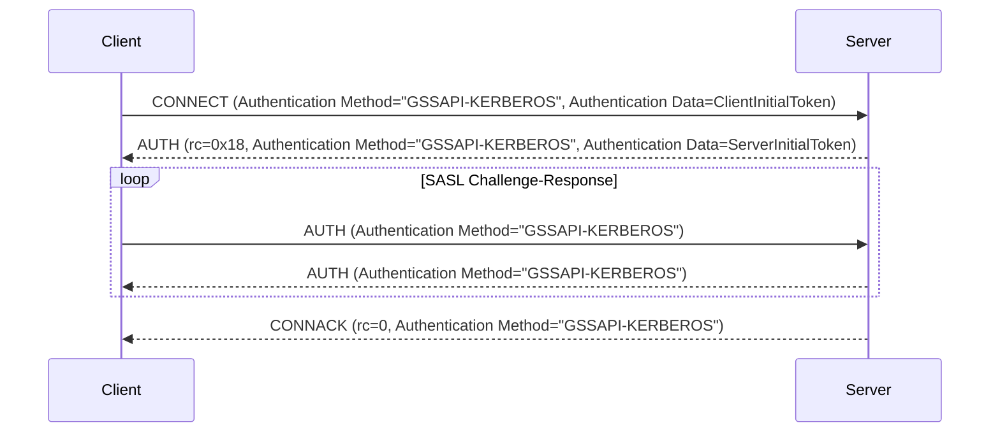

# MQTT 5.0 強化認証 - Kerberos

Kerberos は、「チケット」を使用してノード同士が非安全なネットワーク上で安全に自身の身元を証明できるネットワーク認証プロトコルです。秘密鍵暗号方式を用いてクライアント／サーバーアプリケーションに対して強力な認証を提供するよう設計されています。

EMQX は RFC 4422 の SASL/GSSAPI メカニズムに従い、Kerberos 認証を統合しています。Generic Security Services Application Program Interface（GSSAPI）は Kerberos プロトコルの詳細を抽象化した標準化された API を提供し、MQTT クライアントとサーバー間で Kerberos 認証プロセスの詳細をアプリケーション側で管理することなく安全な通信を可能にします。

本ページでは、EMQX における Kerberos 認証器の設定方法を紹介します。

::: tip
MQTT の強化認証はプロトコルバージョン 5 以降でのみサポートされています。

メカニズムのネゴシエーションがないため、クライアントは認証メカニズムとして明示的に `GSSAPI-KERBEROS` を指定する必要があります。

:::

## 設定の前提条件

EMQX で Kerberos 認証を設定する前に、必須ライブラリのインストールや Kerberos システムの適切なセットアップなど、環境が要件を満たしていることを確認してください。

### Kerberos ライブラリのインストール

Kerberos 認証器を設定する前に、EMQX ノードに MIT Kerberos ライブラリをインストールする必要があります。

- Debian/Ubuntu 系では、必要なパッケージは `libsasl2-2` と `libsasl2-modules-gssapi-mit` です。

- Redhat 系では、必要なパッケージは `krb5-libs` と `cyrus-sasl-gssapi` です。

### Kerberos ライブラリの設定

Kerberos ライブラリの設定ファイルは `/etc/krb5.conf` です。このファイルには Kerberos ライブラリの設定情報（レルムやキー配布センター（KDC）など）が含まれています。Kerberos ライブラリはこのファイルを参照して KDC やレルムの場所を特定します。

以下は `krb5.conf` ファイルの例です。

```ini
[libdefaults]
    default_realm = EXAMPLE.COM
    default_keytab_name = /var/lib/emqx/emqx.keytab

[realms]
   EXAMPLE.COM = {
      kdc = kdc.example.com
      admin_server = kdc.example.com
   }
```

### Keytab ファイル

Kerberos 認証器を設定するには、稼働中の KDC（キー配布センター）サーバーと、サーバーおよびクライアント双方の有効な keytab ファイルが必要です。keytab ファイルはサーバーのプリンシパルに関連付けられた暗号鍵を格納し、サーバーが手動でパスワードを入力することなく Kerberos KDC に認証を行うことを可能にします。

EMQX はデフォルトの場所にある keytab ファイルのみをサポートします。環境変数 `KRB5_KTNAME` を使用するか、`/etc/krb5.conf` の `default_keytab_name` を設定してシステムのデフォルト値を指定できます。

::: tip 注意

keytab ファイルは EMQX ノード上に配置されている必要があり、EMQX サービスを実行するユーザーがファイルの読み取り権限を持っている必要があります。

:::

## ダッシュボードからの設定

1. EMQX ダッシュボードの左メニューから **アクセス制御** -> **認証** に移動し、**認証** ページを開きます。

2. 右上の **作成** をクリックし、**メカニズム** に **GSSAPI**、**バックエンド** に **Kerberos** を選択します。

3. **次へ** をクリックして **設定** ステップに進みます。

4. 以下の項目を設定します：

   - **プリンシパル**：Kerberos 認証システム内でサーバーの身元を定義するためのサーバー用プリンシパルを設定します。例：`mqtt/cluster1.example.com@EXAMPLE.COM`。

     注意：使用するレルムは EMQX ノードの `/etc/krb5.conf` に設定されている必要があります。
   
   - **前提条件**：[Variform 式](../../configuration/configuration.md#variform-expressions)で、Kerberos 認証器をクライアント接続に適用するかどうかを制御します。この式はクライアントの属性（`username`、`clientid`、`listener` など）に対して評価され、結果が文字列 `"true"` の場合のみ認証器が呼び出されます。それ以外の場合はスキップされます。前提条件の詳細は [認証の前提条件](./authn.md#authentication-preconditions) を参照してください。

5. **作成** をクリックして設定を完了します。

## 設定項目による設定

設定例：

```hcl
  {
    mechanism = gssapi
    backend = kerberos
    principal = "mqtt/cluster1.example.com@EXAMPLE.COM"
  }
```

`principal` はサーバープリンシパルであり、システムのデフォルト keytab ファイルに存在している必要があります。

## 認証フロー

以下の図は認証プロセスの流れを示しています。



## よくある問題とトラブルシューティング

EMQX で Kerberos 認証を設定する際に遭遇しやすい問題の解決ガイドです。

### `Keytab contains no suitable keys for mqtt/cluster1.example.com@EXAMPLE.COM`

**原因：** keytab ファイルに指定されたプリンシパル用の必要な鍵が含まれていません。

**対処法：**

- デフォルトの keytab ファイルが正しく設定されていることを確認してください。

- `klist -k` コマンドで keytab ファイルを確認します。例：`klist -kte /etc/krb5.keytab`。

  EMQX は現在、デフォルトの場所にある keytab ファイルのみをサポートしています。このエラーが発生した場合、エラーメッセージに現在のデフォルト keytab ファイルのパスが表示されます。

- 環境変数 `KRB5_KTNAME` を使用するか、`/etc/krb5.conf` の `default_keytab_name` を設定してシステムのデフォルト keytab ファイルパスを指定してください。

### `invalid_server_principal_string`

**原因：** Kerberos プリンシパル文字列の形式が誤っています。

**対処法：** Kerberos プリンシパル文字列が正しい形式（`service/SERVER-FQDN@REALM.NAME`）であることを確認してください。

### `Cannot find KDC for realm "EXAMPLE.COM"`

**原因：** 指定された Kerberos レルム（`EXAMPLE.COM`）が `/etc/krb5.conf` の `realms` セクションに記載されていません。

**対処法：** `/etc/krb5.conf` の `realms` セクションに該当レルムの情報を追加してください。

### `Cannot contact any KDC for realm "EXAMPLE.COM"`

**原因：** 指定されたレルムの KDC サービスが稼働していないか、到達不能です。

**対処法：** KDC サービスが稼働中でアクセス可能であることを確認してください。ネットワーク接続や KDC サーバーの設定をチェックしてください。

### `Resource temporarily unavailable`

**原因：** `/etc/krb5.conf` に設定された KDC サービスが稼働していないか、到達できません。

**対処法：** KDC サービスが正常に稼働しており、EMQX ノードから通信可能であることを確認してください。

### `Preauthentication failed`

**原因：** サーバーチケットが無効である可能性があり、keytab ファイルが古くなっている可能性があります。

**対処法：** keytab ファイルが最新で正しい資格情報を含んでいることを確認してください。
