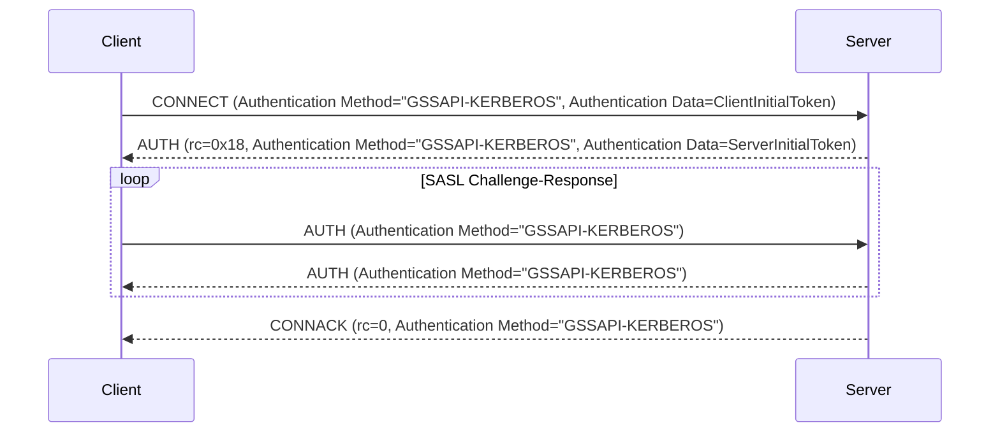

# MQTT 5.0 強化認証 - Kerberos

Kerberosは、ノード同士が非安全なネットワーク上で安全に自身の身元を証明するために「チケット」を使用するネットワーク認証プロトコルです。秘密鍵暗号を用いてクライアント／サーバーアプリケーションに強力な認証を提供するよう設計されています。

EMQXはRFC 4422のSASL/GSSAPIメカニズムに従い、Kerberos認証を統合しています。Generic Security Services Application Program Interface（GSSAPI）はKerberosプロトコルの詳細を抽象化した標準化されたAPIであり、MQTTクライアントとサーバー間でKerberos認証の具体的な処理をアプリケーション側で管理することなく安全な通信を可能にします。

本ページでは、EMQXでのKerberos認証機能の設定方法を紹介します。

::: tip
MQTTの強化認証はプロトコルバージョン5以降でのみサポートされています。

メカニズムのネゴシエーションはないため、クライアントは認証メカニズムとして明示的に`GSSAPI-KERBEROS`を指定する必要があります。

:::

## 設定の前提条件

EMQXでKerberos認証を設定する前に、必要なライブラリのインストールやKerberosシステムの適切なセットアップなど、環境が要件を満たしていることを確認してください。

### Kerberosライブラリのインストール

Kerberos認証機能を設定する前に、EMQXノードにMIT Kerberosライブラリをインストールする必要があります。

- Debian/Ubuntuでは、必要なパッケージは`libsasl2-2`および`libsasl2-modules-gssapi-mit`です。

- Redhatでは、必要なパッケージは`krb5-libs`および`cyrus-sasl-gssapi`です。

### Kerberosライブラリの設定

Kerberosライブラリの設定ファイルは`/etc/krb5.conf`です。このファイルにはKerberosライブラリの設定情報（レルムやKey Distribution Center（KDC）など）が含まれています。Kerberosライブラリはこのファイルを参照してKDCやレルムを特定します。

以下は`krb5.conf`ファイルの例です。

```ini
[libdefaults]
    default_realm = EXAMPLE.COM
    default_keytab_name = /var/lib/emqx/emqx.keytab

[realms]
   EXAMPLE.COM = {
      kdc = kdc.example.com
      admin_server = kdc.example.com
   }
```

### Keytabファイル

Kerberos認証機能を設定するには、稼働中のKDC（Key Distribution Center）サーバーと、サーバーおよびクライアントの双方に有効なkeytabファイルが必要です。keytabファイルはサーバーのプリンシパルに関連付けられた暗号鍵を格納し、サーバーが手動でパスワードを入力することなくKerberos KDCに認証できるようにします。

EMQXはデフォルトの場所にあるkeytabファイルのみサポートしています。システムのデフォルト値は環境変数`KRB5_KTNAME`を使うか、`/etc/krb5.conf`の`default_keytab_name`で設定できます。

::: tip 注意

keytabファイルはEMQXノード上に配置されている必要があり、EMQXサービスを実行するユーザーが読み取り権限を持っている必要があります。

:::

## ダッシュボードからの設定

1. EMQXダッシュボードの左メニューから **アクセス制御** -> **認証** に移動し、**認証**ページを開きます。

2. 右上の **作成** をクリックし、**メカニズム**に **GSSAPI**、**バックエンド**に **Kerberos** を選択します。

3. **次へ** をクリックして **設定** ステップに進みます。

4. 以下の項目を設定します。

   - **プリンシパル**：Kerberos認証システム内でサーバーの身元を定義するためのサーバープリンシパルを設定します。例：`mqtt/cluster1.example.com@EXAMPLE.COM`。

     注：使用するレルムはEMQXノードの`/etc/krb5.conf`で設定されている必要があります。
   
   - **前提条件**：[Variform式](../../configuration/configuration.md#variform-expressions)で、Kerberos認証機能を特定のクライアント接続に適用するかどうかを制御します。この式はクライアントの属性（`username`、`clientid`、`listener`など）に対して評価され、結果が文字列の`"true"`の場合にのみ認証機能が呼び出されます。詳細は[認証の前提条件](./authn.md#authentication-preconditions)を参照してください。

5. **作成** をクリックして設定を完了します。

## 設定項目による設定

設定例：

```hcl
  {
    mechanism = gssapi
    backend = kerberos
    principal = "mqtt/cluster1.example.com@EXAMPLE.COM"
  }
```

`principal`はサーバープリンシパルであり、システムのデフォルトkeytabファイルに存在している必要があります。

## 認証フロー

以下の図は認証プロセスの流れを示しています。



## よくある問題とトラブルシューティング

EMQXでKerberos認証を設定する際に遭遇しやすい問題とその解決策を以下に示します。

### `Keytab contains no suitable keys for mqtt/cluster1.example.com@EXAMPLE.COM`

**原因:** keytabファイルに指定したプリンシパルに対応する鍵が含まれていません。

**対処法:**

- デフォルトのkeytabファイルが正しく設定されているか確認してください。

- `klist -k`コマンドでkeytabファイルの内容を確認します。例：`klist -kte /etc/krb5.keytab`。

  EMQXは現在デフォルトの場所にあるkeytabファイルのみサポートしているため、このエラーが発生するとエラーメッセージに現在のデフォルトkeytabファイルのパスが表示されます。

- 環境変数`KRB5_KTNAME`を使うか、`/etc/krb5.conf`の`default_keytab_name`設定でシステムのデフォルトkeytabファイルのパスを指定してみてください。

### `invalid_server_principal_string`

**原因:** Kerberosプリンシパル文字列の形式が誤っています。

**対処法:** Kerberosプリンシパル文字列が正しい形式であることを確認してください。形式は`service/SERVER-FQDN@REALM.NAME`です。

### `Cannot find KDC for realm "EXAMPLE.COM"`

**原因:** 指定されたKerberosレルム（`EXAMPLE.COM`）が`/etc/krb5.conf`の`realms`セクションに記載されていません。

**対処法:** `/etc/krb5.conf`の`realms`セクションに該当レルムの情報を追加してください。

### `Cannot contact any KDC for realm "EXAMPLE.COM"`

**原因:** 指定されたレルムのKDCサービスが稼働していないか、到達不能です。

**対処法:** KDCサービスが稼働しているか、ネットワーク経由でアクセス可能か確認してください。KDCサーバーの設定も見直してください。

### `Resource temporarily unavailable`

**原因:** `/etc/krb5.conf`に設定されたKDCサービスが稼働していないか、到達できません。

**対処法:** KDCサービスが正常に動作しているか、EMQXノードから通信可能か確認してください。

### `Preauthentication failed`

**原因:** サーバーチケットが無効である可能性があり、keytabファイルが古い場合があります。

**対処法:** keytabファイルが最新で正しい認証情報を含んでいるか確認してください。
