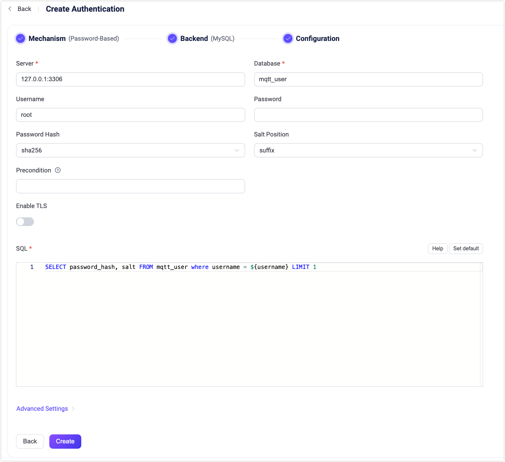

# MySQLとの統合

EMQXはパスワード認証のためにMySQLとの統合をサポートしています。

::: tip

[EMQX認証の基本概念](./authn.md)の知識

:::

## データスキーマとクエリ文

MySQL認証機能はほぼすべてのMySQLストレージスキーマに対応しています。ビジネスニーズに応じて、認証情報の保存方法やアクセス方法を決定できます。例えば、1つまたは複数のテーブルやビューを使用することが可能です。

ユーザーはクエリ文のテンプレートを提供し、以下のフィールドが含まれていることを確認する必要があります。

- `password_hash`：必須。データベースに保存されているパスワード（プレーンテキストまたはハッシュ化されたもの）。
- `salt`：任意。`salt = ""` またはこのフィールドを削除すると、ソルト値が追加されないことを示します。
- `is_superuser`：任意。現在のクライアントがスーパーユーザーかどうかのフラグ。デフォルトは `false`。

認証情報を保存するためのテーブル構造の例：

```sql
CREATE TABLE `mqtt_user` (
  `id` int(11) unsigned NOT NULL AUTO_INCREMENT,
  `username` varchar(100) DEFAULT NULL,
  `password_hash` varchar(100) DEFAULT NULL,
  `salt` varchar(35) DEFAULT NULL,
  `is_superuser` tinyint(1) DEFAULT 0,
  `created` datetime DEFAULT NULL,
  PRIMARY KEY (`id`),
  UNIQUE KEY `mqtt_username` (`username`)
) ENGINE=InnoDB DEFAULT CHARSET=utf8mb4;
```

::: tip
上記の例では、クエリに役立つ暗黙の`UNIQUE`インデックスフィールド（username）が作成されています。
システム内のユーザー数が多い場合は、クエリの応答時間を短縮し、EMQXの負荷を軽減するために、事前にテーブルの最適化とインデックス付けを行ってください。
:::

このテーブルでは、MQTTユーザーは`username`で識別されます。

例えば、スーパーユーザー（`is_superuser`: `true`）として、ユーザー名`emqx_u`、パスワード`public`、サフィックスのソルト`salt_foo123`、パスワードハッシュ`sha256`を追加したい場合、クエリ文は次のようになります。

```bash
mysql> INSERT INTO mqtt_user(username, password_hash, salt, is_superuser) VALUES ('emqx_u', SHA2(concat('public', 'slat_foo123'), 256), 'slat_foo123', 1);
Query OK, 1 row affected (0,01 sec)
```

対応する設定パラメータは以下の通りです。

```sql
password_hash_algorithm {
    name = sha256
    salt_position = suffix
}

query = "SELECT password_hash, salt, is_superuser FROM mqtt_user WHERE username = ${username} LIMIT 1"
```

## ダッシュボードでの設定

EMQXダッシュボードを使用して、MySQLをパスワード認証に利用する設定が可能です。

1. EMQXダッシュボードの左側ナビゲーションメニューから **アクセス制御** -> **認証** をクリックします。
2. **認証** ページの右上にある **作成** をクリックします。
3. **メカニズム**に **パスワードベース** を、**バックエンド**に **MySQL** を選択し、**設定**タブに進みます。以下のように表示されます。



4. 以下の指示に従い、認証バックエンドの設定を行います。

   - **接続**：MySQLへの接続情報を入力します。

     - **サーバー**：EMQXが接続するサーバーのアドレス（`host:port`）を指定します。

     - **データベース**：MySQLのデータベース名。

     - **ユーザー名**：ユーザー名を指定します。

     - **パスワード**：ユーザーパスワードを指定します。

   - **認証設定**：認証に関する設定を行います。

     - **パスワードハッシュ**：プレーンテキストのパスワードに適用され、結果がデータベースに保存されるハッシュアルゴリズムを選択します。利用可能なオプションは `plain`、`md5`、`sha`、`sha256`、`sha512`、`bcrypt`、`pbkdf2` です。選択したアルゴリズムに応じて追加設定があります。

       - `md5`、`sha`、`sha256`、`sha512`の場合：
         - **ソルト位置**：ソルト（ランダムデータ）をパスワードにどのように混ぜるかを指定します。`suffix`、`prefix`、`disable` のいずれかです。外部ストレージからEMQX組み込みデータベースにユーザー認証情報を移行する場合を除き、デフォルト値のままで問題ありません。
         - ハッシュ結果は16進数文字列で表され、大文字・小文字を区別せずに保存された認証情報と比較されます。

       - `plain`の場合：
         - **ソルト位置**は `disable` に設定してください。

       - `bcrypt`の場合：
         - **ソルトラウンド**：ハッシュ関数が適用される回数を定義します。値は _2のソルトラウンド乗_（コストファクター）で表されます。デフォルトは `10`、許容範囲は `5` から `10` です。セキュリティ強化のために高い値が推奨されます。注：コストファクターを1増やすと認証にかかる時間が倍増します。

       - `pbkdf2`の場合：
         - **疑似乱数関数**：キー生成に使用するハッシュ関数を選択します（例：`sha256`）。
         - **反復回数**：ハッシュ関数の実行回数を設定します。デフォルトは `4096`。
         - **派生キー長**（任意）：生成されるキーの長さ（バイト単位）を指定します。空欄の場合は疑似乱数関数により決定された長さになります。
         - ハッシュ結果は16進数文字列で表され、大文字・小文字を区別せずに保存された認証情報と比較されます。

   - **前提条件**：[Variform式](../../configuration/configuration.md#variform-expressions)を使用して、このMySQL認証機能をクライアント接続に適用するかどうかを制御します。この式はクライアントの属性（`username`、`clientid`、`listener`など）に対して評価され、結果が文字列 `"true"` の場合のみ認証機能が呼び出されます。そうでなければスキップされます。詳細は[認証機能の前提条件](./authn.md#authenticator-preconditions)をご覧ください。

   - **TLSを有効化**：TLSを有効にする場合はトグルスイッチをオンにします。TLSの有効化については[ネットワークとTLS](../../network/overview.md)を参照してください。

   - **SQL**：データスキーマに従ってクエリ文を入力します。詳細は[SQLデータスキーマとクエリ文](#データスキーマとクエリ文)をご覧ください。

   - **詳細設定**：同時接続数や接続タイムアウトまでの待機時間を設定します。
     - **接続プールサイズ**（任意）：EMQXノードからMySQLへの同時接続数を整数で指定します。デフォルトは `8`。
     - **クエリタイムアウト**（任意）：EMQXが接続のタイムアウトとみなすまでの待機時間を指定します。ミリ秒、秒、分、時間の単位が利用可能です。デフォルトは `5` 秒。

5. 設定が完了したら、**作成**をクリックします。

## 設定項目による設定

EMQXの設定項目を使ってMySQL認証機能を設定することも可能です。

MySQL認証は `mechanism = password_based` と `backend = mysql` で識別されます。

設定例：

```bash
{
  backend = "mysql"
  mechanism = "password_based"

  server = "127.0.0.1:3306"
  username = "root"
  database = "mqtt_user"
  password = ""
  pool_size = 8

  password_hash_algorithm {name = "sha256", salt_position = "suffix"}
  query = "SELECT password_hash, salt FROM mqtt_user where username = ${username} LIMIT 1"
  query_timeout = "5s"
}
```
