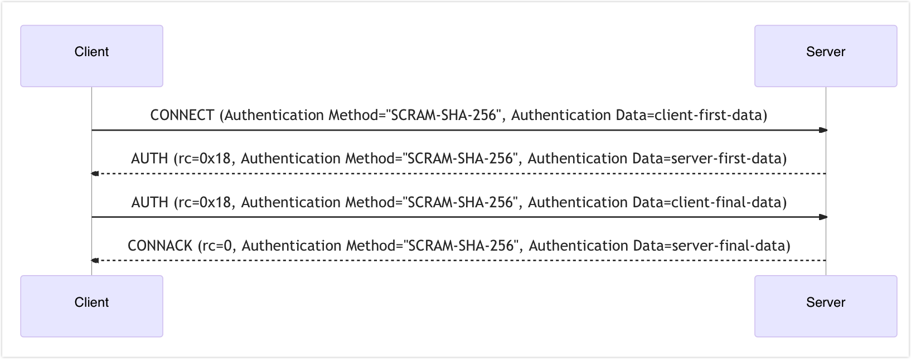

# MQTT 5.0 強化認証 - SCRAM

この認証機構は、[Salted Challenge Response Authentication Mechanism (SCRAM)](https://en.wikipedia.org/wiki/Salted_Challenge_Response_Authentication_Mechanism) 認証を実装しており、EMQXの組み込みデータベースを使用してクライアント資格情報（_ユーザー_）を保存します。

SCRAMはパスワード検証よりも複雑な仕組みであり、接続時に追加のMQTTパケットのやり取りが必要です。SCRAM認証は外部データソースに依存せず、シンプルかつ軽量に利用できます。

::: tip
SCRAM認証機構はMQTT 5.0接続のみをサポートしています。
:::

## ダッシュボードでの設定

1. [EMQXダッシュボード](http://127.0.0.1:18083/#/authentication)の左ナビゲーションメニューから **アクセス制御** -> **認証** をクリックします。
2. 右上の **作成** をクリックし、**Mechanism** に **SCRAM**、**Backend** に **Built-in Database** を選択します。すると **設定** タブに移動します。
3. 認証バックエンドの以下の設定を行います：
   - **Password Hash**：パスワードハッシュアルゴリズムを選択します：`sha256` または `sha512`
   - **Iteration Count**：SCRAM認証プロセスでパスワードをハッシュ化する際の反復回数を定義します。反復回数が多いほど計算コストが増え、ブルートフォース攻撃に対する耐性が向上します。デフォルト値は `4096` です。この値はパフォーマンスとセキュリティに影響するため、システムの要件に応じて調整してください。
   - **Precondition**：[Variform式](../../configuration/configuration.md#variform-expressions)で、クライアント接続に対してこの組み込みデータベース認証機構を適用するかどうかを制御します。式はクライアントの属性（`username`、`clientid`、`listener`など）に基づいて評価され、結果が文字列 `"true"` の場合のみ認証機構が呼び出されます。それ以外の場合はスキップされます。詳細は[認証の前提条件](./authn.md#authentication-preconditions)を参照してください。
4. **作成** をクリックして設定を完了します。

## 設定項目による設定

設定例：

```hcl
{
    mechanism = scram
    backend = built_in_database
    algorithm = sha512
    iteration_count = 4096
}
```

項目の説明：

- `algorithm`：パスワードハッシュアルゴリズム。選択肢は `sha256` と `sha512`
- `iteration_count`（省略可能）：SCRAMの反復回数パラメータ。デフォルトは `4096`

## 認証フロー


