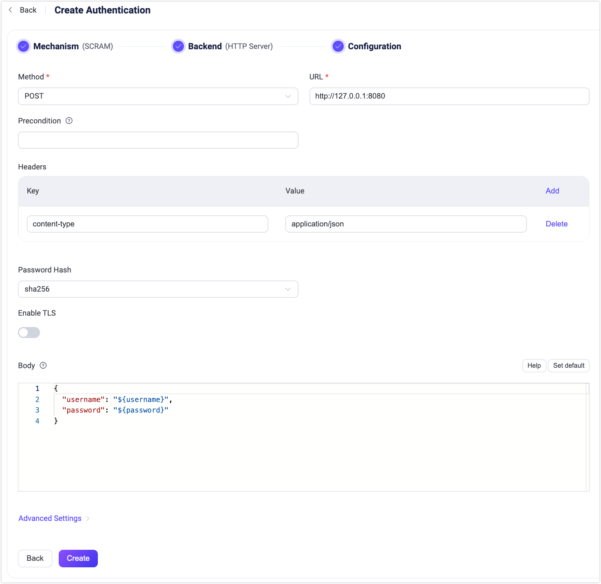

# REST APIベースのMQTT 5.0 SCRAM認証

EMQXはREST APIを利用したMQTT 5.0の拡張認証をサポートしており、[Salted Challenge Response Authentication Mechanism（SCRAM）](https://en.wikipedia.org/wiki/Salted_Challenge_Response_Authentication_Mechanism)を実装しています。このSCRAM認証器は、認証に必要なデータを取得するために外部のWebリソースを利用します。有効化されている場合、クライアントがSCRAMで接続要求を開始すると、EMQXは提供されたユーザー名を用いて外部サービスへHTTPリクエストを構築し、認証プロセスに必要な認証データを取得します。

SCRAM自体は軽量かつシンプルな認証機構ですが、本実装では外部REST APIとの連携により機能を拡張しています。これにより、EMQXは様々な外部システムから安全かつ効率的に認証データを取得でき、より複雑な認証シナリオに対応可能です。

::: tip 前提条件

- [EMQX認証の基本概念](./authn.md)に関する理解
- SCRAM認証器はMQTT 5.0接続のみ対応
- 本認証器はRFC 7804の[Salted Challenge Response HTTP Authentication Mechanism](https://datatracker.ietf.org/doc/html/rfc7804)の実装ではありません

:::

## HTTPリクエストとレスポンス

認証プロセスはHTTP APIコールに類似しています。EMQXはクライアントとして振る舞い、外部HTTPサービスへHTTPリクエストを構築して送信します。サービスは`username`に対応する認証データを含むレスポンスを返します。

### レスポンス形式の要件

認証を成功させるため、HTTPレスポンスは以下の条件を満たす必要があります。

- **Content-Type**：レスポンスは`application/json`でエンコードされていること
- **認証データ**：`stored_key`、`server_key`、`salt`を含み、すべて16進数でエンコードされていること
- **スーパーユーザー指標**：`is_superuser`フィールドを使用し、値は`true`または`false`
- **クライアント属性**：任意で`client_attrs`フィールドを指定可能（[クライアント属性](../../../develop/client-attributes/client-attributes.md)）。キーと値は文字列である必要があります
- **アクセス制御リスト（ACL）**：任意で`acl`フィールドを含めてクライアントの権限を定義可能。詳細は[アクセス制御リスト](./jwt.md#access-control-list-optional)を参照してください
- **有効期限**：任意で`expire_at`フィールドを設定可能。クライアント認証の有効期限をUnixタイムスタンプ（秒単位）で指定し、期限切れ後はクライアントは切断し再認証が必要です
- **HTTPステータスコード**：HTTPレスポンスは`200 OK`である必要があります。`4xx`または`5xx`のステータスコードは`ignore`として扱われ、この認証器をスキップして認証チェーンが続行されます

### HTTPレスポンス例

以下はHTTPレスポンスの構造と内容の例です。

```json
HTTP/1.1 200 OK
Headers: Content-Type: application/json
...
Body:
{
    "stored_key": "008F5E0CC6316BB172F511E93E4756EEA876B5B5125F1CD2FD69A2C30F9A0D73",
    "server_key": "81466E185EC642AFAE1EFA75953735D6C0934D099149AAAB601D59F8F8162580",
    "salt": "6633653634383437393466356532333165656435346432393464366165393137",
    "is_superuser": true, // オプション: true | false, デフォルトは false
    "client_attrs": { // 任意
        "role": "admin",
        "sn": "10c61f1a1f47"
    },
    "expire_at": 1654254601, // 任意
    "acl": // 任意
    [
        {
            "permission": "allow",
            "action": "subscribe",
            "topic": "eq t/1/#",
            "qos": [1]
        },
        {
            "permission": "deny",
            "action": "all",
            "topic": "t/3"
        }
    ]
}
```

## ダッシュボードでの認証器設定

EMQXダッシュボードからSCRAM認証器を設定できます。

1. EMQXダッシュボードにログインします。

2. 左側ナビゲーションメニューで **Access Control** -> **Authentication** をクリックし、**Authentication** ページを開きます。

3. 右上の **Create** をクリックします。

4. **Mechanism** に **SCRAM** を選択し、**Backend** に **HTTP Server** を選択します。**Next** をクリックすると、以下のような **Configuration** ステップのページに進みます。

   

5. バックエンドの設定を以下のように行います。

   - **Method**：HTTPリクエストメソッドを選択（`GET` または `POST`）

     ::: tip

     `POST` メソッドはパスワードなどの機密情報がサーバーログに露出しないため推奨されます。信頼できない環境ではHTTPSを使用してください。

     :::

   - **URL**：HTTPサービスのURLを入力

   - **Precondition**：このHTTPサーバー認証器をクライアント接続に適用するか制御するための[Variform式](../../configuration/configuration.md#variform-expressions)。式はクライアントの属性（`username`、`clientid`、`listener`など）に対して評価され、結果が文字列の`"true"`の場合のみ認証器が呼び出されます。詳細は[認証の前提条件](./authn.md#authentication-preconditions)を参照してください。

   - **Headers**（任意）：追加のHTTPリクエストヘッダーを指定可能

   - **Authentication Configuration**：

     - **Password Hash**：パスワードハッシュアルゴリズムを選択（`sha256` または `sha512`）
     - **Enable TLS**：スイッチを切り替えてTLSを有効化。TLS有効化の詳細は[外部リソースアクセスのTLS](../../network/overview.md#tls-for-external-resource-access)を参照してください。
     - **Body**：リクエストテンプレートを定義。`POST`リクエストの場合はJSON形式でリクエストボディに送信、`GET`リクエストの場合はURLのクエリ文字列としてエンコードされます。[プレースホルダー](./authn.md#authentication-placeholders)を利用してキーと値をマッピングします。

   - **Advanced Settings**：

     - **Connection Pool size**（任意）：EMQXノードからHTTPサーバーへの同時接続数（整数値）。デフォルトは`8`。
     - **Connect Timeout**（任意）：EMQXが接続タイムアウトと判断するまでの待機時間。単位は`milliseconds`、`second`、`minute`、`hour`がサポートされます。
     - **HTTP Pipelining**（任意）：レスポンスを待たずに送信可能な最大HTTPリクエスト数（正の整数）。デフォルトは`100`。
     - **Request Timeout**（任意）：EMQXがリクエストタイムアウトと判断するまでの待機時間。単位は`milliseconds`、`second`、`minute`、`hour`がサポートされます。
     - **Iteration Count**（任意）：SCRAMのイテレーション回数。デフォルトは`4096`。

6. 設定が完了したら、**Create** をクリックして設定を確定します。
