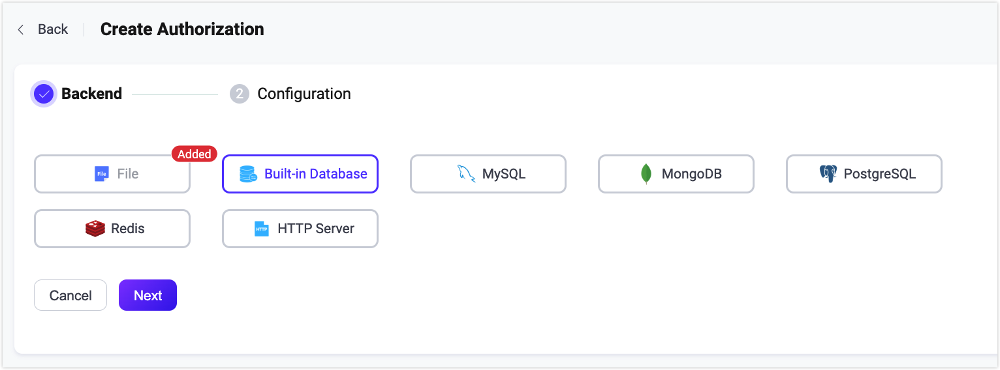

# 認可

EMQXにおける認可とは、MQTTクライアントのパブリッシュ／サブスクライブ操作に対する権限管理を指します。クライアントがパブリッシュ／サブスクライブ操作を行う際、EMQXは特定の手順に従うか、ユーザー指定のクエリ文を使用して、設定されたデータソースからクライアントの権限リストを照会します。照会結果に基づき、EMQXは現在の操作を許可または拒否します。

クライアントの単一の権限データは以下の要素で構成されます。

| **権限**       | **クライアント**          | **操作**                             | **操作の詳細**                |
| -------------- | ------------------------- | ----------------------------------- | ---------------------------- |
| 許可／拒否     | クライアントID／ユーザー名／IP | パブリッシュ／サブスクライブ／パブリッシュ・サブスクライブ | トピック／QoS／保持メッセージ |

::: tip
EMQX 5.1.1以降、操作の詳細におけるQoSおよび保持メッセージのチェックがサポートされました。
:::

クライアントの権限リストは、あらかじめ特定のデータソース（データベース、ファイルなど）に保存しておく必要があります。対応するデータレコードを更新することで、実行時にリストを更新可能です。

EMQXではデフォルトでファイルベースのオーソライザーが設定されており、直接利用できます。認可はACLファイルに設定された事前定義ルールに基づいて処理されます。

## データストレージオブジェクトとの統合

EMQXの認可機構は、組み込みデータベース、ファイル、MySQL、PostgreSQL、MongoDB、Redisなど、さまざまなデータストレージオブジェクトとの統合をサポートしています。REST APIやEMQXダッシュボードを通じて権限データを管理可能です。<!-- CSVやJSONファイルによる一括インポートは現時点でサポートされていません。-->

さらに、ユーザーが開発したHTTPサービスに接続し、異なる認可要件に対応することも可能です。

バックエンドのデータストレージに応じて、以下のように複数のEMQXオーソライザータイプがあります。各オーソライザーは独自の設定オプションを持ちます。詳細は表中のリンクを参照してください。

| データベース       | 説明                                                         |
| ----------------- | ------------------------------------------------------------ |
| ACLファイル        | [ファイルに設定された静的ルールによる認可](./file.md)         |
| 組み込みデータベース | [組み込みデータベースをルールストレージとした認可](./mnesia.md) |
| MySQL             | [MySQLをルールストレージとした認可](./mysql.md)               |
| PostgreSQL        | [PostgreSQLをルールストレージとした認可](./postgresql.md)     |
| MongoDB           | [MongoDBをルールストレージとした認可](./mongodb.md)           |
| Redis             | [Redisをルールストレージとした認可](./redis.md)               |
| LDAP              | [LDAPディレクトリをルールストレージとした認可](./ldap.md)      |
| HTTP              | [外部HTTPサービスによる認可](./http.md)                       |

以下はEMQXのMySQLオーソライザー設定例です。

例:

```bash
{

    type = mysql
    database = "mqtt"
    username = "root"
    password = "public"

    query = "SELECT permission, action, topic FROM mqtt_acl WHERE username = ${username}"
    server = "10.12.43.12:3306"
}
```

## 認可チェーン

EMQXは単一のオーソライザーではなく複数のオーソライザーを設定して認可チェーンを作成し、認可をより柔軟に行えます。EMQXはチェーン内のオーソライザーの順序に従って認可処理を順次実行します。最初のオーソライザーで該当する認可情報が取得できない場合、次のオーソライザーに切り替えて処理を続行します。

オーソライザーは`precondition`（前提条件）もサポートします。`precondition`が設定されている場合、EMQXはオーソライザーのデータソースを呼び出す前に前提条件式を評価し、その結果が`true`のときのみオーソライザーを呼び出します。`true`でないか、実行時に評価失敗した場合はオーソライザーをスキップし、認可チェーン内の次の有効なオーソライザーに進みます。

認可チェックの流れは以下の通りです。

1. 現在のオーソライザーに`precondition`が設定されていれば、まず前提条件式を評価します。結果が`true`でなければ、そのオーソライザーをスキップします。
2. EMQXがクライアントの権限情報を正常に取得できた場合、クライアントの操作と権限リストを照合します。
   - 一致すれば、権限設定に基づき操作を許可または拒否します。
   - 一致しなければ、次のオーソライザーに切り替えて処理を続行します。
3. クライアントの権限情報を取得できなかった場合、他に設定されたオーソライザーがあれば次に切り替えて処理を続行します。
   - 最後のオーソライザーであれば、`no_match`の設定に従ってクライアントの操作を許可または拒否します。

::: warning 注意

認可に問題が生じないよう、ACLファイルオーソライザーは必要に応じて無効化または削除してください。デフォルトで末尾に`{allow, all}`があり、すべての認可要求を許可してしまいます。

:::

オーソライザーの順序変更方法や稼働状況の確認方法は[オーソライザー管理](#manage-authorizers)を参照してください。

### オーソライザーの前提条件

EMQX 6.3以降、各オーソライザーに前提条件を割り当てて、特定の認可リクエストに対して呼び出すかどうかを制御できます。

前提条件は[Variform式](../../configuration/configuration.md#variform-expressions)で、`listener`、`username`、`clientid`、`action`、`topic`などのクライアントおよび認可リクエスト情報を評価します。式が`true`と評価されなければオーソライザーはスキップされます。

例えば、認可リクエストを事業部門、クライアント属性、パブリッシュ／サブスクライブ操作、トピック範囲に応じて異なるバックエンドに振り分けることが可能です。空の`precondition`は前提条件なしを意味し、認可チェーン内の位置に従い通常通り実行されます。

`precondition`で利用可能なクライアント変数は以下の通りです。

- `username`: クライアントのユーザー名。
- `clientid`: クライアントID。
- `client_attrs.*`: クライアント属性。例: `client_attrs.tenant`。クライアント属性の詳細は[MQTTクライアント属性](../../../develop/client-attributes/client-attributes.md)を参照してください。
- `cert_common_name`: クライアントTLS証明書のCommon Name (CN)。
- `cert_subject`: クライアントTLS証明書のSubject。
- `peersni`: TLSクライアントが送信するSNI（Server Name Indication）。
- `listener`: クライアントが使用するリスナーID。例: `tcp:default`。
- `zone`: クライアントに関連付けられた設定ゾーン。

認可リクエスト変数は以下の通りです。

- `action`: 現在の認可アクション。値は`publish`または`subscribe`。
- `topic`: 現在チェック中のパブリッシュトピックまたはサブスクリプショントピックフィルター。

以下の例は`precondition`に関するフィールドのみ示しています。HTTPオーソライザーは`orders`事業部クライアントのパブリッシュ要求のみ処理し、Redisオーソライザーはトピックが`devices/${clientid}/#`のフィルターにマッチする要求のみ処理します。

```hcl
authorization {
  sources = [
    {
      type = http
      precondition = "iif(str_eq(client_attrs.biz, 'orders'), str_eq(action, 'publish'), false)"
      ...
    },
    {
      type = redis
      precondition = "topic_match(topic, topic_join(['devices', clientid, '#']))"
      ...
    }
  ]
}
```

この例の意味は以下の通りです。

- `iif(str_eq(client_attrs.biz, 'orders'), str_eq(action, 'publish'), false)`: クライアント属性`client_attrs.biz`が`orders`かつ現在の認可アクションが`publish`の場合に`true`となる。
- `topic_match(topic, topic_join(['devices', clientid, '#']))`: 現在の認可リクエストのトピックが`devices/${clientid}/#`のトピックフィルターにマッチする場合に`true`となる。

## クライアント認可キャッシュ

EMQXはセッションベースの認可データキャッシュ機構を提供します。このキャッシュはクライアントのセッション状態に認可結果を保存し、同一接続内での認可ルール評価の繰り返しを減らします。クライアント認可キャッシュ機構はクライアントのパブリッシュ／サブスクライブ操作に対する権限チェックの効率を向上させ、多数のクライアントリクエストによる認可データバックエンドへのアクセス負荷を軽減します。

### クライアント認可キャッシュの動作

クライアントが接続しパブリッシュ／サブスクライブ操作を行う際、

1. EMQXは現在のセッションに保存された認可キャッシュを確認します。
2. セッションキャッシュに一致するルールがあれば、それを直接使用します。
3. キャッシュが存在しない（または期限切れ）場合、設定されたオーソライザーで完全な認可チェックを実行します。
4. 結果はセッションにキャッシュされ、同一接続内で再利用されます。

::: tip

キャッシュはクライアントセッション固有であり、クライアントが切断または再接続するとクリアされます。

:::

### ダッシュボードでのクライアント認可キャッシュ設定

EMQXダッシュボードでクライアント認可キャッシュを有効化または設定できます。

1. **アクセス制御** -> **認可** -> **設定**に移動します。

2. 以下のオプションを設定します。

   | フィールド名                         | 説明                                                         |
   | ---------------------------------- | ------------------------------------------------------------ |
   | **キャッシュを有効にする**          | クライアントセッションごとの認可キャッシュを有効／無効に切り替えます。 |
   | **最大キャッシュ数**                | クライアントごとの最大キャッシュエントリ数。デフォルト：`32`。       |
   | **キャッシュの有効期限**            | 各キャッシュエントリの有効期間。デフォルト：`1分`。                  |
   | **除外トピック**                    | キャッシュを無効にするトピックのリスト。                          |
   | **マッチしない場合の動作**          | オーソライザーが一致しなかった場合の動作。`allow`（許可）／`deny`（拒否）。デフォルト：`allow`。 |
   | **拒否時の動作**                    | 操作が拒否された場合の動作。`ignore`（操作を無視）／`disconnect`（クライアント切断）。デフォルト：`ignore`。 |
   | **キャッシュクリア**                | 現在のすべてのアクティブなセッション認可キャッシュを手動でクリアするボタン。 |

3. **保存**をクリックして設定を適用します。

これらのオプションは設定ファイルでも設定可能です。詳細は[設定ファイル](../../configuration/configuration.md)を参照してください。

::: tip

適切に設定すればキャッシュはパフォーマンスを大幅に向上させます。システム性能に応じて適時調整することを推奨します。

:::

## 外部リソースキャッシュ

セッションベースのキャッシュに加え、EMQXはMySQL、MongoDB、Redisなどの外部バックエンドから取得した認可結果を保存するノードレベルのキャッシュもサポートしています。この機能により、リモートデータソースへのアクセスを減らしパフォーマンスを向上させます。

::: tip 注意

外部リソースキャッシュは外部データソースにのみ適用されます。組み込みデータベースやファイルベースのオーソライザーなどローカルソースには適用されません。

:::

### 外部リソースキャッシュの動作

パブリッシュ／サブスクライブ操作が外部バックエンドのクエリをトリガーする際、

1. EMQXは外部リソースキャッシュ（ノード全体で共有）を確認します。
2. キャッシュに有効な結果があれば**キャッシュヒット**となり、外部バックエンドへの呼び出しは行われません。
   - 結果がなければ**キャッシュミス**となり、外部バックエンドにクエリを送信します。
3. バックエンドから返された結果はキャッシュに保存され、以降の利用に備えます。これにより**キャッシュ挿入**メトリクスが増加します。

::: tip 注意

セッションベースの認可キャッシュと異なり、外部リソースキャッシュはノード全体で共有され、クライアントセッションを超えて持続します。

:::

### 外部リソースキャッシュの有効化と設定

EMQXダッシュボードで外部リソースキャッシュを有効化および設定できます。

1. **アクセス制御** -> **認可**に移動します。

2. 右上の**外部リソースキャッシュ設定**ボタンをクリックすると、右側からパネルが表示されます。

3. パネル内の**外部リソースキャッシュを有効にする**ボタンで機能をオン／オフします。有効化後、以下のキャッシュ設定を行います。

   | フィールド名                     | 説明                                                         |
   | -------------------------------- | ------------------------------------------------------------ |
   | **最大キャッシュ数**             | ノードごとの最大キャッシュエントリ数。デフォルト：`1,000,000`。 |
   | **最大メモリ使用量**             | キャッシュのメモリ使用上限。デフォルト：`100 MB`。             |
   | **キャッシュTTL**                | キャッシュエントリの有効期間。デフォルト：`1分`。               |

4. **更新**をクリックして設定を適用します。

これらの設定はクラスター全体に適用され、すべてのノードで一貫した動作を保証します。

### 外部リソースキャッシュの状態監視

<!--@include: ../monitor-cache-status.md-->

## 認可プレースホルダー

EMQXオーソライザーは設定内でプレースホルダーを使用可能です。認可処理時にこれらは実際のクライアント情報に置換され、現在のクライアントに合致したクエリやHTTPリクエストが構築されます。

有効なプレースホルダーは`${PATH.TO.VALUE}`の形式で、PATH.TO.VALUEはオブジェクト内の値へのドット区切りパスです。使用可能な文字は英数字、ドット（`.`）、アンダースコア（`_`）です。サポートされない文字を含むプレースホルダーはプレーンテキストとして扱われます。

### データクエリ内のプレースホルダー

プレースホルダーはクエリ文の構築に使用されます。例えば、EMQXのMySQLオーソライザーのデフォルトクエリSQLは`${username}`を使用しています。

```sql
SELECT action, permission, topic FROM mqtt_acl where username = ${username}
```

クライアント（名前：`emqx_u`）が接続要求を送ると、構築されるクエリ文は以下のようになります。

```sql
SELECT action, permission, topic FROM mqtt_acl where username = 'emqx_u'
```

クエリ文でサポートされるプレースホルダーは以下の通りです。

* `${username}`: 実行時にユーザー名に置換されます。ユーザー名は`CONNECT`パケットの`Username`フィールドから取得されます。`peer_cert_as_username`が有効な場合は証明書のフィールドや内容で上書きされます。
* `${clientid}`: 実行時にクライアントIDに置換されます。通常は`CONNECT`パケットでクライアントが明示的に指定します。`use_username_as_clientid`や`peer_cert_as_clientid`が有効な場合はユーザー名や証明書のフィールド・内容で上書きされます。
* `${peerhost}`: 実行時にクライアントの送信元IPアドレスに置換されます。[Proxy Protocol](http://www.haproxy.org/download/1.8/doc/proxy-protocol.txt)が有効な場合はプロキシが報告する送信元IPを使用します。
* `${peerport}`: EMQX 6.3.0以降で使用可能。実行時にクライアントの送信元ポート番号（例：`51544`）に置換されます。Proxy Protocolが有効な場合はプロキシが報告する送信元ポートを使用します。
* `${peername}`: EMQX 6.3.0以降で使用可能。実行時にクライアントの送信元IPアドレスとポート番号に置換されます。IPv4の場合は`IP:port`形式（例：`192.168.0.1:51544`）、IPv6の場合は角括弧なし（例：`2001:db8::1:51544`）で表現されます。Proxy Protocolが有効な場合はプロキシが報告するIPとポートを使用します。
* `${cert_common_name}`: 実行時にクライアントTLS証明書のCommon Nameに置換されます。ロードバランサーがTCPリスナーにクライアント証明書情報を送信する場合はProxy Protocol v2の使用を推奨します。
* `${cert_subject}`: 実行時にクライアントTLS証明書のSubjectに置換されます。ロードバランサーがTCPリスナーにクライアント証明書情報を送信する場合はProxy Protocol v2の使用を推奨します。
* `${client_attrs.NAME}`: クライアント属性。`NAME`は実行時に事前定義された属性名に置換されます。クライアント属性の詳細は[MQTTクライアント属性](../../../develop/client-attributes/client-attributes.md)を参照してください。
* `${zone}`: 実行時にクライアントのゾーンに置換されます。`${zone}`プレースホルダーは認可テンプレートで直接使用可能です。ゾーン設定の詳細は[ゾーンオーバーライド](../../configuration/configuration.md#zone-override)を参照してください。

::: tip
`${peerhost}`と`${peerport}`は非推奨です。後方互換性のため残されていますが、新規テンプレートでは`${peername}`の使用を推奨します。
:::

LDAPオーソライザーは`${peerport}`および`${peername}`をサポートしていません。

### トピック内のプレースホルダー

EMQXはトピック内でもプレースホルダーを使用可能で、動的なトピックをサポートします。サポートされるプレースホルダーは以下の通りです。

* `${clientid}`
* `${username}`
* `${client_attrs.NAME}`: クライアント属性。`NAME`は`mqtt.client_attrs_init`で設定された属性名に置換されます。

プレースホルダーはトピックのセグメントとして使用可能です。例：`a/b/${username}/c/d`

EMQX 6.3.0以降、認可トピックテンプレートに挿入される値は検証されます。デフォルトでは、これらの値にトピックレベル区切り文字(`/`)やMQTTトピックフィルターのワイルドカード（`+`、`#`）を含めることはできません。この制限はテンプレート内に直接記述された区切り文字やワイルドカードには適用されません。

例えば、ユーザー名が`alice`の場合、`tenant/${username}/#`は`tenant/alice/#`としてレンダリングされます。ユーザー名が`tenant/alice`や`+`の場合、挿入値に許可されない文字が含まれるためレンダリングできません。

挿入値に許可されない文字が含まれる場合、EMQXは有効なセキュリティプロファイルに応じて以下のように処理します。

- `legacy`プロファイルではルールはマッチせず、残りの認可ルールやソースで処理を続行します。
- `hardened`プロファイルではパブリッシュまたはサブスクライブ操作を拒否します。ただし`authorization.ignore_backend_failures`が`true`の場合はルール不一致として扱います。

EMQX 6.3.0のデフォルトセキュリティプロファイルは`legacy`で、`authorization.ignore_backend_failures`は`false`です。6.3.0にアップグレード後、挿入値に許可されない文字が含まれる場合、アップグレード前に設定されたルールはデフォルトの`legacy`プロファイル下でマッチしなくなります。最終結果は残りの認可ルール、認可ソース、`authorization.no_match`によって決まります。アップグレード前にこれらの設定を確認し、期待されるフォールバック動作を確認してください。

`authorization.topic_template_allow`設定は挿入値に許可する文字を制御します。すべての設定はデフォルトで`false`です。

```hocon
authorization.topic_template_allow {
  plus = false
  hash = false
  slash = false
}
```

対応する文字を含める必要がある場合のみ`true`に設定してください。これらを有効にすると、クライアント由来の値が認可ルールのトピックフィルターを広げる可能性があります。ユーザー名、クライアントID、クライアント属性の値はトピックテンプレートで使用する前に検証してください。

プレースホルダーの展開を回避するには、EMQX 5.4以降、`$`を`${$}`とエスケープできます。例：`t/${$}{username}`は`username`を置換せず文字通り`t/${username}`として扱われます。

::: tip

クエリ文で`eq`構文を使用する場合、`eq`の後に続くトピックはプレースホルダー展開をサポートしません。この挙動は将来のバージョンで変更される可能性があります。

`eq`構文はトピックフィルターと完全一致する場合にマッチします。例えば、`eq t/#`は`t/#`にのみマッチし、`t/1`や`t/2`にはマッチしません。

:::

## 認可チェックの優先順位

キャッシュや認可チェッカーに加え、認可結果は認証フェーズの[スーパーユーザーロールと権限セット](../authn/authn.md#super-user)の影響も受けます。

スーパーユーザーの場合、すべての操作は認可チェックをスキップします。[アクセス制御リスト（ACL）](../authn/acl.md)が設定されている場合、EMQXは認可チェッカーを実行する前にクライアントの権限データを優先します。優先順位は以下の通りです。

```bash
スーパーユーザー > 権限データ > 認可チェック
```

## 認可機構の設定

EMQXは認可を設定する方法として、ダッシュボード、設定ファイル、HTTP APIの3つを提供しています。

### ダッシュボードでの認可設定

EMQXダッシュボードは直感的にEMQXオーソライザーを設定できる方法で、関連パラメータの設定、稼働状況の確認、認可チェーン内の位置調整が可能です。



### 設定ファイルでの認可設定

設定ファイルの`authorization`フィールドで認可を設定できます。一般的な設定構造は以下の通りです。

```bash
authorization {
  sources = [
    { ...   },
    { ...   }
  ]
  no_match = deny
  deny_action = ignore
  cache {
    max_size = 32
    excludes = ["t/1", "t/2"]
    ttl = 1m
  }
}
```

項目の説明：

- `sources`（任意）：順序付き配列。各要素は対応するオーソライザーのデータソースを定義します。詳細な設定は各オーソライザーの設定ファイルを参照してください。
  - `sources[].precondition`：オーソライザー呼び出し前にスキップ判定を行うVariform式。空の場合は前提条件なし。
- `no_match`：設定されたオーソライザーのいずれも認可ルールを見つけられなかった場合のデフォルト動作。任意の値は`allow`または`deny`。EMQX 6.0以降はデフォルトが`deny`に変更されました。
- `deny_action`：パブリッシュ／サブスクライブ操作が拒否された場合の次の動作。任意の値は`ignore`または`disconnect`。デフォルトは`ignore`。`ignore`は操作を静かに無視し、`disconnect`はクライアント接続を切断します。
- `cache`：クライアント認可キャッシュの設定。
  * `cache.enable`：クライアント認可キャッシュを有効にするかどうか。デフォルトは`true`。認可がJWTパケットのみに基づく場合は`false`を推奨。
  * `cache.max_size`：キャッシュ内の最大要素数。デフォルトは32。超過分は古いレコードから削除されます。
  * `cache.excludes`：キャッシュを生成しない除外トピックのリスト。デフォルトは空配列`[]`。
  * `cache.ttl`：キャッシュの有効期間。デフォルトは`1m`（1分）。

::: tip

信頼できないネットワークやパブリックネットワークに公開するブローカーでは、`deny_action`を`disconnect`に設定すると、同一接続での認可拒否されたパブリッシュ／サブスクライブ試行を停止できます。[フラッピング検知](../flapping-detect.md)と組み合わせると、繰り返し再接続して認可拒否を引き起こすクライアントを一定期間自動で禁止可能です。

`deny_action`はグローバル設定でリスナーごとには設定できません。また、拒否された操作を試みる正当なクライアントも切断されます。クライアントが通常は認可済みトピックのみでパブリッシュ／サブスクライブする場合に`disconnect`を使用し、フラッピング検知の閾値を調整して通常の再接続ラッシュでの禁止を避けてください。

:::

### HTTP APIでの認可設定

認可管理用のAPIエンドポイントは以下の通りです。

* `/api/v5/authorization/settings`：一般パラメータ、`no_match`、`deny_action`、`cache`の管理。
* `/api/v5/authorization/sources`：オーソライザーの管理と順序調整。
* `/api/v5/authorization/cache`：クライアント認可キャッシュのクリア。
* `/api/v5/authorization/sources/built_in_database`：`built_in_database`オーソライザーの認可ルール管理。

詳細な操作手順は[HTTP API](../../api.md)を参照してください。

## オーソライザー管理

ダッシュボードの**アクセス制御**->**認可**ページでオーソライザーの閲覧・管理が可能です。

### オーソライザーの順序調整

[認可チェーン](#authorization-chain)で述べたように、オーソライザーは設定された順序に従って実行されます。**その他**ドロップダウンから**上へ移動**、**下へ移動**、**先頭へ移動**、**末尾へ移動**を選択してオーソライザーの位置を変更できます。`authorization.sources`設定項目でも順序を調整可能です。

### オーソライザーの状態確認

**状態**列で接続状況を確認できます。

| 状態           | 意味                                                         | トラブルシューティング                                      |
| -------------- | ------------------------------------------------------------ | ---------------------------------------------------------- |
| 接続済み       | すべてのノードがデータソースに正常に接続されている状態。       | -                                                          |
| 未接続         | 一部またはすべてのノードがデータソース（データベース、ファイル）に接続できていない状態。 | データソースの稼働状況を確認。<br />問題解決後にオーソライザーを手動で再起動（**無効化**→**有効化**）してください。 |
| 接続中         | 一部またはすべてのノードがデータソースに再接続中の状態。       | データソースの稼働状況を確認。<br />問題解決後にオーソライザーを手動で再起動（**無効化**→**有効化**）してください。 |

### 稼働メトリクス

オーソライザーの概要ページで統計メトリクスを確認できます。主なメトリクスは以下の通りです。

- **許可数**: 認可が通った回数。
- **拒否数**: 認可が拒否された回数。
- **不一致数**: クライアントの認可データが見つからなかった回数。
- **無視数**: 例えばオーソライザーの`precondition`が`true`でない場合や認可ソースが適用外・エラーで判定不能な場合の無視された認可クエリ数。
- **レート（tps）**: 認可処理の実行レート。

各ノードの認可状況や実行状況は**ノードステータス**で確認可能です。

認可全体の稼働メトリクスを確認したい場合は[メトリクス - 認証＆認可](../../observability/metrics-and-stats.md#Metrics+-+Authentication+%26+Authorization)を参照してください。
