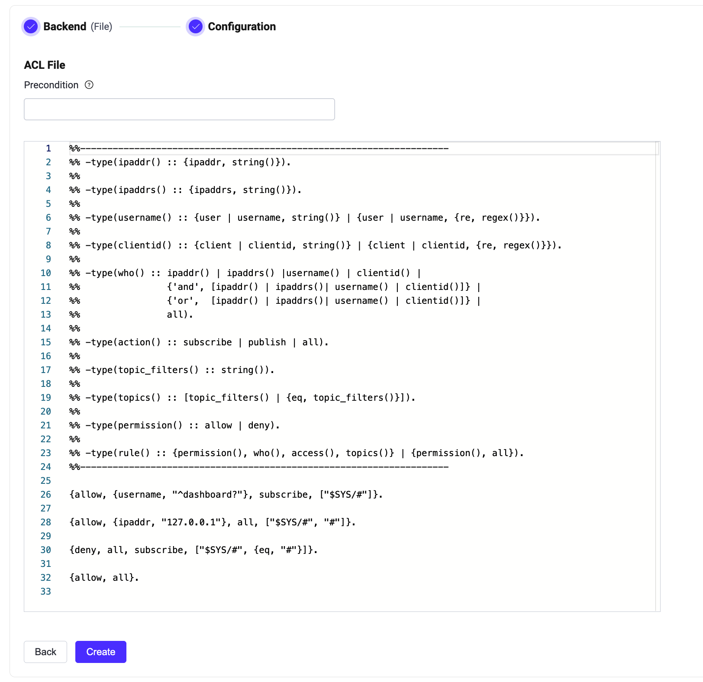

# ACLファイルの使用

EMQXは、ACLファイルに格納された事前定義されたルールに基づいて認可チェックをサポートしています。ファイル内に複数の認可チェックルールを設定できます。クライアントの操作リクエストを受け取ると、EMQXはACLルールを上から順に照合します。ルールがマッチすると、その設定に従って現在のリクエストを許可または拒否し、その後のルール照合を停止します。

ファイルベースのACLはシンプルで軽量です。一般的なルールの設定に適しています。クライアントごとに数百以上のルールを設定する場合は、他の認可ソースの利用を推奨します。ファイルベースのACLは認可チェーンの最後の安全装置として機能させることができます。

::: tip 前提条件
バージョン5.0以降、ファイルベースのACLルールはEMQXダッシュボードUIから編集・リロード可能です。

[認可](./authz.md)の基本概念を理解しておいてください。

:::

## ACLファイル形式

ACLファイルに基づく認可チェックを行う前に、認可ルールを[Erlangタプル](https://www.erlang.org/doc/reference_manual/data_types.html#tuple)のデータリスト形式でファイルに保存する必要があります。

ACL設定ファイルは、ピリオドで終わるErlangタプルのリストです。_タプル_はカンマ区切りの式のリストで、全体が中括弧で囲まれています。

`%%`で始まる行はコメントとして認識され、解析時に無視されます。

例：

```erlang
%% ユーザー名 "dashboard" のMQTTクライアントに "$SYS/#" トピックのサブスクライブを許可
{allow, {user, "dashboard"}, subscribe, ["$SYS/#"]}.

%% IPアドレス "127.0.0.1" のユーザーに "$SYS/#", "#" トピックのパブリッシュ/サブスクライブを許可
{allow, {ipaddr, "127.0.0.1"}, all, ["$SYS/#", "#"]}.

%% "全ユーザー" に `$SYS/#`, `#`, `+/#` のサブスクライブを拒否
{deny, all, subscribe, ["$SYS/#", {eq, "#"}, {eq, "+/#"}]}.

%% その他のパブリッシュ/サブスクライブ操作をすべて許可
%% 注意: 本番環境では最後のルールを `{deny, all}` に変更し、設定 `authorization.no_match = deny` を推奨
{allow, all}.
```

ルールは上から順に照合されます。ルールがマッチすると、その許可設定が適用され、残りのルールは無視されます。

- タプルの第1要素は、ルールがマッチした場合に適用される許可を示します。可能な値は以下の通りです：
  * `allow`
  * `deny`

- タプルの第2要素は、そのルールが適用されるクライアントを示します。以下の用語や組み合わせで指定可能です：
  * `{username, "dashboard"}`：ユーザー名が `dashboard` のクライアント。`{user, "dashboard"}` も可。
  * `{username, {re, "^dash"}}`：ユーザー名が正規表現 `^dash` にマッチするクライアント。
  * `{clientid, "dashboard"}`：クライアントIDが `dashboard` のクライアント。`{client, "dashboard"}` も可。
  * `{clientid, {re, "^dash"}}`：クライアントIDが正規表現 `^dash` にマッチするクライアント。
  * `{client_attr, "name", "dashboard"}`：クライアント属性 `name` が `dashboard` のクライアント。
  * `{client_attr, "name", {re, "^dash"}}`：クライアント属性 `name` が正規表現 `^dash` にマッチするクライアント。
  * `{ipaddr, "127.0.0.1"}`：IPアドレス `127.0.0.1` から接続するクライアント。ネットマスクも使用可能。EMQXがロードバランサーの背後にある場合は、クライアントのMQTTリスナーで `proxy_protocol` を有効にする必要があります。
  * `{ipaddrs, ["127.0.0.1", ..., ]}`：指定した複数のIPアドレスのいずれかから接続するクライアント。ネットマスクも使用可能。
  * `all`：すべてのクライアント。
  * `{'and', [Spec1, Spec2, ...]}`：リスト内のすべての条件を満たすクライアント。
  * `{'or', [Spec1, Spec2, ...]}`：リスト内のいずれかの条件を満たすクライアント。

- タプルの第3要素は、ルールが適用される操作を示します。
  * `publish`：パブリッシュ操作に適用されるルール。
  * `subscribe`：サブスクライブ操作に適用されるルール。
  * `all`：パブリッシュおよびサブスクライブ両方に適用されるルール。
  * EMQX v5.1.1以降では、パブリッシュおよびサブスクライブ操作におけるQoSや保持メッセージフラグのチェックが可能です。第3要素に `qos` や `retain` を追加して指定できます。例：
    * `{publish, [{qos, 1}, {retain, false}]}`：QoS 1で保持メッセージでないパブリッシュを拒否。
    * `{publish, {retain, true}}`：保持メッセージのパブリッシュを拒否。
    * `{subscribe, {qos, 2}}`：QoS 2のトピックのサブスクライブを拒否。

- タプルの第4要素は、ルールが適用されるトピックを指定します。トピックはパターンのリストで指定し、[トピックプレースホルダー](./authz.md#topic-placeholders)を使用可能です。利用可能なパターンは以下の通りです：
  * 文字列値（例：`"t/${clientid}"`）：トピックプレースホルダーを使用します。クライアントIDが `emqx_c` の場合、トピック `t/emqx_c` に正確にマッチします。
  * 文字列値（例：`"$SYS/#"`）：ワイルドカードを含む標準的なトピックフィルターです。トピックフィルターは[MQTT仕様](http://docs.oasis-open.org/mqtt/mqtt/v3.1.1/errata01/os/mqtt-v3.1.1-errata01-os-complete.html#_Toc442180920)に従ってトピックにマッチします。例として、`$SYS/#` はパブリッシュでは `$SYS/foo`、`$SYS/foo/bar` に、サブスクライブでは `$SYS/foo`、`$SYS/foo/#`、`$SYS/#` にマッチします。トピック[プレースホルダー](./authz.md#topic-placeholders)も使用可能です。
  * `eq`タプル（例：`{eq, "foo/#"}`）：トピック文字列の完全一致を示します。このパターンはすべての操作に対して正確に `foo/#` トピックにマッチします。ワイルドカードやプレースホルダーは考慮されません。例えば、トピック `foo/bar` はマッチしません。

さらに、以下の2つの特別なルールがあります。通常、設定の最後にデフォルトとして使用されます。
- `{allow, all}`：すべての操作を許可。
- `{deny, all}`：すべての操作を拒否。

## ダッシュボードでの設定

EMQXはデフォルトでファイルベースの認可を設定しています。**Actions**列の**Settings**ボタンをクリックすると、**ACLファイル**エリアに設定された認可ルールの閲覧・編集が可能です。ファイル形式やフィールドの詳細については、[ACLファイル形式](#acl-file-format)を参照してください。



## 設定ファイルでの設定

ファイルベースの認可は、`file`タイプで識別されます。

設定例：

```bash
authorization {
  deny_action = ignore
  no_match = deny
  sources = [
    {
      type = file
      enable = true
      path = "etc/acl.conf"
    }
  ]
}
```

各項目の説明：

- `type`：認可元のデータソースタイプ。ここでは `file`。
- `enable`：認可機能を有効化するかどうか。オプション値は `true` または `false`。
- `path`：設定ファイルのパス。デフォルトは `etc/acl.conf`。ダッシュボードやREST APIでファイルベースの認可を編集した場合、EMQXは新しいファイルを `data/authz/acl.conf` に保存し、元のファイルの読み込みを停止します。

<!--詳細なパラメータ一覧は[authz-file](../../configuration/configuration-manual.html#authz-file)を参照してください。リンクは後で更新予定です-->

::: tip

`path`設定で指定した初期ファイルはEMQXによって変更されません。  
ダッシュボードUIや管理APIからルールを更新すると、新しいルールは `data/authz/acl.conf` に保存され、元の設定ファイルは読み込まれなくなります。

:::
