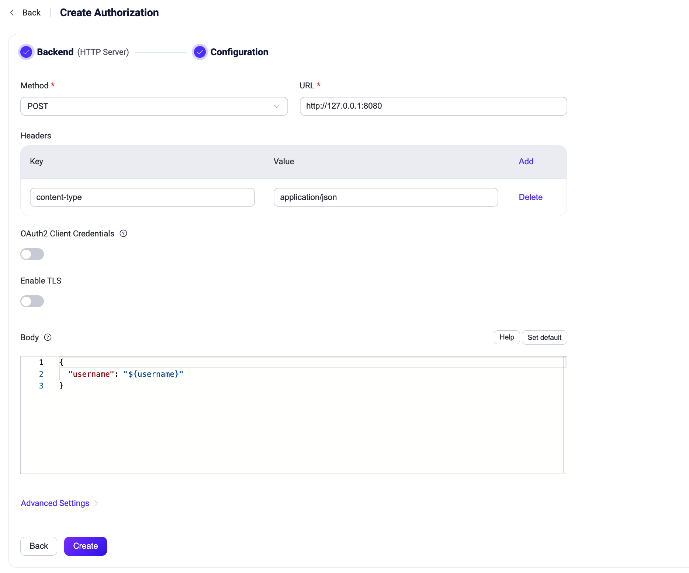

# HTTPサービスの利用

::: tip
EMQX v5.8.0以降、HTTP認証機能はレスポンスボディにACLルールを含めてクライアントの権限を事前設定できるようになりました。より良いパフォーマンスのために新しいフォーマットの利用を推奨します。詳細は[HTTP認証](../authn/http.md)をご参照ください。
:::

EMQXはHTTPサービスに基づく認可をサポートしています。ユーザーは外部のHTTPアプリケーションをデータソースとして自身で構築する必要があります。EMQXはHTTPサービスにリクエストを送り、HTTP APIから返されたデータに基づいて認可結果を判定し、複雑な認可ロジックを実現します。

::: tip ヒント

[EMQX認可の基本概念](./authz.md)の知識

:::

## HTTPリクエストとレスポンス

クライアントがサブスクライブやパブリッシュ操作を開始すると、HTTP認可者は設定されたリクエストテンプレートに基づいてリクエストを構築し送信します。ユーザーは認可サービス内で認可ロジックを実装し、以下の要件に従って結果を返す必要があります。

### リクエスト

リクエストはJSON形式を使用でき、URLやリクエストボディ内で以下のプレースホルダーが利用可能です：

- `${clientid}`：クライアントID
- `${username}`：クライアントがログイン時に使用したユーザー名
- `${client_attrs.NAME}`：クライアント属性。`NAME`は実行時に事前定義された設定に基づく属性名に置き換えられます。クライアント属性の詳細は[MQTTクライアント属性](../../../develop/client-attributes/client-attributes.md)をご参照ください。
- `${peerhost}`：クライアントの送信元IPアドレス。[Proxy Protocol](http://www.haproxy.org/download/1.8/doc/proxy-protocol.txt)が有効な場合はプロキシが報告する送信元IPを使用します。
- `${peerport}`：EMQX 6.3.0以降、クライアントの送信元ポート（例：`51544`）。Proxy Protocolが有効な場合はプロキシが報告する送信元ポートを使用します。
- `${peername}`：EMQX 6.3.0以降、クライアントの送信元IPアドレスとポート。IPv4の場合は`IP:port`形式（例：`192.168.0.1:51544`）、IPv6の場合は角括弧なし（例：`2001:db8::1:51544`）。Proxy Protocolが有効な場合はプロキシが報告するIPアドレスとポートを使用します。
- `${proto_name}`：クライアントが使用するプロトコル名（例：`MQTT`、`CoAP`）
- `${mountpoint}`：ゲートウェイリスナーのマウントポイント（トピックプレフィックス）
- `${action}`：リクエストされている操作（例：`publish`、`subscribe`）
- `${topic}`：現在のリクエストでパブリッシュまたはサブスクライブされるトピック（またはトピックフィルター）
- `${qos}`：現在のリクエストでパブリッシュまたはサブスクライブされるメッセージのQoS
- `${retain}`：現在のリクエストでパブリッシュされるメッセージがリテインドメッセージかどうか
- `${zone}`：実行時のクライアントのゾーン。ゾーンはクライアントの論理的分類（例：地域や環境）であり、クライアント設定に基づき動的に適用されます。

::: tip
`${peerhost}`および`${peerport}`のプレースホルダーは非推奨です。後方互換性のためにサポートは継続していますが、新しいテンプレートでは対応可能な場合`${peername}`を使用してください。
:::

### レスポンス

認可サービスはチェック後、以下の形式でレスポンスを返す必要があります：

- レスポンスの`content-type`は`application/json`であること。
- HTTPステータスコードが`200`の場合、HTTPボディの`result`フィールドの値により認可結果を判定します：
  - `allow`：パブリッシュまたはサブスクライブを許可
  - `deny`：パブリッシュまたはサブスクライブを拒否
  - `ignore`：このリクエストを無視し、次の認可者に処理を委ねる
- HTTPステータスコードが`204`の場合、このパブリッシュまたはサブスクライブリクエストは許可されたものとみなします。
- `200`および`204`以外のHTTPステータスコードは「無視」とみなされます。例えばHTTPサービスが利用不可の場合などです。

<!--- 注意：コードは`application/x-www-form-urlencoded`もサポートしていますが、将来的な拡張が難しいためドキュメントには記載していません -->

レスポンス例：

```json
HTTP/1.1 200 OK
Headers: Content-Type: application/json
...
Body:
{
    "result": "allow" | "deny" | "ignore" // デフォルトは "ignore"
}
```

::: tip EMQX 4.xとの互換性について

4.x系ではHTTP APIが返すステータスコードのみを使用し、内容は破棄していました。例えば`200`は許可、`403`は拒否を意味します。より詳細な情報提供のため、EMQX 5.0でレスポンス内容の返却を追加しました。

:::

::: tip

`POST`メソッドの使用を推奨します。`GET`メソッド使用時はHTTPサーバーログに機密情報が露出する可能性があります。

信頼できない環境ではHTTPSの利用を推奨します。

:::

## 動的ホスト名解決の設定

デフォルトでは、HTTP認可者は作成時に`url`のホスト名を解決し、永続的なコネクションプールを使用します。認可リクエストごとにホスト名を解決したい場合は、`hostname_resolution`を`dynamic`に設定してください。

動的ホスト名解決では、`url`のホスト部分にプレースホルダーを使用できます。例えば、以下の設定はクライアントの`tenant`属性に応じて認可リクエストを異なるエンドポイントにルーティングします：

```hocon
{
    type = http
    method = post
    url = "https://${client_attrs.tenant}.auth.example.com/authz"
    hostname_resolution = dynamic
    allowed_hosts = ["*.auth.example.com"]
    pool_size = 8
    headers {
        "Content-Type" = "application/json"
    }
    body {
        username = "${username}"
        topic = "${topic}"
        action = "${action}"
    }
    ssl {
        enable = true
    }
}
```

動的ホスト名解決を設定する際の注意点：

- `hostname_resolution`は`static`または`dynamic`を受け付けます。デフォルトは`static`です。リテラルホスト名に対しても`dynamic`を指定してリクエストごとに解決可能です。
- URLのホストにプレースホルダーが含まれる場合、`hostname_resolution`は`dynamic`でなければならず、`allowed_hosts`に少なくとも1つのエントリを含める必要があります。
- `allowed_hosts`の各エントリは正確なホスト名（例：`auth.example.com`）またはワイルドカードパターン（例：`*.auth.example.com`）でなければなりません。ワイルドカードは指定されたサフィックスの下位ホスト名にマッチしますが、サフィックス自体にはマッチしません。URLがリテラルホスト名の場合、`allowed_hosts`は効果を持ちません。
- URLの権限部ではホストのみがプレースホルダーを含められます。スキームは`http`または`https`でなければならず、ポートが指定されている場合はリテラルの整数でなければなりません。URLのユーザー情報やフラグメントはサポートされません。URLパスやクエリのプレースホルダーは引き続きサポートされます。
- EMQXが有効なホスト名をレンダリングできない場合、またはレンダリングされたホスト名が`allowed_hosts`にマッチしない場合、HTTPリクエストは送信されず認可チェックは失敗します。
- `dynamic`モードでは、レンダリングされたすべてのホストへのリクエストが同じコネクションプールを共有します。`pool_size`はプールが再利用のために保持できるアイドルコネクション数を制限します。`0`に設定するとコネクション再利用を無効化します。`enable_pipelining`および`max_inactive`はこのモードでは適用されません。
- `dynamic`モードのHTTPSリクエストでは、EMQXは設定されたTLSオプションをレンダリングされたホストに適用します。SNIが明示的に設定されていない限り、EMQXはレンダリングされたホスト名からSNIを導出します。
- `hostname_resolution`が`dynamic`の場合、OAuth2はサポートされません。

## ダッシュボードでの設定

1. [EMQXダッシュボード](http://127.0.0.1:18083/#/authentication)の左ナビゲーションツリーで**アクセス制御** -> **認可**をクリックし、**認可**ページに入ります。

2. 右上の**作成**をクリックし、**バックエンド**として**HTTPサーバー**を選択し、**次へ**をクリックして**設定**ステップに進みます。

   

3. 以下の指示に従い設定を行います。

   - **メソッド**：HTTPリクエストメソッドを選択します。選択肢は`GET`、`POST`です。
   - **URL**：HTTPアプリケーションのURLを入力します。ホスト部分は**ホスト名解決**が`Dynamic`の場合、[認可プレースホルダー](./authz.md#authorization-placeholders)を含めることができます。
   - **ホスト名解決**：認可者作成時に固定ホスト名を解決する`Static`、または認可リクエストごとにホスト名を解決する`Dynamic`を選択します。デフォルトは`Static`です。詳細は[動的ホスト名解決の設定](#configure-dynamic-hostname-resolution)をご参照ください。
   - **許可ホスト**：URLのホストにプレースホルダーが含まれる場合、レンダリングされたホスト名がマッチ可能な正確なホスト名またはワイルドカードパターンを入力します。
   - **前提条件**：任意のVariform式を入力します。式が`true`評価のときのみこの認可者が呼び出されます。詳細は[認可者の前提条件](./authz.md#authorizer-preconditions)をご参照ください。
   - **ヘッダー**（任意）：HTTPリクエストヘッダーを設定します。キーと値は[プレースホルダー](./authz.md#authorization-placeholders)を使用可能です。
   - **OAuth2クライアント認証**：トグルをオンにすると、EMQXがアクセストークンを取得し、外部HTTP認可サービスへのリクエストに追加します。詳細は[OAuth2クライアント認証の設定](#configure-oauth2-client-credentials)をご参照ください。
   - **TLSを有効化**：トグルをオンにすると外部HTTP認可サービスへの接続でTLSを有効にします。この設定はOAuth2トークンエンドポイントのTLS設定とは独立しています。
   - **ボディ**：HTTPリクエストボディを設定します。キーと値は[プレースホルダー](./authz.md#authorization-placeholders)を使用可能です。
   - **詳細設定**：同時接続数、接続タイムアウト、最大HTTPリクエスト数、リクエストタイムアウトを設定します。
     - **プールサイズ**（任意）：`Static`モードでは永続的なコネクションプールのサイズを指定します。値は最低`1`以上でなければなりません。`Dynamic`モードではリクエスト間で再利用可能な接続数を指定し、`0`に設定すると接続再利用を無効化します。デフォルトは`8`です。
     - **接続タイムアウト**（任意）：接続タイムアウトの待機時間を入力します。単位は**時間**、**分**、**秒**、**ミリ秒**が使用可能です。
     - **HTTPパイプライニング**（任意）：正の整数で、レスポンスを待たずに送信可能な最大HTTPリクエスト数を指定します。デフォルトは`100`です。**ホスト名解決**が`Dynamic`の場合はこの設定は適用されません。
     - **リクエストタイムアウト**（任意）：リクエストタイムアウトの待機時間を入力します。単位は**時間**、**分**、**秒**、**ミリ秒**が使用可能です。

4. **作成**をクリックして設定を完了します。

### OAuth2クライアント認証の設定

EMQX 6.3.0以降、HTTP認可者はOAuth 2.0クライアントクレデンシャルズグラントをサポートしています。OAuth2を有効にすると、EMQXは設定されたトークンエンドポイントからアクセストークンを取得、キャッシュし、自動更新します。EMQXが外部HTTP認可サービスを呼び出す際、`Authorization: Bearer <access_token>`リクエストヘッダーにトークンを付与し、外部サービスはEMQXを認証できます。

**OAuth2クライアント認証**をオンにし、以下の設定を行います：

| ダッシュボード設定項目 | 説明 |
| --- | --- |
| **トークンエンドポイント** | 必須。アクセストークン取得に使用するOAuth2認可サーバーのエンドポイント。URLはHTTPまたはHTTPSで、ユーザー情報を含んではいけません。 |
| **クライアントID** | 必須。アクセストークン取得に使用するOAuth2クライアントID。 |
| **クライアントシークレット** | 必須。アクセストークン取得に使用するOAuth2クライアントシークレット。 |
| **スコープ** | 任意。アクセストークン取得時に要求するOAuth2スコープ。 |
| **トークンリクエストタイムアウト** | トークンエンドポイントへのHTTPリクエストのタイムアウト。デフォルトは`5`秒。 |
| **TLSを有効化** | トグルをオンにするとトークンエンドポイントへのTLSを有効化します。この設定は外部HTTP認可サービスのTLS設定とは独立しています。 |

EMQXは`application/x-www-form-urlencoded`コンテンツタイプの`POST`リクエストをトークンエンドポイントに送信します。リクエストボディには`grant_type`、`client_id`、`client_secret`、および任意の`scope`が含まれます。トークンエンドポイントは`200`レスポンスで`access_token`を含むJSONボディを返す必要があります。`token_type`と`expires_in`も返すことができ、存在する場合`token_type`は`Bearer`、`expires_in`は正の整数でなければなりません。

::: warning 重要なお知らせ

- OAuth2を有効にした場合、HTTP認可者の`Authorization`ヘッダーを設定しないでください。EMQXは自動生成されるBearer認証ヘッダーと競合するため設定を拒否します。
- トークンエンドポイントはクライアントIDとクライアントシークレットをリクエストボディのフォームフィールドとして受け入れる必要があります。HTTP Basic認証ヘッダーによる認証はサポートされていません。

:::

## 設定ファイルでの設定

HTTP認可は`type=http`で設定します。

任意の`precondition`設定項目はVariform式を受け付けます。式が`true`評価のときのみこの認可者が呼び出されます。`precondition`が省略または空の場合、前提条件は適用されません。詳細は[認可者の前提条件](./authz.md#authorizer-preconditions)をご参照ください。

HTTPの`POST`および`GET`リクエストをサポートします。それぞれに固有のオプションがあります。<!--詳細は[authz:http_post](../../configuration/configuration-manual.html#authz:http_post)および[authz:http_get](../../configuration/configuration-manual.html#authz:http_get)をご参照ください。-->

`POST`リクエストで設定したHTTP認可者の例：

```bash
{
    type = http

    method = post
    url = "http://127.0.0.1:32333/authz/${peercert}?clientid=${clientid}"
    body {
        username = "${username}"
        topic = "${topic}"
        action = "${action}"
    }
    headers {
        "Content-Type" = "application/json"
        "X-Request-Source" = "EMQX"
    }
}
```

`GET`リクエストで設定したHTTP認可者の例：

```bash
{
    type = http

    method = get
    url = "http://127.0.0.1:32333/authz"
    body {
        username = "${username}"
        topic = "${topic}"
        action = "${action}"
    }
    headers {
        "X-Request-Source" = "EMQX"
    }
}
```

### OAuth2クライアント認証の設定

EMQX 6.3.0以降、HTTP認可者設定に`oauth2`ブロックを追加してOAuth2クライアント認証を有効化できます。`method`、`url`、`body`、`headers`と同じ階層に配置してください：

```hocon
oauth2 {
    enable = true
    grant_type = client_credentials
    token_endpoint = "https://auth.example.com/oauth/token"
    client_id = "emqx-client"
    client_secret = "emqx-client-secret"
    scope = "authorization.check"
    timeout = 5s
    ssl {
        enable = true
    }
}
```

認可サーバーがスコープを要求しない場合は`scope`を省略してください。リクエスト形式や制限事項は[OAuth2クライアント認証の設定](#configure-oauth2-client-credentials)をご参照ください。
