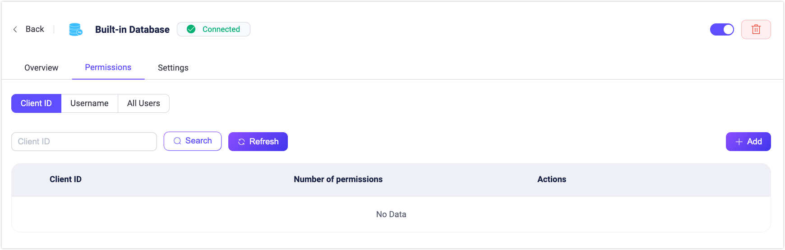

# 組み込みデータベースの使用

EMQXは、組み込みデータベースを通じて低コストかつすぐに使える認可ルールの保存方法を提供しています。Dashboardや設定ファイルで組み込みデータベース（Mnesia）をデータソースとして設定し、DashboardやHTTP APIを通じて関連する認可チェックルールを追加できます。

::: tip 前提条件

[EMQX認可の基本概念](./authz.md)の知識

:::

## Dashboardから組み込みデータベース認可者を作成する

1. [EMQX Dashboard](http://127.0.0.1:18083/#/authentication)の左メニューで **アクセス制御** > **認可** に移動し、**認可** ページを開きます。

2. 右上の **作成** をクリックし、**バックエンド** に **組み込みデータベース** を選択してから **次へ** をクリックします。

   

3. **設定** ステップで、クライアントまたはユーザーごとに許可される最大認可ルール数を定義する **Max Rules** の値を設定します（デフォルト：`100`）。

   ::: tip 注意

   ルール数を多く設定するとシステムのパフォーマンスに影響を与える可能性があります。

   :::

4. **作成** をクリックして設定を完了します。

## 設定ファイルから組み込みデータベース認可者を作成する

組み込みデータベース認可者は `built_in_database` タイプで識別されます。

設定例：

```bash
{
    type = built_in_database
    enable = true
}
```

- `type`: 認可チェッカーのデータソースタイプ。ここには `built_in_database` を指定します。

- `enable`: このチェッカーを有効にするかどうか。オプション値は `true` または `false`。

<!--詳細なパラメータ一覧は [authz-mnesia](../../configuration/configuration-manual.html#authz-mnesia) を参照してください。-->

## 認可ルールの作成

認可ルールはDashboardまたはAPIを通じて作成できます。

### Dashboardから認可ルールを作成する

EMQX Dashboardの **組み込みデータベース** バックエンドの **権限** ページで直接認可ルールを定義できます。

#### 権限ページへのアクセス

1. Dashboardで **認可** ページに移動します。  
2. **組み込みデータベース** バックエンドの **操作** 列で **権限** をクリックします。



#### 認可ルールのスコープ

認可ルールは以下の3つのスコープで設定可能です：

- **クライアントID**：特定のクライアントIDに適用するルール  
- **ユーザー名**：特定のユーザー名に適用するルール  
- **すべてのユーザー**：すべてのクライアント／ユーザーに適用するルール（パターンやIP範囲でフィルタ可能）

#### 共通のルールフィールド

すべてのルールタイプで利用可能なフィールドは以下の通りです：

| フィールド             | 説明                                                                                     |
| ---------------------- | ---------------------------------------------------------------------------------------- |
| **Action**             | ルールが適用される操作タイプ。選択肢：`Publish`、`Subscribe`、`Publish & Subscribe`。  |
| **Permission**         | 操作を許可するか拒否するか。選択肢：`Allow`、`Deny`。                                   |
| **Topic**              | ルールが適用されるMQTTトピック。ワイルドカード（`+`、`#`）をサポート。                  |
| **QoS**                | 許可されるQoSレベル。複数選択可：`0`、`1`、`2`。                                        |
| **Retain**             | ルールが保持メッセージに適用されるかどうか。選択肢：`true`、`false`、`All`。             |
| **IP Address Range**   | ルールが適用されるクライアントのIP範囲。CIDR表記（例：`192.168.1.0/24`）または正確なIPを指定可能。 |
| **Listener**           | ルールが適用されるリスナー。`{type}:{name}`形式で指定（例：`tcp:default`、`ws:default`）。 |
| **Zone**               | ルールが有効となるゾーン。マルチゾーン環境で適用可能。                                   |

#### スコープ別フィールド

| ルールスコープ     | フィールド                                                                                             |
| ------------------ | ---------------------------------------------------------------------------------------------------- |
| **クライアントID** | **Client ID**：（必須）このルールが適用される正確なクライアントID。<br />**Username Pattern**：（任意）このルールが有効なユーザー名をマッチさせる正規表現。 |
| **ユーザー名**     | **Username**：（必須）このルールが適用される正確なユーザー名。<br />**Client ID Pattern**：（任意）このルールが有効なクライアントIDをマッチさせる正規表現。 |
| **すべてのユーザー** | **Client ID Pattern**：（任意）このルールが有効なクライアントIDをマッチさせる正規表現。<br />**Username Pattern**：（任意）このルールが有効なユーザー名をマッチさせる正規表現。 |

**パターン例：**

- `^device-user-.*`：`device-user-`で始まるユーザー名にマッチ  
- `^sensor-.*`：`sensor-`で始まるクライアントIDにマッチ

#### ルールの追加

1. **権限** ページで対象のタブ（**クライアントID**、**ユーザー名**、**すべてのユーザー**）を選択します。  
2. **追加** をクリックします。  
3. [共通フィールド](#共通のルールフィールド)および[スコープ別フィールド](#スコープ別フィールド)を入力します。  
4. （任意）複数ルールを追加する場合は **権限を追加** をクリックし、**上へ**・**下へ** ボタンでルールの実行順序を調整します。  
5. **追加** をクリックしてルールを保存します。

#### 複数ルールの管理（すべてのユーザーのみ）

**すべてのユーザー** のルールは、**操作** 列の **その他** メニューからルールの順序を変更できます：

- 上へ移動  
- 下へ移動  
- 先頭へ移動  
- 末尾へ移動

ルールは上から順に評価されるため、順序が優先度を決定します。

#### ルールの編集と管理

**権限** ページで既存ルールの編集や削除が可能です：

- 対応するルールの **操作** 列で **編集** ボタンをクリックし、ルールフィールド、マッチングパターン、IP範囲設定を変更できます。  
- **削除** ボタンをクリックするとルールを削除できます。

### REST APIから認可ルールを作成する

REST APIを使って認可ルールを管理することも可能です。APIエンドポイントはDashboardの3つのスコープ（ユーザー名、クライアントID、すべてのユーザー）に対応しています。

#### エンドポイント

- **ユーザー名ルール**  
  - `POST /authorization/sources/built_in_database/rules/users`：ユーザーのルールを作成  
  - `PUT /authorization/sources/built_in_database/rules/users/:username`：特定ユーザーのルールを置換  
- **クライアントIDルール**  
  - `POST /authorization/sources/built_in_database/rules/clients`：クライアントのルールを作成  
  - `PUT /authorization/sources/built_in_database/rules/clients/:clientid`：特定クライアントのルールを置換  
- **すべてのユーザールール**  
  - `POST /authorization/sources/built_in_database/rules/all`：すべてのクライアント／ユーザーに適用されるグローバルルールを作成または置換  
  - `PUT` リクエストはなく、`POST` で全ルールを更新または作成します。

#### ステップ1：認証トークンの取得

APIアクセスにはEMQX Dashboardで認証し、トークンを取得する必要があります：

```bash
export EMQX_TOKEN=$(curl --silent -X 'POST' "http://localhost:18083/api/v5/login" \
  -H 'Accept: application/json' \
  -H 'Content-Type: application/json' \
  -d '{"username": "admin","password": "public"}' | jq -r ".token")
```

#### ステップ2：組み込みデータベース認可ソースの作成

ルール作成前に組み込みデータベース認可ソースを作成してください：

```bash
curl -X 'POST' \
  'http://localhost:18083/api/v5/authorization/sources' \
  -H "Authorization: Bearer $EMQX_TOKEN" \
  -H 'Accept: */*' \
  -H 'Content-Type: application/json' \
  -d '{
        "enable": true,
        "max_rules": 100,
        "type": "built_in_database"
  }'
```

#### ステップ3：認可ルールの作成

- **特定クライアントIDのルール作成**：

  ```bash
  curl -X 'POST' \
    'http://localhost:18083/api/v5/authorization/sources/built_in_database/rules/clients' \
    -H "Authorization: Bearer $EMQX_TOKEN" \
    -H 'Accept: */*' \
    -H 'Content-Type: application/json' \
    -d '[
    {
      "clientid": "client1",
      "rules": [
        {
          "action": "publish",
          "permission": "allow",
          "topic": "test/topic/1"
        },
        {
          "action": "subscribe",
          "permission": "allow",
          "topic": "test/topic/2"
        },
        {
          "action": "all",
          "permission": "deny",
          "topic": "eq test/#"
        }
      ]
    }
  ]'
  ```

- **特定ユーザー名のルール作成**：

  ```bash
  curl -X 'POST' \
    'http://localhost:18083/api/v5/authorization/sources/built_in_database/rules/users' \
    -H "Authorization: Bearer $EMQX_TOKEN" \
    -H 'Accept: */*' \
    -H 'Content-Type: application/json' \
    -d '[
    {
      "username": "user1",
      "rules": [
        {
          "topic": "v1/devices/#",
          "permission": "allow",
          "action": "publish",
          "qos": [0,1,2],
          "retain": "all"
        }
      ]
    }
  ]'
  ```

#### 例：ユーザーのルールを更新する

```bash
curl -X PUT 'http://localhost:18083/api/v5/authorization/sources/built_in_database/rules/users/user1' \
  -H "Authorization: Bearer $EMQX_TOKEN" \
  -H 'Content-Type: application/json' \
  -d '{
    "username": "user1",
    "rules": [
      {
        "topic": "v1/devices/+/state",
        "permission": "allow",
        "action": "subscribe",
        "qos": [0,1],
        "retain": "all"
      }
    ]
  }'
```

#### 例：すべてのユーザーのルールを作成する

```bash
curl -X POST 'http://localhost:18083/api/v5/authorization/sources/built_in_database/rules/all' \\
  -H "Authorization: Bearer $EMQX_TOKEN" \\
  -H 'Content-Type: application/json' \\
  -d '[
    {
      "rules": [
        {
          "topic": "v1/#",
          "permission": "deny",
          "action": "all"
        }
      ]
    }
  ]'
```

#### ルールフィールド

各ルールは以下のフィールドを含めることができます：

| フィールド                 | 説明                                                                                              |
| -------------------------- | ------------------------------------------------------------------------------------------------- |
| **username** / **clientid** | このルールが適用される正確なユーザー名またはクライアントID（エンドポイントにより異なる）          |
| **topic**                  | このルールが適用されるMQTTトピック。ワイルドカード（`+`、`#`）および[トピックプレースホルダー](./authz.md#topic-placeholders)をサポート。 |
| **permission**             | 現在のクライアント／ユーザーからの操作要求を許可するか拒否するか。選択肢：`allow`、`deny`。        |
| **action**                 | 操作タイプ。選択肢：`publish`、`subscribe`、`all`。                                              |
| **qos**                    | （任意）許可されるQoSレベル。例：`[0,1]`。デフォルトはすべてのレベル。                           |
| **retain**                 | （任意）ルールが保持メッセージに適用されるかどうか。選択肢：`true`、`false`、`all`。             |
