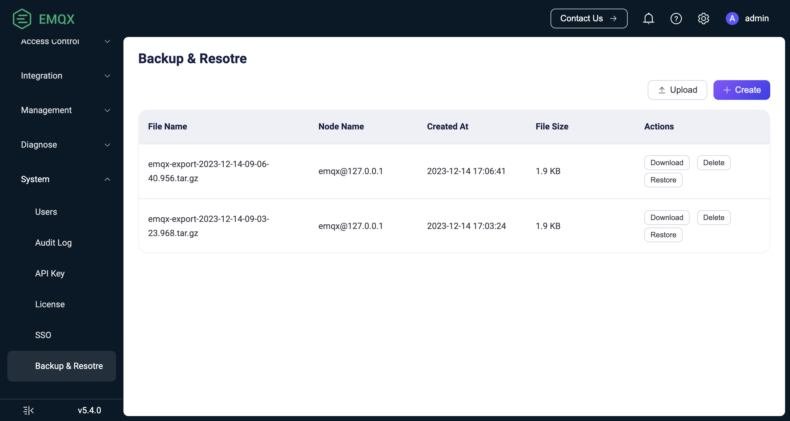

# バックアップとリストア

EMQXは分散ストレージスキーマを採用し、システムの高可用性を確保するためにクラスター転送機能も導入しています。

本ページでは、システム障害時のデータ損失を防ぐために、運用データおよび設定ファイルのバックアップ方法について説明します。

## 機能説明

EMQXはバックアップとリカバリを実現するために、データのインポートおよびエクスポート用のCLIコマンドを提供しています。EMQX 4.xのコマンドと類似していますが、エクスポートファイルのフォーマットは4.xとは互換性がありません。

- EMQX 4.xでは、EMQXの設定および組み込みデータベースに必要なすべてのデータを単一のJSONファイルに保存していました。
- EMQX 5.xでは、エクスポートされたデータがtarファイル形式で圧縮され、大量のユーザーデータをより効率的かつ構造的に扱えるようになっています。

CLIコマンドに加えて、EMQX Enterpriseではダッシュボード上にデータのバックアップおよびリカバリページがあり、そこでデータのインポート・エクスポート操作を行うことができます。

EMQXがインポートおよびエクスポートに対応しているデータは以下の通りです：

- EMQXの[設定リライトファイル](./configuration/configuration.md#configuration-rewrite-file)の内容：
  - 認証および認可設定
  - ルール、コネクター、Sink/Source
  - リスナー、ゲートウェイ設定
  - その他のEMQX設定
- 組み込みデータベース（Mnesia）データ
  - ダッシュボードユーザーおよびREST APIキー
  - クライアント認証情報（組み込みデータベースのパスワード認証、拡張認証）
  - PSK認証データ
  - 認可ルール
  - ブラックリストデータ
  - 保持メッセージ
- EMQXデータディレクトリ（`node.data_dir`）に保存されているSSL/TLS証明書
- EMQXデータディレクトリに保存されている認可用`acl.conf`ファイル

::: tip 特記事項

1. エクスポートファイルにはEMQXデータディレクトリに保存されているSSL/TLS証明書および`acl.conf`ファイルのみが含まれます。データディレクトリ外にある証明書や`acl.conf`ファイルがある場合は、インポート前に手動で適切な場所にコピーしておく必要があります。
2. エクスポートファイルのファイル名形式は`emqx-export-YYYY-MM-DD-HH-mm-ss.sss.tar.gz`で、エクスポート先ディレクトリは`<EMQX data directory>/backup`です。
3. EMQX v5.7.1以降では、保持メッセージのストレージ方式がram（メモリ）に設定されている場合でもバックアップされます。

:::

### エクスポート

データは稼働中の任意のクラスターのノードからエクスポート可能です。

### インポート

データをインポートするにはEMQXノードが稼働中である必要があり、インポート操作が成功するためには以下の条件を満たす必要があります：

- [コアノード＋レプリカノード](../develop/cluster/mria-introduction.md)モードが有効な場合、データインポートはコアノードでのみ実行可能です。実際のインポート動作には影響しません。データはコアノードとレプリカノードを含むすべてのクラスターのノードにレプリケートされます。コアノードで操作することで正しいデータインポートが保証されます。
- データファイルの名前を変更してはいけません。

上記の条件を満たさない場合、インポート処理は中止され、対応するエラーメッセージが表示されます。

データインポート中は、対象のEMQXクラスターに存在しないデータは挿入され、競合がある場合は更新されます。インポート処理は既存のデータを削除しません。

::: tip 特記事項

稀に既存データとインポートデータが互換性がない場合があります。例えば、EMQXクラスターが組み込みデータベース認証を使用し、saltの位置を「suffix」に設定しているのに対し、インポートデータでは同じ設定が「prefix」になっている場合、インポート後に新しい設定が有効となり、以前作成した古いユーザー認証情報が使えなくなります。

そのため、データをクリアせずにEMQXクラスターにデータをインポートする際は特に注意が必要です。

:::

## ダッシュボードでの例

このセクションでは、ダッシュボード上でのデータインポートおよびエクスポート操作方法を説明します。

:::tip

- ダッシュボードによるバックアップとリカバリはEMQX Enterpriseエディションv5.4.0以降で利用可能です。
- CLIでエクスポートしたバックアップファイルもダッシュボードのバックアップ＆リカバリページで管理できます。

:::

1. ダッシュボードにログインし、**システム** -> **バックアップ＆リストア**ページに移動します。

2. データをエクスポートするには、右上の**作成**ボタンをクリックし、EMQXクラスターの現在のデータに基づくバックアップファイルを作成します。バックアップファイル一覧ページでファイル情報を確認できます：

   - **ファイル名**：バックアップファイルの名前
   - **ノード名**：バックアップファイルが保存されているノード名であり、そのノードのデータのみを含むわけではありません
   - **作成日時**：バックアップファイルの作成日時
   - **ファイルサイズ**：バックアップファイルのサイズ

   **操作**列の**ダウンロード**をクリックするとファイルをダウンロードし、ローカルに保存できます。

3. データをインポートするには、右上の**アップロード**ボタンをクリックしてバックアップファイルを現在のEMQXクラスターにアップロードします。アップロード直後に復元は行われません。バックアップファイル一覧の**操作**列にある**復元**をクリックすると、バックアップファイルを現在のEMQXクラスターにインポートできます。



## CLIでの例

このセクションでは、コマンドラインインターフェースを使ったデータのインポートおよびエクスポート方法を示します。

1. データをエクスポートします。エクスポートファイルのファイル名形式は`emqx-export-YYYY-MM-DD-HH-mm-ss.sss.tar.gz`で、エクスポート先ディレクトリは`<EMQX data directory>/backup`です：

    ```bash
    $ ./emqx ctl data export
    Exporting data to "data/backup/emqx-export-2023-06-19-15-14-19.947.tar.gz"...
    Exporting cluster configuration...
    Exporting additional files from EMQX data_dir: "data"...
    Exporting built-in database...
    Exporting emqx_admin database table...
    Exporting emqx_authn_mnesia database table...
    Exporting emqx_enhanced_authn_scram_mnesia database table...
    Exporting emqx_app database table...
    Exporting emqx_acl database table...
    Exporting emqx_psk database table...
    Exporting emqx_banned database table...
    Data has been successfully exported to data/backup/emqx-export-2023-06-19-15-14-19.947.tar.gz.
    ```
2. データをインポートします。インポートするファイル名は絶対パスまたは相対パスで指定できます。ファイルが`<EMQX data directory>/backup`ディレクトリにある場合は、パスなしのベース名だけでも指定可能です。例：

    ```bash
    # 絶対パスでファイルをインポート
    $ ./emqx ctl data import /tmp/emqx-export-2023-06-19-15-14-19.947.tar.gz
    Importing data from "/tmp/emqx-export-2023-06-19-15-14-19.947.tar.gz"...
    Importing cluster configuration...
    Importing built-in database...
    Importing emqx_banned database table...
    Importing emqx_psk database table...
    Importing emqx_acl database table...
    Importing emqx_app database table...
    Importing emqx_enhanced_authn_scram_mnesia database table...
    Importing emqx_authn_mnesia database table...
    Importing emqx_admin database table...
    Data has been imported successfully.

    # EMQXルートディレクトリからの相対パスでファイルをインポート
    $ ./emqx ctl data import ../../../tmp/emqx-export-2023-06-21-13-28-06.418.tar.gz
    Importing data from "../../../tmp/emqx-export-2023-06-21-13-28-06.418.tar.gz"...
    Importing cluster configuration...
    Importing built-in database...
    Importing emqx_enhanced_authn_scram_mnesia database table...
    Importing emqx_authn_mnesia database table...
    Importing emqx_admin database table...
    Importing emqx_acl database table...
    Importing emqx_banned database table...
    Importing emqx_psk database table...
    Importing emqx_app database table...
    Data has been imported successfully.

    # `<EMQX data directory>/backup`ディレクトリからファイルをインポート
    $ cp /tmp/emqx-export-2023-06-21-13-28-06.418.tar.gz /opt/emqx/data/backup/
    $ ./emqx ctl data import emqx-export-2023-06-21-13-28-06.418.tar.gz
    Importing data from "data/backup/emqx-export-2023-06-21-13-28-06.418.tar.gz"...
    Importing cluster configuration...
    Importing built-in database...
    Importing emqx_enhanced_authn_scram_mnesia database table...
    Importing emqx_authn_mnesia database table...
    Importing emqx_admin database table...
    Importing emqx_acl database table...
    Importing emqx_banned database table...
    Importing emqx_psk database table...
    Importing emqx_app database table...
    Data has been imported successfully.
    ```
