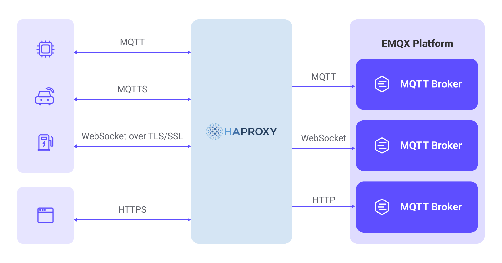
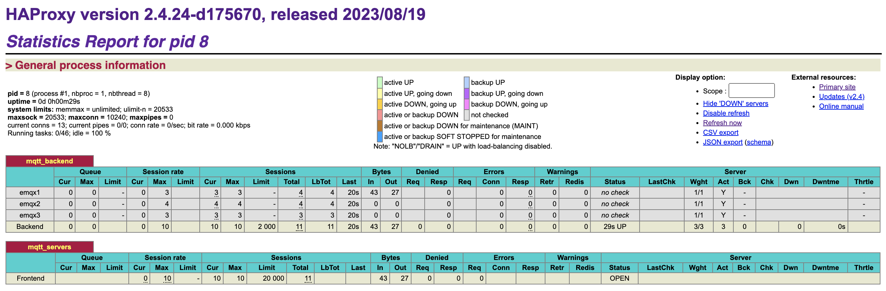
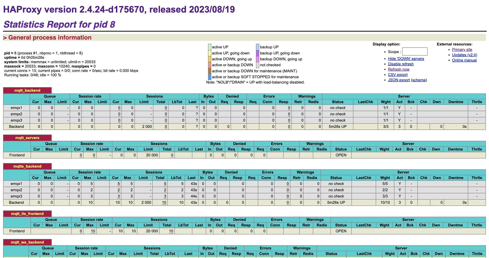

# HAProxyによるEMQXクラスターのロードバランス

HAProxyは、クライアントのネットワーク接続要求を複数のバックエンドサーバーに分散する、無料で高速かつ信頼性の高いロードバランスソフトウェアです。EMQXは複数のMQTTサーバーで構成される分散クラスターアーキテクチャをネイティブにサポートしています。HAProxyを用いてEMQXクラスターを構築することで、IoTデバイスからのMQTT接続をロードバランスし、多数のデバイス接続をクラスター内の異なるEMQXノードに分散できます。

本ページでは、主にHAProxyのインストールと設定方法について説明し、EMQXクラスター内でMQTTサーバーのロードバランスを構築する方法を解説します。

## 特徴と利点

HAProxyを用いたEMQX MQTTロードバランスの利用により、以下の特徴と利点があります。

- HAProxyを介してEMQXクラスターをデプロイすることで、バックエンドノードの情報をリバースプロキシの背後に隠蔽し、外部には統一されたアクセスアドレスを提供。システムの保守性とスケーラビリティを向上させます。
- MQTT over TLS接続の終端をサポートし、EMQXのSSL暗号化計算負荷を軽減。証明書の展開と管理も簡素化します。
- MQTTプロトコルをネイティブに解析可能で、セッションのスティッキー性やインテリジェントなロードバランス機構を実装。違法な接続の識別も可能で、セキュリティ保護を強化します。
- プライマリ・スタンバイサーバーによる高可用性機構を備え、バックエンドのヘルスチェックと組み合わせてサブミリ秒単位のフェイルオーバーを実現し、サービスの継続稼働を保証します。



## クイックスタート

以下は、Docker Compose構成の実例で、簡単にセットアップを試行・検証できます。手順は次の通りです。

1. サンプルリポジトリをクローンし、`mqtt-lb-haproxy`ディレクトリに移動します。

```bash
git clone https://github.com/emqx/emqx-usage-example
cd emqx-usage-example/mqtt-lb-haproxy
```

2. Docker Composeでサンプルを起動します。

```bash
docker compose up -d
```

3. [MQTTX](https://mqttx.app/) CLIを使い、10個のTCP接続を確立してMQTTクライアント接続をシミュレートします。

```bash
mqttx bench conn -c 10
```

4. HAProxyの接続モニタリングとEMQXクライアント接続の分布状況を確認できます。

   - HAProxyのステータス監視ページ http://localhost:8888/stats でクライアント接続状況を確認します。

   

   ここで、現在のアクティブ接続数やリクエスト処理統計が表示されます。

   - 各EMQXノードのクライアント接続状況は以下のコマンドで確認可能です。

   ```bash
   docker exec -it emqx1 emqx ctl broker stats | grep connections.count
   docker exec -it emqx2 emqx ctl broker stats | grep connections.count
   docker exec -it emqx3 emqx ctl broker stats | grep connections.count
   ```

   それぞれのノードの接続数とアクティブ接続数が表示され、10接続がクラスター内のノードに均等に分散されていることがわかります。

   ```bash
   connections.count             : 4
   live_connections.count        : 4
   connections.count             : 3
   live_connections.count        : 3
   connections.count             : 3
   live_connections.count        : 3
   ```

これらの手順により、HAProxyのロードバランス機能を検証し、EMQXクラスター内のクライアント接続分布を観察できます。`emqx-usage-example/mqtt-lb-haproxy/haproxy.conf`ファイルを編集して設定をカスタマイズし、検証することも可能です。

## HAProxyのインストールと使用方法

本節では、HAProxyのインストールと使用方法を詳しく紹介します。

### 前提条件

開始前に、以下の3つのEMQXノードで構成されるクラスターを作成していることを確認してください。EMQXクラスターの作成方法は[クラスターの作成](./create-cluster.md)を参照してください。

| ノードアドレス            | MQTT TCPポート | MQTT WebSocketポート |
| ------------------------- | -------------- | -------------------- |
| emqx1-cluster.emqx.io     | 1883           | 8083                 |
| emqx2-cluster.emqx.io     | 1883           | 8083                 |
| emqx3-cluster.emqx.io     | 1883           | 8083                 |

本ページの例では、単一のHAProxyサーバーをロードバランサーとして設定し、これら3つのEMQXノードからなるクラスターにリクエストを分散します。

### HAProxyのインストール

Ubuntu 22.04 LTS環境でのHAProxyインストール手順は以下の通りです。

```bash
# パッケージインデックスの更新
sudo apt update

# HAProxyのインストール
sudo apt install haproxy

# バージョン確認
haproxy -v
```

### はじめに

HAProxyの設定ファイルはデフォルトで `/etc/haproxy/haproxy.cfg` にあります。本ページの例を参考に、設定ファイルの末尾に設定を追加してください。実行中は `/var/log/haproxy.log` にログが継続的に出力され、デバッグに利用できます。

HAProxyの基本的な操作コマンドは以下の通りです。

設定ファイルの構文チェック：

```bash
sudo haproxy -c -f /etc/haproxy/haproxy.cfg
```

HAProxyの起動：

```bash
sudo systemctl start haproxy
```

設定変更を反映するためのリロード。事前に構文チェックを推奨：

```bash
sudo systemctl reload haproxy
```

HAProxyの停止：

```bash
sudo systemctl stop haproxy
```

HAProxyの稼働状況確認：

```bash
sudo systemctl status haproxy
```

## HAProxyのリバースプロキシおよびロードバランス設定

本節では、さまざまなロードバランス要件に対応するHAProxyの設定方法を解説します。

### 基本設定

HAProxyサーバーを起動するための参考設定例です。`haproxy.cfg`に以下の2つの設定項目が含まれていることを確認してください。

```bash
global
  log 127.0.0.1 local3 info
  daemon
  maxconn 1024000

defaults
  log global
  mode tcp
  option tcplog
  #option dontlognull
  timeout connect 10000
  # timeout > mqttのキープアライブ * 1.2
  timeout client 240s
  timeout server 240s
  maxconn 20000
```

### MQTTのリバースプロキシ設定

以下の設定をHAProxyの設定ファイルに追加することで、MQTT接続をリバースプロキシし、クライアントのリクエストをバックエンドMQTTサーバーにルーティングできます。

```bash
backend mqtt_backend
  mode tcp
  stick-table type string len 32 size 100k expire 30m
  stick on req.payload(0,0), mqtt_field_value(connect, client_identifier)

  # send-proxyを追加すると実際のIPがEMQXに渡され、対応するバックエンドリスナーでproxy_protocolを有効にする必要があります
  # server emqx1 emqx1-cluster.emqx.io:1883 check send-proxy-v2-ssl-cn
  server emqx1 emqx1-cluster.emqx.io:1883
  server emqx2 emqx2-cluster.emqx.io:1883
  server emqx3 emqx3-cluster.emqx.io:1883

frontend mqtt_servers
  bind *:1883
  mode tcp
  # MQTTメッセージ解析のためにバッファが満たされるのを待つ
  tcp-request inspect-delay 10s
  # MQTT以外の接続を拒否
  tcp-request content reject unless { req.payload(0,0), mqtt_is_valid }
  default_backend mqtt_backend
```

### MQTT SSLのリバースプロキシ設定

以下の設定により、HAProxyがMQTTのTLS接続を終端し、クライアントからの暗号化されたMQTTリクエストをバックエンドMQTTサーバーに転送して通信の安全性を確保します。

基本のTCP設定にSSLおよび証明書関連パラメータを追加するだけです。

:::tip Tip
HAProxyの証明書ファイルは証明書と秘密鍵の両方を含む必要があり、`cat`コマンドで1つのファイルに結合できます。

```bash
cat server.crt server.key > server.pem
```

:::

```bash
backend mqtt_backend
  mode tcp
  balance roundrobin

  # send-proxyを追加すると実際のIPがEMQXに渡され、対応するバックエンドリスナーでproxy_protocolを有効にする必要があります
  server emqx1 emqx1-cluster.emqx.io:1883 check-send-proxy send-proxy-v2-ssl-cn
  server emqx2 emqx2-cluster.emqx.io:1883 check-send-proxy send-proxy-v2-ssl-cn
  server emqx3 emqx3-cluster.emqx.io:1883 check-send-proxy send-proxy-v2-ssl-cn

frontend mqtt_tls_frontend
  bind *:8883 ssl crt /etc/haproxy/certs/server.pem
  # 相互認証
  # bind *:8883 ssl ca-file /etc/haproxy/certs/cacert.pem crt /etc/haproxy/certs/server.pem verify required
  mode tcp
  default_backend mqtt_backend
```

### MQTT WebSocketのリバースプロキシ設定

以下の設定により、HAProxyがMQTT WebSocket接続をリバースプロキシし、クライアントリクエストをバックエンドMQTTサーバーに転送します。`server_name`でHTTPのドメイン名やIPアドレスを指定します。

```bash
backend mqtt_ws_backend
  mode tcp
  balance roundrobin
  server emqx1 emqx1-cluster.emqx.io:8083 check
  server emqx2 emqx2-cluster.emqx.io:8083 check
  server emqx3 emqx3-cluster.emqx.io:8083 check

frontend mqtt_ws_frontend
  bind *:8083
  mode tcp
  default_backend mqtt_ws_backend
```

### MQTT WebSocket SSLのリバースプロキシ設定

以下の設定により、HAProxyがMQTT WebSocket接続のTLSを終端し、クライアントからの暗号化されたMQTTリクエストをバックエンドMQTTサーバーに転送して通信の安全性を確保します。`server_name`でHTTPのドメイン名やIPアドレスを指定します。

基本のWebSocket設定にSSLおよび証明書関連パラメータを追加するだけです。

:::tip
HAProxyの証明書ファイルは証明書と秘密鍵の両方を含む必要があり、`cat`コマンドで1つのファイルに結合できます。

```bash
cat server.crt server.key > server.pem
```

:::

```bash
backend mqtt_ws_backend
  mode tcp
  balance roundrobin
  server emqx1 emqx1-cluster.emqx.io:8083 check
  server emqx2 emqx2-cluster.emqx.io:8083 check
  server emqx3 emqx3-cluster.emqx.io:8083 check

frontend mqtt_ws_tls_frontend
  bind *:8084 ssl crt /etc/haproxy/certs/server.pem
  mode tcp
  default_backend mqtt_ws_backend
```

### ロードバランス戦略の設定

HAProxyは接続の分配方法を制御するさまざまなロードバランス戦略を提供しています。実際の運用では、サーバー性能やトラフィック要件などに応じて適切な戦略を選択することが重要です。

以下にHAProxyがサポートするロードバランス戦略と設定例を示します。

#### ラウンドロビン

デフォルトのロードバランス戦略で、リクエストをバックエンドサーバーに順番に循環させて分配します。負荷を均等に分散し、バックエンドサーバーの性能がほぼ同等の場合に適しています。

```bash
backend mqtt_backend
  mode tcp
  balance roundrobin
  server emqx1 emqx1-cluster.emqx.io:1883 check
  server emqx2 emqx2-cluster.emqx.io:1883 check
  server emqx3 emqx3-cluster.emqx.io:1883 check
```

#### 重み付きラウンドロビン

ラウンドロビンをベースに、各EMQXノードに異なる重みを割り当ててリクエストの分配比率を調整します。重みの高いサーバーほど多くのリクエストを受け取ります。

```bash
backend mqtt_backend
  mode tcp
  balance roundrobin
  server emqx1 emqx1-cluster.emqx.io:1883 check weight 5
  server emqx2 emqx2-cluster.emqx.io:1883 check weight 2
  server emqx3 emqx3-cluster.emqx.io:1883 check weight 3
```

#### IPハッシュ

クライアントのIPアドレスをもとにハッシュ値を計算し、リクエストを固定のバックエンドサーバーに割り当てます。同じクライアントからのリクエストは常に同じサーバーに送られます。

```bash
backend mqtt_backend
  mode tcp
  balance source
  server emqx1 emqx1-cluster.emqx.io:1883
  server emqx2 emqx2-cluster.emqx.io:1883
  server emqx3 emqx3-cluster.emqx.io:1883
```

#### 最小接続数

現在の接続数が最も少ないサーバーにリクエストを割り当て、負荷をできるだけ均等に分散します。サーバー性能に差が大きい場合に適しています。

```bash
backend mqtt_backend
  mode tcp
  balance leastconn
  server emqx1 emqx1-cluster.emqx.io:1883
  server emqx2 emqx2-cluster.emqx.io:1883
  server emqx3 emqx3-cluster.emqx.io:1883
```

### MQTTスティッキーセッションロードバランスの設定

MQTTスティッキーセッションロードバランスはHAProxy 2.4で導入されました。

「スティッキー」とは、クライアントが再接続する際に同じサーバーにルーティングし、MQTTのセッション乗っ取りを防ぐ機能を指します。複数のクライアントが頻繁に再接続する場合や、問題のあるクライアントが頻繁に切断・再接続する場合に効果的です。

スティッキーセッションを実現するには、サーバーが接続要求内のクライアント識別子（通常はクライアントID）を特定する必要があり、ロードバランサーはMQTTパケットを解析します。クライアント識別子を取得後、静的クラスターならハッシュでサーバーIDに割り当てるか、ロードバランサーがクライアント識別子とターゲットノードIDのマッピングテーブルを保持して柔軟にルーティングします。

```bash
backend mqtt_backend
  mode tcp
  # スティッキーセッション用テーブルを作成
  stick-table type string len 32 size 100k expire 30m

  # クライアントIDをキーに使用
  stick on req.payload(0,0), mqtt_field_value(connect, client_identifier)

  server emqx1 emqx1-cluster.emqx.io:1883
  server emqx2 emqx2-cluster.emqx.io:1883
  server emqx3 emqx3-cluster.emqx.io:1883
```

## HAProxyのステータス監視

HAProxyは特別なフロントエンドを設定してステータス監視を有効にできます。これにより、各バックエンド・フロントエンドの接続状況やグローバルな接続統計を閲覧可能です。詳細は[Exploring the HAProxy Stats Page](https://www.haproxy.com/blog/exploring-the-haproxy-stats-page)を参照してください。

```bash
frontend stats
  mode http
  bind *:8888
  stats enable
  stats uri /stats
  stats refresh 10s
```

http://localhost:8888/stats を開くとステータスデータが表示されます。



### HAProxy高可用性ソリューションの紹介

HAProxyとKeepalivedは、高可用性とロードバランスを実現する一般的な組み合わせです。KeepalivedはLinux向けの軽量な高可用性ソリューションで、複数サーバー間で仮想IPアドレス（VIP）を管理し、サーバー障害時にVIPを別のサーバーに移動させて高可用性を実現します。さらに、KeepalivedはHAProxyプロセスを監視し、必要に応じて再起動してロードバランスサービスの可用性を確保します。

Keepalivedを利用することで、HAProxyの高可用性を保証できます。プライマリHAProxyサーバーが障害を起こした場合、Keepalivedが自動的にVIPをバックアップサーバーに移動し、サービスの継続性を維持します。このソリューションの実装方法は[HAProxyドキュメント](https://www.haproxy.com/documentation/hapee/latest/high-availability/active-standby/)を参照してください。

## さらに詳しく

EMQXはHAProxyに関する豊富な情報を提供しています。以下のリンクもご参照ください。

**ブログ:**

- [HAProxyベースのEMQXクラスター構築](https://www.emqx.com/en/blog/emqx-haproxy)
- [スティッキーセッションロードバランス - MQTTブローカークラスタリングパート2](https://www.emqx.com/en/blog/mqtt-broker-clustering-part-2-sticky-session-load-balancing)
