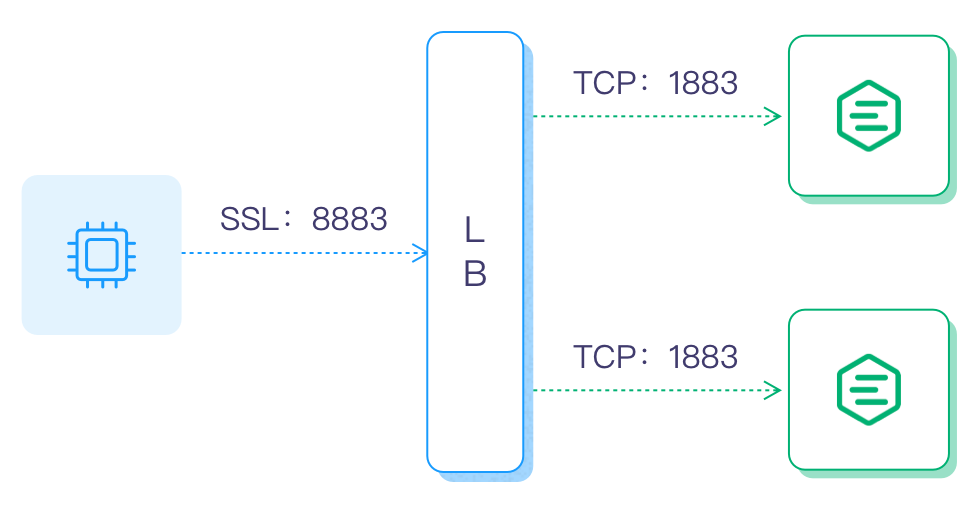
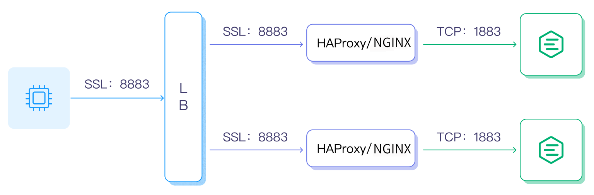

# ロードバランサーの設定

ロードバランサー（LB）は複数のネットワークコンポーネント間で負荷を分散し、リソースの使用を最適化することで、過負荷によるシステム障害を回避します。LBはEMQXにおいて必須のコンポーネントではありませんが、以下のような明確なシステム上の利点があります。

- EMQXの負荷を分散し、単一ノードの過負荷を防止する。
- クライアントの設定を簡素化し、クライアントはLBにのみ接続すればよく、クラスター内のスケーリングを意識する必要がない。
- TLS/SSL終端によりEMQXクラスターの負荷を軽減する。
- クラスターの前段にLBを配置することで不要なトラフィックを遮断し、悪意ある攻撃からEMQXクラスターを保護し、セキュリティを向上させる。

本節では、EMQXにおけるLBの設定方法を紹介します。

## デプロイメントアーキテクチャ

本節では、3種類のロードバランサーのデプロイメントアーキテクチャを紹介します。

### TCPロードバランサー

LBを設定したEMQXクラスターでは、LBが受信したTCPトラフィックを処理し、受け取ったMQTT接続要求やメッセージを異なるEMQXノードに振り分けます。典型的なデプロイメントアーキテクチャは以下の通りです。


### TLS終端とロードバランサー

SSL/TLSが有効な場合は、LBでSSL/TLS接続を終端することを推奨します。つまり、クライアントとLB間はSSL/TLSで保護し、LBとEMQXノード間はTCP接続を用いることで、EMQXクラスターのパフォーマンスを最大化します。アーキテクチャは以下の通りです。



### ハイブリッドデプロイメント

クラウドサービスプロバイダーのLBを接続および負荷分散層として利用したいが、TLS終端に対応していなかったり、プロキシプロトコルなど特定のTLS機能が不足している場合は、ハイブリッドデプロイメントを選択できます。EMQXの前段にHAProxyやNGINXを配置し、SSL/TLS接続を終端します。

EMQXで直接TLS接続を処理する場合と比較して、より高いパフォーマンス効果が得られます。デプロイメントアーキテクチャは以下の通りです。



ロードバランシングによるクラスターのデプロイに加え、DNSラウンドロビンを利用してEMQXクラスターに直接接続する方法もあります。この場合はすべてのノードをDNSラウンドロビンリストに追加し、デバイスはドメイン名またはIPアドレスリストを介してクラスターにアクセスします。ただし、DNSラウンドロビンは本番環境での利用は一般的に推奨されません。

## 実IPおよびTLS証明書情報の取得

LBをデプロイした後、EMQXは通常クライアントの実際の送信元IPやTLS証明書情報を取得する必要があります。そのためには、LBで[プロキシプロトコル](https://www.haproxy.com/blog/haproxy/proxy-protocol)の設定を有効にするか、実IPを取得するための関連設定を有効にする必要があります。

LBでプロキシプロトコルを有効にした場合、EMQXの該当リスナーでも`proxy_protocol`設定を有効にする必要があります。例えば、TCP 1883リスナーの場合は設定ファイルに以下を追加します。

```bash
listeners.tcp.default {
  bind = "0.0.0.0:1883"
  max_connections = 1024000

  proxy_protocol = true
}
```

LBでのプロキシプロトコル有効化方法については、各LBのドキュメントを参照してください。プロキシプロトコルをサポートしないLB製品でも、バックエンドサービスが実際のクライアントIPを取得できる場合があります。LBやクラウドサービスプロバイダーの仕様に応じて適切に設定してください。

### クライアントTLS証明書情報

クライアント証明書情報（Common Name（CN）やSubjectなど）を転送できるのはプロキシプロトコルv2のみです。ロードバランサーがクライアント証明書情報をTCPリスナーに送信する場合は、プロキシプロトコルv2を使用していることを確認してください。

## LB製品の選択

現在、多くのLB製品が存在し、オープンソース版や商用版が利用可能です。また、パブリッククラウドプロバイダーもロードバランシングサービスを提供しています。

パブリッククラウド向けLB製品：

| クラウドプロバイダー                      | SSL終端 | プロキシプロトコル対応 | LB製品                                                    |
| ----------------------------------------- | ------- | ---------------------- | --------------------------------------------------------- |
| [AWS](https://aws.amazon.com)             | 対応    | 対応                   | <https://aws.amazon.com/elasticloadbalancing/?nc1=h_ls>   |
| [Azure](https://azure.microsoft.com)      | 不明    | 不明                   | <https://azure.microsoft.com/en-us/products/load-balancer/> |
| [Google Cloud](https://cloud.google.com/) | 対応    | 対応                   | <https://cloud.google.com/load-balancing>                 |

プライベートクラウド向けLB製品：

| オープンソースLB                     | SSL終端 | プロキシプロトコル対応 | ドキュメント/URL                                         |
| ---------------------------------- | ------- | ---------------------- | ------------------------------------------------------- |
| [HAProxy](https://www.haproxy.org) | 対応    | 対応                   | <https://www.haproxy.com/solutions/load-balancing.html> |
| [NGINX](https://www.nginx.com)     | 対応    | 対応                   | <https://www.nginx.com/solutions/load-balancing/>       |

以下の2ページでは、プライベートにデプロイしたLBサーバーを例に、EMQXクラスターの設定およびロードバランシング方法を紹介します。

- [NGINXによるEMQXクラスターのロードバランス](./lb-nginx.md)
- [HAProxyによるEMQXクラスターのロードバランス](./lb-haproxy.md)
