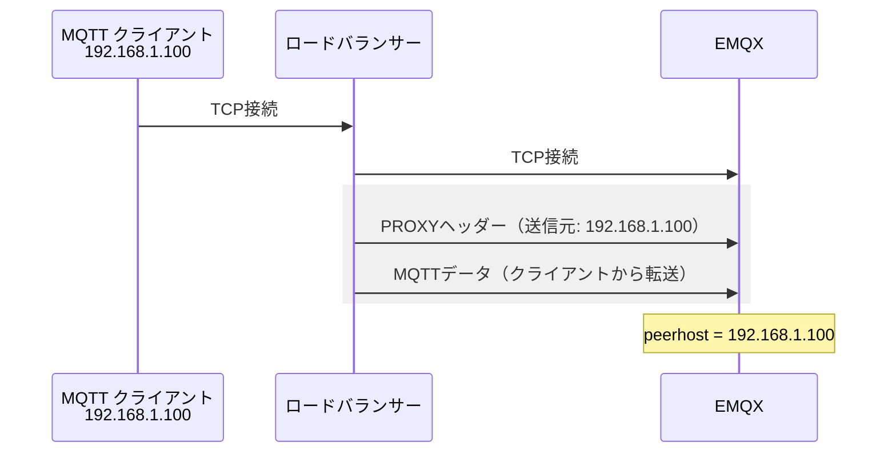

# PROXYプロトコル

EMQXをロードバランサーやリバースプロキシの背後にデプロイする場合、EMQXに到達するTCP接続は実際のクライアントからではなくプロキシから発生します。そのため、EMQXはプロキシのアドレスのみを認識し、実際のクライアントIPを把握できません。これは、IPによる認証ルール、送信元アドレスに基づく認可ポリシー、監査ログ、レート制限、およびトラブルシューティングに影響します。

PROXYプロトコルはこの問題を解決します。HAProxyによって定義された軽量なトランスポート層の仕組みで、元のクライアントのIPアドレス、ポート、および接続メタデータを含む小さなヘッダーをTCPストリームの先頭に付加します。EMQXはMQTTトラフィックを処理する前にこのヘッダーを読み取り、以降のすべての操作で報告されたアドレスを実際のクライアントアドレスとして扱います。

## PROXYプロトコルのバージョン

PROXYプロトコルには2つのバージョンがあります。

| バージョン | フォーマット | TLS証明書転送 |
| ---------- | ------------ | ------------- |
| v1         | 人間が読めるテキスト行 | 非対応        |
| v2         | バイナリヘッダー       | 対応（CN、Subject、SANなど） |

**v1**はシンプルで、プロキシがペイロードの前に単一のASCII行を挿入します。

```text
PROXY TCP4 192.168.1.100 10.0.0.1 56324 1883\r\n
```

**v2**はTLS拡張フィールドを含むより豊富なメタデータを運ぶコンパクトなバイナリ形式です。ロードバランサーがTLS終端を相互認証付きで行い、EMQX内でクライアント証明書情報（例：認証や認可のプレースホルダー`${cert_common_name}`）を利用したい場合は、PROXYプロトコルv2が必要です。

::: tip

PROXYプロトコルは単方向かつ接続ごとの仕組みであり、MQTTクライアント側の変更は不要です。

:::

## 動作の仕組み

PROXYプロトコル有効時のフローは以下の通りです。

1. MQTTクライアントがロードバランサーへTCP接続を開く。
2. ロードバランサーがEMQXへ新しいTCP接続を確立し、元のクライアントのアドレスを示すPROXYプロトコルヘッダー（v1またはv2）を即座に送信する。
3. EMQXはMQTTデータを処理する前にヘッダーを読み取り解析する。
4. 以降のEMQXのすべての操作（認証、認可、ログ記録、レート制限）はヘッダーに記載されたクライアントアドレスを使用する。



EMQXリスナーでPROXYプロトコルが有効でもヘッダーが届かない場合（例：ロードバランサーを経由しない直接接続）、EMQXはエラーで接続を切断します。逆にリスナーでPROXYプロトコルが無効なのにプロキシがヘッダーを送信した場合、EMQXはそれを不正なMQTTデータとして扱います。

::: warning 重要なお知らせ

ロードバランサーとEMQXリスナーの両方でPROXYプロトコルの設定が一致している必要があります。不一致があると接続に失敗します。

:::

## EMQXリスナーでPROXYプロトコルを有効化する

`proxy_protocol`オプションはMQTT TCP、MQTT SSL、MQTT WebSocket、MQTT WebSocket SSLなど、すべてのTCPベースのEMQXリスナーで利用可能です。デフォルトでは無効です。

::: warning セキュリティ注意事項

EMQXリスナーでPROXYプロトコルを有効にする場合、リスナーのエンドポイントが公開されていないことを確認してください。ファイアウォールルールを設定し、指定したプロキシやロードバランサーのみからのアクセスを許可してください。

:::

### ダッシュボードでの設定

1. EMQXダッシュボードの **Management** -> **Listeners** に移動します。
2. 設定したいリスナー（例：ポート1883の`default`）をクリックします。
3. **Proxy Protocol** を `true` に設定します。
4. **Update** をクリックします。

### base.hoconでの設定

`etc/base.hocon`のリスナーブロックに`proxy_protocol`オプションを追加または変更します。以下は各リスナータイプの例です。

**MQTT TCP（ポート1883）**

```hocon
listeners.tcp.default {
  bind = "0.0.0.0:1883"
  proxy_protocol = true
}
```

**MQTT SSL（ポート8883）**

```hocon
listeners.ssl.default {
  bind = "0.0.0.0:8883"
  proxy_protocol = true
  ssl_options {
    certfile = "etc/certs/cert.pem"
    keyfile  = "etc/certs/key.pem"
    cacertfile = "etc/certs/cacert.pem"
  }
}
```

**MQTT WebSocket（ポート8083）**

```hocon
listeners.ws.default {
  bind = "0.0.0.0:8083"
  proxy_protocol = true
}
```

**MQTT WebSocket SSL（ポート8084）**

```hocon
listeners.wss.default {
  bind = "0.0.0.0:8084"
  proxy_protocol = true
  ssl_options {
    certfile = "etc/certs/cert.pem"
    keyfile  = "etc/certs/key.pem"
    cacertfile = "etc/certs/cacert.pem"
  }
}
```

### 設定パラメーター

| パラメーター              | 型       | デフォルト | 説明                                                                                  |
| ------------------------- | -------- | ---------- | ------------------------------------------------------------------------------------- |
| `proxy_protocol`          | Boolean  | `false`    | このリスナーでPROXYプロトコルを有効にします。有効時は、EMQXは接続開始時にPROXYヘッダーを期待します。 |
| `proxy_protocol_timeout`  | Duration | `3s`       | 接続受理後にPROXYヘッダーを待つ最大時間。期間内にヘッダーが届かない場合、接続は切断されます。            |

タイムアウトを設定した例：

```hocon
listeners.tcp.default {
  bind = "0.0.0.0:1883"
  proxy_protocol = true
  proxy_protocol_timeout = 5s
}
```

## ロードバランサーでPROXYプロトコルヘッダーを送信する設定

EMQXはPROXYプロトコルヘッダーを生成しません。上流のプロキシで送信設定を行う必要があります。

### HAProxy

バックエンドの各`server`行に`send-proxy-v2`（v2バイナリ）または`send-proxy`（v1テキスト）を指定します。

```bash
backend mqtt_backend
  mode tcp
  server emqx1 emqx1-cluster.emqx.io:1883 check send-proxy-v2
  server emqx2 emqx2-cluster.emqx.io:1883 check send-proxy-v2
  server emqx3 emqx3-cluster.emqx.io:1883 check send-proxy-v2
```

クライアント証明書のCommon Nameも転送する場合（フロントエンドで相互TLSが必要）、`send-proxy-v2-ssl-cn`を使用します。

```bash
backend mqtt_backend
  mode tcp
  server emqx1 emqx1-cluster.emqx.io:1883 check send-proxy-v2-ssl-cn
  server emqx2 emqx2-cluster.emqx.io:1883 check send-proxy-v2-ssl-cn
  server emqx3 emqx3-cluster.emqx.io:1883 check send-proxy-v2-ssl-cn
```

### NGINX

TCP/streamリスナーの`server`ブロックで`proxy_protocol on`を設定します。

```bash
stream {
  upstream mqtt_servers {
    server emqx1-cluster.emqx.io:1883;
    server emqx2-cluster.emqx.io:1883;
  }

  server {
    listen 1883;
    proxy_pass mqtt_servers;
    proxy_protocol on;
  }
}
```

::: tip

NGINXのオープンソースstreamモジュールはPROXYプロトコル経由でTLSクライアント証明書の詳細を転送しません。証明書情報をEMQXに渡す必要がある場合は、HAProxyの`send-proxy-v2-ssl-cn`を使用してください。

:::

## 認証および認可でクライアントIPを利用する

PROXYプロトコルを有効にすると、EMQXは接続のpeerアドレスをPROXYヘッダーから抽出したアドレスに置き換えます。認証器や認可器内の`${peerhost}`プレースホルダーは、プロキシのアドレスではなく実際のクライアントIPを反映します。

`${peerhost}`が使用できる例：

- HTTP認証器のURLやボディ：`http://auth.example.com/check?ip=${peerhost}`
- MySQL/PostgreSQL認可クエリ：`SELECT ... WHERE ipaddress = ${peerhost}`
- ファイルベース認可で`{ipaddr, "192.168.1.0/24"}`が実際のクライアントIPにマッチ

`${cert_common_name}`などTLS証明書のプレースホルダーを使うには、TLS拡張対応のPROXYプロトコルv2が必要です。ロードバランサーは相互認証付きTLS終端を行い、証明書情報をPROXY v2ヘッダーで転送する必要があります。

## PROXYプロトコルが動作しているか確認する

ロードバランサーとEMQXリスナーの両方でPROXYプロトコルを有効にした後、EMQXが正しいクライアントIPを受信しているか確認します。

**CLIで接続情報を確認**

```bash
emqx ctl clients list
```

出力の`peername`フィールドに、ロードバランサーのアドレスではなく元のクライアントIPとポートが表示されているはずです。

**ダッシュボードで確認**

EMQXダッシュボードの **Clients** で接続中のクライアント詳細ページを開きます。**IP Address** フィールドに実際のクライアントアドレスが表示されます。

**ログを確認**

`proxy_protocol_timeout`内にPROXYヘッダーが届かず接続が失敗した場合、EMQXは以下のようなエラーログを出力します。

```text
[error] [esockd_proxy_protocol] The listener 0.0.0.0:1883 is working in proxy protocol mode,
but timed out while waiting for proxy_protocol header
```

これは接続がPROXYヘッダーなしでEMQXに到達したことを示します。ロードバランサーの送信設定を再確認してください。
