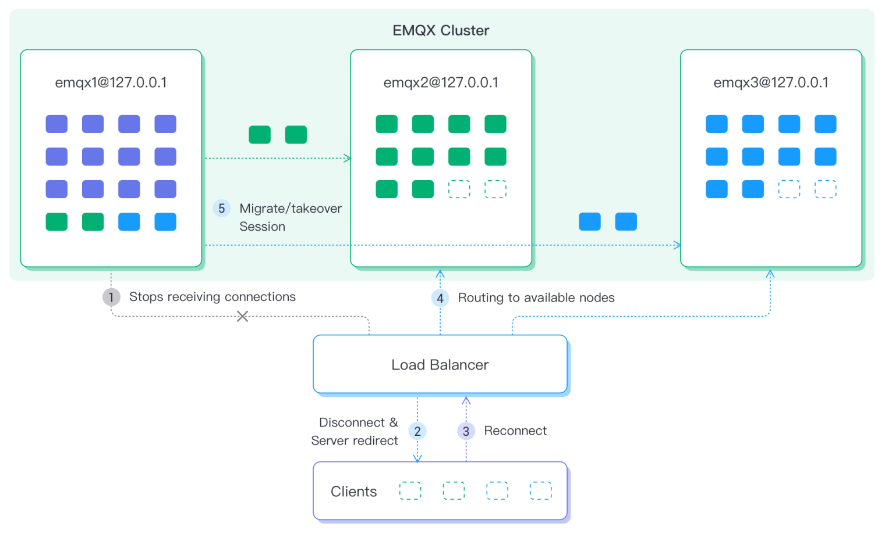

# ノード避難とクラスター負荷再分散

MQTTはステートフルな長時間接続アクセスプロトコルであり、一度確立された接続は簡単には切断されません。そのため、クラスターのノードのアップグレード、メンテナンス、スケールアウトはより困難になります。EMQXは、ユーザーのクラスター運用と保守を支援するために、ノード避難とクラスター負荷再分散機能を提供しています。

## ノード避難

クラスター内のノードをメンテナンスやアップグレードする必要がある場合、ノードを直接シャットダウンすると接続やセッションが失われ、データ損失を引き起こす可能性があります。さらに、この操作により多数のデバイスが一時的にオフラインになり再接続が発生してサーバー負荷が増大し、全体の業務に影響を及ぼす恐れがあります。

そこで、EMQXはノード避難機能を提供し、ノードをシャットダウンする前にそのノード上のすべての接続とセッションデータをクラスター内の他のノードに移行し、全体の業務への影響を軽減します。

### 動作の仕組み

ノード避難は以下の順序で動作します。

1. 避難対象のノードは新規接続の受け入れを停止します。
2. 避難対象ノードは設定されたレート（`conn-evict-rate`で指定）で現在のクライアント接続を徐々に切断します。切断されたクライアントは再接続機構を利用してクラスター内の他のノード（ターゲットノード）に接続します。再接続機構はプロトコルバージョンにより異なります：
   - MQTT v3.1/v3.1.1クライアント：ロードバランシング戦略により指定され、クライアント側で再接続機構を有効にする必要があります；
   - MQTT v5.0クライアント：`redirect-to`パラメータで指定されます。
3. ターゲットノードがクライアントとの再接続を完了し、セッションを引き継ぐのを待ちます（`wait-takeover`で指定）。
4. 再接続待機時間経過後、避難対象ノードに残っている未引き継ぎのセッションをターゲットノードに移行します：
   - セッション移行先のノードは`migrate-to`で指定します；
   - セッション移行速度は`sess-evict-rate`で指定します。

避難はいつでも停止可能です。避難中に避難対象ノードがシャットダウンされた場合、ノード再起動後に避難処理が再開されます。

### CLIによるノード避難の開始と停止

CLIコマンドを使ってノード避難の開始、避難状況の取得、停止が可能です。

#### ノード避難の開始

以下のCLIコマンドでノード避難を開始します。`--evacuation`パラメータは避難操作であることを示します。

```bash
./bin/emqx ctl rebalance start --evacuation \
    [--wait-health-check Secs] \
    [--redirect-to "Host1:Port1 Host2:Port2 ..."] \
    [--conn-evict-rate CountPerSec] \
    [--migrate-to "node1@host1 node2@host2 ..."] \
    [--wait-takeover Secs] \
    [--sess-evict-rate CountPerSec]
```

| パラメータ             | 型               | 説明                                                                                     |
| --------------------- | ---------------- | ---------------------------------------------------------------------------------------- |
| `--wait-health-check` | 正の整数         | ノードがロードバランサー（LB）からアクティブなバックエンドノードリストから除外されるのを待つ時間（秒、デフォルト60秒）。この待機時間経過後に避難処理が開始され、元ノードは新規接続を拒否します。 |
| `--redirect-to`       | 文字列           | MQTT 5.0クライアント向けの再接続時のリダイレクト先サーバーアドレス。詳細は[MQTT 5.0仕様 - サーバーリダイレクション](https://docs.oasis-open.org/mqtt/mqtt/v5.0/os/mqtt-v5.0-os.html#_Toc3901255)を参照してください。 |
| `--conn-evict-rate`   | 正の整数         | クライアント切断レート（接続数/秒）。デフォルトは毎秒500接続。                             |
| `--migrate-to`        | 文字列           | セッションを避難させるノードのスペースまたはカンマ区切りリスト。                           |
| `--wait-takeover`     | 正の整数         | セッション避難開始までの待機時間（秒単位、デフォルト60秒）。                               |
| `--sess-evict-rate`   | 正の整数         | セッション避難レート（セッション数/秒）。デフォルトは毎秒500セッション。                   |

**コード例**

ノード`emqx@127.0.0.1`上のクライアントをノード`emqx2@127.0.0.1`と`emqx3@127.0.0.1`に移行したい場合、`emqx@127.0.0.1`ノード上で以下のコマンドを実行します。

```bash
./bin/emqx ctl rebalance start --evacuation \
	--wait-health-check 60 \
	--wait-takeover 200 \
	--conn-evict-rate 30 \
	--sess-evict-rate 30 \
	--migrate-to "emqx2@127.0.0.1 emqx3@127.0.0.1"
Rebalance(evacuation) started
```

このコマンドは既存のクライアントを毎秒30接続の速度で切断し、すべての接続が切断された後に200秒間待機してクライアントセッションを再接続ノードに移行します。その後、残りのセッションを毎秒30セッションの速度で`emqx2@127.0.0.1`と`emqx3@127.0.0.1`ノードに移行します。

#### 避難状況の取得

以下のCLIコマンドで避難状況を取得できます。

```bash
./bin/emqx ctl rebalance node-status
```

返却例は以下の通りです。

```bash
Rebalance type: evacuation
Rebalance state: evicting_conns
Connection eviction rate: 30 connections/second
Session eviction rate: 30 sessions/second
Connection goal: 0
Session goal: 0
Session recipient nodes: []
Channel statistics:
  current_connected: 10
  current_sessions: 0
  initial_connected: 100
  initial_sessions: 0
```

#### ノード避難の停止

以下のCLIコマンドで避難を停止できます。

```bash
./bin/emqx ctl rebalance stop
```

返却例は以下の通りです。

```bash
./bin/emqx ctl rebalance stop
Rebalance(evacuation) stopped
```

### HTTP APIによるノード避難の開始／停止

HTTP APIでもノード避難の開始・停止が可能で、避難対象ノードをパラメータで指定する必要があります。詳細は[APIドキュメント](https://docs.emqx.com/en/enterprise/v5.1/admin/api-docs.html)を参照してください。

## 負荷再分散

MQTTがステートフルな長時間接続プロトコルであるため、接続確立後は簡単に切断されません。ノードをスケールアウトしても既存の接続は自動的に新規ノードに移動しません。そのため、新規クライアント接続が少ない場合、追加ノードが長期間低負荷のままになることがあります。このような場合、高負荷ノードから低負荷ノードへ接続を手動で移行し、クラスターの負荷バランスを取る必要があります。



### 動作の仕組み

負荷再分散は複数ノードが関与するため、より複雑な処理です。

任意のノードでクラスター負荷再分散タスクを開始できます。EMQXは各ノードの現在の接続負荷に基づき必要な接続移行計画を自動計算し、高負荷ノードから低負荷ノードへ接続とセッションを移行してノード間の負荷バランスを実現します。処理の流れは以下の通りです。

1. 移行計画を計算し、再分散対象ノード（`--nodes`で指定）を送出元ノードと受入先ノードに分類：
   - 送出元ノード：高負荷ノード
   - 受入先ノード：低負荷ノード
2. 送出元ノードで新規接続の受け入れを停止。
3. 一定時間（`wait-health-check`で指定）待機し、ロードバランサー（LB）が送出元ノードをアクティブなバックエンドノードリストから除外するのを待つ。
4. 送出元ノードの接続クライアントを徐々に切断し、平均接続数が受入先ノードと同等になるまで続ける。
5. 受入先ノードがクライアントと再接続しセッションを引き継ぐのを待つ（`wait-takeover`で指定）。
6. 再接続待機時間経過後、送出元ノードは残りの未引き継ぎセッションを`sess-evict-rate`で指定した速度で受入先ノードに移行。

これで負荷再分散タスクは完了し、送出元ノードは通常状態に戻ります。

::: tip

負荷再分散は一時的な処理です。参加ノードのいずれかがクラッシュすると、全ノードで処理が中断されます。

:::

### CLIによる負荷再分散の開始と停止

CLIコマンドで負荷再分散の開始、状況取得、停止が可能です。

#### 負荷再分散の開始

負荷再分散開始コマンドは以下のフィールドを含みます。

```bash
rebalance start \
    [--nodes "node1@host1 node2@host2"] \
    [--wait-health-check Secs] \
    [--conn-evict-rate ConnPerSec] \
    [--abs-conn-threshold Count] \
    [--rel-conn-threshold Fraction] \
    [--conn-evict-rate ConnPerSec] \
    [--wait-takeover Secs] \
    [--sess-evict-rate CountPerSec] \
    [--abs-sess-threshold Count] \
    [--rel-sess-threshold Fraction]
```

| フィールド               | 型               | 説明                                                                                     |
| ---------------------- | ---------------- | ---------------------------------------------------------------------------------------- |
| `--nodes`              | 文字列           | 再分散に参加するノードのスペースまたはカンマ区切りリスト。コマンドを実行するノード（コーディネーター）を含む場合も含まない場合もあります。 |
| `--wait-health-check`  | 正の整数         | ノードがロードバランサー（LB）からアクティブなバックエンドノードリストから除外されるのを待つ時間（秒、デフォルト60秒）。この待機時間経過後に負荷再分散処理が開始されます。 |
| `--conn-evict-rate`    | 正の整数         | 送出元ノードでのクライアント切断レート。デフォルトは毎秒500接続。                         |
| `--abs-conn-threshold` | 正の整数         | 接続バランス判定の絶対閾値。デフォルトは1000。                                         |
| `--rel-conn-threshold` | 数値<br /> > 1.0 | 接続バランス判定の相対閾値。デフォルトは1.1。                                          |
| `--wait-takeover`      | 正の整数         | すべての接続切断後、クライアントが再接続してセッションを引き継ぐまでの待機時間（秒、デフォルト60秒）。 |
| `--sess-evict-rate`    | 正の整数         | 送出元ノードでのセッション避難レート。デフォルトは毎秒500セッション。                     |
| `--abs-sess-threshold` | 正の整数         | セッションバランス判定の絶対閾値。デフォルトは1000。                                     |
| `--rel-sess-threshold` | 数値<br /> > 1.0 | セッションバランス判定の相対閾値。デフォルトは1.1。                                    |

**セッションバランスの判定**

接続がバランスしている条件は以下の通りです。

```bash
avg(DonorConns) < avg(RecipientConns) + abs_conn_threshold
OR
avg(DonorConns) < avg(RecipientConns) * rel_conn_threshold
```

切断済みセッションについても同様のルールが適用されます。

**例**

3ノード`emqx@127.0.0.1`、`emqx2@127.0.0.1`、`emqx3@127.0.0.1`間で負荷再分散を行う場合、以下のコマンドを使用します。

```bash
./bin/emqx ctl rebalance start \
	--wait-health-check 10 \
	--wait-takeover 60  \
	--conn-evict-rate 5 \
	--sess-evict-rate 5 \
	--abs-conn-threshold 30 \
	--abs-sess-threshold 30 \
	--nodes "emqx1@127.0.0.1 emqx2@127.0.0.1 emqx3@127.0.0.1"
Rebalance started
```

#### 負荷再分散状況の取得

負荷再分散状況取得のCLIコマンドは以下の通りです。

```bash
./bin/emqx ctl rebalance node-status
```

**例**

```bash
./bin/emqx ctl rebalance node-status
Node 'emqx1@127.0.0.1': rebalance coordinator
Rebalance state: evicting_conns
Coordinator node: 'emqx1@127.0.0.1'
Donor nodes: ['emqx2@127.0.0.1','emqx3@127.0.0.1']
Recipient nodes: ['emqx1@127.0.0.1']
Connection eviction rate: 5 connections/second
Session eviction rate: 5 sessions/second
Connection goal: 0.0
Current average donor node connection count: 300.0
```

#### 負荷再分散の停止

負荷再分散停止のCLIコマンドは以下の通りです。

```bash
emqx ctl rebalance stop
```

返却例は以下の通りです。

```bash
./bin/emqx ctl rebalance stop
Rebalance stopped
```

### HTTP APIによる負荷再分散の開始／停止

CLIで可能なすべての操作はAPIでも可能です。開始・停止コマンドはノード指定が必要です。詳細は[APIドキュメント](https://docs.emqx.com/en/enterprise/v5.1/admin/api-docs.html)を参照してください。

## ロードバランサーの統合

ユーザーはロードバランサーを統合して避難や再分散を実施できます。切断されたクライアントが再接続を試みる際、ロードバランサーはバックエンドノードの現在の状態に基づき受入先ノードへリダイレクトします。ユーザーはロードバランサー統合のためにヘルスチェックパラメータを設定する必要があります。設定がないと切断数が過剰になる可能性があります。

この設定支援のため、EMQXはヘルスチェック用REST APIを提供しています。

`GET /api/v5/load_rebalance/availability_check`

ヘルスチェックは、送出元または避難中のノードに対してはHTTPコード503を返し、正常稼働中で接続を受け入れているノードに対してはHTTPコード200を返します。

例えば、3ノードのEMQXクラスターでMQTTリスナーがポート3001、3002、3003、REST APIがポート5001、5002、5003の場合、HAProxyの設定例は以下の通りです。

```bash
defaults
  timeout connect 5s
  timeout client 60m
  timeout server 60m

listen mqtt
  bind *:1883
  mode tcp
  maxconn 50000
  timeout client 6000s
  default_backend emqx_cluster

backend emqx_cluster
  mode tcp
  balance leastconn
  option httpchk
  http-check send meth GET uri /api/v5/load_rebalance/availability_check hdr Authorization "Basic xxxxxx"
  server emqx1 127.0.0.1:3001 check port 5001 inter 1000 fall 2 rise 5 weight 1 maxconn 1000
  server emqx2 127.0.0.1:3002 check port 5002 inter 1000 fall 2 rise 5 weight 1 maxconn 1000
  server emqx3 127.0.0.1:3003 check port 5003 inter 1000 fall 2 rise 5 weight 1 maxconn 1000
```
